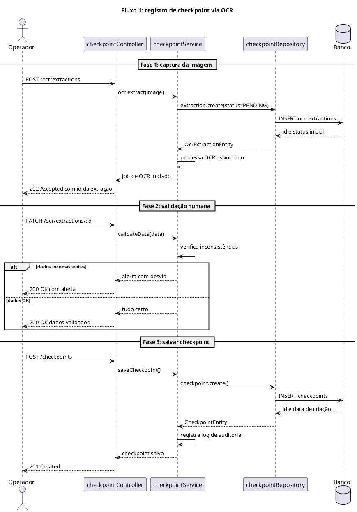
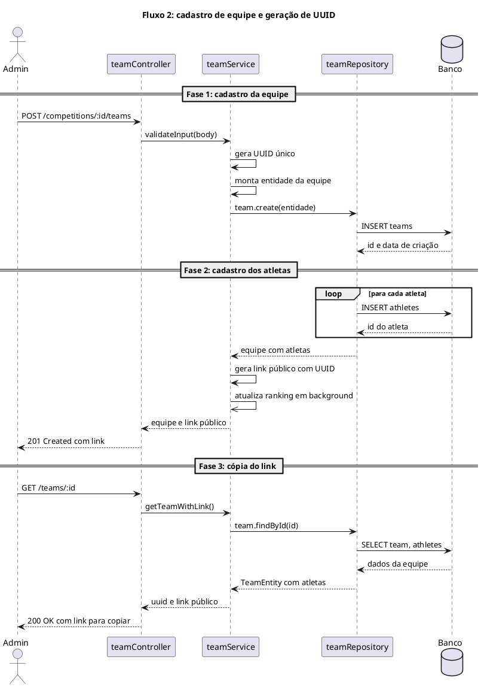
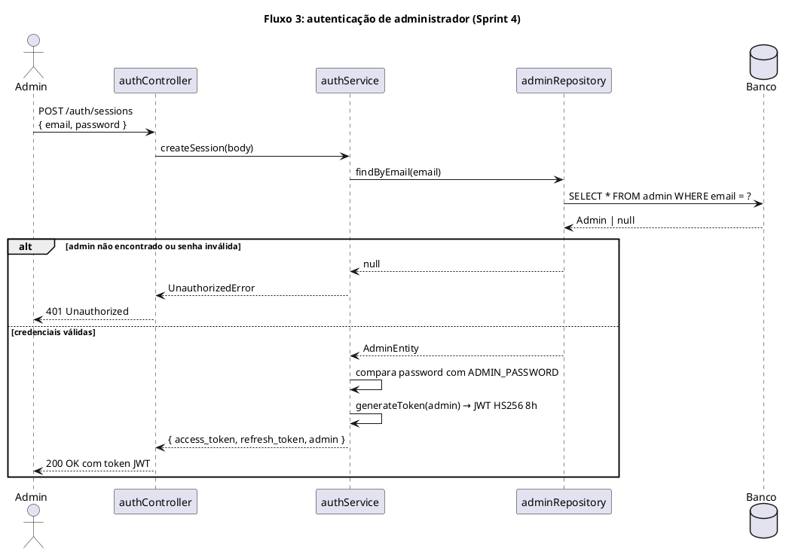
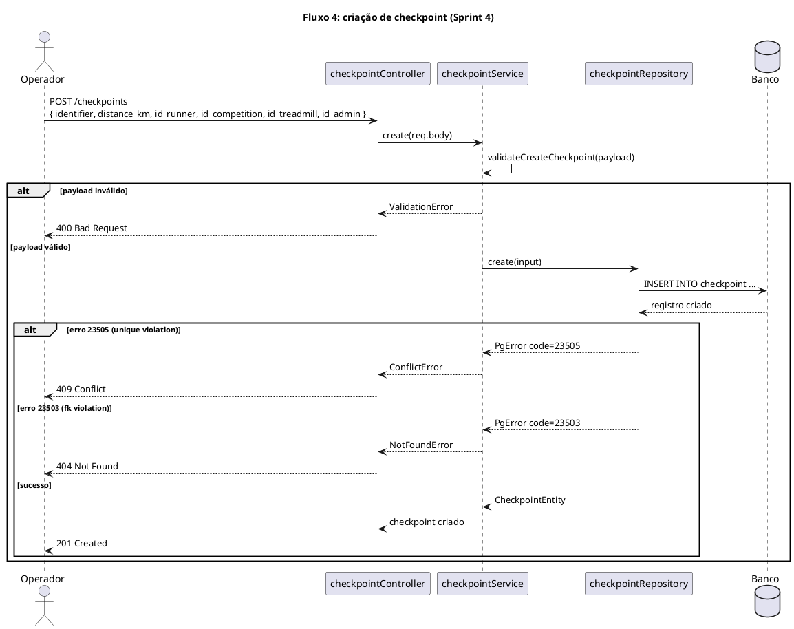

# Diagramas de sequência UML - Seção 3.2.4

Este documento reúne o código-fonte em PlantUML dos diagramas de sequência usados na seção 3.2.4 do WAD. Os Fluxos 1 e 2 foram elaborados na Sprint 3; os Fluxos 3 e 4 foram mapeados na Sprint 4 com base no código implementado, após padronização das nomenclaturas de camadas para o inglês.

Os diagramas modelam a comunicação entre as camadas da arquitetura da aplicação seguindo o fluxo Controller → Service → Repository → Banco de Dados. As chamadas síncronas usam `->`, os processamentos assíncronos usam `->>` e os retornos tracejados usam `-->`.

Fluxo 1:

Fluxo 2:

Fluxo 3:

Fluxo 4:

