# WAD - Web Application Document - Módulo 2 - Inteli

## Propositivos

#### Ana Clara Tenório Pelegrini
#### Beatriz Okubo Vieira Lima
#### Eduardo Hirohito Izawa Maciel
#### Isabella Sandra Santos
#### Julia Khristina de Oliveira Silva Souza
#### Luiza Nicol Giusti Dias Cardoso
#### Mariana Azevedo Silva
#### Vinícius Tavares Castiglia


## Sumário

[1. Introdução](#c1)

[2. Visão Geral da Aplicação Web](#c2)

[3. Projeto Técnico da Aplicação Web](#c3)

[4. Desenvolvimento da Aplicação Web](#c4)

[5. Testes da Aplicação Web](#c5)

[6. Estudo de Mercado e Plano de Marketing](#c6)

[7. Conclusões e trabalhos futuros](#c7)

[8. Referências](#c8)

[Anexos](#c9)

<br>


# <a name="c1"></a>1. Introdução

A Red Bull, marca global atuante em eventos esportivos e experiências de marca, é o parceiro deste projeto por meio de seu time de Field Marketing, responsável pela operação do Red Bull 24 Horas, competição anual em que duas equipes de dezesseis corredores se revezam ininterruptamente em esteiras durante vinte e quatro horas, buscando acumular a maior quilometragem total. Atualmente, o registro dos quilômetros percorridos é realizado de forma manual por operadores, que anotam em pranchetas os momentos de início e término de cada turno, além de checkpoints periódicos. Esse processo é suscetível a erros de anotação, distrações humanas e inconsistências, o que compromete a confiabilidade e a rastreabilidade dos resultados finais. Como as esteiras utilizadas no evento não permitem integração direta com dispositivos externos e alternativas como dispositivos vestíveis sincronizados se mostraram inviáveis diante da dinâmica de trocas rápidas entre corredores, a apuração depende exclusivamente de registros humanos, sem mecanismos estruturados de auditabilidade dos dados.

Diante desse cenário, o projeto propõe o desenvolvimento de uma plataforma web de gestão de performance com atualização em tempo real dos dados ao longo da competição, projetada para uso em iPads posicionados ao lado das esteiras pelos operadores do evento. A solução substitui o registro manual por uma abordagem de automação assistida, na qual o operador captura imagens do visor da esteira por meio de fotografia, e o sistema realiza a extração automática dos dados por meio de reconhecimento óptico de caracteres (OCR). Considerando as limitações de padronização visual das esteiras e as variáveis do ambiente operacional do evento, a viabilidade da solução ainda depende de validações práticas relacionadas à precisão e consistência da leitura automatizada. Os dados extraídos são submetidos à validação humana, garantindo maior confiabilidade e controle sobre o processo de apuração.

A plataforma é dividida em duas interfaces principais: uma área privada de operação, onde os administradores registram checkpoints, corrigem dados extraídos via OCR, acompanham informações detalhadas de cada equipe e gerenciam a dinâmica da competição; e uma área pública por equipe, acessada sem login por meio de uma URL com UUID único entregue ao capitão de cada equipe, responsável pela exibição do ranking, status individual dos atletas e calculadora de descanso durante a competição.

A criação de valor do sistema se concentra em quatro eixos principais: redução de erros no processo de apuração, aumento da confiabilidade e auditabilidade dos dados, ganho de eficiência operacional para a equipe organizadora da Red Bull e disponibilização de informações atualizadas a cada checkpoint operacional da competição.

# <a name="c2"></a>2. Visão Geral da Aplicação Web 

## 2.1. Escopo do Projeto 

### 2.1.1. Modelo de 5 Forças de Porter 

O modelo das Cinco Forças de Porter constitui um framework de análise estratégica utilizado para avaliar a atratividade e a intensidade competitiva de uma indústria. O posicionamento estratégico de uma organização não depende exclusivamente da concorrência direta, mas da interação entre cinco forças estruturais: a rivalidade entre concorrentes existentes, a ameaça de novos entrantes, a ameaça de produtos ou serviços substitutos, o poder de barganha dos fornecedores e o poder de barganha dos clientes. A aplicação desse modelo permite identificar oportunidades, vulnerabilidades competitivas e fatores críticos para a sustentabilidade de uma solução (Porter, 2008).

No contexto deste projeto, a análise foi aplicada à operação do Red Bull 24 Horas, considerando o desenvolvimento de uma aplicação web para digitalização do processo de registro de quilometragem durante o evento. A solução proposta busca substituir um processo manual suscetível a erros, transformando a coleta operacional em um fluxo digital mais confiável, ágil e escalável.

<div align="center">
  <sub>Figura 1 - Análise das cinco forças de Porter</sub><br>
  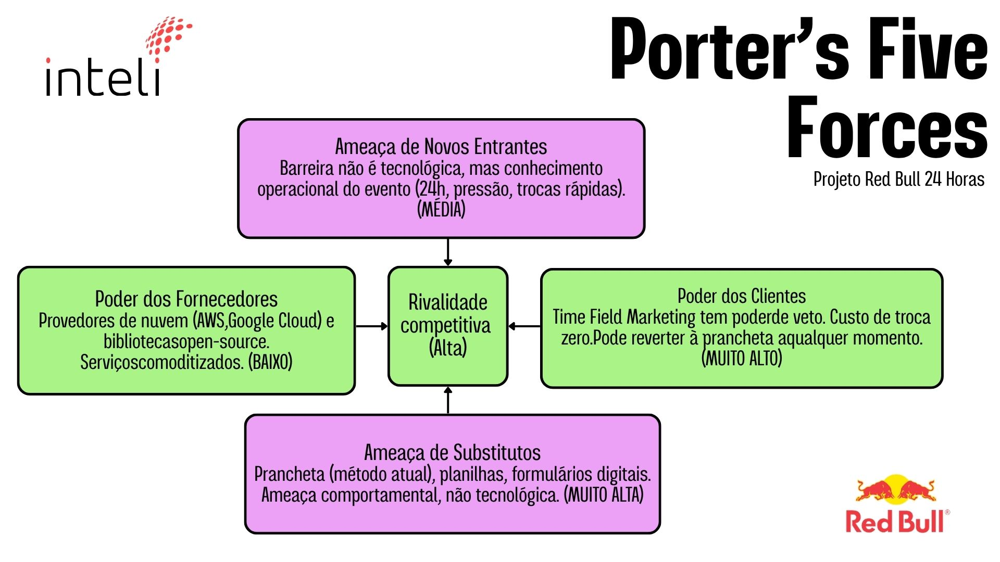<br>
  <sup>Fonte: Elaborado pelos autores (2026).</sup>
</div>

#### 1. Rivalidade entre concorrentes existentes (ALTA)

A rivalidade competitiva neste contexto é considerada alta, pois existem diversas soluções que podem atender parcialmente à necessidade de registro operacional do evento, incluindo ferramentas genéricas de coleta de dados, como Google Forms, Microsoft Excel, aplicativos móveis de coleta de informações e plataformas genéricas de gestão operacional. Embora essas alternativas sejam amplamente acessíveis e de fácil implementação, elas não foram desenvolvidas para atender às particularidades do Red Bull 24 Horas, como uso contínuo por 24 horas, trocas frequentes de operadores e necessidade de registro rápido sob pressão operacional.

O diferencial competitivo da solução proposta reside na sua especialização funcional, sendo projetada especificamente para o fluxo real do evento, priorizando velocidade de uso, padronização dos registros e redução de retrabalho. Para a Red Bull, essa especialização representa um ganho estratégico ao transformar um processo operacional crítico em uma atividade mais confiável e eficiente.

#### 2. Ameaça de novos entrantes (MÉDIA)

A ameaça de novos entrantes é considerada média, pois a entrada de novos desenvolvedores de soluções digitais neste mercado é relativamente acessível do ponto de vista técnico, uma vez que as ferramentas de desenvolvimento web são amplamente disponíveis. No entanto, a principal barreira competitiva não está na tecnologia em si, mas na capacidade de adaptação ao contexto operacional específico do evento.

O Red Bull 24 Horas apresenta características próprias, tal qual operações contínuas por 24 horas, rotatividade de usuários, pressão por rapidez e necessidade de confiabilidade no registro dos dados, nesse cenário, é possível verificar que esses fatores dificultam a criação de soluções verdadeiramente aderentes sem conhecimento aprofundado da dinâmica operacional. Dessa forma, embora novos entrantes possam desenvolver sistemas similares, a replicação de uma solução efetivamente integrada à realidade do evento representa uma barreira prática relevante.

#### 3. Ameaça de produtos ou serviços substitutos (MUITO ALTA)

A ameaça de substitutos é considerada muito alta, pois o principal substituto da solução proposta é o próprio método atualmente utilizado pela operação, baseado em registros manuais realizados em pranchetas pelos operadores do evento. Apesar de apresentar limitações relacionadas a erros de preenchimento, retrabalho e ausência de auditabilidade estruturada, esse processo possui vantagens operacionais relevantes, como baixo custo de implementação, independência tecnológica e elevada familiaridade por parte da equipe responsável pela apuração.

Diferentemente de soluções digitais concorrentes, que disputam espaço tecnológico no mercado, o registro manual representa um substituto diretamente integrado à cultura operacional do evento, já consolidado na dinâmica da competição. Nesse contexto, a principal ameaça não é necessariamente tecnológica, mas comportamental, uma vez que a adoção da nova solução depende da percepção clara de ganhos em rapidez, simplicidade, confiabilidade e redução de esforço operacional.

#### 4. Poder de barganha dos fornecedores (BAIXO)

O poder de barganha dos fornecedores é considerado baixo, uma vez que os recursos necessários para o desenvolvimento da solução são predominantemente tecnológicos, incluindo serviços de hospedagem, infraestrutura web, frameworks de desenvolvimento e bibliotecas de software amplamente disponíveis no mercado.
Esses recursos apresentam alta disponibilidade, baixa diferenciação e facilidade de substituição, reduzindo significativamente a dependência de fornecedores específicos. Além disso, a solução não depende de integrações complexas com hardware proprietário ou tecnologias exclusivas, o que amplia a flexibilidade técnica e financeira do projeto.


#### 5. Poder de barganha dos clientes (MUITO ALTO)

O poder de barganha dos clientes é considerada muito alto, a principal área demandante da solução corresponde ao time operacional de Field Marketing da Red Bull, responsável pelo registro dos dados durante o evento. Esse grupo exerce elevado poder de barganha, pois a adoção da ferramenta depende diretamente da sua aceitação em um ambiente caracterizado por alta pressão operacional, rapidez na tomada de decisão e necessidade de execução contínua. O custo de substituição é praticamente inexistente, uma vez que o método manual atualmente utilizado pode ser retomado a qualquer momento sem impactos financeiros ou contratuais. Além disso, qualquer aumento de complexidade, lentidão ou dificuldade de uso pode comprometer diretamente a aceitação da solução. Dessa forma, a área demandante exerce não apenas poder de escolha, mas também poder de veto, exigindo que a ferramenta seja comprovadamente mais simples, rápida e confiável do que o processo atual para garantir sua adoção efetiva.

#### Conclusão da análise

A aplicação do modelo das Cinco Forças de Porter evidencia que a solução proposta para o Red Bull 24 Horas está inserida em um contexto de elevada pressão competitiva, especialmente em relação à rivalidade entre soluções alternativas, à resistência comportamental associada aos métodos já consolidados e ao elevado poder de decisão da área demandante. Em contrapartida, a baixa dependência de fornecedores e a especialização operacional da ferramenta criam condições favoráveis para a construção de vantagem competitiva sustentável. Dessa forma, o sucesso da solução não depende exclusivamente de sua viabilidade técnica, mas principalmente de sua capacidade de entregar ganhos reais de usabilidade, confiabilidade e eficiência operacional no contexto específico da Red Bull.

### 2.1.2. Análise SWOT da Instituição Parceira 

A análise SWOT (ou FOFA) é uma ferramenta de planejamento estratégico que permite avaliar fatores internos (forças e fraquezas) e externos (oportunidades e ameaças) que impactam o desempenho de uma organização (Casarotto, 2019). Com base nisso, foi realizada a análise do evento Red Bull 24 Horas, conforme apresentado na Figura 2, considerando seu posicionamento no mercado e relação com concorrentes.

<div align="center">
  <sub>Figura 2 - Análise SWOT </sub><br>
  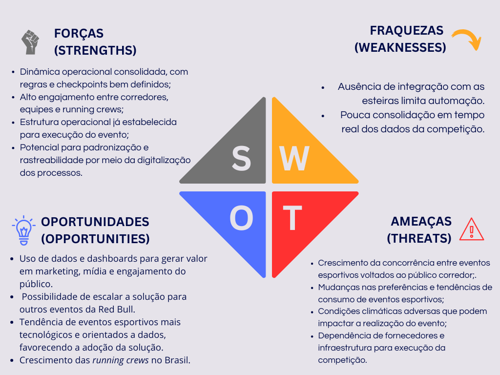<br>
  <sup>Fonte: Elaborado pelos autores (2026).</sup>
</div>

#### Forças

No contexto do evento Red Bull 24 Horas, destacam-se como principais forças a existência de uma dinâmica operacional já consolidada, com regras bem definidas de revezamento, checkpoints periódicos e acompanhamento contínuo das equipes ao longo das 24 horas. Além disso, o evento possui alta capacidade de engajamento entre corredores e running crews, favorecendo a participação ativa do público e a valorização de dados de desempenho durante a competição. A estrutura operacional já estabelecida também favorece a implementação de soluções digitais voltadas à padronização e rastreabilidade do processo de apuração.

#### Fraquezas
  
Entre as fraquezas, observa-se a ausência de integração com as esteiras, o que limita a automação da coleta de dados e mantém a dependência de processos manuais. Adicionalmente, a baixa consolidação de dados em tempo real compromete a visibilidade geral da competição e pode impactar a confiabilidade das informações durante o evento, reduzindo a qualidade da experiência em comparação a soluções mais automatizadas adotadas por concorrentes.

#### Oportunidades

No ambiente externo, identificam-se oportunidades relacionadas ao uso estratégico de dados para geração de valor em marketing, mídia e engajamento do público, por meio de dashboards e indicadores relevantes. Há potencial de escalabilidade da solução para outros eventos da Red Bull, fortalecendo sua vantagem competitiva. Além disso, a crescente tendência de eventos esportivos orientados a dados e o crescimento das running crews no Brasil ampliam o público-alvo e favorecem a adoção da solução proposta.

#### Ameaças

Entre as ameaças, destacam-se o aumento da concorrência de outros eventos esportivos e experiências voltadas ao público corredor, que disputam a atenção dos participantes, patrocinadores e comunidades de running crews. Além disso, mudanças nas tendências de consumo de eventos esportivos podem reduzir o interesse por formatos específicos de competição ao longo do tempo. Fatores externos, como condições climáticas adversas, dificuldades logísticas, indisponibilidade de fornecedores e limitações de infraestrutura, também podem impactar a execução do evento e comprometer a experiência dos participantes. 

#### Conclusão da análise SWOT

A análise SWOT evidencia que o Red Bull 24 Horas possui uma estrutura operacional consolidada e elevado potencial de engajamento, fatores que favorecem a adoção de soluções digitais voltadas à gestão da competição. Ao mesmo tempo, as limitações relacionadas à coleta manual de dados e à baixa visibilidade em tempo real representam oportunidades claras de melhoria. Nesse contexto, a solução proposta busca potencializar as forças existentes, mitigar as fraquezas identificadas e aproveitar as oportunidades de expansão e uso estratégico de dados, contribuindo para uma operação mais eficiente, confiável e escalável. 

### 2.1.3. Solução 

#### Problema a ser resolvido

Atualmente, o processo de registro de dados dos corredores durante a competição é predominantemente manual, exigindo que operadores realizem anotações periódicas ao longo de 24 horas ininterruptas. Esse modelo gera sobrecarga operacional significativa, além de alta suscetibilidade a erros humanos decorrentes de fadiga, falhas de interpretação e inconsistências de caligrafia. Como consequência, a confiabilidade dos dados é comprometida, impactando diretamente a precisão da apuração, a transparência do evento e a qualidade das análises estratégicas realizadas pela organização.

#### Dados disponíveis 

Como base inicial, foi utilizado o site oficial do evento Red Bull 24 Hours, fornecido durante o onboarding, contendo informações institucionais, dinâmica da competição e contexto geral. Complementarmente, foram realizadas interações com o parceiro, nas quais foram identificados os principais fluxos operacionais, limitações do processo atual e requisitos implícitos, especialmente relacionados à necessidade de automatização do registro de checkpoints e à melhoria da confiabilidade dos dados coletados (Red Bull, 2025).

#### Solução proposta

Propõe-se o desenvolvimento de uma aplicação web integrada, com foco na automatização da coleta e processamento de dados por meio de tecnologia de Reconhecimento Óptico de Caracteres (OCR). A solução permitirá que operadores capturem imagens dos displays das esteiras, realizando a extração automática das informações relevantes. Além disso, a plataforma contemplará módulos de cadastro de competições, equipes e atletas, atualização em tempo real dos dados no ambiente administrativo e disponibilização periódica das informações no painel público das equipes e geração de relatórios analíticos com indicadores de desempenho, garantindo escalabilidade, padronização e maior robustez no processo.

#### Forma de utilização da solução

A solução será estruturada em dois ambientes principais: um administrativo e outro para as equipes. No ambiente administrativo, acessado por meio do email e senha única previamente disponibilizada aos operadores, será possível cadastrar competições, gerenciar equipes e registrar checkpoints por OCR ou entrada manual. No ambiente das equipes, acessado por meio de identificadores UUID únicos, os atletas terão acesso a um painel público com informações da equipe, métricas de desempenho e ranking da competição, atualizados periodicamente a cada uma hora. Já o ambiente administrativo opera com atualização em tempo real para suporte à operação do evento. Ao final da competição, administradores poderão exportar relatórios detalhados para análise estratégica e tomada de decisão.

#### Benefícios esperados

A implementação da solução proporcionará significativa redução de erros operacionais, aumento da eficiência no processo de coleta de dados e maior confiabilidade das informações registradas. A disponibilização de métricas em tempo real permitirá melhor acompanhamento do desempenho das equipes durante o evento. Além disso, os relatórios analíticos contribuirão para decisões mais assertivas, melhoria contínua das edições futuras e fortalecimento da experiência dos participantes e da gestão do evento.

#### Critério de sucesso e como será avaliado

O sucesso da solução será mensurado por meio de indicadores objetivos, como a redução da taxa de erro nos registros (meta inferior a 1%), aumento da consistência e integridade dos dados e diminuição do tempo de processamento das informações. A avaliação será realizada em conjunto com o parceiro, considerando o impacto operacional durante a execução do evento, a aderência aos requisitos levantados e a qualidade das análises geradas para suporte à tomada de decisão.

### 2.1.4. Value Proposition Canvas 

O Canvas da Proposta de Valor permite analisar o alinhamento entre as necessidades do cliente e a solução proposta (Osterwalder; Pigneur, 2011). No contexto deste projeto, evidencia-se o encaixe entre as dificuldades enfrentadas por avaliadores e organizadores no processo de coleta, registro e apuração de dados em competições e a solução proposta, baseada na automatização por meio de reconhecimento óptico de caracteres (OCR) e disponibilização de informações em tempo real. Essa abordagem está alinhada ao uso de tecnologias digitais para aumento de eficiência operacional e redução de erros em processos manuais, amplamente discutido na literatura de transformação digital (Vial, 2019).

A seguir, a Figura 3 ilustra o Canva de Proposta de Valor desenvolvido para o projeto em análise.

<div align="center">
  <sub>Figura 3 - Value Proposition Canvas da Solução </sub><br>
  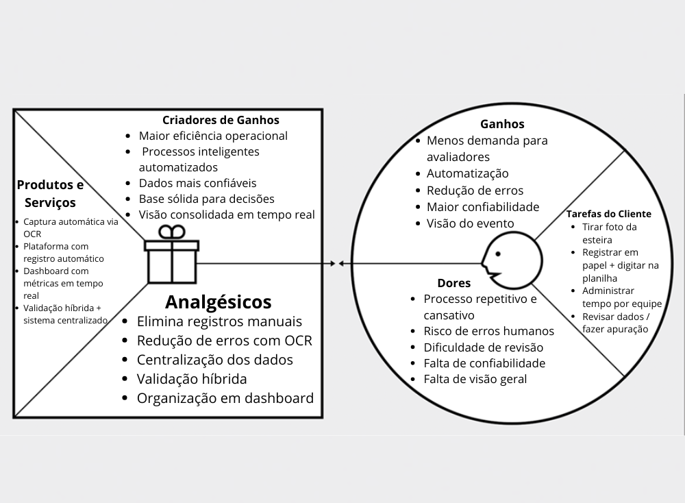<br>
  <sup>Fonte: Elaborado pelos autores (2026).</sup>
</div>

#### A. Perfil do Cliente

Na primeira parte do Canvas da Proposta de Valor é analisado o cenário e o perfil em que o cliente já se encontra. Aqui, é possível explorar quais são as dores do cliente, suas tarefas no contexto atual e o que eles buscam ganhar.

**Tarefas do Cliente**

As tarefas representam as atividades realizadas pelos usuários durante a competição.

- Monitorar o desempenho das equipes durante a competição
- Registrar e validar os dados coletados nos checkpoints
- Garantir a consistência e confiabilidade das informações registradas
- Consolidar os dados operacionais da competição
- Acompanhar o tempo e a quilometragem total de cada equipe
- Realizar a apuração final dos resultados de forma eficiente

**Dores do Cliente**

As dores representam as dificuldades enfrentadas pelos usuários no processo atual.

- Processo repetitivo e cansativo
- Risco de erros humanos durante a coleta e digitação dos dados
- Dificuldade na revisão, validação e apuração das informações
- Incerteza quanto à precisão e consistência dos dados coletados
- Falta de visão consolidada e organizada do evento

**Ganhos**

Os ganhos representam os benefícios esperados pelos usuários durante a operação do evento.

- Menos demanda para os avaliadores
- Automatização do processo de registro e processamento de dados
- Redução de erros operacionais
- Maior confiabilidade e precisão das informações
- Maior eficiência operacional durante o evento
- Visão consolidada e organizada do andamento da competição.

#### B. Mapa de Valor

Os elementos do mapa de valor foram estruturados para responder diretamente às dores identificadas e potencializar os ganhos esperados pelos usuários.

**Produtos e Serviços**

A solução proposta oferece os seguintes elementos:

- Plataforma digital de gestão de performance com atualização em tempo real dos dados
- Sistema de captura de imagens e extração automática de dados por OCR
- Dashboard para visualização de métricas e desempenho por equipe
- Sistema de validação híbrida dos dados (automática e manual)

**Aliviadores de Dores**

A solução atua diretamente na redução das dificuldades enfrentadas pelos usuários:

- Eliminação do registro manual em papel e da digitação em planilhas
- Redução de erros humanos na coleta, registro e processamento dos dados
- Simplificação do processo de revisão, validação e apuração das informações
- Centralização das informações em uma única plataforma
- Aumento da confiabilidade dos dados por meio de validação híbrida

**Criadores de Ganho**

Além de resolver problemas, a solução potencializa ganhos relevantes:

- Geração de informações atualizadas para acompanhamento da competição
- Geração de uma visão consolidada e organizada dos dados do evento
- Aumento da produtividade da equipe organizadora
- Apoio à gestão operacional por meio de dados confiáveis e consolidados
- Melhoria da experiência operacional dos avaliadores durante o evento

A partir da análise do Value Proposition Canvas, observa-se que a solução proposta está diretamente alinhada às necessidades dos avaliadores e organizadores, ao automatizar o processo de coleta e registro de dados por meio de OCR, reduzindo erros humanos e esforço operacional. Além disso, a centralização e disponibilização periódica das informações caracterizam uma automação do fluxo de dados, proporcionando maior confiabilidade, eficiência e suporte à tomada de decisão, garantindo uma gestão mais precisa e organizada da competição.

### 2.1.5. Matriz de Riscos do Projeto

A Matriz de Riscos é uma ferramenta de gestão utilizada para identificar, analisar e priorizar eventos que possam impactar negativamente o desenvolvimento e a execução de um projeto. Por meio da avaliação da probabilidade de ocorrência e do nível de impacto de cada risco, torna-se possível classificá-los conforme sua criticidade e definir estratégias preventivas, corretivas ou de contingência, reduzindo incertezas e aumentando as chances de sucesso do projeto (Project Management Institute, 2021).

No contexto deste projeto, a Matriz de Riscos é aplicada para antecipar possíveis desafios relacionados à implementação da solução de captura e processamento dos dados durante eventos esportivos da Red Bull 24 Horas. Considerando fatores técnicos, operacionais e humanos, a análise dos riscos permite estabelecer planos de resposta capazes de minimizar falhas na coleta, processamento e disponibilização das informações, garantindo maior confiabilidade, desempenho e continuidade operacional da solução proposta.

<div align="center">
  <sub>Figura 4 - Matriz de Risco </sub><br>
  <br>
  <sup>Fonte: Elaborado pelos autores (2026).</sup>
</div>

#### 2.1.5.1 - Matriz de Ameaças

Para identificar e priorizar os principais riscos do projeto, foi elaborada a matriz de risco apresentada no Quadro 1 a seguir.

<p align = "center"> Quadro 1 - Matriz de Risco </p> 

| Risco                              | Descrição                                                                 | Probabilidade       | Impacto     | Classificação | Plano de Resposta                                                                 |
|-----------------------------------|---------------------------------------------------------------------------|--------------------|-------------|--------------|-----------------------------------------------------------------------------------|
| Falha no Reconhecimento de Imagem  | O sistema pode não identificar corretamente os dados capturados nas imagens da esteira. | 70% (Alto)         | Muito Alto        | Crítico      | Treinar o modelo com imagens reais do ambiente de operação, realizar testes iterativos e disponibilizar validação manual para casos de inconsistência.          |
| Baixa Qualidade das Imagens       | Iluminação inadequada, movimento ou posicionamento incorreto podem comprometer a captura dos dados.  | 80% (Muito Alto)  | Muito Alto        | Crítico      | Padronizar os pontos de captura, definir posicionamento fixo dos dispositivos e realizar testes em diferentes condições de iluminação.      |
| Falha de Conexão com a Internet   | Instabilidade de rede pode interromper o envio ou sincronização dos dados.     | 60% (Alto)        | Alto        | Crítico      | Utilizar rede dedicada para operação, implementar armazenamento temporário local e sincronização automática quando a conexão for restabelecida.                   |
| Sobrecarga do Sistema             | Alto volume de acessos ou processamento simultâneo pode reduzir o desempenho da aplicação.  | 50% (Médio)        | Alto        | Alto         | Realizar testes de carga, otimizar consultas e monitorar métricas de desempenho antes e durante o evento.                       |
| Erro Humano                       | Operadores podem registrar dados incorretamente ou utilizar funcionalidades inadequadamente.           | 40% (Média)         | Médio  | Alto         | Desenvolver interface intuitiva, criar instruções operacionais e realizar treinamento prévio da equipe.                       |
| Falta de Padronização operacional            | Diferenças nos procedimentos de coleta podem gerar inconsistências nos dados.   | 30% (Baixa)       | Médio       | Médio        | Definir protocolos de operação, validações automáticas e checklist de execução.             |
| Bugs ou falhas de software                            | Erros de implementação podem comprometer funcionalidades específicas do sistema.        | 20% (Baixo)          | Baixo       | Baixo        | Executar testes funcionais, testes de integração e monitoramento contínuo com correções rápidas.                   |

<div align="center">
  <sup>Fonte: Elaborado pelos autores (2026).</sup>
</div>

#### 2.1.5.2 - Matriz de Oportunidades

 De forma complementar, o Quadro 2 a seguir apresenta a matriz de oportunidades identificadas para o projeto.

<div align="center">
  <sub>Quadro 2 - Matriz de oportunidades do projeto</sub>
</div>

| Oportunidade | Descrição | Probabilidade | Impacto | Classificação | Plano de Resposta |
|--------------|----------|--------------|--------|--------------|-------------------|
| Maior precisão nos dados coletados | A substituição do input manual por OCR reduz erros de digitação identificados no risco de erro humano. | 90% ( Muito Alto) | Alto | Alta Prioridade | Garantir uma alternativa de entrada manual com validação para evitar inconsistências em casos de falhas do OCR. |
| Melhor acompanhamento operacional do evento | Dados atualizados em tempo real permitem maior visibilidade do andamento da competição, facilitando o monitoramento das equipes e a organização operacional do evento. | 60% (Média) | Muito Alto | Alta Prioridade | Desenvolver interfaces claras e dashboards de rápida interpretação. |
| Aumento da eficiência operacional | A automação reduz atividades manuais e retrabalho da equipe operacional durante o evento. | 90% (Muito Alto) | Muito Alto | Alta Prioridade | Automatizar fluxos operacionais e minimizar entradas manuais. |
| Possível reutilização do sistema | Projeto pode ser reutilizado em outros eventos esportivos da Red Bull. | 10% (Muito Baixo) | Médio | Baixa Prioridade | Estruturar sistema modular e escalável. |
| Menor perda de dados durante o evento | O uso de checkpoints digitais permite maior precisão histórica e reduz perdas de dados. | 50% (Médio) | Alto | Alta Prioridade | Otimizar o processamento das capturas sem comprometer a estabilidade do sistema. |
| Geração de insights de dados | O armazenamento estruturado permite análises de desempenho, ritmo e comportamento para relatórios pós-evento. | 70% (Alta) | Muito Alto | Média Prioridade | Garantir exportação facilitada de dados (ex: XLSX) para auditoria e materiais de marketing. |
<div align="center">
  <sup>Fonte: Elaborado pelos autores (2026).</sup>
</div> 

## 2.2. Personas 

Personas são personagens fictícios criados com base em dados plausíveis que representam um tipo de usuário compatível com o projeto. Elas incluem informações como objetivos, necessidades, frustrações e interesses, auxiliando na compreensão do problema e no desenvolvimento da solução.

<div align="center">
  <sub>Figura 5 - Persona 1: Marina Costa, Coordenadora Operacional</sub><br>
  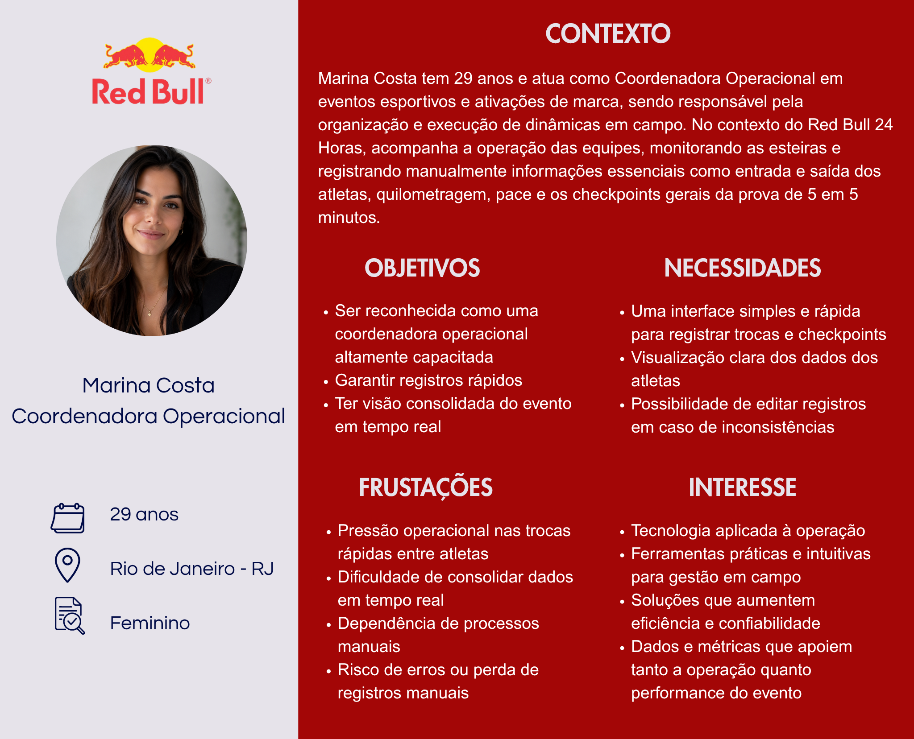<br>
  <sup>Fonte: Elaborado pelos autores (2026).</sup>
</div>

#### Informações
<ul>
    <li>Idade: 29 anos;</li>
    <li>Localização: Rio de Janeiro - RJ</li>
    <li>Cargo: Coordenadora operacional do evento Red Bull 24 horas</li>
    <li>Gênero: Feminino</li>
</ul>

#### Biografia
Marina Costa tem 29 anos e atua como Coordenadora Operacional em eventos esportivos e ativações de marca, sendo responsável pela organização e execução de dinâmicas em campo. No contexto do Red Bull 24 Horas, acompanha a operação das equipes, monitorando as esteiras e registrando manualmente informações essenciais como entrada e saída dos atletas, quilometragem, pace e os checkpoints gerais da prova de 5 em 5 minutos. 

#### Objetivos
<ul>
    <li>Ser reconhecida como uma coordenadora operacional altamente capacitada</li>
    <li>Garantir registros rápidos </li>
    <li>Ter visão consolidada do evento em tempo real</li>
</ul>

#### Necessidades
<ul>
    <li>Uma interface simples e rápida para registrar trocas e checkpoints</li>
    <li>Visualização clara dos dados dos atletas</li>
    <li>Possibilidade de editar registros em caso de inconsistências</li>
</ul>

#### Frustrações
<ul>
    <li>Pressão operacional nas trocas rápidas entre atletas </li>
    <li>Dificuldade de consolidar dados em tempo real </li>
    <li>Dependência de processos manuais </li>
    <li>Risco de erros ou perda de registros manuais</li>
</ul>

#### Interesses
<ul>
    <li>Tecnologia aplicada à operação</li>
    <li>Ferramentas práticas e intuitivas para gestão em campo</li>
    <li>Soluções que aumentem eficiência e confiabilidade</li>
    <li>Dados e métricas que apoiem tanto a operação quanto performance do evento</li>
</ul> <br>

<div align="center">
  <sub>Figura 6 - Persona 2: Bruno Monteiro, Gerente de Field Marketing</sub><br>
  <br>
  <sup>Fonte: Elaborado pelos autores (2026).</sup>
</div>

#### Informações
<ul>
    <li>Idade: 32 anos;</li>
    <li>Localização: São Paulo - SP </li>
    <li>Cargo: Gerente de Field Marketing da Red Bull</li>
    <li>Gênero: Masculino</li>
</ul>

#### Biografia
Bruno Monteiro tem 32 anos e atua como Gerente de Field Marketing, sendo responsável pela supervisão e validação das operações em eventos esportivos da marca. No contexto do Red Bull 24 Horas, o Bruno lidera com uma visão geral da prova e acompanha o desempenho das equipes, garantindo que todos os dados coletados, como quilometragem, pace médio e entradas dos atletas,  estejam consistentes e confiáveis para a análise de resultados no fim da prova. 

#### Objetivos
<ul>
    <li>Monitorar a coleta de dados</li>
    <li>Usar dados para melhorar a competição</li>
    <li>Ver métricas dos participantes </li>
    <li>Garantir confiabilidade dos resultados</li>
</ul>

#### Necessidades
<ul>
    <li>Visualização clara de métricas</li>
    <li>Alertas para inconsistências </li>
    <li>Automatização da coleta de dados</li>
    <li>Relatórios exportáveis para análise pós-evento</li>
</ul>

#### Frustrações
<ul>
    <li>Dependência de registros manuais, sujeitos a erro humano</li>
    <li>Dificuldade em identificar inconsistências </li>
    <li>Falta de resultados em tempo real</li>
    <li>Alto esforço operacional para acompanhar múltiplas equipes simultaneamente</li>
</ul>

#### Interesses
<ul>
    <li>Eficiência e redução de erros</li>
    <li>Tecnologias de automação e monitoramento em tempo real</li>
    <li>Melhoria do evento para globalizá-lo</li>
    <li>Experiência fluida para equipe e para os participantes</li>
</ul> <br>

<div align="center">
  <sub>Figura 7 - Persona 3: Amanda Azevedo, Atleta da Red Bull 24 horas</sub><br>
  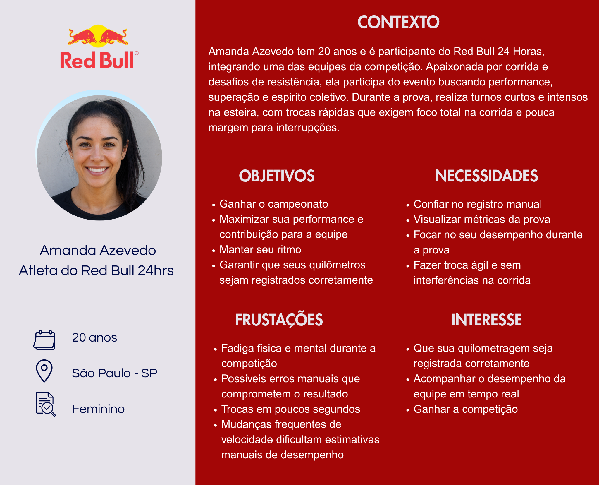<br>
  <sup>Fonte: Elaborado pelos autores (2026).</sup>
</div>

#### Informações
<ul>
    <li>Idade: 20 anos;</li>
    <li>Localização: São Paulo - SP</li>
    <li>Cargo: Atleta do Red Bull 24 horas</li>
    <li>Gênero: Feminino</li>
</ul>

#### Biografia
Amanda Azevedo tem 20 anos e é participante do Red Bull 24 Horas, integrando uma das equipes da competição. Apaixonada por corrida e desafios de resistência, ela participa do evento buscando performance, superação e espírito coletivo. Durante a prova, realiza turnos curtos e intensos na esteira, com trocas rápidas que exigem foco total na corrida e pouca margem para interrupções. 

#### Objetivos
<ul>
    <li>Ganhar o campeonato </li>
    <li>Maximizar sua performance e contribuição para a equipe  </li>
    <li>Garantir que seus quilômetros sejam registrados corretamente</li>
</ul>

#### Necessidades
<ul>
    <li>Confiar no registro manual </li>
    <li>Visualizar métricas da prova</li>
    <li>Focar no seu desempenho durante a prova</li>
    <li>Fazer troca ágil e sem interferências na corrida</li>
</ul>

#### Frustrações
<ul>
    <li>Fadiga física e mental durante a competição</li>
    <li>Possíveis erros manuais que comprometem o resultado  </li>
    <li>Trocas em poucos segundos </li>
    <li>Mudanças frequentes de velocidade dificultam estimativas manuais de desempenho</li>
</ul>

#### Interesses
<ul>
    <li>Que sua quilometragem seja registrada corretamente</li>
    <li>Acompanhar o desempenho da equipe </li>
    <li>Ganhar a competição </li>
</ul> <br>

## 2.3. User Stories

User stories são descrições curtas e objetivas de funcionalidades escritas sob a perspectiva do usuário final. Elas seguem geralmente o formato: “Como (papel/perfil), posso (ação/meta), para (benefício/razão)”, com foco no valor entregue e não em detalhes técnicos (Interaction Design Foundation, s.d.). Esse modelo é amplamente utilizado em metodologias ágeis, como o Scrum, pois facilita a comunicação entre equipe de desenvolvimento e stakeholders, além de permitir a divisão dos requisitos em partes menores e testáveis.

A partir das user stories, torna-se necessário compreender quem são os usuários que estão sendo representados. Nesse contexto, entram as personas, que são representações fictícias baseadas em dados reais de usuários. Elas descrevem características como necessidades, objetivos, comportamentos e desafios, permitindo que a equipe tenha uma visão mais concreta do público-alvo (Nielsen Norman Group, 2025). Dessa forma, as decisões de design e desenvolvimento passam a ser guiadas por perfis realistas, garantindo maior alinhamento com as expectativas dos usuários e contribuindo para soluções mais eficazes e centradas na experiência.

Com as user stories definidas e as personas estabelecidas, é necessário garantir que as funcionalidades descritas estejam claras e possam ser validadas. Para isso, utilizam-se os critérios de aceitação, que são condições específicas, mensuráveis e verificáveis que determinam quando uma user story pode ser considerada concluída (Grace, 2026). Esses critérios reduzem ambiguidades, facilitam testes e garantem que o sistema desenvolvido atenda às expectativas do usuário. Por exemplo, um critério de aceitação pode ser: “Dado que o usuário adiciona um produto ao carrinho de compras (ambiente digital), quando ele acessa o carrinho, então o item deve ser exibido com o nome, quantidade e preço corretos”.

Além dos critérios de aceitação, há mais uma bússola que norteia a equipe no momento de definir as user stories, garantindo qualidade e relevância ao projeto: os critérios INVEST (Independent, Negotiable, Valuable, Estimable, Small, Testable) (Credera, 2023). De modo geral, cada US precisa ser independente, ou seja, não deve depender de outras para gerar valor; negociável, permitindo ajustes conforme o entendimento do projeto evolui; valiosa, entregando benefícios claros ao usuário; estimável, possibilitando que o time dimensione o esforço necessário e gerencie o cronograma de entregas; pequena, de modo que possa ser implementada em uma única iteração, facilitando a implementação e o acompanhamento; e testável, garantindo que seja possível verificar objetivamente se foi concluída com sucesso.

Sendo assim, por meio das user stories, mantém-se o foco no valor gerado ao usuário, além de orientar a priorização das tarefas e facilitar a comunicação entre stakeholders e desenvolvedores. Elas também servem como referência para a definição e compreensão dos requisitos funcionais e não funcionais do projeto, evidenciando as necessidades do usuário por meio de entregas objetivas. Além disso, contribuem para o planejamento iterativo, auxiliam na estimativa de esforço das atividades e permitem a validação contínua das funcionalidades por meio de critérios de aceitação, favorecendo a adaptação do produto conforme o feedback obtido ao longo do desenvolvimento.

A seguir, são apresentadas as histórias de usuário definidas até o momento para o projeto em análise.

<div align="center">
  <sub>Quadro 3 - User Story 1 </sub>
</div>

| Identificação | US01 |
---| ---
| **Persona** | Bruno Monteiro (Gerente de Field Marketing) |
| **User Story** | "Como Bruno Monteiro, Gerente de Field Marketing, posso acessar o painel do admin, para gerenciar a competição e acessar todas as funcionalidades do sistema de forma centralizada." |
| **Critério de aceite 1** | CR1: O sistema deve permitir o acesso ao painel do admin em ambiente controlado. **Teste**: Dado que o administrador acessa o sistema, quando entra na plataforma, então deve ser direcionado ao painel do admin. |
| **Critério de aceite 2** | CR2: O painel deve exibir as principais seções do sistema. **Teste**: Dado que o admin acessa o painel, quando a página carrega, então deve visualizar opções como "criar competição", "equipes", "ranking" e "relatórios". |
| **Critério de aceite 3** | CR3: O painel deve exibir o estado atual do sistema (com ou sem competição). **Teste**: Dado que não há competição cadastrada, quando o painel é exibido, então deve mostrar a opção "Criar competição". Além disso, dado que existe uma competição cadastrada, quando o painel é exibido, então deve mostrar status, tempo e equipes. |
| Critérios INVEST | Independente: Esta US não depende de outras para ser desenvolvida, pois o painel do admin pode ser construído sem que o sistema de login ou o ranking estejam finalizados. <br> Negociável: A forma de acesso ao painel e as seções exibidas podem ser redefinidas conforme as necessidades identificadas durante o projeto. <br> Valorosa: Centraliza o controle do sistema, oferecendo ao administrador um ponto único de acesso a todas as funcionalidades da competição. <br> Estimável: Escopo claro e limitado a uma tela principal com exibição condicional de estado. <br> Pequena: Compreende apenas a tela principal do admin e sua lógica de exibição de estado. <br> Testável: Os comportamentos de redirecionamento e exibição condicional são verificáveis objetivamente para cada estado do sistema. |

<div align="center">
  <sup>Fonte: Elaborado pelos autores (2026).</sup>
</div> 

<div align="center">
  <sub>Quadro 4 - User Story 2 </sub>
</div>

| Identificação | US02 |
---| ---
| **Persona** | Bruno Monteiro (Gerente de Field Marketing) |
| **User Story** | "Como Bruno Monteiro, Gerente de Field Marketing, posso cadastrar uma nova competição com data e localização, para estruturar e iniciar um evento de corrida." |
| **Critério de aceite 1** | CR1: O sistema deve permitir o preenchimento dos dados do evento. **Teste**: Dado que o admin acessa o formulário, quando preenche nome, data e local, então os campos devem aceitar os valores corretamente. |
| **Critério de aceite 2** | CR2: O sistema deve validar campos obrigatórios. **Teste**: Dado que há campos vazios, quando o admin tenta criar o evento, então o sistema deve impedir a criação e exibir erro. |
| **Critério de aceite 3** | CR3: O sistema deve criar o evento com status inicial. **Teste**: Dado que os dados são válidos, quando o admin confirma, então o evento deve ser criado com status "não iniciado". |
| Critérios INVEST | Independente: Esta US não depende de outras para ser desenvolvida, pois o formulário de cadastro pode ser construído de forma isolada. <br> Negociável: Os campos do formulário podem ser revisados conforme necessidade do projeto. <br> Valorosa: É a base do sistema, pois sem um evento cadastrado nenhuma outra funcionalidade pode ser utilizada. <br> Estimável: Escopo claro e limitado a um formulário com validações simples. <br> Pequena: Compreende apenas um formulário de criação de evento. <br> Testável: Validações bem definidas permitem testes objetivos de cada critério. |

<div align="center">
  <sup>Fonte: Elaborado pelos autores (2026).</sup>
</div> 

<div align="center">
  <sub>Quadro 5 - User Story 3 </sub>
</div>

| Identificação | US03 |
---| ---
| **Persona** | Bruno Monteiro (Gerente de Field Marketing) |
| **User Story** | "Como Bruno Monteiro, Gerente de Field Marketing, posso cadastrar e editar equipes com seus atletas, para garantir que todos os participantes estejam registrados corretamente." |
| **Critério de aceite 1** | CR1: O sistema deve permitir criar uma equipe. **Teste**: Dado que o admin insere nome e capitão, quando salva, então a equipe deve aparecer na lista. |
| **Critério de aceite 2** | CR2: O sistema deve permitir adicionar atletas. **Teste**: Dado que o admin adiciona atletas à equipe, quando salva, então os atletas devem estar corretamente vinculados à equipe. |
| **Critério de aceite 3** | CR3: O sistema deve permitir edição e remoção de atletas. **Teste**: Dado que o admin altera ou remove dados de um atleta, quando salva, então as mudanças devem ser refletidas corretamente na equipe. |
| **Critério de aceite 4** | CR4: Quando não há equipes cadastradas, a tela deve exibir um botão de adição com instrução visual. **Teste**: Dado que o admin acessa /admin/equipes sem nenhuma equipe cadastrada, quando a página carrega, então deve exibir o botão "+ Adicionar equipe" acompanhado de instrução visual, sem exibir uma lista vazia. |
| Critérios INVEST | Independente: Esta US pode ser desenvolvida sem depender de outras funcionalidades, pois o cadastro de equipes é uma operação isolada. <br> Negociável: A estrutura dos dados da equipe, como campos obrigatórios e opcionais, pode ser ajustada conforme as necessidades do projeto. <br> Valorosa: É essencial para o funcionamento da competição, pois sem equipes e atletas cadastrados nenhuma corrida pode ser realizada. <br> Estimável: Trata-se de um CRUD simples com escopo bem definido. <br> Pequena: Compreende apenas as operações de criação, edição e remoção dentro do cadastro de equipes. <br> Testável: Cada operação de CRUD possui comportamento verificável e resultado esperado claro. |

<div align="center">
  <sup>Fonte: Elaborado pelos autores (2026).</sup>
</div> 

<div align="center">
  <sub>Quadro 6 - User Story 4 </sub>
</div>

| Identificação | US04 |
---| ---
| **Persona** | Bruno Monteiro (Gerente de Field Marketing) |
| **User Story** | "Como Bruno Monteiro, Gerente de Field Marketing, posso acessar relatórios detalhados da competição, para analisar desempenho e inconsistências." |
| **Critério de aceite 1** | CR1: O sistema deve exibir relatórios da competição. **Teste**: Dado que o admin acessa a seção de relatórios, terá acesso à visão geral da competição, relatório por equipe ou relatório de inconsistências, então os dados correspondentes devem ser exibidos corretamente. |
| **Critério de aceite 2** | CR2: O sistema deve identificar e listar inconsistências. **Teste**: Dado que existem divergências entre os dados registrados de distância e tempo, quando o relatório de inconsistências é gerado, então o sistema deve listar todas as ocorrências identificadas. |
| **Critério de aceite 3** | CR3: O sistema deve permitir a exportação em XLSX dos dados. **Teste**: Dado que o admin solicita a exportação de um relatório, quando executa a ação, então o sistema deve gerar e disponibilizar um arquivo  com os dados correspondentes. |
| Critérios INVEST | Independente: Esta US pode ser desenvolvida de forma isolada, pois a geração de relatórios não depende de outras funcionalidades estarem finalizadas. <br> Negociável: Os tipos de relatório, filtros disponíveis e formatos de exportação podem evoluir conforme as necessidades identificadas durante o projeto. <br> Valorosa: Gera insights estratégicos para o administrador, permitindo análise de desempenho e identificação de problemas durante a competição. <br> Estimável: Possui complexidade média, com escopo definido em exibição, identificação de inconsistências e exportação de dados. <br> Pequena: É modular e pode ser dividida em partes, como exibição de relatórios, detecção de inconsistências e funcionalidade de exportação. <br> Testável: Cada critério possui resultados verificáveis e comportamentos esperados claramente definidos. |

<div align="center">
  <sup>Fonte: Elaborado pelos autores (2026).</sup>
</div> 

<div align="center">
  <sub>Quadro 7 - User Story 5 </sub>
</div>

| Identificação | US05 |
---| ---
| **Persona** | Bruno Monteiro (Gerente de Field Marketing) |
| **User Story** | "Como Bruno Monteiro, Gerente de Field Marketing, posso gerar uma URL única (UUID) automaticamente ao cadastrar uma equipe, para que o link possa ser distribuído ao capitão da equipe sem necessidade de login." |
| **Critério de aceite 1** | CR1: O sistema deve gerar automaticamente um UUID ao salvar uma equipe. **Teste**: Dado que o administrador clica em "Salvar equipe" no modal de criação, quando a equipe é salva, então o sistema deve gerar um UUID único e exibi-lo na tela com um botão "Copiar". Além disso, dado que dois cadastros distintos são realizados, quando comparados, então os UUIDs gerados devem ser diferentes. |
| **Critério de aceite 2** | CR2: O UUID e o botão "Copiar" devem estar visíveis no card da equipe na listagem. **Teste**: Dado que o admin navega para a tela de equipes, quando a página carrega, então cada card deve exibir seu UUID e o botão "Copiar". Além disso, dado que o admin clica em "Copiar", quando a ação é executada, então o link deve ser copiado corretamente para a área de transferência. |
| **Critério de aceite 3** | CR3: O UUID não deve expirar enquanto o evento estiver ativo. **Teste**: Dado que o evento está em andamento, quando o link gerado é acessado, então a página deve carregar corretamente. |
| Critérios INVEST | Independente: Esta US não depende de outras para ser desenvolvida, pois a geração do UUID ocorre de forma isolada no momento do cadastro da equipe. <br> Negociável: A implementação pode ser simplificada ou refinada em conjunto com o parceiro e os demais envolvidos no projeto. <br> Valorosa: Elimina a necessidade de login para a equipe, facilitando o acesso ao painel sem barreiras de autenticação. <br> Estimável: O fluxo de geração do UUID no momento do cadastro é claro e bem delimitado. <br> Pequena: Escopo limitado à geração, exibição e cópia do link. <br> Testável: O comportamento é verificável via criação de equipes e acesso ao link gerado. |

<div align="center">
  <sup>Fonte: Elaborado pelos autores (2026).</sup>
</div> 

<div align="center">
  <sub>Quadro 8 - User Story 6 </sub>
</div>

| Identificação | US06 |
---| ---
| **Persona** | Bruno Monteiro (Gerente de Field Marketing) |
| **User Story** | "Como Bruno Monteiro, Gerente de Field Marketing, posso acessar a aba de equipes pelo menu de navegação ou pelo card de atalho na Home, para gerenciar o cadastro de equipes e atletas da competição." |
| **Critério de aceite 1** | CR1: O menu fixo deve exibir o item "Equipes" em todas as telas do admin e redirecionar corretamente. **Teste**: Dado que o admin está em qualquer tela do sistema, quando clica em "Equipes" no menu fixo, então deve ser redirecionado para /admin/equipes e o item deve ficar destacado como ativo no menu. |
| **Critério de aceite 2** | CR2: Em selecionar competição, no card da competição basta selecionar "equipes" para ser redirecionado para a tela de gestão de equipes. **Teste**: Dado que o admin está na Home, quando clica no botão "equipes", então deve ser redirecionado para /admin/equipes. |
| Critérios INVEST | Independente: Esta US não depende de outros fluxos, pois a navegação até a tela de equipes pode ser desenvolvida de forma isolada. <br> Negociável: Os atalhos, ícones e rótulos do menu podem ser ajustados conforme necessidade do projeto. <br> Valorosa: Centraliza o gerenciamento de equipes e oferece acesso rápido por dois pontos de entrada distintos. <br> Estimável: O padrão de navegação é bem definido e de complexidade baixa. <br> Pequena: Escopo limitado à navegação entre telas por dois pontos de entrada distintos, sem envolver lógica de exibição de conteúdo ou estado da listagem. <br> Testável: As rotas e os estados de tela são verificáveis objetivamente. |

<div align="center">
  <sup>Fonte: Elaborado pelos autores (2026).</sup>
</div> 

<div align="center">
  <sub>Quadro 9 - User Story 7 </sub>
</div>

| Identificação | US07 |
---| ---
| **Persona** | Marina Costa (Coordenadora Operacional) |
| **User Story** | "Como Marina Costa, Coordenadora Operacional, posso clicar no botão 'Acessar Equipe' no card de uma equipe, para abrir o painel operacional completo da equipe e gerenciar os registros em tempo real." |
| **Critério de aceite 1** | CR1: O sistema deve navegar para o painel operacional da equipe selecionada ao clicar em "Acessar Equipe". **Teste**: Dado que o admin clica em "Acessar Equipe" no card de uma equipe, quando a navegação ocorre, então o sistema deve exibir o painel em /admin/equipes/operacional com os dados da equipe correta. |
| **Critério de aceite 2** | CR2: O painel operacional deve conter os três blocos definidos na especificação. **Teste**: Dado que o admin abre o painel operacional, quando a página carrega, então devem estar presentes a área de controle do juiz, o fluxo de registro de checkpoint e a tabela de dados da equipe. Além disso, o dropdown de atletas deve listar todos os membros da equipe selecionada. |
| Critérios INVEST | Independente: Esta US depende apenas do cadastro prévio da equipe, sendo desenvolvível de forma isolada após essa etapa. <br> Negociável: O layout e a organização dos blocos do painel podem ser reorganizados conforme feedback do parceiro. <br> Valorosa: É a tela operacional principal da competição, centralizando o controle em tempo real. <br> Estimável: Escopo bem delimitado pela especificação, com dois critérios de aceite claros. <br> Pequena: Limitada ao acesso e ao carregamento correto do painel operacional. <br> Testável: A navegação e a presença dos componentes são verificáveis objetivamente. |

<div align="center">
  <sup>Fonte: Elaborado pelos autores (2026).</sup>
</div> 

<div align="center">
  <sub>Quadro 10 - User Story 8 </sub>
</div>

| Identificação | US08 |
---| ---
| **Persona** | Marina Costa (Coordenadora Operacional) |
| **User Story** | "Como Marina Costa, Coordenadora Operacional, posso selecionar o atleta ativo na tela de checkpoint, para controlar com precisão quem está em corrida." |
| **Critério de aceite 1** | CR1: O dropdown deve exibir todos os atletas da equipe. **Teste**: Dado que o juiz abre o dropdown na tela de checkpoint, quando a lista é exibida, então todos os atletas da equipe devem aparecer com seu respectivo cargo, capitão ou atleta, visível embaixo do nome. |
| **Critério de aceite 2** | CR2: O card do atleta ativo deve ser atualizado automaticamente após a troca de atleta. **Teste**: Dado que o juiz clica em "Trocar atleta" e confirma a entrada do próximo atleta, quando a ação é concluída, então o atleta anterior deve ser substituído pelo atleta atual. |
| Critérios INVEST | Independente: Esta US funciona de forma independente do fluxo OCR e pode ser desenvolvida separadamente. <br> Negociável: O fluxo de troca pode ser expandidos ou ajustados conforme necessidade. <br> Valorosa: Garante controle preciso da operação durante a prova, evitando inconsistências no registro de atletas. <br> Estimável: O fluxo de seleção e troca de atletas é bem definido e de complexidade controlada. <br> Pequena: Limitada ao controle de atleta ativo, sem envolver o registro de performance. <br> Testável: Os estados dos atletas após cada ação são verificáveis objetivamente. |

<div align="center">
  <sup>Fonte: Elaborado pelos autores (2026).</sup>
</div> 

<div align="center">
  <sub>Quadro 11 - User Story 9 </sub>
</div>

| Identificação | US09 |
---| ---
| **Persona** | Marina Costa (Coordenadora Operacional) |
| **User Story** | "Como Marina Costa, Coordenadora Operacional, posso fotografar a tela da esteira durante a corrida, para que o sistema extraia automaticamente os dados de performance via OCR e os registre no histórico de checkpoint." |
| **Critério de aceite 1** | CR1: O sistema deve capturar a imagem e extrair os dados via OCR. **Teste**: Dado que o admin clica em "Tirar foto da esteira", quando a câmera integrada é aberta e a foto é capturada, então o sistema deve exibir o preview da imagem ao lado dos dados extraídos — distância (km), pace (min/km) e tempo total. |
| **Critério de aceite 2** | CR2: O sistema deve registrar se o dado foi confirmado via OCR ou corrigido manualmente. **Teste**: Dado que o juiz confirma o dado extraído pelo OCR, quando salvo, então o log de auditoria deve registrar o método como "OCR". Além disso, dado que o juiz corrige o dado manualmente, quando salvo, então o log deve registrar o método como "manual". |
| Critérios INVEST | Independente: O fluxo OCR é autossuficiente; o modo de entrada manual é tratado como US separada. <br> Negociável: A engine de OCR utilizada e o limiar de discrepância podem ser ajustados conforme os resultados obtidos em testes. <br> Valorosa: Elimina erros de digitação e agiliza o registro de checkpoints durante a competição. <br> Estimável: O fluxo de quatro etapas — captura, extração, revisão e confirmação — está bem especificado. <br> Pequena: Limitada à captura, extração e confirmação de um único checkpoint. <br> Testável: Os dados extraídos, e os logs de auditoria são verificáveis objetivamente. |

<div align="center">
  <sup>Fonte: Elaborado pelos autores (2026).</sup>
</div> 

<div align="center">
  <sub>Quadro 12 - User Story 10 </sub>
</div>

| Identificação | US10 |
---| ---
| **Persona** | Marina Costa (Coordenadora Operacional) |
| **User Story** | "Como Marina Costa, Coordenadora Operacional, posso registrar um checkpoint manualmente digitando os dados quando a câmera falhar ou a foto estiver ilegível, para que nenhum registro seja perdido por falha técnica." |
| **Critério de aceite 1** | CR1: O modo manual deve disponibilizar um formulário com os campos de distância, pace e tempo total. **Teste**: Dado que o admin acessa o modo de entrada manual, quando preenche os campos de distância (km) e tempo total, o pace (min/km) é calculado automaticamente. Ao clica em "Salvar registro manual", então os dados devem ser salvos corretamente no checkpoint da equipe e do atleta. |
| **Critério de aceite 2** | CR2: O sistema deve registrar automaticamente que o checkpoint foi inserido em modo manual. **Teste**: Dado que o admin salva um registro pelo modo manual, quando o dado é persistido, então o log de auditoria deve exibir a flag "manual" para distingui-lo dos registros inseridos via OCR. |
| Critérios INVEST | Independente: É o caminho de contingência do sistema e pode ser desenvolvido de forma independente do fluxo OCR. <br> Negociável: Os campos disponíveis no modo manual podem ser expandidos conforme necessidade identificada durante o projeto. <br> Valorosa: Garante continuidade operacional em situações de falha técnica, evitando perda de registros durante a competição. <br> Estimável: Trata-se de um formulário simples com campos bem definidos e comportamento claro. <br> Pequena: Escopo limitado à entrada e ao salvamento manual de um único checkpoint. <br> Testável: Os dados salvos e a flag de método no log de auditoria são verificáveis objetivamente. |

<div align="center">
  <sup>Fonte: Elaborado pelos autores (2026).</sup>
</div> 

<div align="center">
  <sub>Quadro 13 - User Story 11 </sub>
</div>

| Identificação | US11 |
---| ---
| **Persona** | Marina Costa (Coordenadora Operacional) |
| **User Story** | "Como Marina Costa, Coordenadora Operacional, posso visualizar uma tabela com os dados consolidados da equipe que se atualiza em tempo real, para acompanhar a evolução da performance sem precisar recarregar a página." |
| **Critério de aceite 1** | CR1: A tabela deve exibir os dados consolidados da equipe com todos os campos definidos. **Teste**: Dado que o admin registra um checkpoint, quando a tabela é exibida, então devem estar presentes os últimos checkpoints registrados referente a cada atleta, o pace médio atualizado, a distância total acumulada e o tempo total ativo, todos com valores coerentes. |
| **Critério de aceite 2** | CR2: A tabela deve ser atualizada automaticamente sem ação do usuário. **Teste**: Dado que um novo checkpoint é registrado, então o novo registro deve aparecer na tabela sem que o admin recarregue a página. |
| **Critério de aceite 3** | CR3: Os valores de pace médio e distância total devem ser recalculados corretamente a cada atualização. **Teste**: Dado que múltiplos checkpoints foram registrados, quando a tabela é atualizada, então o pace médio deve corresponder à média ponderada correta e a distância total deve ser a soma de todos os checkpoints da sessão. |
| Critérios INVEST | Independente: Esta US depende apenas dos checkpoints já registrados, podendo ser desenvolvida de forma isolada. <br> Negociável: As atualizações em tempo real podem ser reconfiguráveis em versões futuras. <br> Valorosa: Oferece ao juiz uma visão consolidada e atualizada da performance da equipe em tempo real. <br> Estimável: A lógica de auto-refresh e os cálculos de métricas estão bem definidos. <br> Pequena: Limitada à exibição e à atualização automática da tabela de dados. <br> Testável: Os dados exibidos, o timing do refresh e os cálculos de métricas são verificáveis objetivamente. |

<div align="center">
  <sup>Fonte: Elaborado pelos autores (2026).</sup>
</div> 

<div align="center">
  <sub>Quadro 14 - User Story 12 </sub>
</div>

| Identificação | US12 |
---| ---
| **Persona** | Amanda Azevedo (Atleta) |
| **User Story** | "Como Amanda Azevedo, atleta da competição, posso acessar a URL única da minha equipe (UUID) sem necessidade de login, para visualizar as informações da equipe atualizadas de 1h em 1h, diretamente pelo link recebido do administrador." |
| **Critério de aceite 1** | CR1: O painel deve ser acessível publicamente sem exigir autenticação. **Teste**: Dado que qualquer pessoa acessa o link, quando a URL é carregada, então a tela deve ser exibida corretamente sem campos de login ou solicitação de senha. Além disso, dado que um UUID inválido é acessado, quando a requisição é feita, então o sistema deve exibir uma mensagem de erro. |
| **Critério de aceite 2** | CR2: A tela deve exibir apenas os dados correspondentes à equipe vinculada ao UUID acessado. **Teste**: Dado que dois links de equipes diferentes são acessados, quando cada um é carregado, então cada painel deve exibir exclusivamente os dados da equipe correta, sem expor informações de outras equipes. |
| Critérios INVEST | Independente: Esta US depende apenas do UUID gerado pelo administrador, sendo desenvolvível de forma isolada. <br> Negociável: O tempo de expiração do link pode ser configurável em versões futuras do sistema. <br> Valorosa: Elimina barreiras de acesso para corredores, permitindo acompanhamento em tempo real sem cadastro. <br> Estimável: O comportamento de rota pública está bem definido e é de complexidade baixa. <br> Pequena: Limitada ao acesso e ao carregamento inicial da tela pública da equipe. <br> Testável: O acesso sem autenticação e a exibição correta dos dados são verificáveis objetivamente. |

<div align="center">
  <sup>Fonte: Elaborado pelos autores (2026).</sup>
</div> 

<div align="center">
  <sub>Quadro 15 - User Story 13 </sub>
</div>

| Identificação            | US13  |
| ------------------------ | ------------------------------------------------------------------------------------------------------------------------------------------------------------------------------------------------------------------------------------------------------------------------------------------------------------------------------------------------------------------------------------------------------------------------------------------------------------------------------------------------------------------------------------------------------------------------ |
| **Persona**              | Amanda Azevedo (Atleta)   |
| **User Story**           | "Como Amanda Azevedo, atleta da competição, posso visualizar o ranking global da competição no painel da equipe, para acompanhar a posição da minha equipe durante o evento."  |
| **Critério de aceite 1** | CR1: O painel deve exibir o ranking global com atualização automática a cada 1 hora. **Teste**: Dado que a atleta acessa o painel, quando a página carrega, então devem ser exibidos o total de quilometragem percorridos pela equipe, distância para o líder, pace médio da equipe, status por atleta e calculadora de descanso.  |
| **Critério de aceite 2** | CR2: O ranking não deve ser atualizado antes do intervalo definido. **Teste**: Dado que menos de 1 hora se passou desde a última atualização, quando o painel é acessado novamente, então o ranking exibido deve permanecer inalterado. |
| Critérios INVEST         | Independente: O ranking pode ser desenvolvido separadamente das demais funcionalidades do painel público. <br> Negociável: As métricas exibidas no ranking podem ser alteradas conforme feedback dos usuários. <br> Valorosa: Permite que a atleta acompanhe o desempenho geral da equipe durante a competição. <br> Estimável: O comportamento de atualização e exibição do ranking é claro e bem delimitado. <br> Pequena: Escopo limitado à exibição do ranking global. <br> Testável: Os dados exibidos e o intervalo de atualização são verificáveis objetivamente. |


<div align="center">
  <sup>Fonte: Elaborado pelos autores (2026).</sup>
</div> 

<div align="center">
  <sub>Quadro 16 - User Story 14 </sub>
</div>

| Identificação            | US14 |
| ------------------------ | ---------------------------------------------------------------------------------------------------------------------------------------------------------------------------------------------------------------------------------------------------------------------------------------------------------------------------------------------------------------------------------------------------------------------------------------------------------------------------------------------------------------------------------------------------------------- |
| **Persona**              | Amanda Azevedo (Atleta) |
| **User Story**           | "Como Amanda Azevedo, atleta da competição, posso visualizar o status individual e as métricas dos atletas da minha equipe, para acompanhar o desempenho coletivo durante a prova." |
| **Critério de aceite 1** | CR1: O painel deve exibir os dados individuais dos atletas da equipe. **Teste**: Dado que a atleta acessa o painel, quando a página carrega, então devem estar presentes pace médio geral, velocidade máxima, distância acumulada e timestamp do último checkpoint. |
| **Critério de aceite 2** | CR2: Os dados devem refletir novos checkpoints registrados. **Teste**: Dado que um checkpoint é registrado pelo administrador, quando o painel é atualizado, então os dados do atleta correspondente devem refletir as novas informações.|
| Critérios INVEST         | Independente: A exibição das métricas dos atletas pode ser desenvolvida independentemente do ranking e da calculadora de descanso. <br> Negociável: As métricas exibidas podem ser ajustadas conforme necessidade do parceiro. <br> Valorosa: Permite acompanhamento detalhado do desempenho da equipe durante a competição. <br> Estimável: Os campos e comportamentos esperados estão claramente definidos. <br> Pequena: Escopo limitado à visualização de métricas dos atletas. <br> Testável: Todos os campos exibidos podem ser verificados objetivamente. |


<div align="center">
  <sup>Fonte: Elaborado pelos autores (2026).</sup>
</div> 

<div align="center">
  <sub>Quadro 17 - User Story 15 </sub>
</div>

| Identificação            | US15|
| ------------------------ | ------------------------------------------------------------------------------------------------------------------------------------------------------------------------------------------------------------------------------------------------------------------------------------------------------------------------------------------------------------------------------------------------------------------------------------------------------------------------------------------------------------------------ |
| **Persona**              | Amanda Azevedo (Atleta) |
| **User Story**           | "Como Amanda Azevedo, atleta da competição, posso visualizar uma calculadora de descanso inteligente, para entender meu tempo recomendado de recuperação entre turnos." |
| **Critério de aceite 1** | CR1: A calculadora deve exibir indicador visual baseado no estado físico do atleta. **Teste**: Dado que o status do atleta varia, quando o indicador é exibido, então a barra deve mudar de cor conforme o estado — verde, amarelo ou vermelho. |
| **Critério de aceite 2** | CR2: A calculadora deve exibir o tempo recomendado de descanso e a contagem regressiva. **Teste**: Dado que um atleta realizou uma corrida recente e intensa, quando o cálculo é executado, então o sistema deve exibir o tempo recomendado de descanso acompanhado de contagem regressiva. |
| Critérios INVEST         | Independente: A calculadora pode ser implementada sem dependência das demais funcionalidades do painel público. <br> Negociável: As regras de cálculo e os indicadores podem ser ajustados conforme testes futuros. <br> Valorosa: Auxilia atletas no gerenciamento de descanso durante a competição. <br> Estimável: A lógica de cálculo e exibição possui escopo claro. <br> Pequena: Escopo limitado à recomendação de descanso. <br> Testável: Os indicadores e tempos exibidos podem ser verificados objetivamente. |


<div align="center">
  <sub>Quadro 18 - User Story 16 </sub>
</div>

| Identificação            | US16 |
| ------------------------ | ------------------------------------------------------------------------------------------------------------------------------------------------------------------------------------------------------------------------------------------------------------------------------------------------------------------------------------------------------------------------------------------------------------------------------------------------------------------------------------------------------------------------ |
| **Persona**              | Amanda Azevedo (Atleta) |
| **User Story**           | "Como Amanda Azevedo, atleta da competição, posso gerar templates visuais personalizados com meus dados de desempenho para compartilhar no Instagram, para divulgar minha participação e resultados nas redes sociais." |
| **Critério de aceite 1** | CR1: O template deve exibir os dados reais de desempenho do atleta selecionado dentro da equipe acessada por UUID (maior KM, menor pace, desempenho por período). **Teste**: Dado que um atleta é selecionado na página pública da equipe e um template é escolhido, quando a página é renderizada, então os campos de destaque devem conter os dados reais da equipe e do atleta selecionado. |
| **Critério de aceite 2** | CR2: O template deve permitir o download como imagem PNG. **Teste**: Dado que o template está renderizado na tela, quando o usuário clica em "Baixar PNG", então uma imagem PNG deve ser baixada contendo o layout visual completo. |
| **Critério de aceite 3** | CR3: O upload da foto do atleta deve ser processado localmente sem envio ao servidor. **Teste**: Dado que o usuário seleciona uma foto no input de arquivo, quando a imagem é carregada, então ela deve ser exibida no círculo do template sem nenhuma requisição ao backend. |
| Critérios INVEST         | Independente: Pode ser implementada sem depender de outras funcionalidades de compartilhamento. <br> Negociável: A quantidade e o layout dos templates podem ser ajustados. <br> Valorosa: Permite que atletas divulguem seus resultados nas redes sociais. <br> Estimável: O escopo de geração de templates é bem definido. <br> Pequena: Funcionalidade específica e isolada. <br> Testável: A renderização e o download podem ser verificados. |


<div align="center">
  <sup>Fonte: Elaborado pelos autores (2026).</sup>
</div> 

# <a name="c3"></a>3. Projeto da Aplicação Web

## 3.1. Requisitos do Sistema 

Esta seção apresenta os requisitos funcionais, regras de negócio e requisitos não funcionais do sistema. Eles definem o comportamento esperado da aplicação, suas restrições e critérios de qualidade, servindo como base para implementação e validação ao longo das sprints.

### 3.1.1. Requisitos Funcionais

O Quadro 19 contempla os requisitos funcionais do sistema, evidenciando as ações e comportamentos que o sistema deve apresentar para cumprir seus objetivos.

<div align="center">
  <sub>Quadro 19 - Requisitos Funcionais </sub>
</div>

| ID    | Descrição                                                                                                                                                             | Prioridade | Status    |
| ----- | --------------------------------------------------------------------------------------------------------------------------------------------------------------------- | ---------- | --------- |
| RF001 | O sistema deve permitir a criação de uma sala administrativa vinculada a uma competição                                                  | Alta       | Concluído |
| RF002 | O sistema deve permitir o cadastro de uma competição contendo nome, data e local                                                                           | Alta       | Concluído |
| RF003 | O sistema deve permitir o cadastro, edição e exclusão de equipes, com suporte para até 16 atletas por equipe                                                          | Alta       | Concluído |
| RF004 | O sistema deve permitir acesso à área administrativa por meio de autenticação com credenciais de administrador                                    | Alta       | Concluído |
| RF005 | O sistema deve capturar automaticamente dados do painel da esteira a partir de imagens fotografadas utilizando OCR. | Alta       | Concluído |
| RF006 | O sistema deve disponibilizar os dados capturados via API para validação antes de serem persistidos.                                | Alta       | Concluído |
| RF007 | O sistema deve permitir a edição manual dos dados capturados via OCR antes da confirmação do checkpoint                                                               | Alta       | Concluído |
| RF008 | O sistema deve registrar checkpoints, contendo a distância (km) e o tempo, somente após validação do usuário                                                             | Alta       | Concluído |
| RF009 | O sistema deve identificar inconsistências nos valores preenchidos de distância em relação ao tempo e sinalizar ao usuário antes da validação                                                     | Média      | Concluído |
| RF010 | O sistema deve atualizar o ranking das equipes no painel administrativo imediatamente após a validação de novos checkpoints durante a competição.                         | Média      | Concluído |
| RF011 | O sistema deve exibir o atleta em execução por equipe no painel administrativo                                                            | Baixa      | Concluído |
| RF012 | O sistema deve permitir o encerramento da competição pelo usuário, bloqueando novos registros de checkpoints                                                          | Alta       | Concluído |
| RF013 | O sistema deve exportar os dados da competição em formato XLSX, incluindo checkpoints, timestamps e logs de validação                                                  | Alta       | Concluído |
| RF014 | O sistema deve gerar automaticamente ao final da competição relatórios e highlights de desempenho por atleta, equipe e geral                                          | Baixa      | Concluído |
| RF015 | O sistema deve atualizar periodicamente o ranking exibido no painel público das equipes em intervalos máximos de 1 hora.                                                  | Média      | Concluído |
| RF016 | O sistema deve permitir a geração de templates visuais de destaques por equipe, acessados via URL pública com UUID, formatados para compartilhamento em redes sociais      | Baixa      | Concluído |
| RF017 | O sistema deve exibir dados reais da equipe acessada por UUID e de seus atletas (maior KM, menor pace, períodos manhã/tarde/madrugada) nos templates de compartilhamento  | Baixa      | Concluído |

<div align="center">
  <sup>Fonte: Elaborado pelos autores (2026).</sup>
</div> 

### 3.1.1.1 Critérios de Aceite dos Requisitos Funcionais

<div align="center">
  <sub>Quadro 20 - Critérios de Aceite dos Requisitos Funcionais </sub>
</div>

| RF    | Critério de Aceite                                                                                                                                                                    |
| ----- | ------------------------------------------------------------------------------------------------------------------------------------------------------------------------------------- |
| RF001 | Dado que uma competição tenha sido criada, quando o administrador acessar a área administrativa vinculada a essa competição, então o sistema deve disponibilizar a sala administrativa correspondente.                                |
| RF002 | Dado que o usuário informe nome, data e local válidos, quando a operação for confirmada, então a competição deve ser registrada no sistema. |
| RF003 | Dado que o usuário realize o cadastro de uma equipe, quando os dados forem confirmados, então o sistema deve permitir registrar até 16 atletas vinculados à equipe. |
| RF004 | Dado que o operador possua credenciais de administrador válidas, quando acessar a área administrativa, então o sistema deve permitir acesso às funcionalidades operacionais. |
| RF005 | Dado que o operador envie uma imagem válida da esteira, quando o OCR for executado, então o sistema deve retornar distância, pace, velocidade e tempo em até 3 segundos.              |
| RF006 | Dado que os dados sejam extraídos via OCR, quando o processamento for concluído, então o sistema deve disponibilizar os dados para validação antes da persistência. |
| RF007 | Dado que os dados extraídos via OCR sejam exibidos, quando o operador editar os campos e confirmar, então o sistema deve registrar os dados corrigidos no checkpoint.                 |
| RF008 | Dado que os dados do checkpoint estejam validados, quando o usuário confirmar o registro, então o sistema deve persistir ao menos a distância (km) e o tempo no banco de dados. |
| RF009 | Dado que o sistema identifique inconsistências entre os valores de distância, tempo ou pace, então o sistema deve sinalizar os campos divergentes ao usuário antes da validação do checkpoint. |
| RF010 | Dado que existam novos checkpoints validados, quando a validação for concluída, então o sistema deve atualizar automaticamente o ranking exibido no painel administrativo.                                          |
| RF011 | Dado que o atleta ativo seja alterado, quando a alteração for confirmada, então o sistema deve atualizar automaticamente o painel administrativo exibindo o novo atleta escalado. |
| RF012 | Dado que a competição seja encerrada, quando o usuário confirmar a operação, então o sistema deve bloquear novos registros de checkpoints.                                            |
| RF013 | Dado que o usuário solicite exportação, quando a operação for executada, então o sistema deve gerar um arquivo XLSX contendo checkpoints, timestamps e logs de validação.                 |
| RF014 |	Dado que a competição seja encerrada, quando o processamento final for executado, então o sistema deve gerar relatórios e highlights de desempenho por atleta, equipe e geral.  |
| RF015	| Dado que existam novos checkpoints consolidados, quando o intervalo máximo de atualização do painel público for atingido, então o sistema deve atualizar o ranking exibido às equipes.  |
| RF016 | Dado que o operador ou atleta acesse a página pública de compartilhamento da equipe por UUID, quando selecionar um template e um atleta, então o sistema deve renderizar um template visual com os dados reais de desempenho da equipe e do atleta preenchidos |
| RF017 | Dado que o template seja renderizado, quando o usuário clicar em "Baixar PNG", então o sistema deve gerar e baixar uma imagem PNG do template |

<div align="center">
  <sup>Fonte: Elaborado pelos autores (2026).</sup>
</div> 

### 3.1.2. Regras de Negócio 

No Quadro 21, são apresentadas as regras de negócio do sistema, as quais definem as  restrições e condições que orientam o funcionamento e o comportamento das funcionalidades ao longo do desenvolvimento.

<div align="center">
  <sub>Quadro 21 - Regras de Negócio </sub>
</div>

| ID   | Descrição                                                                                                                                                                                                                         | RF associado       |
| ---- | --------------------------------------------------------------------------------------------------------------------------------------------------------------------------------------------------------------------------------- | ------------------ |
| RN01 | Ao salvar uma equipe, o sistema deve gerar automaticamente um UUID único e criar um link público acessível sem autenticação.                                                                                                      | RF003, RF001       |
| RN02 | O UUID gerado deve permanecer válido enquanto o evento estiver ativo e expirar automaticamente ao término do evento.                                                                                                              | RF001, RF015       |
| RN03 | O acesso ao painel administrativo deve exigir autenticação via senha do administrador.                                                                                                 | RF004       |
| RN04 | O registro de checkpoint deve exigir obrigatoriamente a distância (km) e o tempo, enquanto o campo do pace é calculado automaticamente.                                                                             | RF008              |
| RN05 | Todo checkpoint registrado deve incluir no log de auditoria o método de entrada utilizado (OCR ou manual).                                                                                                                        | RF005, RF007, RF008|
| RN06 | Valores de distância e tempo que apresentarem divergências devem ser corrigidos manualmente antes do salvamento do checkpoint.     | RF009, RF007       |
| RN07 | O sistema deve suportar os papéis de "atleta" e "capitão" para os corredores, garantindo que a estrutura da equipe seja respeitada conforme o cadastro.                               | RF003, RF011       |
| RN08 | A calculadora de descanso deve utilizar uma contagem regressiva de tempo de 50 minutos a partir da última corrida, classificando esse intervalo em categorias (verde, amarelo ou vermelho).                                      |              |
| RN09 | O painel administrativo deve recalcular automaticamente métricas operacionais, incluindo pace médio e distância acumulada.                                                      | RF010, RF015       |
| RN10 | O painel administrativo deve exibir o atleta atualmente em corrida em "atleta ativo".                                                            | RF011              |
| RN11 |  O painel administrativo deve recalcular automaticamente métricas operacionais, incluindo pace médio e distância acumulada automaticamente. | RF010 |
| RN12 | Edições retroativas em checkpoints devem registrar obrigatoriamente no log de auditoria o usuário responsável pela alteração.                                                                                | RF007, RF008       |
| RN13 | O link de compartilhamento gerado pela equipe deve conter apenas o leaderboard simplificado do geral das equipes, sem expor dados individuais que ofereçam vantagens aos concorrentes. | RF001, RF015      |
| RN14 | O encerramento do evento deve ser permitido apenas a um administrador e deve bloquear novos registros de checkpoint após sua execução.                                                                                      | RF012              |
| RN15 | A exportação em XLSX deve preservar a ordem cronológica dos checkpoints e incluir timestamps e logs de validação para fins de auditoria.                             | RF013              |
| RN16 | Os highlights pós-evento devem ser gerados automaticamente ao encerrar a competição, sem necessidade de configuração manual.                                                                                                      | RF012, RF014       |
| RN17 | Os highlights devem incluir recordes nas categorias: individual (médias de troca de turno, km, pace e total de checkpoint), por equipe (total de km e trocas de turno; média de pace e tempo por turno) e por operador (total de checkpoints registrados de forma manual e por ocr)                       | RF014              |
| RN18 | O cadastro da competição deve exigir obrigatoriamente nome, data e local válidos. | RF002 |
| RN19 | Os templates de compartilhamento devem ser gerados no lado do cliente como imagem PNG, sem persistência de imagens no servidor | RF016 |
| RN20 | O upload da foto do atleta deve ser processado localmente no navegador via FileReader, sem envio ao backend | RF016 |

<div align="center">
  <sup>Fonte: Elaborado pelos autores (2026).</sup>
</div> 

### 3.1.3. Requisitos Não Funcionais — 8 Eixos ISO/IEC 25010 

Os requisitos não funcionais apresentados no Quadro 22 definem os atributos de qualidade, restrições e critérios técnicos considerados ao longo do desenvolvimento da solução proposta para o evento Red Bull 24 Horas. Esses requisitos foram derivados tanto das restrições operacionais identificadas junto ao parceiro quanto dos requisitos funcionais priorizados pela equipe, sendo estruturados com base nos eixos de qualidade da ISO/IEC 25010. Dessa forma, os RNFs estabelecem critérios relacionados à usabilidade, confiabilidade, desempenho, suportabilidade, segurança, capacidade, restrições de design e organização do sistema (oito eixos no total, detalhados no Quadro 22), garantindo alinhamento entre as necessidades operacionais da competição e as decisões técnicas adotadas pela equipe.

<div align="center">
  <sub>Quadro 22 - Requisitos Não Funcionais </sub>
</div>

| Eixo                        | Requisito                                                                                                | Métrica / Critério                                   | Status                      | Como atendido                                      |
| --------------------------- | -------------------------------------------------------------------------------------------------------- | ---------------------------------------------------- | --------------------------- | -------------------------------------------------- |
| USAB — Usabilidade          | O sistema deve permitir execução das funções principais sem treinamento extensivo                        | ≥ 80% dos usuários concluem as tarefas principais em até 5 minutos (tempo aferido em testes de guerrilha cronometrados); SUS ≥ 70 (percepção aferida em questionario SUS) | Concluído | Protótipos validados com o parceiro, fluxos simplificados e testes de usabilidade realizados. |
| CONF — Confiabilidade       | O sistema deve manter consistência entre captura OCR, validação humana e persistência dos checkpoints | Taxa de inconsistência inferior a 1% entre dados capturados e dados persistidos durante a competição (métrica pós-validação humana, não acurácia bruta do OCR) | Concluído | Validações de entrada, restrições no banco de dados, tipagem TypeScript e tratamento centralizado de erros. |
| DES — Desempenho | O sistema deve atualizar o painel administrativo em tempo real durante a competição | Atualização concluída automaticamente 100% das vezes após novos checkpoints | Concluído | Atualização automática dos rankings após a validação de novos checkpoints. |
| SUP — Suportabilidade | O sistema deve permitir manutenção sem interromper competições | Correções críticas aplicadas em até 15 minutos sem perda de checkpoints | Concluído | Arquitetura em camadas, separação de responsabilidades e manutenção isolada por domínio. |
| SEG — Segurança             | O sistema deve restringir o acesso administrativo por meio de credenciais válidas                | 100% das tentativas sem credenciais válidas devem ser bloqueadas com resposta HTTP 401 | Concluído | Autenticação baseada em credenciais, controle de acesso e tratamento de tentativas não autorizadas. |
| CAP — Capacidade            | O sistema deve suportar múltiplos usuários simultâneos durante a competição                              | ≥ 100 usuários simultâneos estáveis                  | Concluído | Infraestrutura baseada em Node.js, Express e Supabase, com suporte à escalabilidade da aplicação. |
| REST — Restrições de Design | O sistema deve operar com validação humana e processamento via API centralizada         | 100% dos checkpoints persistidos devem conter vínculo com corredor, competição e administrador responsável | Concluído | Persistência centralizada via API, validação obrigatória dos dados e integridade referencial no banco de dados. |
| ORG — Organizacionais | O desenvolvimento deve seguir metodologia ágil com rastreabilidade entre tarefas, commits e entregas | 100% das entregas devem possuir registro em commits, branches e tarefas versionadas | Concluído | Metodologia ágil, versionamento, Kanban, Conventional Commits e rastreabilidade das entregas. |

<div align="center">
  <sup>Fonte: Elaborado pelos autores (2026).</sup>
</div> 

**3.1.3.1 Derivação dos RNFs a partir do contexto do parceiro**

O eixo de Usabilidade (USAB) foi estabelecido para garantir que operadores consigam executar as principais funcionalidades do sistema de forma intuitiva e eficiente, mesmo em situações de pressão operacional. Para atender esse requisito, foram desenvolvidos fluxos simplificados, protótipos validados com o parceiro e testes de usabilidade realizados com usuários representativos do contexto de uso.

O eixo de Confiabilidade (CONF) foi definido em função da necessidade de reduzir erros e inconsistências no processo de registro dos checkpoints. Para isso, a solução incorpora validações em diferentes camadas da aplicação, incluindo regras de negócio, validações de entrada, restrições no banco de dados e mecanismos de tratamento de erros, garantindo maior consistência entre os dados registrados e persistidos.

O eixo de Desempenho (DES) está relacionado à necessidade de disponibilizar informações atualizadas durante toda a competição. Dessa forma, o sistema foi projetado para atualizar automaticamente rankings e indicadores operacionais sempre que novos checkpoints forem registrados e validados.

O eixo de Suportabilidade (SUP) considera a necessidade de manutenção da solução sem comprometer a continuidade da operação do evento. A arquitetura em camadas adotada favorece a separação de responsabilidades, simplificando correções, evoluções e atividades de manutenção ao longo do ciclo de vida do sistema.

O eixo de Segurança (SEG) foi definido para assegurar que apenas usuários autorizados possam acessar funcionalidades administrativas e realizar alterações nos dados da competição. Para isso, a solução utiliza autenticação baseada em credenciais e mecanismos de controle de acesso às áreas restritas do sistema.

O eixo de Capacidade (CAP) busca garantir a estabilidade da aplicação diante do acesso simultâneo de operadores, organizadores e usuários que acompanham os resultados da competição. A utilização de tecnologias amplamente consolidadas e serviços gerenciados contribui para a escalabilidade e disponibilidade da solução.

O eixo de Restrições de Design (REST) foi derivado das decisões arquiteturais adotadas no projeto, especialmente a centralização do processamento dos dados por meio da API e a obrigatoriedade de validação antes da persistência das informações. Essas definições garantem padronização, rastreabilidade e integridade dos registros realizados durante o evento.

Por fim, o eixo Organizacional (ORG) está relacionado às práticas de gestão e desenvolvimento utilizadas pela equipe ao longo das sprints. A adoção de metodologia ágil, versionamento de código, controle de tarefas e rastreabilidade das entregas contribuiu para a organização do projeto e para a manutenção da consistência entre requisitos, implementação e documentação.

### 3.1.4. Matriz RF → RN → Endpoint

Os endpoints foram definidos seguindo boas práticas de design de APIs RESTful, com uso de substantivos no plural para nomear recursos, hierarquia de URIs para representar relações entre entidades e verbos HTTP como forma de expressar ações sobre os recursos (Microsoft, 2023). Dessa forma, cada linha da matriz conecta um requisito funcional às regras de negócio associadas, ao contrato HTTP correspondente, ao status de implementação e à evidência técnica de rastreabilidade no projeto.

A matriz abaixo foi revisada a partir dos RFs e RNs descritos nas seções 3.1.1 e 3.1.2 e conferida com as rotas efetivamente montadas em `src/app.ts` e implementadas em `src/routes`.

<div align="center">

  <sub>Quadro 23 - Matriz RF → RN → Endpoint</sub>

</div>

| RF | RN associadas | Endpoint(s) | Método(s) | Status | Evidência / Observação |
|---|---|---|---|---|---|
| RF001 | RN01, RN03, RN13 | `/competitions`; `/public/team/:uuid` | POST; GET | Implementado | Permite criar competição e disponibilizar acesso público por UUID da equipe. |
| RF002 | RN18 | `/competitions`; `/competitions/:id` | POST; GET; PUT; DELETE | Implementado | Permite cadastrar, listar, consultar, atualizar e excluir competições. |
| RF003 | RN01, RN07 | `/competitions/:id/teams`; `/competitions/:id/teams/:teamId`; `/competitions/:id/teams/:teamId/runners`; `/competitions/:id/teams/:teamId/runners/:runnerId` | POST; GET; PUT; DELETE | Implementado | Permite gerenciar equipes e atletas vinculados a uma competição. |
| RF004 | RN03 | `/auth/sessions`; `/admin/login`; `/admin`; `/admin/:id` | POST; GET; PUT; DELETE | Implementado | Permite autenticação e gerenciamento de administradores do sistema. |
| RF005 | RN06 | `/ocr/extractions` | POST | Implementado | Permite a extração automática de dados por OCR. |
| RF006 | RN06 | `/ocr/extractions` | POST | Implementado | Permite apoiar a validação dos dados extraídos por OCR. |
| RF007 | RN06, RN12 | `/checkpoints/:id` | PUT | Implementado | Permite corrigir registros de checkpoints após identificação de inconsistências. |
| RF008 | RN04, RN05 | `/checkpoints`; `/checkpoints/:id`; `/runners/:runnerId/checkpoints`; `/competitions/:id/checkpoints` | POST; GET; DELETE | Implementado | Permite registrar, consultar, listar e excluir checkpoints da competição ou de atletas específicos. |
| RF009 | RN06 | `/competitions/:id/checkpoints/inconsistencies` | GET | Implementado | Permite listar inconsistências entre tempo, quilometragem e histórico de checkpoints. |
| RF010 | RN09, RN11 | `/competitions/:id/ranking/teams` | GET | Implementado | Retorna o ranking das equipes em tempo real com base nos checkpoints registrados. |
| RF011 | RN07, RN08, RN10 | `/competitions/:id/teams/:teamId/active-runner`; `/public/team/:uuid` | PATCH; GET | Implementado | Permite a visualização pública da equipe e a alteração formal do atleta ativo. |
| RF012 | RN14, RN16 | `/competitions/:id` | PATCH | Implementado | Permite atualização parcial de informações da competição, como status e configurações operacionais. |
| RF013 | RN15 | `/competitions/:id/export` | GET | Implementado | Permite exportar dados consolidados da competição para análise posterior. |
| RF014 | RN16, RN17 | `/competitions/:id/reports` | GET | Implementado | Permite a geração de relatórios gerenciais e operacionais da competição. |
| RF015 | RN09, RN13 | `/competitions/:id/ranking`; `/competitions/:id/ranking/teams`; `/competitions/:id/ranking/runners` | GET | Implementado | Retorna rankings por equipe e por atleta, ordenados conforme desempenho registrado. |
| RF016 | RN19, RN20 | `/public/team/:uuid/share`; `/public/team/:uuid/share/template/:type` | GET | Implementado | Permite visualizar o grid de templates da equipe e renderizar templates com dados reais da equipe acessada por UUID. Rota pública acessível sem autenticação pela página da equipe. |

<div align="center">

  <sup>Fonte: Elaborado pelos autores (2026).</sup>

</div>

## 3.2. Arquitetura 

### 3.2.1. Arquitetura em Camadas

O padrão de Arquitetura em Camadas organiza um sistema de software em estratos horizontais com responsabilidades exclusivas, nos quais cada camada se comunica apenas com a camada imediatamente adjacente. Bass, Clements e Kazman (2012) descrevem esse padrão como uma das táticas arquiteturais mais eficazes para controlar o acoplamento entre módulos, pois cada estrato expõe somente a interface necessária para a camada superior e desconhece completamente a implementação da camada inferior. Fowler (2002) formaliza essa separação no contexto de aplicações empresariais sob o princípio de *separation of concerns*, que determina que cada unidade de software deve ter uma única razão para mudar.

A nossa equipe optou por essa abordagem no sistema de gerenciamento da competição Red Bull 24 horas em decorrência de dois requisitos estruturais identificados durante a fase de análise: a necessidade de suportar fluxos de interação radicalmente distintos, um fluxo administrativo operado por juízes e supervisores via dispositivos iPad e um fluxo público acessado por corredores mediante URL personalizada com identificador UUID, e a presença de um processo assíncrono de reconhecimento óptico de caracteres (OCR) que não deveria bloquear o fluxo transacional principal. A Arquitetura em Camadas permitiu isolar esses contextos sem duplicar a lógica de domínio e sem criar dependências cruzadas entre os fluxos.

A arquitetura adotada é composta pelas camadas **Routes**, **Controller**, **Service**, **Repository**, **Model** e **PostgreSQL**. O fluxo de persistência ocorre por meio da sequência **Routes → Controller → Service → Repository → PostgreSQL**, enquanto os Models atuam como contratos de dados compartilhados entre as camadas de Service e Repository.

**Fluxo Principal de Dados**

Toda requisição originada no cliente, seja proveniente do painel administrativo no iPad ou do portal público acessado pelo corredor via navegador, percorre as seguintes camadas em sequência:

**Routes** é a camada de entrada do servidor Express. Define os endpoints da API REST, associa verbos HTTP (`GET`, `POST`, `PUT`, `DELETE`) aos controladores correspondentes e executa middlewares de validação de esquema de entrada antes de encaminhar a requisição ao Controller. Nenhuma lógica de domínio reside nessa camada.

**Controller** recebe o objeto de requisição (`req`) e resposta (`res`) do framework Express, extrai os parâmetros necessários, corpo da requisição, parâmetros de rota, query strings e cabeçalhos, e delega ao método correspondente na camada de Service, retornando a resposta HTTP ao cliente com o código de status adequado. O Controller não toma decisões de negócio; sua responsabilidade se limita a orquestrar o ciclo de vida da requisição HTTP.

**Service** concentra todas as regras de negócio da aplicação. É nessa camada que são realizadas validações de domínio, composições de dados provenientes de múltiplos repositórios, cálculos de ranking, verificações de regras temporais da competição e geração de registros de auditoria. O Service não conhece o protocolo HTTP e não executa queries SQL; toda persistência é delegada à camada de Repository.

**Repository** abstrai o acesso ao banco de dados PostgreSQL por meio de queries SQL parametrizadas. Recebe e retorna instâncias de Model, isolando as camadas superiores de quaisquer detalhes de implementação do mecanismo de persistência. Essa abstração viabiliza a substituição do banco de dados ou a utilização de dublês de teste (*mocks*) sem alteração nas camadas de Service ou Controller.

**Model** define a estrutura de dados das entidades de domínio da aplicação, com nomenclatura padronizada em inglês: `Competition`, `Team`, `Runner`, `Checkpoint` e `Admin`, além de Models de apoio para `Auth`, `OCR`, `Ranking`, `Report`, `Export` e `TvPanel`. Os Models não contêm lógica de persistência nem de negócio; representam o esquema de dados esperado e funcionam como contrato entre as camadas de Repository e Service.

**PostgreSQL** é a camada de persistência definitiva, acessada pela aplicação via cliente Supabase (`src/database/supabaseClient.ts`). Recebe conexões exclusivamente da camada de Repository, o que garante que nenhuma outra camada detenha acesso direto ao banco de dados. O esquema relacional é gerenciado por arquivos de migração versionados localizados em `documentos/outros/migrations/` (arquivos `0000_extensions.sql` a `0008_create_competition_report.sql`), assegurando rastreabilidade e reprodutibilidade do ambiente de dados.

**Fluxo OCR assistido**

O processamento de imagens capturadas pelos funcionários da Red Bull 24h já está integrado ao servidor por meio da rota `POST /ocr/extractions`. Ao receber uma imagem no campo `image`, o `OcrController` persiste o arquivo em diretório controlado, aciona o `OcrService` e retorna `201 Created` com as métricas extraídas, a origem da leitura (`tesseract` ou `groq+tesseract`) e a URL de pré-visualização. A leitura usa Tesseract.js como primeira etapa e pode recorrer ao Groq quando a chave de API estiver configurada. A persistência definitiva da distância, pace, tempo, imagem e vínculos de atleta, competição, esteira e administrador ocorre no fluxo de checkpoint, após conferência humana.

Esse desenho mantém a validação humana como etapa obrigatória antes do registro final e reduz o risco de gravar automaticamente leituras incorretas. Como a extração ainda ocorre de forma síncrona na requisição HTTP, permanece como evolução possível a criação de fila assíncrona caso os testes em ambiente real indiquem latência perceptível durante picos de checkpoints simultâneos.

#### Tabela de Responsabilidades

<div align="center">
  <sub>Quadro 24 - Responsabilidades das Camadas</sub>
</div>

| Camada | Responsabilidade | O que não faz | Pasta do projeto |
|---|---|---|---|
| **Routes** | Define endpoints REST, associa verbos HTTP a controllers, executa middlewares de validação de esquema de entrada. | Não contém lógica de negócio; não acessa banco de dados; não formata respostas de domínio. | `src/routes/` |
| **Controller** | Extrai parâmetros de `req` (body, params, query, headers), delega ao Service correspondente e retorna resposta HTTP com status code adequado. | Não implementa regras de negócio; não acessa banco de dados; não executa queries SQL. | `src/controllers/` |
| **Service** | Implementa todas as regras de negócio do domínio da competição Red Bull 24h, orquestra chamadas a múltiplos repositórios, valida integridade de dados e encaminha processamento assíncrono de OCR. | Não conhece o protocolo HTTP; não executa queries SQL diretamente; não manipula `req` ou `res`. | `src/services/` |
| **Repository** | Executa queries SQL parametrizadas contra o PostgreSQL via cliente Supabase, mapeia resultados de banco para instâncias de Model e persiste alterações de estado das entidades de domínio. | Não implementa regras de negócio; não conhece o protocolo HTTP; não é chamado diretamente pelo Controller. | `src/repositories/` |
| **Model** | Define a estrutura de dados das entidades de domínio (`Competition`, `Team`, `Runner`, `Checkpoint`, `Admin`) e dos contratos de apoio (`Auth`, `OCR`, `Ranking`, `Report`, `Export`, `TvPanel`) como contratos de dados entre camadas. | Não contém lógica de persistência; não contém lógica de negócio; não realiza validações de entrada. | `src/models/` |
| **PostgreSQL** | Armazena e recupera dados de forma persistente, garante integridade referencial por meio de constraints de chave estrangeira e executa transações ACID. | Não recebe conexões de nenhuma camada além do Repository; não aplica regras de negócio. | `src/database/` · `documentos/outros/migrations/` |

<div align="center">
  <sup>Fonte: Elaborado pelos autores (2026).</sup>
</div>

---

#### Tabela de Rastreabilidade

<div align="center">
  <sub>Quadro 25 - Tabela de Rastreabilidade da Arquitetura em Camadas</sub>
</div>

| Camada         | Classe                  | Responsabilidade no projeto                                                                                                                                                                                             | RFs / RNs                    |
| -------------- | ----------------------- | ----------------------------------------------------------------------------------------------------------------------------------------------------------------------------------------------------------------------- | ---------------------------- |
| **Controller** | `CompetitionController` | Recebe `POST /competitions` e delega ao `CompetitionService` para criação de competição; recebe `GET /competitions/:competitionId` e delega ao `CompetitionService` para consulta de estado.                                       | RF02, RF12                   |
| **Controller** | `TeamController`        | Recebe `POST /competitions/:competitionId/teams` e delega ao `TeamService` para criação de equipe com geração de UUID e QR Code; recebe `GET /competitions/:competitionId/teams` e delega ao `TeamService` para listagem. | RF03, RF01, RN01             |
| **Controller** | `RunnerController`      | Recebe `POST /competitions/:id/teams/:teamId/runners` e delega ao `RunnerService` para cadastro de corredor; recebe `GET /public/team/:uuid` para renderizar o painel público da equipe.                                | RF01, RF03, RF15             |
| **Controller** | `AdminController`       | Recebe `POST /admin` e delega ao `AdminService` para criação de usuário administrativo; recebe `GET /admin` e `GET /admin/:id` para consulta dos administradores cadastrados.                                           | RF04                         |
| **Controller** | `CheckpointController`  | Recebe `POST /checkpoints` e `POST /runners/:runnerId/checkpoints` e delega ao `CheckpointService` para registro de passagem; também fornece consultas por atleta, competição e inconsistências.                         | RF05, RF07, RF08, RF09       |
| **Controller** | `AuthController`        | Recebe `POST /auth/sessions` e `POST /admin/login` e delega ao `AuthService` para validação de credenciais, emissão de JWT e controle de acesso administrativo.                                                        | RF04, RN03                   |
| **Service**    | `CompetitionService`    | Cria competições, valida regras de período e estado da competição e coordena operações por meio do `CompetitionRepository`.                                                                                             | RF02, RF12, RN02             |
| **Service**    | `TeamService`           | Cria equipes, gera UUID e QR Code de identificação e valida unicidade do nome da equipe dentro da competição.                                                                                                           | RF01, RF03, RN01             |
| **Service**    | `RunnerService`         | Cadastra corredores, valida dados obrigatórios, aplica limite de atletas por equipe e garante integridade das informações dos participantes.                                                                            | RF01, RF03                   |
| **Service**    | `AdminService`          | Gerencia criação, consulta, atualização e remoção de administradores autorizados.                                                                                                                                       | RF04                         |
| **Service**    | `AuthService`           | Valida credenciais de acesso administrativo, compara senha com hash bcrypt e gera JWT para rotas protegidas.                                                                                                            | RF04, RN03                   |
| **Service**    | `OcrService`            | Persiste temporariamente imagens enviadas, processa OCR no servidor com Tesseract e fallback via Groq quando configurado, retornando dados para validação humana antes do checkpoint.                                   | RF05, RF06, RF09, RN05, RN06 |
| **Service**    | `CheckpointService`     | Valida pertencimento do corredor à equipe, aplica regras temporais da competição, registra checkpoints e aciona mecanismos de auditoria.                                                                                | RF08, RN04, RN05, RN12       |
| **Service**    | `RankingService`        | Calcula ranking em tempo real a partir dos checkpoints registrados, aplicando critérios de desempate definidos pelas regras de negócio.                                                                                 | RF10, RF15, RN09, RN11       |
| **Repository** | `CompetitionRepository` | Executa operações de persistência relacionadas às competições, incluindo criação, consulta e atualização de estado.                                                                                                     | RF02, RF12                   |
| **Repository** | `TeamRepository`        | Executa operações de persistência das equipes, incluindo armazenamento de UUID e QR Code e consultas por competição.                                                                                                    | RF01, RF03                   |
| **Repository** | `RunnerRepository`      | Executa operações de persistência dos corredores, incluindo consultas por equipe e identificador.                                                                                                                       | RF01, RF03                   |
| **Repository** | `AdminRepository`       | Executa operações de persistência relacionadas aos administradores e consultas por e-mail para autenticação.                                                                                                            | RF04                         |
| **Repository** | `CheckpointRepository`  | Executa persistência e recuperação de checkpoints e fornece dados agregados para cálculo de rankings.                                                                                                                   | RF05, RF08, RF10             |
| **Model**      | `Competition`           | Representa a entidade de competição contendo informações de identificação, data, local e estado operacional.                                                                                                            | RF02                         |
| **Model**      | `Team`                  | Representa a entidade de equipe contendo identificador público UUID, vínculo com a competição e atleta ativo.                                                                                                           | RF01, RF03                   |
| **Model**      | `Runner`                | Representa os participantes vinculados às equipes da competição.                                                                                                                                                        | RF01, RF03                   |
| **Model**      | `Admin`                 | Representa os usuários autorizados a operar o sistema administrativo da competição.                                                                                                                                     | RF04                         |
| **Model**      | `Checkpoint`            | Representa os registros de passagem utilizados para cálculo de desempenho e ranking.                                                                                                                                    | RF05, RF08                   |
| **Model**      | `OcrExtractionResult`   | Representa o resultado estruturado da leitura OCR antes da validação e persistência como checkpoint.                                                                                                                    | RF05, RF06                   |


<div align="center">
  <sup>Fonte: Elaborado pelos autores (2026).</sup>
</div>

---

#### Diagrama da Arquitetura em Camadas

<div align="center">
  <sub>Figura 8 - Diagrama de Arquitetura em Camadas</sub><br>
  <br>
  <sup>Fonte: Elaborado pelos autores (2026).</sup>
</div>

---

#### Revisão Cruzada da Análise de Consistência Arquitetural

A presente seção analisa a coerência entre os artefatos da seção 3.2.1, os diagramas de sequência UML (seção 3.2.4), o diagrama de entidade-relacionamento (seção 3.6.1) e os arquivos de migração localizados em `documentos/outros/migrations/`, identificando pontos de atenção e ações necessárias.

**Nomenclatura de camadas.** Os nomes `Controller`, `Service`, `Repository` e `Model` são utilizados de forma uniforme na seção 3.2.1 e nos diagramas de sequência. A nomenclatura do código está majoritariamente em inglês (`Competition`, `Team`, `Runner`, `Checkpoint`, `Admin`), com textos de interface e documentação em português para manter aderência ao contexto do parceiro. Essa separação foi preservada por clareza: nomes técnicos seguem o padrão do repositório, enquanto a linguagem de negócio permanece acessível aos operadores e revisores.

**Coerência entre Models e tabelas de banco.** Os Models implementados estão alinhados às migrations principais efetivamente usadas pela aplicação: `Competition`, `Team`, `Runner`, `Admin` e `Checkpoint`. O `Checkpoint` já está implementado e persiste `identifier`, `distance_km`, `pace`, `time`, `image`, `id_runner`, `id_competition`, `id_admin` e `created_at`, permitindo rastrear quem registrou cada marca e em qual contexto operacional sem depender de uma entidade de esteira separada.

**Rastreabilidade operacional.** A rastreabilidade atual é garantida principalmente pelos vínculos obrigatórios do checkpoint com atleta, competição e administrador, além do timestamp de criação e da imagem associada quando o registro deriva de captura. A migration `0007_create_ocr_extraction.sql` também prevê uma tabela específica para extrações OCR vinculáveis a checkpoints. Uma tabela imutável de auditoria ampla ainda pode ser considerada como evolução, mas não deve ser descrita como componente já existente no código.

**Autenticação JWT.** A autenticação administrativa já está implementada. O `AuthController` expõe `POST /auth/sessions` e `POST /admin/login`; o `AuthService` valida credenciais, compara a senha com hash bcrypt e emite JWT; e o middleware `garantirAutenticacao` protege as rotas administrativas. As dependências `jsonwebtoken`, `bcryptjs` e `cookie-parser` constam no `package.json`, alinhando código, arquitetura e seção 3.8.

**Fluxo OCR nos diagramas de sequência (3.2.4).** O diagrama deve representar o fluxo real implementado: envio da imagem pelo operador para `POST /ocr/extractions`, processamento síncrono no servidor, retorno das métricas extraídas para conferência e posterior persistência por `POST /checkpoints` ou `PUT /checkpoints/:id`. Caso uma fila assíncrona seja adotada futuramente, a documentação deverá ser atualizada para diferenciar o comportamento planejado do comportamento efetivamente entregue.

**Constraint `UNIQUE` sobre `uuid`.** Confirmada em `0002_create_team.sql` por meio da constraint `uq_team_uuid UNIQUE (uuid)`, garantindo a integridade das consultas do fluxo público acessado pelas equipes via link único.


### 3.2.2. Diagrama de Casos de Uso 
O Diagrama de Casos de Uso é uma representação gráfica da Linguagem de
Modelagem Unificada (UML) que descreve as funcionalidades de um sistema
do ponto de vista de seus usuários, evidenciando as interações entre
atores externos e os casos de uso disponíveis (Booch; Rumbaugh; Jacobson, 2005). No contexto deste projeto, o diagrama cumpre três
funções centrais: delimita o escopo do sistema ao explicitar quais
funcionalidades estão dentro e fora de sua fronteira, comunica de forma
visual as interações entre os atores e o sistema para todos os
envolvidos no projeto, e serve de base para a derivação dos requisitos
funcionais, garantindo rastreabilidade entre o que os usuários precisam
fazer e o que o sistema deve oferecer.

A Figura 9 apresenta o diagrama de casos de uso do Sistema Red Bull 24
Horas, modelando as interações entre os dois atores externos
identificados — Administrador e Corredor — e os principais fluxos do
sistema, organizados em quatro pacotes funcionais: Operação da
competição, Registro de checkpoints, Acompanhamento e relatórios e
Painel público das equipes. A fonte editável do diagrama está
versionada em
`documentos/outros/programacao/diagrama-casos-de-uso.puml` (PlantUML),
de modo que alterações futuras possam ser realizadas no código-fonte
e o PNG regerado via Kroki sem retrabalho manual em ferramentas
visuais.

Figura 9 - Diagrama de Casos de Uso do Sistema Red Bull 24 Horas

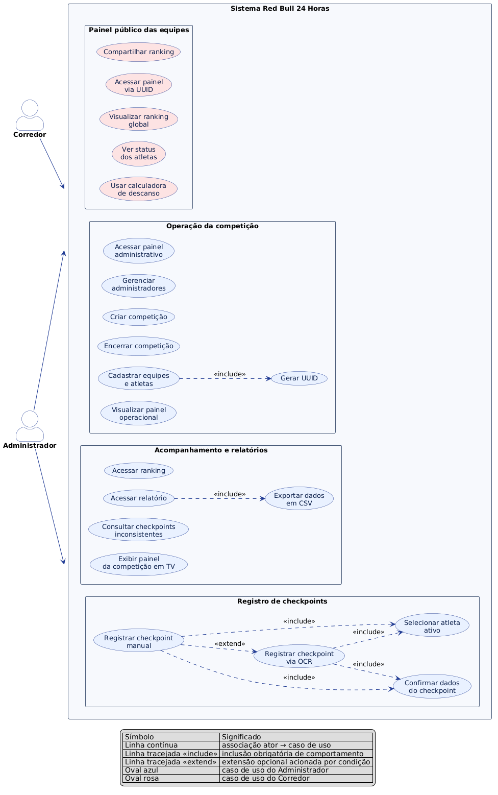

Fonte: Material produzido pelos autores (2026).

O **Administrador** unifica as personas Marina Costa (Coordenadora
Operacional) e Bruno Monteiro (Gerente de Field Marketing) e
corresponde ao operador autenticado responsável pela configuração e
operação do evento. É o ator com maior número de casos de uso,
atuando desde o acesso ao painel administrativo, a gestão dos demais
administradores autorizados, a criação e o encerramento de
competições, o cadastro de equipes e atletas, a operação do registro
de checkpoints (manual ou assistido por OCR), o acompanhamento do
ranking, o acesso ao relatório consolidado, a exportação em CSV e a
exibição do painel da competição em TV durante o evento. O
**Corredor** representa atletas e capitães de equipe, que acessam o
sistema por meio de uma URL única vinculada ao UUID público da
equipe, sem autenticação, para acompanhar o ranking global, consultar
o status dos atletas, utilizar a calculadora de descanso e
compartilhar o ranking da equipe.

O reconhecimento óptico de caracteres aplicado às imagens capturadas
pelo operador a partir do visor da esteira durante a competição é
tratado internamente pelo sistema, na forma do subsistema híbrido
descrito na seção 3.2.1 (Tesseract.js executado localmente no
servidor, com fallback opcional para a API externa da Groq), e por
isso não figura como ator externo no diagrama. A responsabilidade
antes representada por um ator «system» dedicado — a extração das
métricas a partir da imagem — passa a ser representada pelo caso de
uso interno "Registrar checkpoint via OCR". O acompanhamento de
checkpoints inconsistentes, por sua vez, foi modelado como uma
consulta operacional ("Consultar checkpoints inconsistentes")
disponível ao Administrador para auditoria e composição do relatório
consolidado, refletindo o comportamento efetivamente implementado em
`checkpointRepository.findInconsistenciesByCompetition` — que retorna
os checkpoints persistidos cujo corredor associado não pôde ser
resolvido — em vez de uma sinalização ativa em tempo real durante a
confirmação dos dados.

O diagrama emprega relações «include» e «extend» para representar
dependências entre casos de uso. A geração do UUID é «include» de
"Cadastrar equipes e atletas", refletindo que o identificador único é
gerado automaticamente ao persistir a equipe e é posteriormente
utilizado pela URL pública do painel da equipe. A seleção do atleta
ativo é «include» dos dois fluxos de registro de checkpoint, sendo
etapa obrigatória para vincular o registro ao corredor que está em
pista no momento. A confirmação humana dos dados é «include» de
ambos os fluxos de registro, em conformidade com a RN06 (validação
humana obrigatória) descrita na seção 3.1.2. O registro manual
estende o registro via OCR como caminho alternativo acionado quando a
extração automática falha ou não produz resultado utilizável. A
exportação em CSV é «include» do acesso ao relatório, uma vez que a
exportação é parte integrante da tela de relatórios consolidados.

#### 3.2.2.1 Descrição estruturada dos casos de uso

A literatura de UML recomenda que cada caso de uso identificado no
diagrama seja acompanhado por uma descrição estruturada, com seus
atores, pré-requisitos, pós-requisitos e fluxos principais e
alternativos (BOOCH; RUMBAUGH; JACOBSON, 2006). Os quadros a seguir
apresentam essa descrição para cada um dos vinte e um casos de uso da
Figura 9, identificados pelos rótulos UC01 a UC21 e agrupados pelos
quatro pacotes funcionais introduzidos anteriormente. A numeração
adotada é interna a esta subseção (UC), independente da numeração de
Quadros do restante do WAD, para evitar conflito com a numeração já
estabelecida em outras seções.

##### Pacote: Operação da competição

<div align="center"><sub>UC01 — Acessar painel administrativo</sub></div>

| Campo | Conteúdo |
| --- | --- |
| **Descrição** | Operador autenticado acessa a área administrativa do sistema para iniciar a sessão e habilitar as demais funcionalidades restritas a usuários autorizados. |
| **Ator primário** | Administrador |
| **Atores secundários** | — |
| **Pré-requisitos** | Administrador cadastrado e ativo, com credenciais válidas (e-mail e senha). |
| **Pós-requisitos** | Sessão administrativa iniciada e token JWT emitido pelo `AuthService` (HS256, validade de 8 horas); cookie de sessão definido no navegador. |
| **Fluxo principal** | 1. Administrador informa e-mail e senha no formulário de login. 2. Sistema delega a validação das credenciais ao `AuthService`, que consulta o `AdminRepository`. 3. Sistema emite o token JWT e o registra no cookie de sessão. 4. Sistema redireciona o Administrador para o painel administrativo. |
| **Fluxos alternativos** | 2a. Credenciais inválidas → sistema responde HTTP 401, exibe mensagem de erro e mantém o Administrador na tela de login; sessão não iniciada. |
| **RFs/RNs relacionados** | RF04, RN03 |

<div align="center"><sub>UC02 — Gerenciar administradores</sub></div>

| Campo | Conteúdo |
| --- | --- |
| **Descrição** | Administrador autenticado cadastra, consulta, atualiza ou remove os demais usuários autorizados a operar o sistema. |
| **Ator primário** | Administrador |
| **Atores secundários** | — |
| **Pré-requisitos** | UC01 concluído com sucesso. |
| **Pós-requisitos** | Lista de administradores atualizada via `AdminRepository`. |
| **Fluxo principal** | 1. Administrador acessa a área de gestão de administradores. 2. Seleciona a operação desejada (criar, consultar, atualizar ou remover). 3. Sistema delega a operação ao `AdminService`, que valida os dados e persiste a alteração via `AdminRepository`. |
| **Fluxos alternativos** | 2a. E-mail duplicado em cadastro/atualização → `AdminService` lança `ConflictError`, sistema rejeita a operação e persistência não é realizada. 2b. Identificador inexistente em consulta/atualização/remoção → `AdminService` lança `NotFoundError` e o sistema retorna HTTP 404. |
| **RFs/RNs relacionados** | RF04 |

<div align="center"><sub>UC03 — Criar competição</sub></div>

| Campo | Conteúdo |
| --- | --- |
| **Descrição** | Administrador cadastra uma nova competição com janela temporal definida, que será posteriormente populada com equipes, atletas e checkpoints. |
| **Ator primário** | Administrador |
| **Atores secundários** | — |
| **Pré-requisitos** | UC01 concluído com sucesso. |
| **Pós-requisitos** | Competição persistida no estado `not_started` via `CompetitionRepository`. |
| **Fluxo principal** | 1. Administrador informa nome, datas e demais parâmetros da competição. 2. `CompetitionService` valida os parâmetros (datas coerentes, nome não vazio). 3. Sistema persiste a competição via `CompetitionRepository`. 4. Sistema retorna a competição criada e a marca como selecionada via cookie para os fluxos administrativos subsequentes. |
| **Fluxos alternativos** | 2a. Parâmetros inválidos → sistema rejeita a criação com mensagem de erro; nenhuma persistência ocorre. |
| **RFs/RNs relacionados** | RF02, RN02 |

<div align="center"><sub>UC04 — Encerrar competição</sub></div>

| Campo | Conteúdo |
| --- | --- |
| **Descrição** | Administrador encerra uma competição em andamento, congelando o estado dos checkpoints, do ranking e dos relatórios. |
| **Ator primário** | Administrador |
| **Atores secundários** | — |
| **Pré-requisitos** | UC01 concluído; competição existente no estado `in_progress`. |
| **Pós-requisitos** | Competição transicionada para o estado `closed` via `CompetitionRepository`; novos checkpoints não são mais aceitos pelo `CheckpointService`. |
| **Fluxo principal** | 1. Administrador solicita o encerramento da competição. 2. `CompetitionService` verifica que a competição está em `in_progress`. 3. Sistema executa o `PATCH` correspondente e persiste a transição de estado. |
| **Fluxos alternativos** | 2a. Competição já encerrada ou ainda não iniciada → sistema rejeita a transição com mensagem informativa. |
| **RFs/RNs relacionados** | RF12, RN14 |

<div align="center"><sub>UC05 — Cadastrar equipes e atletas</sub></div>

| Campo | Conteúdo |
| --- | --- |
| **Descrição** | Administrador cadastra uma equipe vinculada a uma competição e os atletas que compõem a equipe (até dezesseis por equipe, conforme RN17). |
| **Ator primário** | Administrador |
| **Atores secundários** | — |
| **Pré-requisitos** | UC01 concluído; competição existente (UC03). |
| **Pós-requisitos** | Equipe persistida via `TeamRepository`, com UUID público atribuído (UC06); atletas persistidos via `RunnerRepository` e vinculados à equipe. |
| **Fluxo principal** | 1. Administrador informa o nome da equipe. 2. `TeamService` valida a unicidade do nome dentro da competição e persiste a equipe. 3. Sistema executa «include» do UC06 para gerar o UUID público. 4. Administrador cadastra os atletas da equipe. 5. `RunnerService` valida o limite de até dezesseis atletas por equipe e persiste cada atleta via `RunnerRepository`. |
| **Fluxos alternativos** | 2a. Nome de equipe duplicado na competição → sistema rejeita o cadastro e exibe mensagem de erro. 5a. Limite de atletas excedido → sistema bloqueia o cadastro adicional e orienta o Administrador. |
| **RFs/RNs relacionados** | RF01, RF03, RN01, RN17 |

<div align="center"><sub>UC06 — Gerar UUID (include)</sub></div>

| Campo | Conteúdo |
| --- | --- |
| **Descrição** | Sistema gera o identificador público único da equipe, utilizado pela URL única do painel público (UC17). |
| **Ator primário** | Sistema (acionado por UC05) |
| **Atores secundários** | — |
| **Pré-requisitos** | Equipe em processo de criação no fluxo UC05. |
| **Pós-requisitos** | Campo `uuid` da equipe preenchido e persistido com a constraint `uq_team_uuid UNIQUE`, garantindo unicidade global. |
| **Fluxo principal** | 1. Sistema invoca `gen_random_uuid()` no PostgreSQL durante o `INSERT` da equipe. 2. Valor é persistido no campo `uuid` da tabela `team`. |
| **Fluxos alternativos** | — |
| **RFs/RNs relacionados** | RF01, RN01 |

<div align="center"><sub>UC07 — Visualizar painel operacional</sub></div>

| Campo | Conteúdo |
| --- | --- |
| **Descrição** | Administrador acessa a tela `/operational-panel`, que concentra a operação do evento ao vivo: equipes, atletas ativos e últimos checkpoints. |
| **Ator primário** | Administrador |
| **Atores secundários** | — |
| **Pré-requisitos** | UC01 concluído; competição selecionada via cookie. |
| **Pós-requisitos** | Tela do painel operacional renderizada com o estado atual da competição. |
| **Fluxo principal** | 1. Administrador acessa `/operational-panel`. 2. `CheckpointController` consulta o estado atual junto aos repositórios de equipes, atletas e checkpoints. 3. Sistema renderiza a view com os dados consolidados. |
| **Fluxos alternativos** | 1a. Nenhuma competição selecionada → sistema redireciona o Administrador para a tela de seleção de competição. |
| **RFs/RNs relacionados** | RF05, RF09 |

##### Pacote: Registro de checkpoints

<div align="center"><sub>UC08 — Selecionar atleta ativo (include)</sub></div>

| Campo | Conteúdo |
| --- | --- |
| **Descrição** | Administrador define qual atleta da equipe está em pista no momento, vinculando os checkpoints subsequentes a esse corredor. |
| **Ator primário** | Administrador |
| **Atores secundários** | — |
| **Pré-requisitos** | UC01 concluído; equipe com pelo menos um atleta cadastrado (UC05). |
| **Pós-requisitos** | Campo `active_runner_id` da equipe atualizado via `TeamRepository`. |
| **Fluxo principal** | 1. Administrador acessa o painel operacional (UC07) e seleciona uma equipe. 2. Escolhe o atleta ativo entre os cadastrados. 3. Sistema executa `PATCH /competitions/:id/teams/:teamId/active-runner` e persiste a seleção. |
| **Fluxos alternativos** | 2a. Atleta não pertence à equipe selecionada → sistema rejeita a operação. |
| **RFs/RNs relacionados** | RF08, RN04 |

<div align="center"><sub>UC09 — Registrar checkpoint via OCR</sub></div>

| Campo | Conteúdo |
| --- | --- |
| **Descrição** | Administrador captura uma imagem do visor da esteira e o sistema extrai automaticamente as métricas (distância, pace, tempo) por OCR, oferecendo-as para confirmação humana antes da persistência. |
| **Ator primário** | Administrador |
| **Atores secundários** | — |
| **Pré-requisitos** | UC01 concluído; UC08 executado (atleta ativo definido); competição no estado `in_progress`. |
| **Pós-requisitos** | Métricas extraídas exibidas ao Administrador para confirmação no fluxo UC11; nenhum dado é persistido sem confirmação humana. |
| **Fluxo principal** | 1. Administrador captura a imagem pela câmera do iPad. 2. `OCRController` recebe o upload e delega ao `OCRService`. 3. `OCRService` tenta a extração local com Tesseract.js (modelo `eng.traineddata`); se o resultado for utilizável, retorna-o com origem `tesseract`. 4. Caso contrário, e havendo `GROQ_API_KEY` configurada, o `OCRGroqService` realiza a extração contra a API externa da Groq e o resultado é retornado com origem `groq`. 5. Sistema executa «include» do UC11 para confirmação humana. |
| **Fluxos alternativos** | 3a. Tesseract retorna resultado incompleto e Groq indisponível ou desativada → sistema responde `422 Unprocessable` e oferece ao Administrador o caminho de UC10 (registro manual). 4a. Erro de credencial Groq (`401`/`403`) → sistema desativa Groq para a sessão e registra o erro em log. |
| **RFs/RNs relacionados** | RF05, RF06, RN06 |

<div align="center"><sub>UC10 — Registrar checkpoint manual</sub></div>

| Campo | Conteúdo |
| --- | --- |
| **Descrição** | Administrador insere manualmente as métricas do checkpoint quando o registro via OCR (UC09) falha, não é viável ou foi conscientemente preterido pelo operador. |
| **Ator primário** | Administrador |
| **Atores secundários** | — |
| **Pré-requisitos** | UC01 concluído; UC08 executado (atleta ativo definido); competição no estado `in_progress`. |
| **Pós-requisitos** | Checkpoint persistido via `CheckpointRepository` com vínculo aos identificadores de corredor, equipe e competição. |
| **Fluxo principal** | 1. Administrador acessa o registro manual a partir do painel operacional. 2. Informa as métricas (distância, pace, tempo). 3. Sistema executa «include» do UC11 para confirmação. 4. `CheckpointService` aplica as regras de validação (RN04, RN05, RN12) e persiste o checkpoint via `CheckpointRepository`. |
| **Fluxos alternativos** | 2a. Métricas inválidas (formato incorreto, valores fora de faixa) → sistema rejeita o envio com mensagem de erro de validação; persistência não realizada. |
| **RFs/RNs relacionados** | RF07, RF08, RN04, RN05, RN12 |

<div align="center"><sub>UC11 — Confirmar dados do checkpoint (include)</sub></div>

| Campo | Conteúdo |
| --- | --- |
| **Descrição** | Validação humana obrigatória das métricas do checkpoint antes da persistência, em conformidade com a RN06. Atua tanto sobre o fluxo via OCR (UC09) quanto sobre o registro manual (UC10). |
| **Ator primário** | Administrador |
| **Atores secundários** | — |
| **Pré-requisitos** | Métricas disponíveis para revisão, oriundas de UC09 ou UC10. |
| **Pós-requisitos** | Checkpoint persistido via `CheckpointRepository` quando confirmado; nenhum registro persistido quando rejeitado. |
| **Fluxo principal** | 1. Sistema exibe as métricas extraídas ou digitadas. 2. Administrador revisa os valores. 3. Administrador confirma a operação. 4. `CheckpointController` aciona o `CheckpointService`, que persiste o checkpoint via `CheckpointRepository`. |
| **Fluxos alternativos** | 3a. Administrador edita as métricas antes de confirmar → o sistema atualiza a previsão e segue o fluxo. 3b. Administrador rejeita o registro → métricas descartadas, nenhum checkpoint é persistido. |
| **RFs/RNs relacionados** | RN05, RN06 |

##### Pacote: Acompanhamento e relatórios

<div align="center"><sub>UC12 — Acessar ranking</sub></div>

| Campo | Conteúdo |
| --- | --- |
| **Descrição** | Administrador consulta o ranking em tempo real das equipes e dos atletas, calculado a partir dos checkpoints registrados. |
| **Ator primário** | Administrador |
| **Atores secundários** | — |
| **Pré-requisitos** | UC01 concluído; competição com checkpoints registrados. |
| **Pós-requisitos** | Ranking renderizado em JSON (`GET /competitions/:id/ranking/teams|runners`) ou em view administrativa (`/ranking`, `/view/competitions/:id/ranking`). |
| **Fluxo principal** | 1. Administrador acessa a tela de ranking. 2. `RankingController` consulta o `RankingService`. 3. `RankingService` calcula posições, pace médio e desempates a partir do `CheckpointRepository`. 4. Sistema renderiza o ranking solicitado. |
| **Fluxos alternativos** | 1a. Nenhum checkpoint registrado → sistema retorna ranking vazio com mensagem informativa. |
| **RFs/RNs relacionados** | RF10, RF15, RN09, RN11 |

<div align="center"><sub>UC13 — Acessar relatório</sub></div>

| Campo | Conteúdo |
| --- | --- |
| **Descrição** | Administrador acessa o relatório consolidado da competição, que reúne métricas agregadas, ranking final e dados auditáveis. |
| **Ator primário** | Administrador |
| **Atores secundários** | — |
| **Pré-requisitos** | UC01 concluído; competição com dados disponíveis. |
| **Pós-requisitos** | Relatório consolidado renderizado em `GET /reports`, `GET /competitions/:id/reports` ou `GET /view/competitions/:id/reports`. |
| **Fluxo principal** | 1. Administrador acessa a tela de relatórios. 2. `ReportController` aciona o `ReportService`, que compõe os dados a partir do `ReportRepository`. 3. Sistema renderiza o relatório. 4. Sistema disponibiliza a exportação por «include» do UC14. |
| **Fluxos alternativos** | — |
| **RFs/RNs relacionados** | RF13 |

<div align="center"><sub>UC14 — Exportar dados em CSV (include)</sub></div>

| Campo | Conteúdo |
| --- | --- |
| **Descrição** | Sistema gera o arquivo CSV consolidado a partir dos dados da competição, possibilitando análises externas e arquivamento. |
| **Ator primário** | Administrador (acionando a exportação a partir de UC13) |
| **Atores secundários** | — |
| **Pré-requisitos** | UC13 em execução. |
| **Pós-requisitos** | Arquivo CSV gerado pelo `ExportService` e disponibilizado para download. |
| **Fluxo principal** | 1. Administrador aciona a exportação na tela de relatórios. 2. `ExportController` delega ao `ExportService`. 3. `ExportService` consulta o `ExportRepository` e formata o arquivo CSV. 4. Sistema retorna o arquivo para download. |
| **Fluxos alternativos** | — |
| **RFs/RNs relacionados** | RF13 |

<div align="center"><sub>UC15 — Consultar checkpoints inconsistentes</sub></div>

| Campo | Conteúdo |
| --- | --- |
| **Descrição** | Administrador lista os checkpoints da competição que apresentam inconsistência de vínculo — registros persistidos cujo corredor associado não pôde ser resolvido — para fins de auditoria operacional e composição do relatório consolidado. |
| **Ator primário** | Administrador |
| **Atores secundários** | — |
| **Pré-requisitos** | UC01 concluído; competição existente com pelo menos um checkpoint registrado. |
| **Pós-requisitos** | Lista de checkpoints inconsistentes da competição retornada em `GET /competitions/:id/checkpoints/inconsistencies` ou consolidada na seção de inconsistências do relatório (UC13). |
| **Fluxo principal** | 1. Administrador aciona a consulta a partir da rota dedicada ou da tela de relatórios. 2. `CheckpointController.findInconsistenciesByCompetition` delega a consulta ao `CheckpointService`. 3. `CheckpointRepository.findInconsistenciesByCompetition` recupera os checkpoints da competição e devolve aqueles cujo `runner` associado é nulo. 4. Sistema renderiza o resultado em JSON ou na tabela de inconsistências do relatório. |
| **Fluxos alternativos** | 1a. Nenhum checkpoint inconsistente → sistema retorna lista vazia (HTTP 200 com payload `[]` ou tabela com mensagem informativa no relatório). |
| **RFs/RNs relacionados** | RF13, RN05 |

<div align="center"><sub>UC16 — Exibir painel da competição em TV</sub></div>

| Campo | Conteúdo |
| --- | --- |
| **Descrição** | Administrador abre o painel público da competição em uma televisão ou projetor durante o evento, consolidando em uma única tela o estado da competição, a distância total percorrida, o tempo decorrido, o pace médio ponderado e as primeiras equipes do ranking. O painel é consumido visualmente pelo público presente, ainda que sem interação direta com o sistema. |
| **Ator primário** | Administrador |
| **Atores secundários** | — |
| **Pré-requisitos** | Competição existente e identificada por `:competitionId`. |
| **Pós-requisitos** | Painel renderizado na URL pública `GET /public/competitions/:id/tv-panel/metrics`, com atualização periódica das métricas. |
| **Fluxo principal** | 1. Administrador abre a URL do painel de TV em um navegador da televisão ou do projetor. 2. `TvPanelController` consulta o `TvPanelService`. 3. `TvPanelService` agrega o estado da competição, a distância total, o tempo decorrido, o pace médio ponderado e o top N de equipes. 4. Sistema renderiza a view consolidada e a atualiza ao longo do evento. |
| **Fluxos alternativos** | 1a. `:competitionId` inexistente → sistema retorna HTTP 404 com a tela pública de erro. |
| **RFs/RNs relacionados** | RF11 |

##### Pacote: Painel público das equipes

<div align="center"><sub>UC17 — Acessar painel via UUID</sub></div>

| Campo | Conteúdo |
| --- | --- |
| **Descrição** | Corredor acessa o painel público da própria equipe a partir do link único distribuído pela equipe, sem necessidade de autenticação. |
| **Ator primário** | Corredor |
| **Atores secundários** | — |
| **Pré-requisitos** | Equipe cadastrada (UC05), com UUID público válido (UC06). |
| **Pós-requisitos** | Painel da equipe renderizado em `GET /public/team/:uuid`, com os dados atualizados da competição. |
| **Fluxo principal** | 1. Corredor abre a URL `/public/team/:uuid` no navegador. 2. `RunnerController` busca a equipe pelo UUID. 3. Sistema renderiza a view pública com as informações da equipe. |
| **Fluxos alternativos** | 2a. UUID inexistente ou removido → sistema retorna HTTP 404 com a tela pública de erro. |
| **RFs/RNs relacionados** | RF14, RN13, RN17 |

<div align="center"><sub>UC18 — Visualizar ranking global</sub></div>

| Campo | Conteúdo |
| --- | --- |
| **Descrição** | Corredor consulta o ranking de todas as equipes da competição a partir do painel da própria equipe. |
| **Ator primário** | Corredor |
| **Atores secundários** | — |
| **Pré-requisitos** | UC17 concluído; competição em andamento ou encerrada. |
| **Pós-requisitos** | Ranking exibido com a posição da equipe destacada. |
| **Fluxo principal** | 1. Corredor solicita a visualização do ranking global no painel. 2. Sistema consulta o ranking via `RankingService`. 3. Ranking é renderizado com a posição da equipe destacada. |
| **Fluxos alternativos** | — |
| **RFs/RNs relacionados** | RF10, RF15 |

<div align="center"><sub>UC19 — Ver status dos atletas</sub></div>

| Campo | Conteúdo |
| --- | --- |
| **Descrição** | Corredor consulta o status de cada atleta da equipe (em pista, em descanso, última atualização) para apoiar a coordenação dos turnos. |
| **Ator primário** | Corredor |
| **Atores secundários** | — |
| **Pré-requisitos** | UC17 concluído. |
| **Pós-requisitos** | Lista de atletas exibida com o respectivo status e o instante do último checkpoint. |
| **Fluxo principal** | 1. Corredor abre a visão de status no painel da equipe. 2. Sistema apresenta cada atleta com o respectivo status e os indicadores associados. |
| **Fluxos alternativos** | — |
| **RFs/RNs relacionados** | RF14 |

<div align="center"><sub>UC20 — Usar calculadora de descanso</sub></div>

| Campo | Conteúdo |
| --- | --- |
| **Descrição** | Corredor consulta o tempo restante recomendado de descanso para cada atleta, calculado a partir do último checkpoint registrado e do tempo recomendado de 50 minutos (RN08), com classificação visual em três categorias (verde, amarelo ou vermelho) conforme o progresso do descanso. |
| **Ator primário** | Corredor |
| **Atores secundários** | — |
| **Pré-requisitos** | UC17 concluído; atleta com pelo menos um checkpoint registrado. |
| **Pós-requisitos** | Percentual e tempo restante de descanso exibidos no painel da equipe, com a categoria visual (verde, amarelo ou vermelho) correspondente ao progresso. |
| **Fluxo principal** | 1. Corredor seleciona um atleta no painel. 2. Sistema calcula o tempo decorrido desde o último checkpoint. 3. Sistema apresenta o percentual concluído, o tempo restante até o limite recomendado de 50 minutos e a categoria visual correspondente, em conformidade com a RN08. |
| **Fluxos alternativos** | 1a. Atleta sem checkpoint registrado → sistema exibe a indicação "Aguardando tempo de descanso…" sem cálculo numérico. |
| **RFs/RNs relacionados** | RN08 |

<div align="center"><sub>UC21 — Compartilhar ranking</sub></div>

| Campo | Conteúdo |
| --- | --- |
| **Descrição** | Corredor compartilha o link público do painel da equipe copiando a URL para a área de transferência do dispositivo. |
| **Ator primário** | Corredor |
| **Atores secundários** | — |
| **Pré-requisitos** | UC17 concluído. |
| **Pós-requisitos** | URL pública (`/public/team/:uuid`) copiada para a área de transferência do dispositivo. |
| **Fluxo principal** | 1. Corredor aciona o botão de compartilhar no cabeçalho do painel. 2. Sistema copia a URL pública da equipe para a área de transferência. 3. Sistema apresenta um *toast* de confirmação. |
| **Fluxos alternativos** | 2a. Navegador sem permissão para acessar a área de transferência → sistema exibe a URL para cópia manual. |
| **RFs/RNs relacionados** | RF14 |

### 3.2.3. Diagrama de Classes do Domínio

O diagrama de classes de domínio é uma representação visual que modela todos os elementos principais e os relacionamentos de um sistema. O objetivo do diagrama é descrever as entidades presentes no domínio do problema proposto de forma conceitual, descrever seus atributos e descrever como as entidades se conectam. Ele auxilia na compreensão da estrutura do sistema antes de ser implementado, facilitando a comunicação e entendimento de todos os membros da equipe e servindo como base para o desenvolvimento. 

<div align="center">
  <sub>Figura 10 - Diagrama de Classes de Domínio </sub><br>
  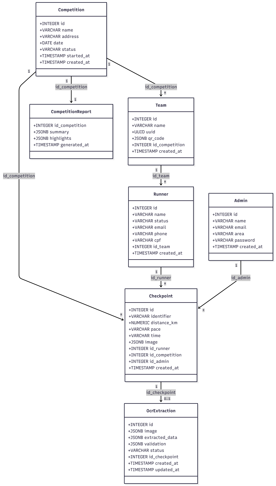<br>
  <sup>Fonte: Elaborado pelos autores (2026).</sup>
</div>

#### 3.2.3.1 Diagrama de Classes Arquitetural

O Diagrama de Classes Arquitetural é uma das representações da UML (Unified Modeling Language) que apresenta, em nível de projeto, as principais classes do sistema, seus atributos, métodos e os relacionamentos entre elas. Diferentemente do diagrama de classes de domínio, voltado à modelagem conceitual do negócio, o diagrama arquitetural reflete diretamente a estrutura do código-fonte, evidenciando como as responsabilidades são distribuídas entre as camadas da aplicação e como os componentes se comunicam entre si.

No projeto em questão, a arquitetura adotada segue o padrão Controller-Service-Repository, amplamente utilizado em aplicações back-end por promover separação de responsabilidades, facilitar a manutenção e viabilizar a testabilidade independente de cada camada. A camada Controller é responsável por receber as requisições HTTP e delegar o processamento para a camada de serviço. A camada Service concentra as regras de negócio da aplicação. Já a camada Repository abstrai o acesso ao banco de dados PostgreSQL via Supabase, expondo métodos padronizados de consulta e persistência. Complementando esse núcleo, o sistema conta ainda com camadas de Routes (definição de rotas Express com middlewares de autenticação), Validators (schemas zod para validação de entrada), Middlewares (autenticação JWT e tratamento global de erros) e Helpers (funções utilitárias como inferência de método de entrada e seleção de competição ativa).

O diagrama é composto pelos seguintes módulos principais: Admin, Auth, Competition, Team, Runner, Checkpoint, OCR, Ranking, Report, Export e TvPanel. A maior parte desses módulos segue a estrutura de três camadas apresentada anteriormente. Alguns serviços, no entanto, fogem a essa regra por terem função de suporte geral ou por consumirem outros serviços diretamente. É o caso do AuthService, que utiliza o AdminRepository para autenticação; do OCRService, que orquestra os submódulos Tesseract (local) e Groq (fallback via LLM) sem depender de outros serviços do sistema; e do RankingService, ReportService, ExportService e TvPanelService, que reutilizam serviços existentes (como CheckpointService, CompetitionService e TeamService) para gerar rankings, relatórios e exportações. As entidades do sistema são representadas por interfaces TypeScript nos modelos (Competition, Team, Runner, Checkpoint, Admin, etc.), enquanto a validação de dados de entrada é feita por validators dedicados com zod, e não pelas interfaces de modelo.

As dependências entre as classes seguem o fluxo Controller → Service → Repository, com setas indicando uso ou associação. O CheckpointService depende do CompetitionService para verificar se a competição ainda está ativa antes de registrar um novo checkpoint, e do CheckpointRepository para persistência. O RankingService depende do CheckpointService e do TeamService para calcular posições, pace médio e classificação de equipes e corredores em tempo real. O ReportService, por sua vez, consome CompetitionService, CheckpointService e RankingService para gerar relatórios consolidados. O ExportService utiliza o ExportRepository e o RankingService para montar a exportação de dados. O TvPanelService combina dados do CompetitionService, CheckpointRepository e RankingService para alimentar o painel de TV público. O OCRService opera de forma independente, chamando apenas os submódulos Tesseract e Groq, sem depender de CheckpointService ou qualquer outro serviço do sistema — a extração de métricas é dissociada da criação do checkpoint, que ocorre em uma requisição separada.

<div align="center">
  <sub>Figura 10 - Diagrama de Classes Arquitetural</sub><br>
  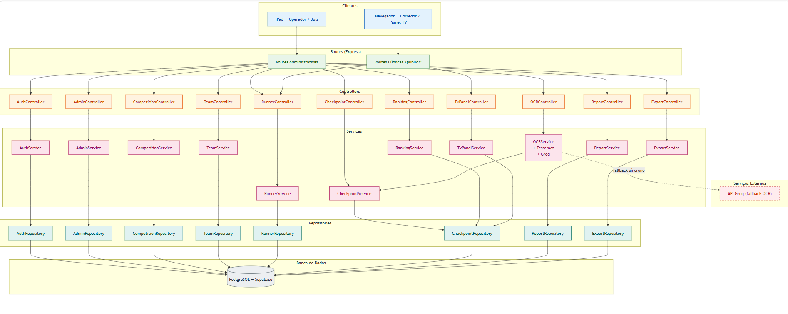<br>
  <sup>Fonte: Elaborado pelos autores (2026).</sup>
</div>


### 3.2.4. Diagrama de Sequência UML (sprint 3)

Os diagramas de sequência UML apresentados modelam a comunicação entre as camadas da arquitetura da aplicação seguindo o fluxo Controller → Service → Repository → Banco de Dados, evidenciando a separação de responsabilidades no back-end. As mensagens síncronas representam operações que aguardam resposta imediata para continuidade do fluxo, enquanto mensagens assíncronas foram utilizadas em processos de maior latência, como o processamento OCR e atualização de dados em tempo quase real. Os retornos tracejados representam as respostas das operações executadas entre os componentes da aplicação e a persistência no banco de dados.

O PlantUML é uma ferramenta de código aberto que permite a criação de diagramas UML a partir de descrições textuais simples, eliminando a necessidade de ferramentas gráficas manuais. Por meio de uma sintaxe própria e intuitiva, o texto é interpretado e convertido automaticamente em imagens, o que favorece a legibilidade, o versionamento e a manutenção dos diagramas ao longo do ciclo de desenvolvimento do projeto. Os diagramas de sequência apresentados nesta seção foram elaborados utilizando essa abordagem, com o código-fonte escrito em formato .puml e a geração das imagens realizada pela plataforma disponível em plantuml.com (PlantUML, s.d.).

O código-fonte dos diagramas em PlantUML pode ser consultado no documento [diagramas-sequencia-puml.md](./outros/diagramas-sequencia-puml.md), localizado na pasta `documentos/outros`. Esse arquivo reúne os blocos textuais utilizados para gerar as imagens apresentadas a seguir, permitindo que os diagramas sejam versionados, revisados e atualizados com maior facilidade.

O primeiro diagrama representa o fluxo de registro de checkpoint via OCR. Nele, o operador envia a imagem para o Controller, que encaminha a solicitação ao Service; o Service registra a extração por meio do Repository, persiste os dados iniciais no Banco de Dados, executa o processamento OCR de forma assíncrona e, após a validação humana, salva o checkpoint com retorno tracejado entre as camadas.

<div align="center">
  <sub>Figura 12 - Diagrama de sequência do registro de checkpoint via OCR</sub><br>
  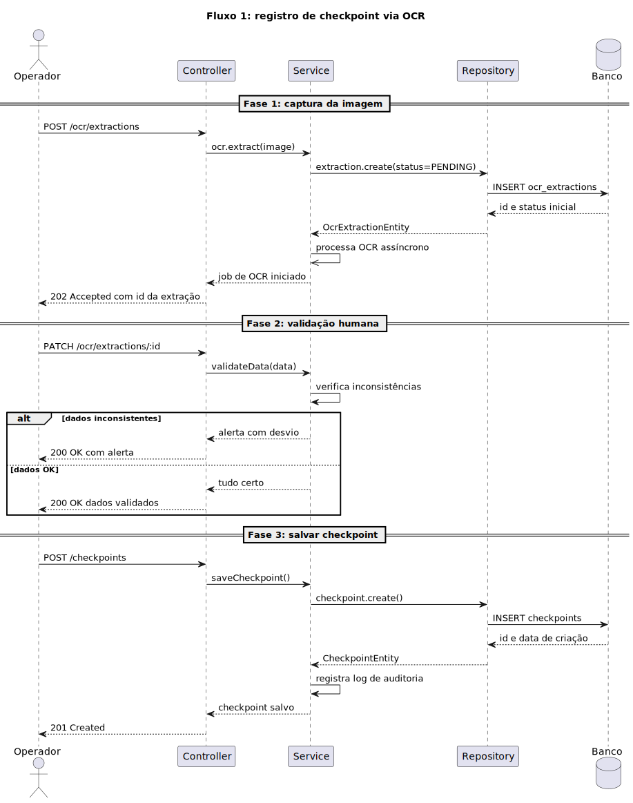<br>
  <sup>Fonte: Elaborado pelos autores (2026).</sup>
</div>

O segundo diagrama descreve o fluxo de cadastro de equipe e geração de UUID. O administrador cadastra a equipe em uma competição, o Controller aciona o Service, o Service utiliza o Repository para persistir equipes e atletas no Banco de Dados, e a aplicação retorna o link público após registrar os dados. O fluxo também evidencia a atualização assíncrona de ranking em segundo plano e a consulta posterior da equipe por meio da mesma arquitetura em camadas.

<div align="center">
  <sub>Figura 13 - Diagrama de sequência do cadastro de equipe e geração de UUID</sub><br>
  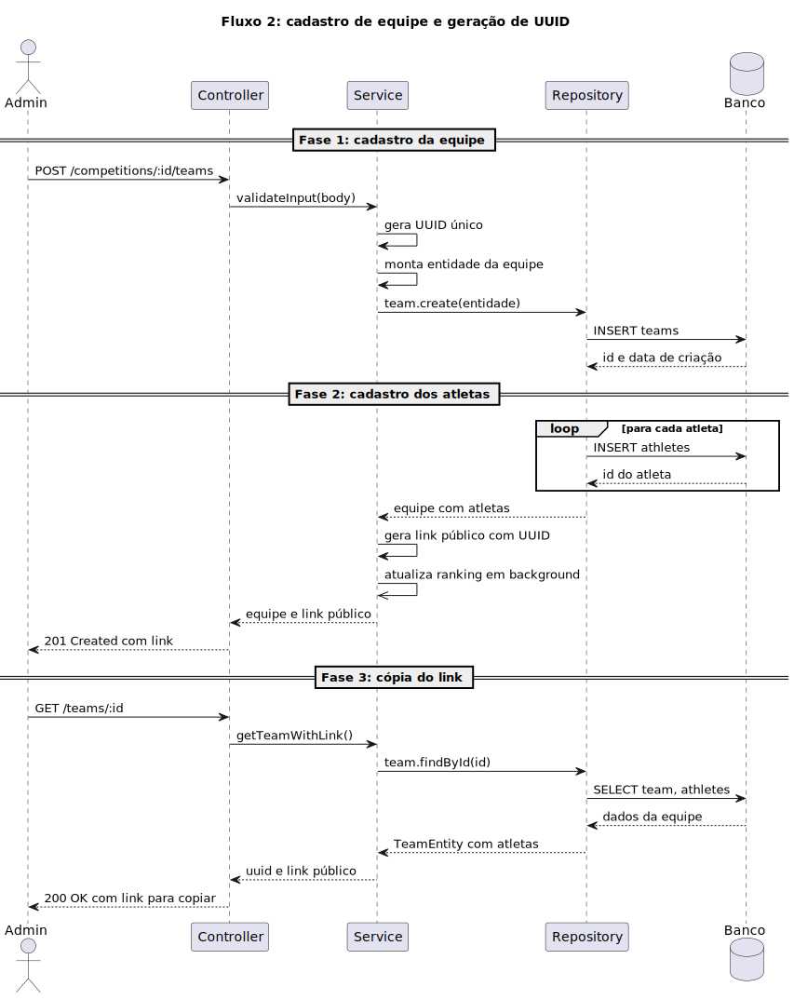<br>
  <sup>Fonte: Elaborado pelos autores (2026).</sup>
</div>

O terceiro diagrama mapeia o fluxo de autenticação de administrador (Fluxo 3). O administrador envia suas credenciais via `POST /auth/sessions`; o `authController` repassa ao `authService`, que consulta o `adminRepository` para localizar o registro por e-mail no Banco de Dados. Caso as credenciais sejam válidas, o Service gera um JWT com validade de 8 horas e o devolve ao cliente. Em caso de erro, um `UnauthorizedError` é lançado e propagado até o cliente como `401 Unauthorized`.

<div align="center">
  <sub>Figura 14 - Diagrama de sequência do fluxo de autenticação do administrador</sub><br>
  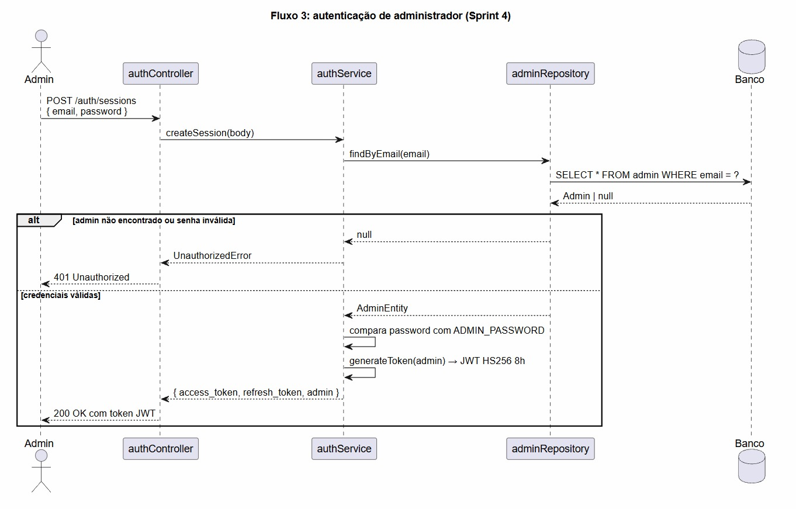<br>
  <sup>Fonte: Elaborado pelos autores (2026).</sup>
</div>

O quarto diagrama ilustra o fluxo de criação de checkpoint (Fluxo 4). O operador envia os dados via `POST /checkpoints`; o `checkpointController` invoca o `checkpointService`, que valida o payload com `validateCreateCheckpoint` antes de chamar o `checkpointRepository`. O Repository persiste o registro no Banco de Dados via Supabase e retorna a entidade criada. Violações de unicidade (código PostgreSQL `23505`) geram `ConflictError` e violações de chave estrangeira (`23503`) geram `NotFoundError`, ambas tratadas pelo Service antes de propagar ao Controller.

<div align="center">
  <sub>Figura 15 - Diagrama de sequência do fluxo de criação de checkpoint</sub><br>
  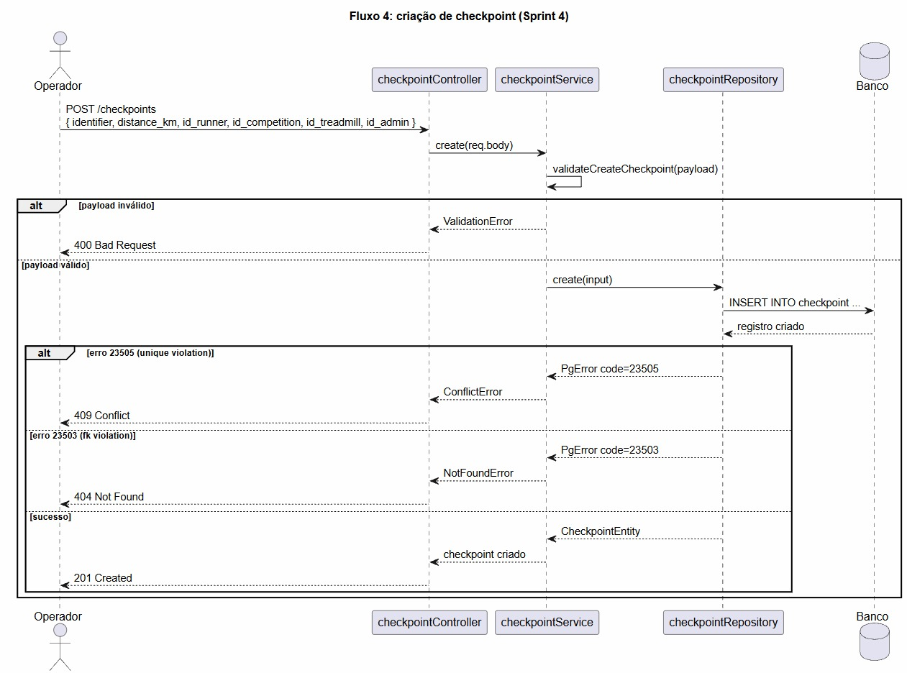<br>
  <sup>Fonte: Elaborado pelos autores (2026).</sup>
</div>

### 3.2.5. Diagrama de Atividades ou Estados 

O diagrama de atividades a seguir representa o fluxo de registro de checkpoint por meio do módulo de OCR da solução. O processo inicia com a captura da foto do painel pelo operador, seguida pelo envio da imagem ao servidor para processamento. Após a extração dos dados pelo servidor, o sistema realiza validações relacionadas ao atleta, à equipe e à competição antes de registrar o checkpoint e atualizar as informações exibidas aos usuários.

<div align="center">
  <sub>Figura 16 - Diagrama de atividades do registro de checkpoint via OCR</sub><br>
  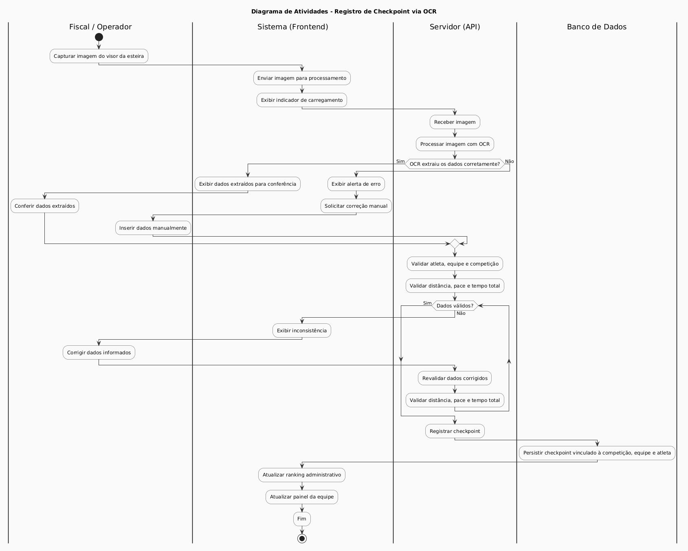<br>
  <sup>Fonte: Elaborado pelos autores (2026).</sup>
</div>

O fluxo contempla tanto o cenário de sucesso quanto os casos em que os dados extraídos pelo OCR apresentam inconsistências. Nessas situações, o sistema solicita correção manual e realiza uma nova validação antes de permitir o registro do checkpoint. Desta forma, o processo contribui para a confiabilidade das informações utilizadas na atualização do ranking administrativo e do painel das equipes.

### 3.2.6. Diagrama de Implantação 

O Diagrama de Implantação UML modela a distribuição física dos artefatos de software sobre os nós de hardware e de infraestrutura, evidenciando como os componentes são alocados em tempo de execução e quais canais de comunicação os interligam. Segundo Booch, Rumbaugh e Jacobson (2005), esse diagrama representa a visão de implantação (*deployment view*) de uma arquitetura, complementando os diagramas de sequência e de classes ao situar os artefatos em seu ambiente operacional real. No contexto do RM-ODP (Reference Model of Open Distributed Processing), o diagrama corresponde às perspectivas *Engineering* e *Technology*, que descrevem, respectivamente, a infraestrutura de suporte à distribuição e as tecnologias concretas utilizadas.
 
O sistema Red Bull 24h é composto por três nós principais em produção: o dispositivo cliente (navegador web), o servidor de aplicação Node.js/Express e o banco de dados gerenciado Supabase (PostgreSQL). Um quarto nó, o GitLab Pages, hospeda a documentação estática da WebAPI, sem participar do fluxo de dados em tempo de execução. O processamento OCR ocorre no servidor de aplicação (*server-side*), por meio da biblioteca Tesseract.js em conjunto com pré-processamento de imagem pela biblioteca sharp, havendo ainda um mecanismo de extração assistida por modelo de linguagem (Groq) acionado como complemento. A imagem capturada no dispositivo cliente é enviada ao servidor, que executa a extração e devolve os dados para validação humana antes da persistência.

<div align="center">
  <sub>Figura 17 - Diagrama de Implantação UML</sub><br>

```
plantuml
@startuml diagrama-implantacao
 
skinparam backgroundColor #FFFFFF
skinparam node {
  BackgroundColor #F5F5F5
  BorderColor #333333
  FontName Arial
}
skinparam artifact {
  BackgroundColor #DAE8FC
  BorderColor #6C8EBF
}
skinparam component {
  BackgroundColor #D5E8D4
  BorderColor #82B366
}
skinparam database {
  BackgroundColor #FFF2CC
  BorderColor #D6B656
}
 
node "Dispositivo do Operador / Capitão\n(Navegador Web)" as browser {
  artifact "Aplicação Web (HTML/CSS/JS)\nServida pelo Express (EJS)" as webapp
}
 
node "Servidor de Aplicação\n(Node.js + TypeScript)" as server {
  artifact "Express App (app.ts)" as express
  component "Routes" as routes
  component "Controllers" as controllers
  component "Services" as services
  component "OCR Server-side\n(Tesseract.js + sharp + Groq)" as ocr
  component "Repositories" as repositories
  component "Validators / Middlewares" as validators
}
 
node "Banco de Dados Gerenciado\n(Supabase - PostgreSQL)" as db {
  database "Schema público\n(competition, team, runner,\ncheckpoint, admin, ocr_extraction,\ncompetition_report)" as schema
}
 
node "GitLab Pages\n(Infraestrutura estática)" as pages {
  artifact "api-documentation.html\n(documentação da WebAPI)" as apidoc
}
 
browser --> server : "HTTP/REST\n(JSON - porta 3000)"
browser --> server : "Upload de imagem\n(multipart/form-data -\nPOST /ocr/extractions)"
repositories --> db : "Supabase JS SDK\n(HTTPS - porta 443)"
browser ..> pages : "HTTPS (leitura apenas -\nacesso externo de revisores)"
 
express --> routes
routes --> controllers
controllers --> services
services --> ocr
services --> repositories
services --> validators
 
@enduml
```
 
  <sup>Fonte: Elaborado pelos autores (2026).</sup>
</div>

O nó **Dispositivo do Operador / Capitão** representa qualquer navegador moderno a partir do qual o operador acessa a interface administrativa ou o capitão de equipe consulta o painel público. No fluxo de OCR implementado, o dispositivo captura ou seleciona a imagem do display da esteira e a envia ao servidor por `POST /ocr/extractions`; o processamento ocorre no back-end, com Tesseract.js e fallback via Groq quando configurado, retornando os dados extraídos para validação humana antes da persistência.

O nó **Servidor de Aplicação** executa a aplicação Node.js compilada em TypeScript, organizada na arquitetura em camadas descrita na seção 3.2.1. O ponto de entrada é `src/app.ts`, que inicializa o framework Express e registra os roteadores por domínio funcional (`competitions`, `teams`, `runners`, `checkpoints`, `ocr`, `ranking`, `reports`, `export`, `auth`, `admin` e `dashboard`). A comunicação entre cliente e servidor ocorre via HTTP/REST com payloads em JSON ou formulários HTML. Em ambiente de desenvolvimento local, o servidor opera na porta 3000; em produção, a porta é definida pela variável de ambiente `PORT`.
O nó **Dispositivo do Operador / Capitão** representa qualquer navegador moderno a partir do qual o operador acessa a interface administrativa ou o capitão de equipe consulta o painel público. A foto do painel é capturada pelo dispositivo e enviada ao servidor por meio de requisição `POST /ocr/extractions`, no formato *multipart/form-data*. O dispositivo cliente não executa o reconhecimento de imagem; sua função no fluxo OCR limita-se à captura e ao envio da foto.
 
O nó **Servidor de Aplicação** executa a aplicação Node.js compilada em TypeScript, organizada na arquitetura em camadas descrita na seção 3.2.1. O ponto de entrada é `src/app.ts`, que inicializa o framework Express e registra os roteadores por domínio funcional (`competitions`, `teams`, `runners`/`athletes`, `checkpoints`, `ocr`, `ranking`, `export`, `reports`, `auth` e o roteador administrativo montado sob o prefixo `/admin`). É também neste nó que ocorre o processamento OCR, por meio do módulo de serviços `src/services/ocr*.ts` (Tesseract.js, pré-processamento com sharp e extração assistida por Groq). A comunicação entre cliente e servidor ocorre via HTTP/REST com payloads em JSON. Em ambiente de desenvolvimento local, o servidor opera na porta 3000; em produção, a porta é definida pela variável de ambiente `PORT`.
 
O nó **Banco de Dados Gerenciado** corresponde à instância PostgreSQL hospedada pelo Supabase. O acesso é realizado exclusivamente pela camada Repository por meio do Supabase JS SDK, que encapsula as requisições HTTPS ao endpoint gerenciado. Nenhuma outra camada da aplicação detém acesso direto ao banco, garantindo o isolamento arquitetural descrito na seção 3.2.1. O esquema relacional é gerenciado pelos arquivos de migração DDL localizados em `documentos/outros/migrations/`, conforme detalhado na seção 3.6.3.
 
O nó **GitLab Pages** hospeda a documentação estática da WebAPI (`documentos/outros/api-documentation.html`), publicada em `https://web-api-deploy-d81981.pages.git.inteli.edu.br/`. Este nó não integra o fluxo de dados operacional da aplicação; sua finalidade é exclusivamente facilitar a leitura e validação externa da documentação de endpoints sem necessidade de clonar o repositório.
 
A ausência de um nó de autenticação dedicado nesta versão reflete o estado atual do desenvolvimento: o mecanismo de autenticação e controle de sessão é executado pelo próprio servidor de aplicação, conforme descrito na seção 3.8, e não demanda um nó de infraestrutura separado.


### 3.2.7. Padrões de Projeto Aplicados 

Os padrões de projeto foram adotados ao longo do desenvolvimento com o objetivo de promover uma arquitetura organizada, modular e de fácil manutenção. A utilização desses padrões contribui para a separação de responsabilidades entre as camadas da aplicação, reduzindo o acoplamento entre componentes e facilitando a reutilização de código, a escalabilidade e a testabilidade das funcionalidades implementadas.
 
Com a evolução do sistema e a integração de um frontend renderizado no servidor, baseado no template engine EJS com suporte a layouts e parciais, a arquitetura da aplicação passou a contemplar também padrões relacionados à camada de apresentação. A documentação a seguir descreve os padrões aplicados tanto no backend quanto no frontend, com base no código efetivamente implementado na versão atual do projeto.
 
---
### MVC (Model-View-Controller)
 
#### Categoria
 
Arquitetural
 
#### Definição
 
O padrão Model-View-Controller (MVC) organiza a aplicação em camadas com responsabilidades distintas. Os Models representam os dados da aplicação, as Views são responsáveis pela apresentação das informações ao usuário e os Controllers coordenam o fluxo das requisições entre as diferentes camadas do sistema. No projeto, as Views são implementadas por meio de templates EJS renderizados no servidor pelo Express.
 
#### Problema resolvido
 
Sem esse padrão, regras de negócio, acesso aos dados e elementos de interface poderiam ficar concentrados em uma única camada, aumentando o acoplamento e dificultando manutenção, testes e evolução da aplicação.
 
#### Justificativa da adoção
 
Com a implementação do frontend, tornou-se necessário estruturar a camada de apresentação de forma integrada ao backend existente. A utilização do MVC permitiu manter a separação de responsabilidades entre Controllers, Services, Repositories e Views, preservando a organização arquitetural da aplicação.
 
#### Aplicação no projeto
 
O padrão pode ser observado nos seguintes arquivos e diretórios:
 
- `src/app.ts`
- `src/controllers/`
- `src/services/`
- `src/repositories/`
- `src/models/`
- `src/views/`
- `src/routes/dashboardRoutes.ts`
- `src/controllers/rankingController.ts`
- `src/controllers/reportController.ts`
#### Exemplo de código
 
```typescript
const competitions = await competitionService.findAll();
 
res.render("dashboard/dashboard", {
  title: "Dashboard - Red Bull 24H",
  competitions,
  activeCompetition,
  currentPage: "dashboard",
  pageCSS: "/css/dashboard.css"
});
```
 
Nesse exemplo, o Controller obtém os dados por meio da camada de Service e encaminha as informações para uma View EJS responsável pela renderização da interface.
 
---
 

### Repository Pattern
 
#### Categoria
 
Estrutural / Arquitetural
 
#### Definição
 
O Repository Pattern é um padrão responsável por centralizar e abstrair o acesso aos dados da aplicação em uma camada específica de repositório. Esse padrão atua como intermediário entre a aplicação e o banco de dados, encapsulando operações de persistência, como consultas, inserções, atualizações e remoções de registros.
 
Com a utilização desse padrão, as demais camadas da aplicação não precisam conhecer detalhes específicos relacionados à comunicação com o banco de dados, às consultas utilizadas ou à estrutura de persistência dos dados.
 
#### Problema resolvido
 
Sem a utilização desse padrão, operações relacionadas ao banco de dados ficariam distribuídas entre Controllers e Services, fazendo com que múltiplas camadas da aplicação fossem responsáveis tanto pela lógica de negócio quanto pelo acesso aos dados. Esse cenário aumentaria significativamente o acoplamento entre os componentes do sistema e dificultaria manutenção, reutilização de código e organização da arquitetura.
 
#### Justificativa da adoção
 
Esse padrão foi adotado porque o backend possui diferentes operações de CRUD relacionadas às entidades da aplicação. Durante o desenvolvimento, tornou-se necessário separar a lógica responsável pelo acesso ao banco de dados das regras de negócio, permitindo que cada camada possuísse uma responsabilidade específica dentro da arquitetura do sistema. A centralização das operações de persistência em arquivos de repositório também contribui para melhorar a organização do backend, reduzir repetição de consultas, facilitar manutenção das operações de banco, reutilizar métodos de acesso aos dados e reduzir acoplamento entre as camadas da aplicação.
 
#### Aplicação no projeto
 
O padrão foi aplicado nos seguintes arquivos:
 
- `src/repositories/competitionRepository.ts`
- `src/repositories/teamRepository.ts`
- `src/repositories/runnerRepository.ts`
- `src/repositories/checkpointRepository.ts`
- `src/repositories/adminRepository.ts`
- `src/repositories/reportRepository.ts`
- `src/repositories/exportRepository.ts`
- `src/repositories/authRepository.ts`

Esses arquivos concentram as operações responsáveis pela comunicação com o Supabase, incluindo consultas, criação de registros, atualizações e remoções de dados. Dessa forma, os Services não executam diretamente operações de banco de dados, utilizando os repositórios como intermediários para acesso às informações persistidas.
 
#### Exemplo de código
 
```typescript
async findById(id: number): Promise<Competition | null> {
  const supabase = getSupabaseClient();
 
  const { data, error } = await supabase
    .from("competition")
    .select("id, name, address, date, status, created_at")
    .eq("id", id)
    .maybeSingle();
 
  if (error) {
    throw error;
  }
 
  return data as unknown as Competition | null;
}
```
 
No exemplo apresentado, o método `findById` encapsula toda a lógica de consulta ao banco de dados dentro do repositório. Assim, outras camadas da aplicação não precisam conhecer detalhes relacionados ao Supabase ou à construção da consulta utilizada para buscar uma competição pelo identificador.
 
---

### Service Layer Pattern
 
#### Categoria
 
Arquitetural
 
#### Definição
 
O Service Layer é um padrão utilizado para centralizar regras de negócio em uma camada intermediária entre os Controllers e os Repositories. Essa camada é responsável por coordenar operações da aplicação, validar fluxos de execução e controlar comportamentos relacionados às funcionalidades do sistema antes da comunicação com a camada de persistência. A utilização desse padrão permite separar responsabilidades entre as diferentes partes do backend, evitando que Controllers assumam funções além do gerenciamento das requisições HTTP.
 
#### Problema resolvido
 
Sem esse padrão, os Controllers seriam responsáveis simultaneamente pelo recebimento das requisições HTTP, execução das regras de negócio e manipulação de dados persistidos. Esse cenário geraria Controllers excessivamente grandes e acoplados, dificultando organização do código, reutilização de lógica e implementação de testes unitários. Além disso, diferentes regras de negócio poderiam acabar repetidas em múltiplos endpoints da aplicação.
 
#### Justificativa da adoção
 
Esse padrão foi adotado para garantir separação clara entre responsabilidades dentro do backend. No projeto, a camada de Service concentra regras relacionadas às entidades do sistema, incluindo validação de parâmetros, verificação de existência de registros, coordenação de operações, lançamento de exceções e controle de fluxos de execução. Dessa forma, os Controllers permanecem responsáveis apenas pelo recebimento das requisições e envio das respostas HTTP, enquanto os repositórios permanecem responsáveis exclusivamente pela persistência dos dados.
 
#### Aplicação no projeto
 
O padrão foi aplicado nos seguintes arquivos:
 
- `src/services/competitionService.ts`
- `src/services/teamService.ts`
- `src/services/runnerService.ts`
- `src/services/checkpointService.ts`
- `src/services/authService.ts`
- `src/services/adminService.ts`
- `src/services/rankingService.ts`
- `src/services/exportService.ts`
- `src/services/reportService.ts`
#### Exemplo de código
 
```typescript
async findById(idParam: unknown): Promise<Competition> {
  const id = validateCompetitionId(idParam);
  const competition = await repository.findById(id);
 
  if (!competition) {
    throw new NotFoundError("Competição não encontrada");
  }
 
  return competition;
}
```
 
Nesse exemplo, o Service realiza validação do identificador recebido, consulta o repositório e verifica se o registro existe antes de retornar a informação. Dessa forma, a lógica de negócio permanece isolada da camada responsável pelas requisições HTTP.
 
---

### Dependency Injection Pattern
 
#### Categoria
 
Criacional / Arquitetural
 
#### Definição
 
A Dependency Injection é um padrão utilizado para fornecer dependências externas para uma função, classe ou módulo, em vez de instanciá-las diretamente dentro da própria implementação. No projeto, o padrão é implementado por meio de factory functions que recebem repositórios, e, em alguns casos, outros services, como parâmetros com valores padrão, retornando um objeto com os métodos do service. Esse padrão reduz o acoplamento entre os componentes do sistema e permite maior flexibilidade, especialmente na realização de testes automatizados.
 
#### Problema resolvido
 
Sem a utilização desse padrão, os Services dependeriam diretamente das implementações concretas dos repositórios, fazendo com que a camada de negócio estivesse fortemente acoplada à camada de persistência. Além disso, esse cenário dificultaria a criação de testes automatizados, pois os testes dependeriam diretamente do banco de dados e das implementações reais da aplicação.
 
#### Justificativa da adoção
 
Esse padrão foi adotado devido à necessidade de testar regras de negócio de forma isolada, sem depender diretamente do banco de dados utilizado pelo sistema. A utilização da Injeção de Dependência permite substituir os repositórios reais por objetos simulados (mocks) durante os testes. Além disso, o padrão contribui para reduzir acoplamento entre camadas, facilitar manutenção, melhorar testabilidade e permitir maior flexibilidade na criação dos Services.
 
#### Aplicação no projeto
 
O padrão foi aplicado nos seguintes arquivos, todos seguindo a mesma convenção de factory function com parâmetro de dependência e valor padrão:
 
- `src/services/competitionService.ts`
- `src/services/checkpointService.ts`
- `src/services/authService.ts`
- `src/services/exportService.ts`
- `src/services/rankingService.ts`
- `src/services/reportService.ts`
#### Exemplo de código
 
```typescript
// Injeção simples: repositório como dependência
export function createCompetitionService(
  repository: CompetitionRepository = competitionRepository
) {
  return {
    async create(payload: Partial<CreateCompetitionInput>): Promise<Competition> {
      const input = validateCreateCompetition(payload);
      return repository.create(input);
    },
    // ...
  };
}
 
export const competitionService = createCompetitionService();
```
 
```typescript
// Injeção múltipla: dois services como dependências
export function createRankingService(
  checkpoints: CheckpointServiceDependency = checkpointService,
  teams: TeamServiceDependency = teamService
) {
  return { ... };
}
 
export const rankingService = createRankingService();
```
 
Em ambos os exemplos, as dependências são fornecidas como parâmetros com valores padrão. Durante a execução normal da aplicação, utiliza-se a implementação real; nos testes, podem ser fornecidos mocks para simular o comportamento esperado.
 
---

### Middleware Pattern
 
#### Categoria
 
Comportamental / Arquitetural
 
#### Definição
 
O Middleware Pattern consiste na utilização de funções intermediárias executadas durante o fluxo de processamento das requisições HTTP. Essas funções atuam entre o recebimento da requisição e a execução final do Controller, permitindo centralizar comportamentos compartilhados relacionados ao fluxo da aplicação, como tratamento de erros e encapsulamento de handlers assíncronos.
 
#### Problema resolvido
 
Sem esse padrão, funcionalidades relacionadas ao tratamento de erros e controle de fluxo precisariam ser repetidas manualmente em diferentes Controllers e rotas do sistema. Isso aumentaria duplicidade de código e dificultaria manutenção da aplicação, especialmente no tratamento de exceções assíncronas.
 
#### Justificativa da adoção
 
Esse padrão foi adotado para centralizar o tratamento de erros assíncronos no backend e evitar repetição de blocos try/catch nos Controllers. A utilização de middlewares permite organizar melhor o fluxo das requisições HTTP e concentrar comportamentos compartilhados em funções reutilizáveis. Além disso, o padrão contribui para reduzir repetição de código, melhorar organização estrutural, centralizar tratamento de exceções e simplificar implementação das rotas.
 
#### Aplicação no projeto
 
O padrão foi aplicado nos seguintes arquivos:
 
- `src/helpers/asyncHandler.ts`, encapsula handlers assíncronos, redirecionando erros para o middleware de tratamento de exceções
- `src/middlewares/errorHandler.ts`, responsável pelo tratamento centralizado de erros, inspecionando o tipo da exceção via `instanceof AppError`
#### Exemplo de código
 
```typescript
// src/helpers/asyncHandler.ts
export function asyncHandler(
  handler: (req: Request, res: Response, next: NextFunction) => Promise<void>
) {
  return (req: Request, res: Response, next: NextFunction): void => {
    Promise.resolve(handler(req, res, next)).catch(next);
  };
}
```
 
```typescript
// src/middlewares/errorHandler.ts
export const errorHandler: ErrorRequestHandler = (error, _req, res, _next) => {
  if (error instanceof AppError) {
    res.status(error.statusCode).json({ message: error.message });
    return;
  }
  console.error("[errorHandler]", error);
  res.status(500).json({ message: "Erro interno do servidor" });
};
```
 
#### Exemplo de uso nas rotas
 
```typescript
// src/routes/competitionRoutes.ts
router.post("/competitions", asyncHandler(competitionController.create));
router.get("/competitions/:id", asyncHandler(competitionController.findById));
```
 
Nesse exemplo, o `asyncHandler` encapsula o Controller responsável pela rota, garantindo que erros assíncronos sejam encaminhados corretamente para o `errorHandler`.
 
---

### Validation Layer Pattern
 
#### Categoria
 
Estrutural / Arquitetural
 
#### Definição
 
O Validation Layer Pattern consiste na criação de uma camada responsável pela validação dos dados recebidos pela aplicação antes de sua utilização nas regras de negócio. Essa camada garante que os dados recebidos pelos endpoints estejam estruturados corretamente antes de serem processados pelos Services e pela camada de persistência da aplicação, reduzindo inconsistências e aumentando a confiabilidade do sistema.
 
#### Problema resolvido
 
Sem a utilização desse padrão, validações poderiam ficar espalhadas entre Controllers e Services, aumentando duplicidade de código e dificultando manutenção das verificações realizadas pela aplicação. Além disso, dados inválidos poderiam avançar para outras camadas do sistema, aumentando risco de falhas durante a execução das operações.
 
#### Justificativa da adoção
 
Esse padrão foi adotado devido à necessidade de validar os dados recebidos pelos endpoints antes de sua utilização na lógica da aplicação. A centralização das validações em arquivos específicos permite reduzir repetição de código, organizar validações da aplicação, padronizar verificações realizadas e impedir envio de dados inválidos para os Services. Além disso, esse padrão contribui para manter os Services mais focados nas regras de negócio da aplicação.
 
#### Aplicação no projeto
 
O padrão foi aplicado nos seguintes arquivos:
 
- `src/validators/competitionValidator.ts`
- `src/validators/teamValidator.ts`
- `src/validators/runnerValidator.ts`
- `src/validators/checkpointValidator.ts`
#### Exemplo de código
 
```typescript
export function validateCreateCompetition(
  payload: unknown
): CreateCompetitionInput {
  if (!isObject(payload)) {
    throw new ValidationError("Payload inválido");
  }
 
  const name = readRequiredText(payload, "name");
  const date = readRequiredText(payload, "date");
  const address = readRequiredText(payload, "address");
 
  if (name.length > 100) {
    throw new ValidationError("name deve ter no máximo 100 caracteres");
  }
 
  if (address.length > 255) {
    throw new ValidationError("address deve ter no máximo 255 caracteres");
  }
 
  if (!isValidDate(date)) {
    throw new ValidationError("date deve ser uma data válida");
  }
 
  return { name, date, address };
}
```
 
Nesse exemplo, a função realiza validações relacionadas à estrutura, tipos, formatos e tamanhos dos campos esperados no payload antes que os dados sejam enviados para as regras de negócio da aplicação.
 
---
 
### Template View com Partial Views
 
#### Categoria
 
Estrutural / Apresentação
 
#### Definição
 
O Template View é um padrão que utiliza arquivos de template para gerar páginas HTML dinamicamente a partir dos dados fornecidos pelo backend. Em conjunto com Partial Views, permite reutilizar elementos visuais compartilhados entre diferentes páginas da aplicação, mantendo uma estrutura consistente e reduzindo duplicação de código.
 
#### Problema resolvido
 
Sem esse padrão, cada página precisaria replicar manualmente estruturas comuns da interface, como layout principal, navegação, estilos e scripts compartilhados, aumentando a duplicidade de código e dificultando manutenção.
 
#### Justificativa da adoção
 
Esse padrão foi adotado para permitir a renderização dinâmica das páginas utilizando EJS e reutilizar elementos compartilhados da interface por meio de layouts e parciais. Dessa forma, a estrutura visual da aplicação permanece centralizada e padronizada entre as diferentes telas do sistema.
 
#### Aplicação no projeto
 
O padrão pode ser observado nos seguintes arquivos:
 
- `src/views/layouts/main.ejs`
- `src/views/partials/menu.ejs`
- `src/views/dashboard/`
- `src/views/auth/`
- `src/views/competitions/`
- `src/views/ranking/`
- `src/views/reports/`
- `src/views/teams/`
#### Exemplo de código
 
```html
<head>
  <link rel="stylesheet" href="/css/variables.css">
 
  <% if (locals.pageCSS) { %>
    <link rel="stylesheet" href="<%= locals.pageCSS %>">
  <% } %>
</head>
 
<body>
  <%- include('../partials/menu') %>
 
  <div class="content-wrapper">
    <%- body %>
  </div>
 
  <script src="/js/app.js"></script>
</body>
```
 
Nesse exemplo, o layout principal define a estrutura compartilhada da interface, enquanto o partial `menu.ejs` é reutilizado em diferentes páginas da aplicação, evitando duplicação de código e facilitando manutenção.
 


## 3.3. Wireframes 

Os wireframes apresentados nesta seção têm como objetivo representar visualmente os principais fluxos de navegação da solução proposta para o evento Red Bull 24 Horas, evidenciando a organização das funcionalidades priorizadas. Os artefatos foram desenvolvidos com foco na compreensão da experiência do usuário, permitindo validar rapidamente a estrutura da aplicação, os componentes principais das telas e a sequência de interação entre os módulos do sistema.

A organização desta seção foi estruturada por persona, separando os fluxos administrativos e operacionais do fluxo público da equipe. Essa divisão facilita a compreensão da navegação do sistema e evidencia como cada perfil interage com a plataforma ao longo da competição.

Os wireframes de baixa fidelidade foram utilizados para validar arquitetura da informação, hierarquia visual e fluxo de navegação inicial da aplicação, enquanto os wireframes de alta fidelidade representam uma visão mais próxima da interface final, incluindo layout, organização visual e distribuição dos componentes.

### 3.3.1 Personas Administrativas — Marina Costa e Bruno Monteiro

As personas Marina Costa e Bruno Monteiro compartilham o mesmo fluxo principal de navegação dentro da plataforma administrativa da solução. Enquanto Marina atua diretamente na preparação operacional da competição, realizando cadastro de equipes, organização dos atletas e acompanhamento dos checkpoints, Bruno é responsável pela supervisão geral do evento, monitoramento da prova e análise estratégica das informações geradas pelo sistema.

Por utilizarem o mesmo ambiente administrativo e acessarem funcionalidades complementares dentro da mesma arquitetura operacional, os wireframes apresentados nesta subseção foram organizados de forma conjunta. O fluxo contempla desde o acesso inicial ao painel administrativo até o gerenciamento operacional da competição, incluindo cadastro de equipes, geração de UUIDs, captura OCR, validação de checkpoints, visualização consolidada dos dados e geração de relatórios operacionais.

#### Fluxo de Cenas — Operadores

O fluxo abaixo representa a navegação realizada pelas personas administrativas durante a preparação e operação da competição, evidenciando o caminho percorrido desde o acesso inicial ao painel até a configuração das equipes participantes.

<div align="center">
  <sub>Figura 18 - Fluxo de Navegação das Personas Administrativas</sub><br>
  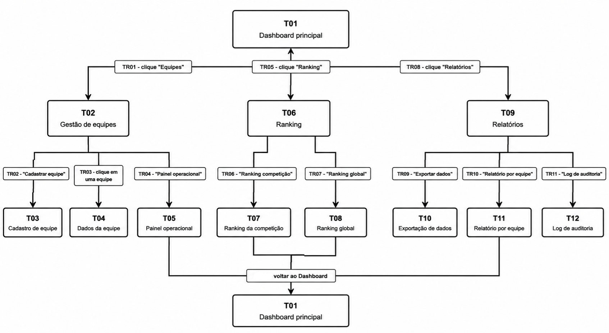<br>
  <sup>Fonte: Material produzido pelos autores (2026).</sup>
</div>

- O fluxo completo de navegação das personas administrativas pode ser consultado em: [Fluxo do Operador](outros/fluxo_operador.md).

O fluxo apresentado evidencia a sequência de navegação utilizada pelos administradores durante a competição. A partir do dashboard principal, os operadores conseguem acessar rapidamente módulos de equipes, checkpoints, ranking e relatórios operacionais, reduzindo a quantidade de interações necessárias durante a execução operacional da prova e centralizando todas as funcionalidades críticas em um único ambiente.

#### Wireframe de Baixa Fidelidade — Operadores

Os wireframes de baixa fidelidade das personas administrativas foram desenvolvidos para validar rapidamente a arquitetura da informação, a organização estrutural das telas e os principais fluxos de navegação da solução antes da definição visual definitiva da interface.

A utilização desse tipo de prototipação permitiu testar hierarquia visual, distribuição dos componentes e sequência de interação entre os módulos administrativos da plataforma, reduzindo retrabalho durante as etapas posteriores de desenvolvimento e refinamento visual.


O principal objetivo deste wireframe é 
representar de forma rápida e simplificada o fluxo de navegação da persona 1 (Marina) ao preparar uma nova edição do Red Bull 24h antes da prova começar, explorando desde o primeiro acesso ao painel até as equipes cadastradas e prontas para receber o link público (UUID).

 Persona 1: Marina Costa, 29, Coordenadora Operacional (Administradora)

 <div align="center">
  <sub>Quadro 27 - User Stories cobertas: </sub>
</div>


| ID   | User Story | Descrição |
|------|-------------|------------|
| US01 | Acessar painel admin | Estados sem e com competição |
| US02 | Cadastrar nova competição | Cadastro com data e localização |
| US03 | Cadastrar e editar equipes | Gerenciamento de equipes e atletas |
| US05 | Gerar URL UUID automaticamente | Geração automática ao cadastrar equipe |
| US06 | Acessar aba de equipes | Navegação pelo menu ou atalho |
| US07 | Acessar painel operacional completo da equipe | Visualização de informações da equipe, atletas e checkpoints em tempo real |
| US08 | Selecionar o atleta ativo | Controle realizado pelo juiz para definir o atleta atualmente monitorado |
| US09 | Fotografar a esteira para extração via OCR | Captura da imagem da esteira para leitura automática de dados utilizando OCR |
| US10 | Registrar checkpoint manualmente | Inserção manual de checkpoint como alternativa em caso de falha do OCR |
| US11 | Visualizar tabela com auto-refresh a cada 5 min | Atualização automática periódica das informações operacionais da competição |
<div align="center">
  <sup>Fonte: Elaborado pelos autores (2026).</sup>
</div> 


<div align="center"> 
  <sub>Quadro 28 - Critérios de baixa fidelidade adotados</sub> 
</div>

| Critério | Descrição |
|-----------|------------|
| Paleta em P&B | Uso apenas de preto e branco |
| Placeholders de imagem | Representados com X cortado |
| Blocos de texto | Indicados com linhas zigzag |
| Elementos visuais | Ausência de elementos decorativos |
| Foco estrutural | Ênfase em hierarquia, navegação e organização espacial |

<div align="center"> 
  <sup>Fonte: Elaborado pelos autores (2026).</sup> 
</div>

---

**Configuração inicial da competição**

O primeiro conjunto de telas representa o fluxo inicial de configuração da competição, incluindo criação da sala administrativa e definição das informações básicas do evento.

<div align="center">
  <sub>Figura 19 - Wireframe de baixa fidelidade do fluxo inicial de configuração da competição</sub><br>
  <br>
  <sup>Fonte: Material produzido pelos autores (2026).</sup>
</div>

---

**Cadastro e gerenciamento das equipes**

O segundo conjunto de telas representa o processo de cadastro, edição e gerenciamento das equipes e atletas participantes da competição.

<div align="center">
  <sub>Figura 20 - Wireframe de baixa fidelidade do gerenciamento das equipes</sub><br>
  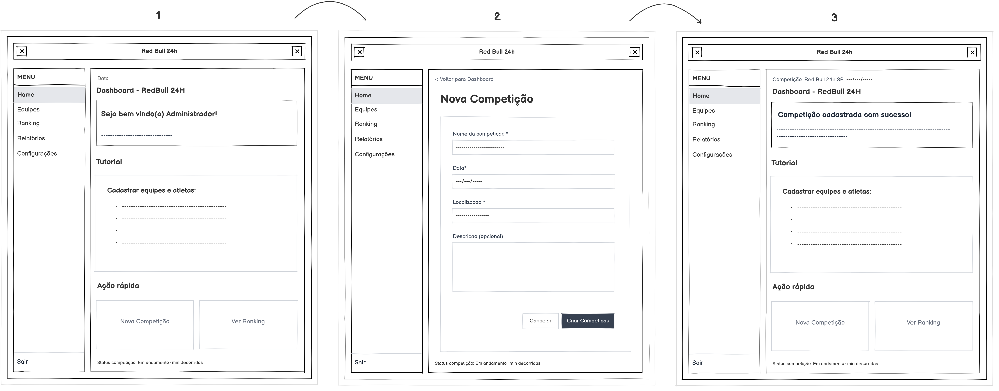<br>
  <sup>Fonte: Material produzido pelos autores (2026).</sup>
</div>

---

**Gerenciamento operacional da competição**

O terceiro fluxo demonstra as telas relacionadas ao gerenciamento operacional da prova, incluindo registro de checkpoints e acompanhamento das informações da competição.

<div align="center">
  <sub>Figura 21 - Wireframe de baixa fidelidade do gerenciamento operacional da competição</sub><br>
  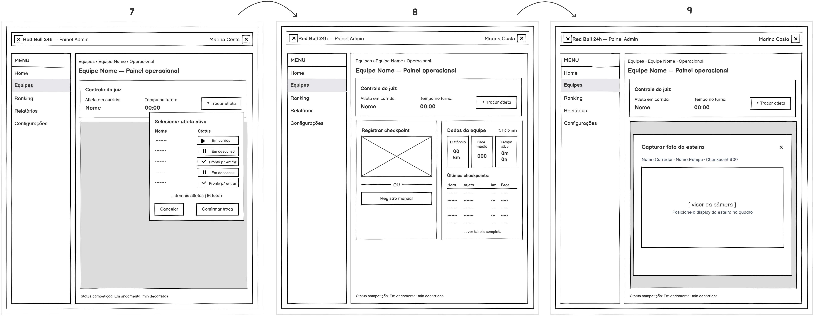<br>
  <sup>Fonte: Material produzido pelos autores (2026).</sup>
</div>

---

**Revisão e análise da competição**

O último conjunto de telas representa as funcionalidades de revisão, validação e análise consolidada dos dados registrados durante a competição.

<div align="center">
  <sub>Figura 22 - Wireframe de baixa fidelidade da revisão operacional da competição</sub><br>
  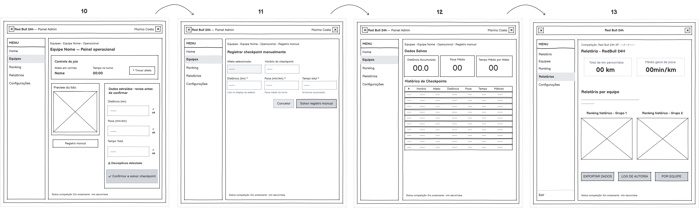<br>
  <sup>Fonte: Material produzido pelos autores (2026).</sup>
</div>

**Tela TV**

A tela de TV exibe o countdown da competição para que os telespectadores que passam pelo local possam acompanhar os corredores.

<div align="center">
  <sub>Figura 23 - Wireframe de baixa fidelidade da tela TV durante a competição</sub><br>
  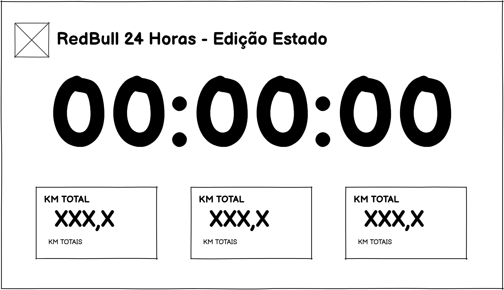<br>
  <sup>Fonte: Material produzido pelos autores (2026).</sup>
</div>

**Tela do Instagram para os competidores**

Essa tela foi feita para que os competidores possam postar seus resultados após a competição, com base nos dados coletados.

<div align="center">
  <sub>Figura 24 - Wireframe de baixa fidelidade da tela do Instagram para competidores</sub><br>
  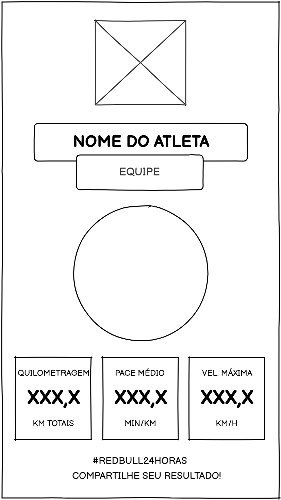<br>
  <sup>Fonte: Material produzido pelos autores (2026).</sup>
</div>

**Tela do Instagram para atletas em destaque**

As telas a seguir foram feitas para serem postadas nos períodos da manhã, tarde, noite e madrugada, comemorando os atletas em destaque em cada um desses horários.

<div align="center">
  <sub>Figura 25 - Wireframe de baixa fidelidade da tela do Instagram para destaques</sub><br>
  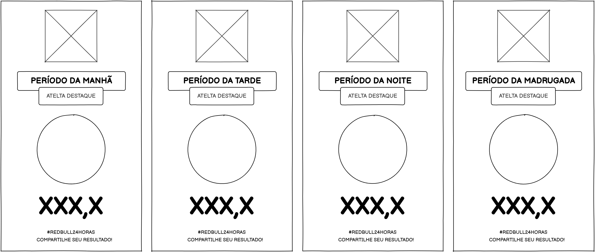<br>
  <sup>Fonte: Material produzido pelos autores (2026).</sup>
</div>

**Tela do Instagram com maior quilometragem e menor pace médio**

Essas duas telas foram criadas para compartilhar os melhores desempenhos da competição.

<div align="center">
  <sub>Figura 25 - Wireframe de baixa fidelidade da tela do Instagram pace/km</sub><br>
  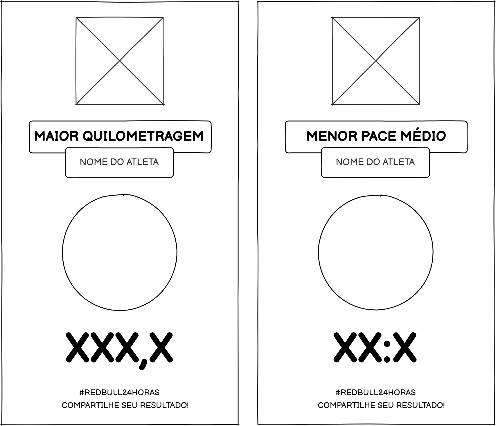<br>
  <sup>Fonte: Material produzido pelos autores (2026).</sup>
</div>

#### Wireframe de Alta Fidelidade — Operadores

Os wireframes de alta fidelidade representam uma versão visual mais próxima da interface final da solução, incluindo organização espacial dos componentes, tipografia, hierarquia visual e estrutura de navegação da plataforma. O nível de fidelidade de um protótipo está diretamente relacionado à sua proximidade com a experiência real do usuário, tornando esse tipo de artefato fundamental para validação visual e operacional antes da implementação definitiva do sistema (Garrett, 2011).

As interfaces apresentadas a seguir representam o painel operacional administrativo da competição Red Bull 24 Horas, desenvolvido para centralizar o monitoramento dos atletas, o controle dos checkpoints e o gerenciamento operacional das equipes participantes durante a execução da prova.

A construção das telas priorizou rápida interpretação das informações, organização visual dos dados e redução da sobrecarga operacional dos administradores durante a competição.

---

As figuras a seguir apresentam o início do fluxo administrativo, desde a tela principal do painel até o formulário de criação de uma nova competição.

<div align="center" style="display: flex; justify-content: center; gap: 30px; flex-wrap: wrap;">

  <div>
    <sub>Figura 23 - Dashboard principal do painel administrativo</sub><br>
    <br>
    <sup>Fonte: Elaborado pelos autores (2026).</sup>
  </div>

  <div>
    <sub>Figura 24 - Criação de nova competição</sub><br>
    <br>
    <sup>Fonte: Elaborado pelos autores (2026).</sup>
  </div>

</div>

---

As figuras a seguir mostram a etapa de preparação das equipes, contemplando o estado inicial sem equipes cadastradas e o formulário de cadastro com capitão e atletas.

<div align="center" style="display: flex; justify-content: center; gap: 30px; flex-wrap: wrap;">

  <div>
    <sub>Figura 25 - Estado inicial da tela de equipes</sub><br>
    <br>
    <sup>Fonte: Elaborado pelos autores (2026).</sup>
  </div>

  <div>
    <sub>Figura 26 - Cadastro de equipe e atletas</sub><br>
    <br>
    <sup>Fonte: Elaborado pelos autores (2026).</sup>
  </div>

</div>

---

As figuras a seguir apresentam a continuidade do gerenciamento das equipes, incluindo o retorno ao estado de cadastro e a visualização das equipes com URLs públicas geradas por UUID.

<div align="center" style="display: flex; justify-content: center; gap: 30px; flex-wrap: wrap;">

  <div>
    <sub>Figura 27 - Competição cadastrada sem equipes</sub><br>
    <br>
    <sup>Fonte: Elaborado pelos autores (2026).</sup>
  </div>

  <div>
    <sub>Figura 28 - Equipes cadastradas com URLs públicas</sub><br>
    <br>
    <sup>Fonte: Elaborado pelos autores (2026).</sup>
  </div>

</div>

---

As figuras a seguir apresentam a visão geral do painel operacional administrativo e a interface de seleção do atleta ativo, utilizadas para acompanhamento da competição e gerenciamento dos corredores em tempo real.

<div align="center" style="display: flex; justify-content: center; gap: 30px; flex-wrap: wrap;">

  <div>
    <sub>Figura 29 - Painel operacional administrativo da competição</sub><br>
    <br>
    <sup>Fonte: Elaborado pelos autores (2026).</sup>
  </div>

  <div>
    <sub>Figura 30 - Seleção do atleta ativo</sub><br>
    <br>
    <sup>Fonte: Elaborado pelos autores (2026).</sup>
  </div>

</div>

---

As figuras a seguir demonstram o processo de captura da imagem da esteira e a validação dos dados extraídos via OCR, funcionalidade central da proposta de automação da solução.

<div align="center" style="display: flex; justify-content: center; gap: 30px; flex-wrap: wrap;">

  <div>
    <sub>Figura 31 - Captura da imagem da esteira</sub><br>
    <br>
    <sup>Fonte: Elaborado pelos autores (2026).</sup>
  </div>

  <div>
    <sub>Figura 32 - Validação dos dados extraídos via OCR</sub><br>
    <br>
    <sup>Fonte: Elaborado pelos autores (2026).</sup>
  </div>

</div>

---

As figuras a seguir apresentam funcionalidades complementares da plataforma, incluindo o registro manual de checkpoints, a visualização consolidada das informações da competição e a geração de relatórios operacionais.

<div align="center" 
     style="display: flex; justify-content: center; align-items: flex-start; gap: 20px; flex-wrap: nowrap;">

  <div>
    <sub>Figura 33 - Registro manual de checkpoint</sub><br>
    <br>
    <sup>Fonte: Elaborado pelos autores (2026).</sup>
  </div>

  <div>
    <sub>Figura 34 - Visualização consolidada dos dados da competição</sub><br>
    <br>
    <sup>Fonte: Elaborado pelos autores (2026).</sup>
  </div>

  <div>
    <sub>Figura 35 - Relatório operacional da competição</sub><br>
    <br>
    <sup>Fonte: Elaborado pelos autores (2026).</sup>
  </div>

</div>

Os wireframes apresentados permitiram validar visualmente os principais fluxos administrativos da solução, evidenciando como as funcionalidades operacionais se integram dentro da plataforma e como os administradores interagem com o sistema durante a execução da competição.

### 3.3.2 Persona Corredor — Amanda Azevedo

Amanda Azevedo representa os atletas participantes da competição, utilizando o painel público da equipe para acompanhar métricas da prova, ranking geral, desempenho dos corredores e informações estratégicas relacionadas ao descanso e posicionamento da equipe durante o evento.

Diferentemente das personas administrativas, Amanda interage exclusivamente com a área pública da plataforma, acessada por meio do link gerado automaticamente pelo sistema. Seu fluxo prioriza rapidez na visualização das informações, simplicidade de navegação e acompanhamento contínuo da competição em tempo real.

<div align="center"> 
  <sub>Quadro 29 - User Stories cobertas pela Persona Corredor</sub> 
</div>

| ID | User Story | Descrição |
|----|-------------|------------|
| US13 | Visualizar ranking global | Acompanhamento da posição da equipe |
| US14 | Visualizar métricas dos atletas | Desempenho individual e coletivo |
| US15 | Utilizar calculadora de descanso | Apoio operacional ao atleta |
| US16 | Compartilhar resultados | Geração de templates Instagram com dados de desempenho |

<div align="center"> 
  <sup>Fonte: Elaborado pelos autores (2026).</sup> 
</div>

---

#### Fluxo de Cenas — Corredores

O fluxo abaixo representa a navegação realizada pelos corredores ao acessarem o painel público da equipe por meio do link compartilhado da competição. O fluxo contempla o acesso via UUID, validação do link, visualização das métricas da equipe e compartilhamento simplificado do ranking.

<div align="center">
  <sub>Figura 36 - Fluxo de navegação da Persona Corredor</sub><br>
  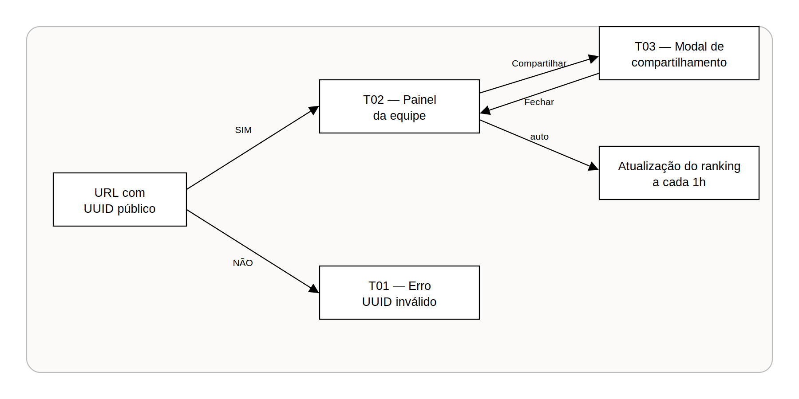<br>
  <sup>Fonte: Material produzido pelos autores (2026).</sup>
</div>

O fluxo completo de navegação da persona corredor pode ser consultado em:

- [Fluxo do Corredor](outros/fluxo-corredor.md).

O fluxo apresentado demonstra a navegação simplificada utilizada pelos corredores ao acessarem o painel público da equipe por meio do link gerado automaticamente pelo sistema. A estrutura prioriza acesso rápido às informações estratégicas da competição, permitindo acompanhamento contínuo do desempenho da equipe durante a prova e reduzindo a quantidade de interações necessárias para visualização dos dados mais relevantes da competição.

#### Wireframe de Baixa Fidelidade — Corredores

O wireframe de baixa fidelidade da persona corredor foi desenvolvido para validar rapidamente a organização estrutural do painel público da equipe, priorizando hierarquia visual, distribuição das informações e fluxo simplificado de navegação.

A prototipação buscou representar os principais elementos utilizados pelos atletas durante a competição, incluindo ranking geral, métricas da equipe, informações dos corredores e funcionalidades estratégicas relacionadas ao acompanhamento da prova.

<div align="center">
  <sub>Figura 37 - Wireframe de baixa fidelidade do painel público da equipe</sub><br>
  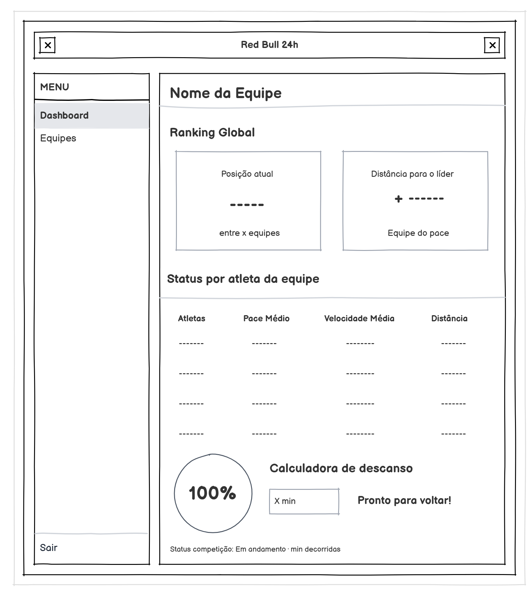<br>
  <sup>Fonte: Material produzido pelos autores (2026).</sup>
</div>

O wireframe apresentado permitiu validar rapidamente a disposição das informações estratégicas da competição, garantindo uma navegação simplificada e rápida interpretação dos dados pelos corredores durante o evento.

#### Wireframe de Alta Fidelidade — Corredores

Os wireframes de alta fidelidade da persona corredor representam uma versão visual mais próxima da interface final da solução, incluindo organização espacial dos componentes, hierarquia visual, tipografia e estrutura de navegação do painel público da equipe. Conforme Garrett (2011), o nível de fidelidade de um protótipo está diretamente relacionado à sua proximidade com a experiência real do usuário, tornando esse tipo de artefato essencial para validações visuais e operacionais antes da implementação definitiva da interface.

As telas abaixo representam o painel público da equipe, desenvolvido para acompanhamento da competição pelos atletas participantes durante a prova. A interface foi projetada para apresentar de forma clara e organizada as principais informações estratégicas da competição, permitindo rápida interpretação dos dados durante o evento.

O layout utiliza cartões informativos, tabelas e indicadores visuais para facilitar a leitura de métricas como ranking, pace, velocidade, distância percorrida e descanso dos atletas. Além disso, a interface contempla funcionalidades estratégicas, como a Calculadora de Descanso e o compartilhamento simplificado do ranking da equipe, priorizando legibilidade, organização visual e rápida navegação durante a competição.

<div align="center">
  <sub>Figura 38 - Painel público da equipe</sub><br>
  <br>
  <sup>Fonte: Material produzido pelos autores (2026).</sup>
</div>

## 3.4. Guia de estilos 

O Guia de Estilos é um documento que define as diretrizes visuais e os padrões utilizados no desenvolvimento de um produto digital, incluindo elementos como cores, tipografia, iconografia, espaçamentos e componentes de interface. Seu objetivo é garantir consistência visual ao longo de todo o produto, orientando as equipes durante o processo de desenvolvimento e assegurando uma experiência coesa e de qualidade para o usuário. Ao sistematizar decisões de design, o guia também facilita a aplicação de princípios de UI e UX de forma integrada e contínua (PM3, s.d.).

Para garantir essa padronização, o guia de estilos desenvolvido pelo grupo foi baseado no Logo Package oficial da Red Bull (julho de 2025), documento que estabelece as diretrizes globais de identidade visual da marca. Dessa forma, será facilitada a integração entre a aplicação desenvolvida e os padrões já consolidados pela Red Bull, proporcionando ao usuário uma experiência visual alinhada à identidade da marca e coerente com suas plataformas existentes.


### 3.4.1 Cores

A paleta de cores da solução foi definida com base na identidade visual da Red Bull, sendo composta por três cores primárias e cinco cores secundárias. As cores primárias são utilizadas nos principais elementos da interface e na comunicação visual do sistema, enquanto as cores secundárias auxiliam na composição de fundos, textos, componentes de apoio e detalhes visuais, contribuindo para a padronização e harmonia da interface.

<div align="center">
  <sub>Figura 39 - Paleta de cores</sub><br>
    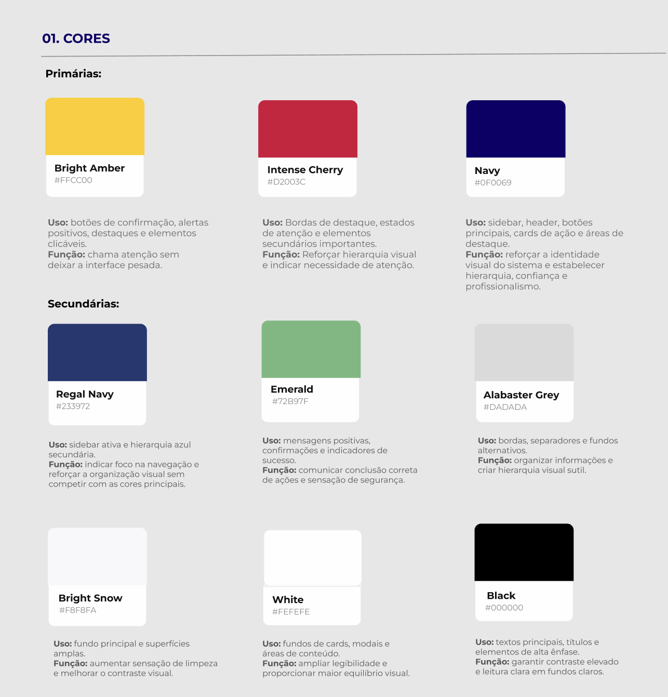<br>
      <sup>Fonte: Elaborado pelos autores (2026).</sup>
</div>

### 3.4.2 Tipografia

<div align="center">
  <sub>Figura 40 - Tipografia</sub><br>
    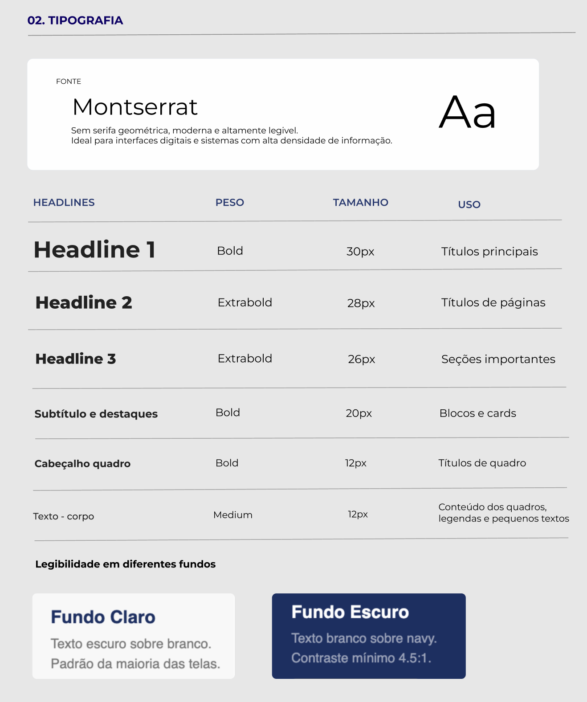<br>
      <sup>Fonte: Elaborado pelos autores (2026).</sup>
</div>

### 3.4.3 Iconografia e imagens 

<div align="center">
  <sub>Figura 41 - Ícones e imagens</sub><br>
    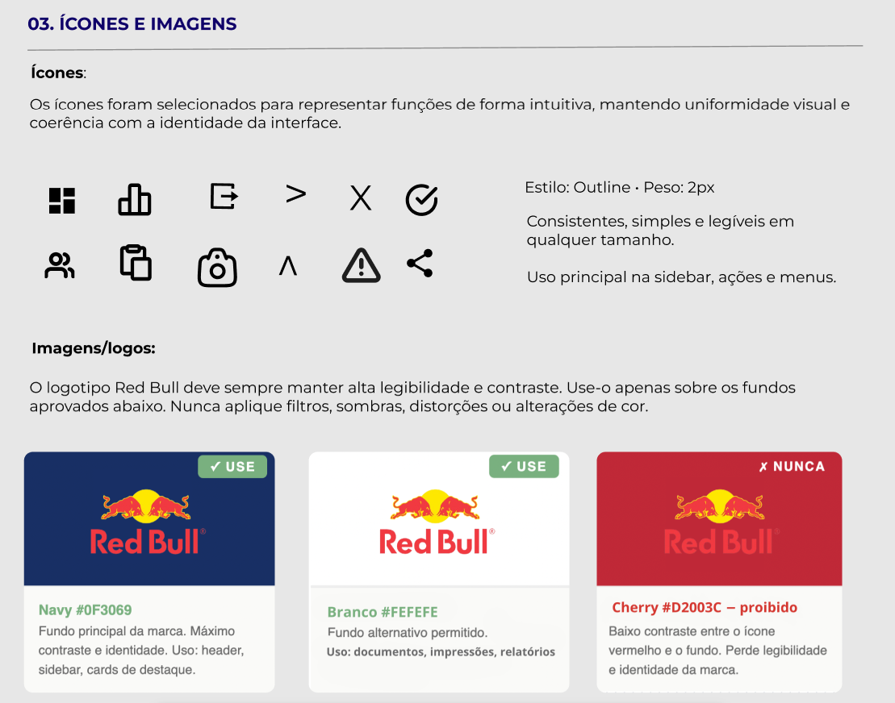<br>
      <sup>Fonte: Elaborado pelos autores (2026).</sup>
</div>


## 3.5. <a name="prototipo-alta-fidelidade"></a>Protótipo de alta fidelidade 


Esta seção apresenta a documentação do protótipo de alta fidelidade desenvolvido para a aplicação web. O objetivo do protótipo é representar, de forma visual e funcional, a experiência que o usuário final terá ao interagir com a plataforma. A interface foi projetada com foco em usabilidade, clareza das informações e alinhamento com os fluxos definidos nas User Stories.

Através das telas prototipadas, é possível validar a arquitetura de navegação, os componentes-chave da interface e os elementos visuais que compõem o sistema. Cada tela foi construída com base nos requisitos levantados, considerando as funcionalidades essenciais da plataforma, como o painel de administrador e do atleta.

O protótipo também está servindo como referência para o desenvolvimento front-end e será utilizado durante as etapas de implementação, testes de usabilidade e iteração do produto.

### Persona 1 - Marina Costa
#### Tela de Login
&nbsp; &nbsp; &nbsp; &nbsp;Abaixo, nota-se a Tela de Login, cujo background é uma foto real da competição 24 Horas. Essa tela solicita, em um pop-up de fundo branco, e-mail e senha para autorizar o acesso do administrador. Conta com uma frase de encorajamento da Red Bull e um botão em destaque "Entrar".


<div align="center">
  <sub>Figura 1 - Tela de Login</sub><br>
    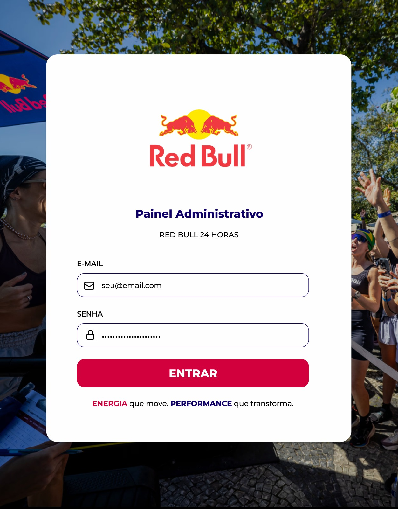<br>
      <sup>Fonte: Elaborado pelos autores (2026).</sup>
</div>

#### Dashboard Principal
&nbsp; &nbsp; &nbsp; &nbsp;Na figura abaixo encontra-se o Dashboard Principal do sistema WEB, exibindo uma mensagem de boas-vindas ao administrador e um tutorial com o passo a passo para configurar a competição (inserir dados da equipe, gerar UUID, criar equipes e iniciar a competição). Conta com dois atalhos de ação rápida: "Nova Competição" e "Ver Ranking", facilitando o acesso às funcionalidades centrais da plataforma.


<div align="center">
  <sub>Figura 42 - Dashboard Principal</sub><br>
    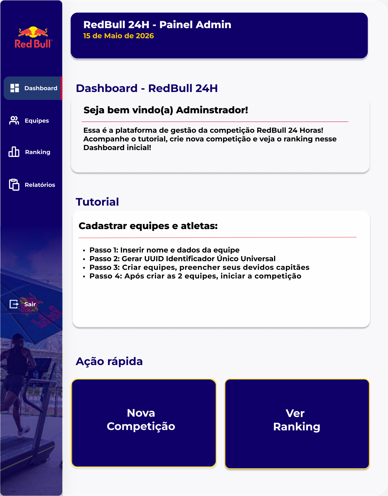<br>
      <sup>Fonte: Elaborado pelos autores (2026).</sup>
</div>

#### Cadastro de nova competição
&nbsp; &nbsp; &nbsp; &nbsp;Encontra-se abaixo um formulário de cadastro de competição, permitindo ao administrador inserir nome do evento, data, localização e uma descrição opcional. Ao finalizar o preenchimento, o administrador pode confirmar a criação por meio do botão "Criar nova Competição" ou cancelar a ação e retornar ao Dashboard.


<div align="center">
  <sub>Figura 43 - Cadastro de competição </sub><br>
    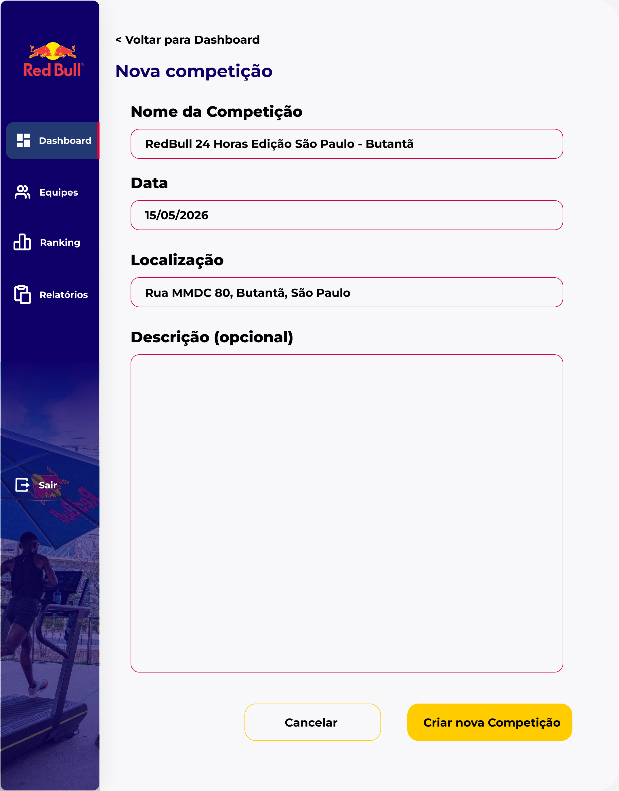<br>
      <sup>Fonte: Elaborado pelos autores (2026).</sup>
</div>

#### Dashboard pós-cadastro de competição
&nbsp; &nbsp; &nbsp; &nbsp;Estado do Dashboard após o cadastro bem-sucedido de uma competição, exibindo uma mensagem de confirmação "Competição cadastrada com sucesso!". O tutorial de cadastro de equipes e atletas permanece visível, orientando o próximo passo do fluxo operacional, e os atalhos de ação rápida continuam acessíveis.


<div align="center">
  <sub>Figura 44 - Competição Cadastrada </sub><br>
    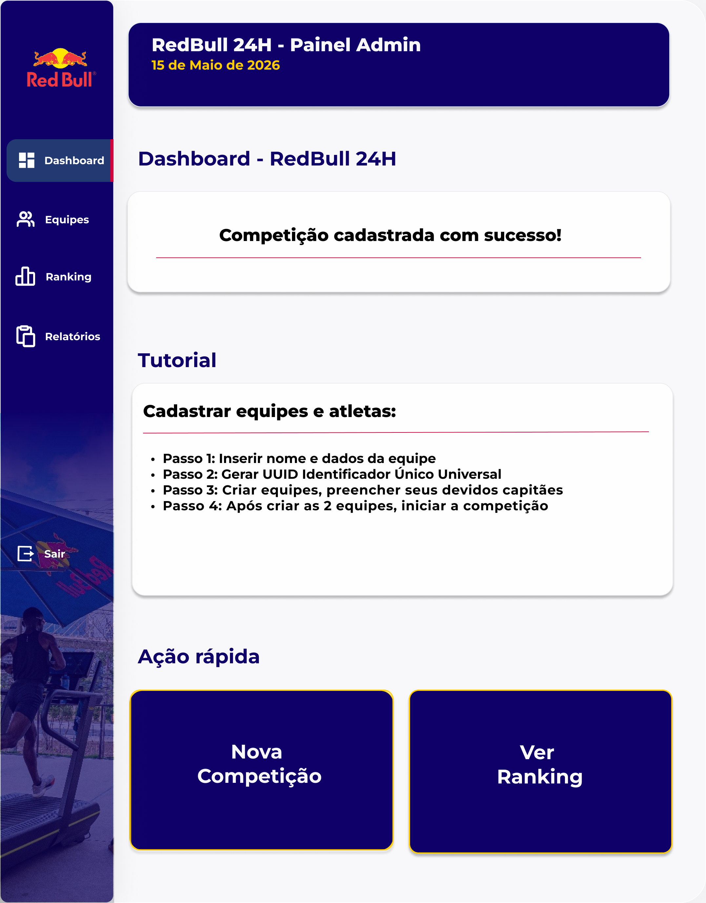<br>
      <sup>Fonte: Elaborado pelos autores (2026).</sup>
</div>

#### Painel de equipes (sem equipes cadastradas)
&nbsp; &nbsp; &nbsp; &nbsp;Tela de gerenciamento de equipes no estado inicial, quando nenhuma equipe foi cadastrada ainda. Exibe uma mensagem orientativa indicando que as duas equipes da competição devem ser adicionadas, juntamente com o botão "+ Adicionar Equipe" para iniciar o cadastro.


<div align="center">
  <sub>Figura 45 - Painel Equipes vazio</sub><br>
    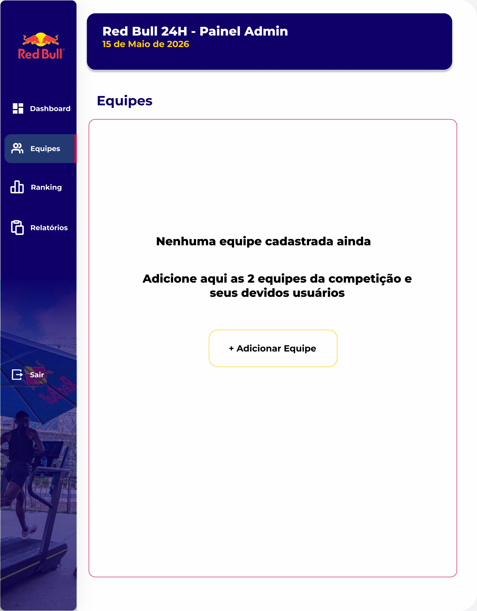<br>
      <sup>Fonte: Elaborado pelos autores (2026).</sup>
</div>

#### Cadastro de equipes
&nbsp; &nbsp; &nbsp; &nbsp;Encontra-se abaixo a tela de cadastro de equipes, que permite ao administrador inserir o nome da equipe, definir o capitão e registrar os atletas participantes. O sistema também oferece a opção de adicionar novos atletas dinamicamente. Ao finalizar o preenchimento, o administrador pode confirmar a criação da equipe por meio do botão “Criar Equipe” ou cancelar a ação e retornar à tela anterior.


<div align="center">
  <sub>Figura 46 - Tela de Cadastro das equipes</sub><br>
    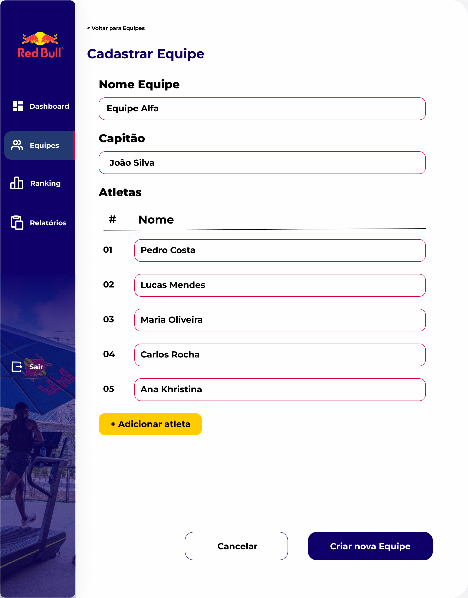<br>
      <sup>Fonte: Elaborado pelos autores (2026).</sup>
</div>


#### Painel de administração das equipes
&nbsp; &nbsp; &nbsp; &nbsp; Apresenta-se o painel de administração das equipes, que permite ao administrador visualizar todas as equipes cadastradas na competição, acessar links públicos individuais, editar informações, remover equipes e acessar diretamente o painel operacional de cada grupo. A tela também exibe o status geral da competição em tempo real.


<div align="center">
  <sub>Figura 47 - Painel de admin das equipes</sub><br>
    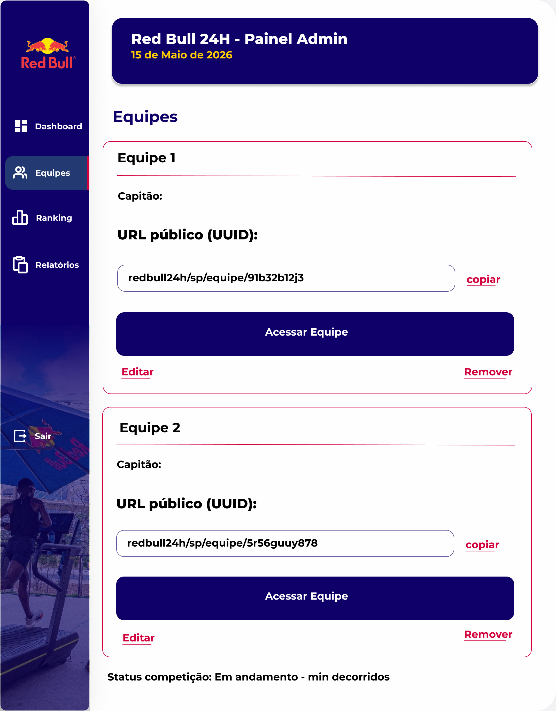<br>
      <sup>Fonte: Elaborado pelos autores (2026).</sup>
</div>


#### Painel operacional das equipes
&nbsp; &nbsp; &nbsp; &nbsp; Em seguida, apresenta-se o painel operacional da equipe, utilizado pelo juiz para acompanhar o atleta em tempo real durante a corrida, controlar o tempo do turno e registrar checkpoints da competição. A interface também exibe métricas da equipe, como distância percorrida, pace médio, tempo ativo e o histórico dos últimos checkpoints registrados.


<div align="center">
  <sub>Figura 48 - Painel de operacional das equipes</sub><br>
    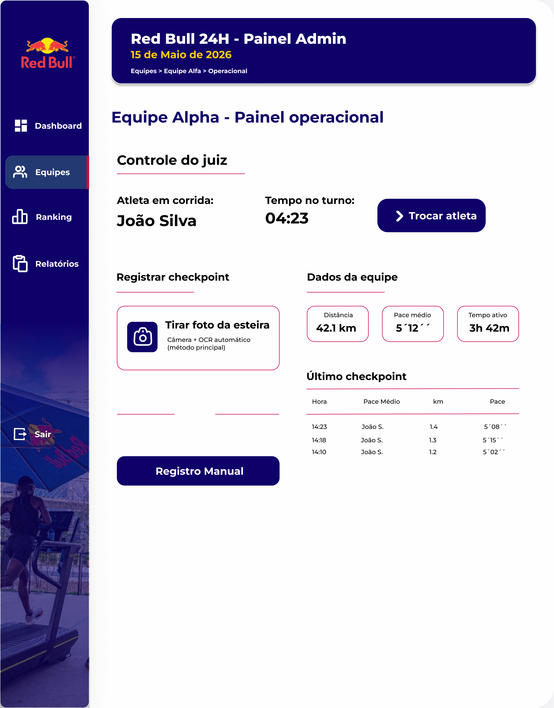<br>
      <sup>Fonte: Elaborado pelos autores (2026).</sup>
</div>


#### Painel operacional das equipes com dropdown
&nbsp; &nbsp; &nbsp; &nbsp;    Abaixo está a funcionalidade de troca de atleta ativo, que permite ao juiz selecionar o próximo participante da equipe durante a competição. A tela apresenta o status atual de cada atleta, indicando quais estão em corrida, em descanso ou prontos para entrar. O processo é realizado por meio de um menu dropdown, proporcionando maior controle operacional e organização durante os revezamentos.


<div align="center">
  <sub>Figura 49 - Painel de operacional das equipes com dropdown</sub><br>
    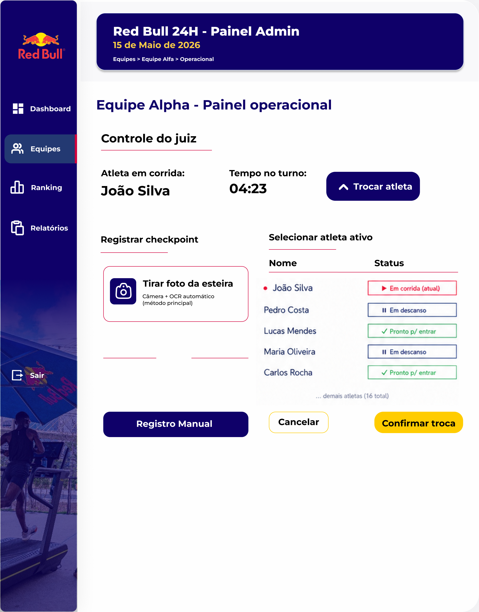<br>
      <sup>Fonte: Elaborado pelos autores (2026).</sup>
</div>

#### Captura da foto da esteira
&nbsp; &nbsp; &nbsp; &nbsp;A figura abaixo representa a tela de captura da foto da esteira, utilizada para registrar os dados do participante durante a competição. Nela, o operador pode visualizar a imagem capturada do painel da esteira referente ao checkpoint atual, além de optar entre realizar um registro manual ou prosseguir com a captura automática para extração dos dados via OCR, garantindo maior agilidade e precisão no processo de validação dos checkpoints.


<div align="center">
  <sub>Figura 50 - Captura da foto da esteira </sub><br>
    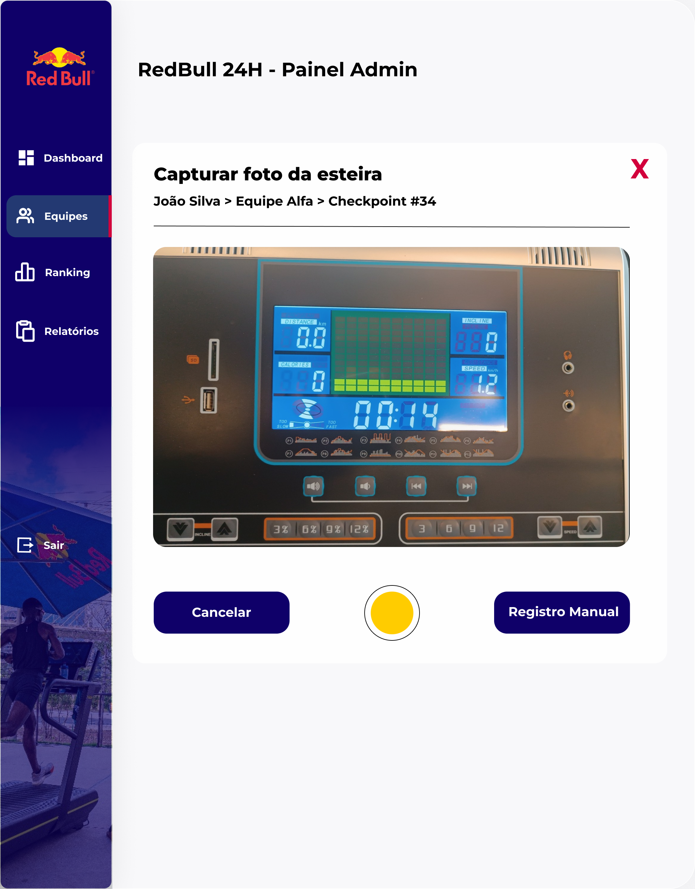<br>
      <sup>Fonte: Elaborado pelos autores (2026).</sup>
</div>

#### Dados extraídos via OCR
&nbsp; &nbsp; &nbsp; &nbsp; A figura abaixo apresenta a tela de validação dos dados extraídos automaticamente via OCR a partir da foto capturada da esteira. Nela, o operador pode visualizar a imagem utilizada no processamento, conferir as informações identificadas pelo sistema, como distância, pace e tempo, além de receber alertas em casos de discrepâncias nos dados. A interface também permite corrigir manualmente as informações antes da confirmação e salvamento do checkpoint.


<div align="center">
  <sub>Figura 51 - Dados extraídos via OCR </sub><br>
    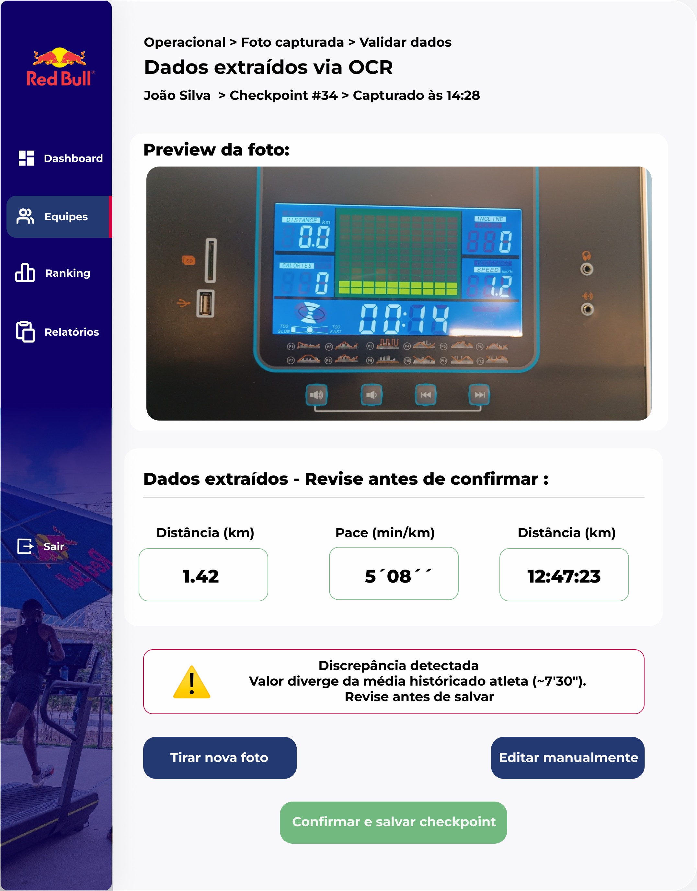<br>
      <sup>Fonte: Elaborado pelos autores (2026).</sup>
</div>

#### Registro manual
&nbsp; &nbsp; &nbsp; &nbsp;A figura abaixo representa a tela de registro manual de checkpoints, utilizada em situações nas quais a captura automática ou a leitura via OCR não funcionem corretamente. Nela, o operador pode inserir manualmente os dados do atleta, como distância percorrida, pace e tempo total, garantindo a continuidade do registro da competição. A interface também exibe um alerta indicando que a ação será registrada no log de auditoria do sistema para fins de rastreabilidade e validação posterior.


<div align="center">
  <sub>Figura 52 -  Registro Manual </sub><br>
    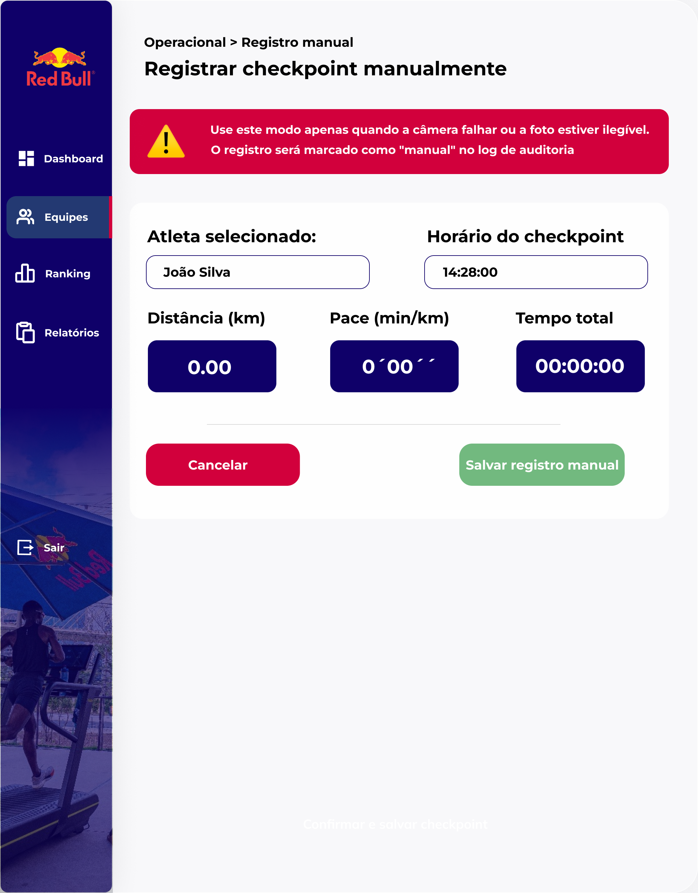<br>
      <sup>Fonte: Elaborado pelos autores (2026).</sup>
</div>

#### Checkpoints salvos
&nbsp; &nbsp; &nbsp; &nbsp;A figura abaixo apresenta a tela de visualização dos checkpoints salvos da equipe durante a competição. Nela, o operador pode acompanhar métricas gerais da equipe, como distância acumulada, pace médio e tempo total registrado, além de visualizar o histórico completo dos checkpoints realizados por cada atleta. A interface também informa o método utilizado em cada registro, permitindo identificar se os dados foram capturados automaticamente ou inseridos manualmente, garantindo maior controle e rastreabilidade das informações registradas no sistema.


<div align="center">
  <sub>Figura 53 -  Checkpoints salvos </sub><br>
    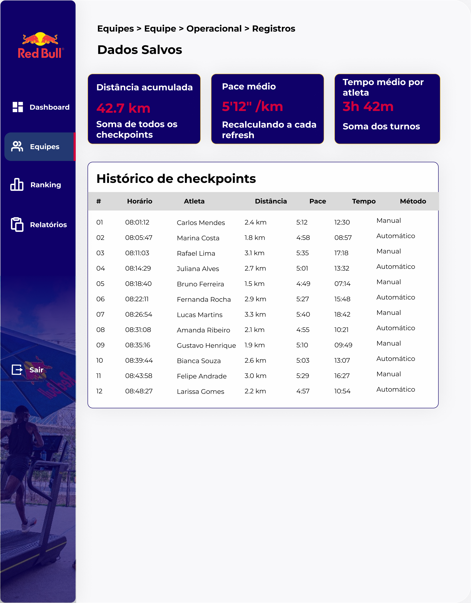<br>
      <sup>Fonte: Elaborado pelos autores (2026).</sup>
</div>


#### Ranking em tempo real

Tela de ranking em tempo real da competição, exibindo métricas globais como total de quilômetros percorridos, pace médio global e número de checkpoints. Na seção "Disputa ao vivo", são apresentadas as duas equipes em competição, com a diferença de quilômetros entre elas. Ao final, exibe os atletas atualmente em corrida, com informações individuais de distância, pace atual e último checkpoint registrado. Um botão "Congelar ranking" está disponível no canto superior direito para pausar a atualização em tempo real.

<div align="center">
  <sub>Figura 54 - Ranking em tempo real</sub><br>
    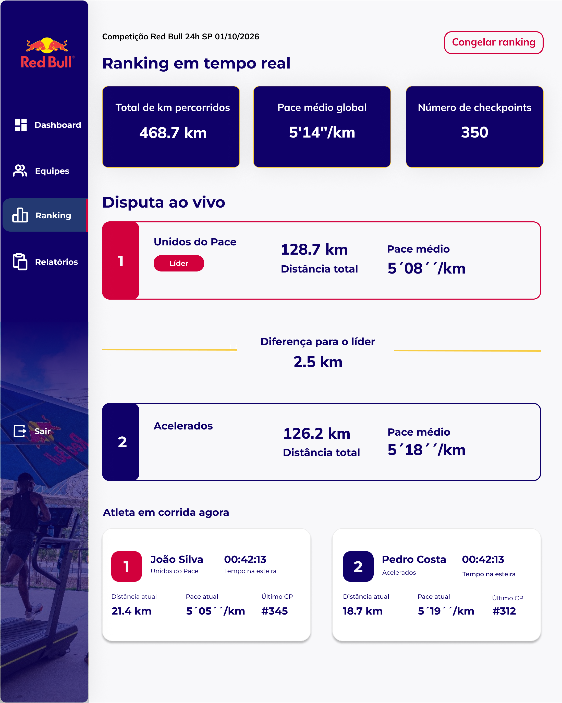<br>
      <sup>Fonte: Elaborado pelos autores (2026).</sup>
</div>

#### Relatório da competição

Tela de relatório final da competição, apresentando um resumo geral com total de quilômetros percorridos, média geral de pace e número de checkpoints. Exibe um gráfico de linha com a evolução das posições das equipes ao longo do tempo (de 0h a 24h), permitindo visualizar as variações de liderança durante a prova. Abaixo, há uma seção de "Relatório de inconsistências" com uma tabela de registros corrigidos manualmente, contendo informações de data, atleta, equipe, checkpoint, valor OCR original, valor corrigido, diferença e usuário responsável pela correção. Um botão "Log de Auditoria" e outro de "Exportar dados" estão disponíveis para rastreabilidade e extração das informações.

<div align="center">
  <sub>Figura 55 - Relatório da competição</sub><br>
    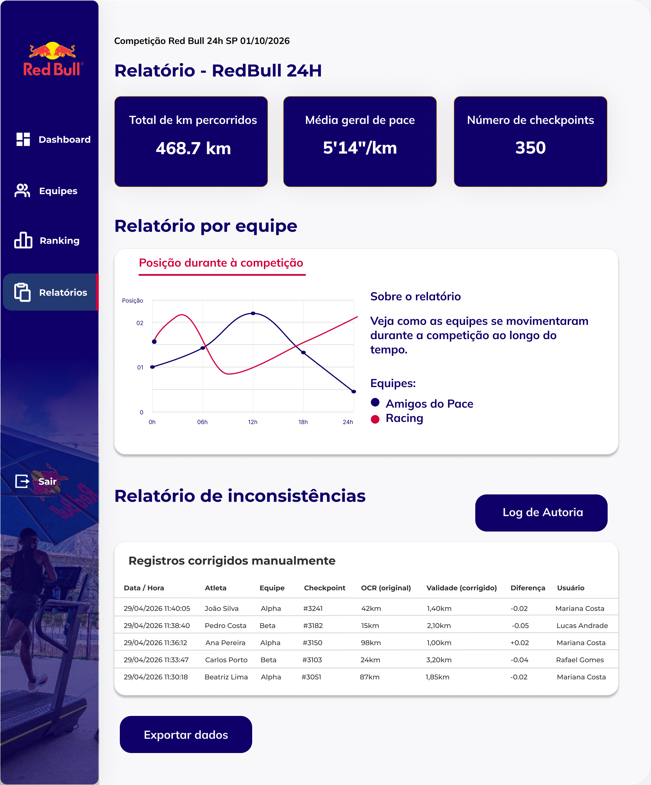<br>
      <sup>Fonte: Elaborado pelos autores (2026).</sup>
</div>

### Persona 3 - Amanda Azevedo

#### Painel operacional da equipe
Painel operacional da Equipe, acessado apenas pelos integrantes da mesma, exibindo métricas em tempo real como tempo de competição, distância para o líder e pace médio da equipe. A seção "Status por atleta da equipe" apresenta uma tabela com dados individuais de cada atleta, incluindo pace médio geral, velocidade máxima, distância percorrida e último checkpoint registrado. Na parte inferior, a "Calculadora de descanso" indica que o atleta atual atingiu 100% do tempo de descanso recomendado (50 min) e está pronto para voltar, apontando o próximo atleta como Rafael Lima. Um gráfico de posição ao longo do tempo complementa o painel, permitindo ao capitão acompanhar a evolução da equipe na disputa.

Durante o processo de validação com o parceiro de projeto, foi identificado que as competições Red Bull 24h não ocorrem simultaneamente em diferentes localidades do Brasil, o que inviabilizou a existência de um ranking global entre eventos distintos. Essa informação levou à reestruturação da tela de equipe, com a remoção do componente de "Ranking global" e a adição de modais quantitativos exibindo o tempo total de competição e o pace médio da equipe, além de um gráfico de evolução da posição da equipe ao longo do evento em função do tempo, tornando o painel mais aderente à realidade operacional da competição.

<div align="center">
  <sub>Figura 56 - Painel operacional da equipe</sub><br>
    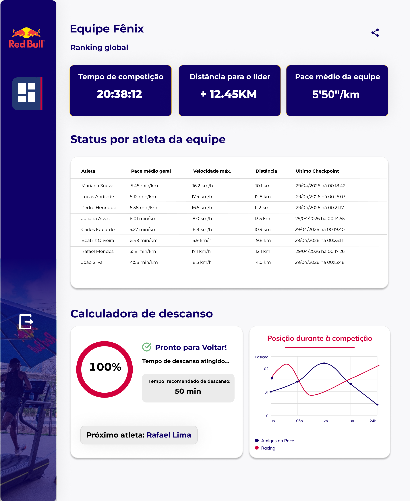<br>
      <sup>Fonte: Elaborado pelos autores (2026).</sup>
</div>


### Painel TV
&nbsp; &nbsp; &nbsp; &nbsp;Esse é o protótipo de alta fidelidade da tela de TV, criada para ser projetada durante a competição, permitindo que o público acompanhe os dados em tempo real.

<div align="center">
  <sub>Figura 56 - Painel TV</sub><br>
    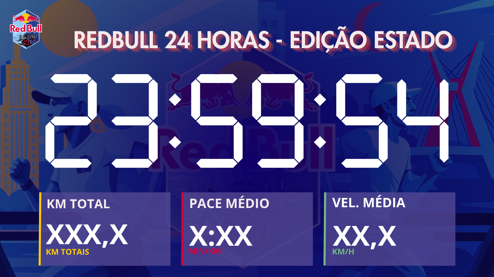<br>
      <sup>Fonte: Elaborado pelos autores (2026).</sup>
</div>


### Telas de divulgação pós competição
#### Tela de desempenho do atleta
&nbsp; &nbsp; &nbsp; &nbsp;Esse é o protótipo de alta fidelidade da tela criada para que os atletas divulguem seu desempenho na competição, com informações como quilometragem total, pace mínimo e velocidade máxima alcançada.

<div align="center">
  <sub>Figura 56 - Stories de divulgação do atleta</sub><br>
    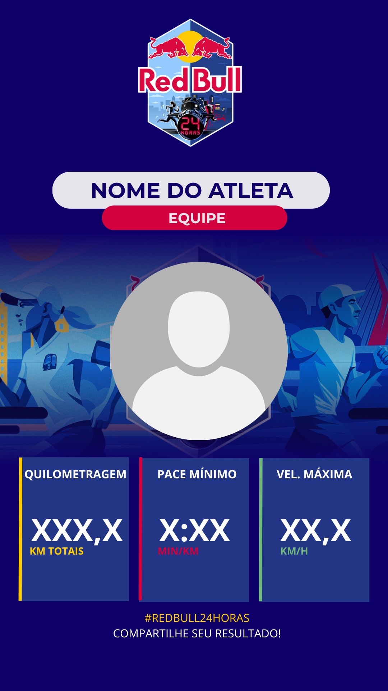<br>
      <sup>Fonte: Elaborado pelos autores (2026).</sup>
</div>

#### Tela de desempenho por período 
&nbsp; &nbsp; &nbsp; &nbsp;Esse é o protótipo de alta fidelidade da tela criada para a divulgação, por parte da Red Bull, dos atletas em destaque nos períodos da manhã, tarde, noite e madrugada, considerando a maior quilometragem realizada por atleta em cada um.

<div align="center">
  <sub>Figura 56 - Stories atleta destaque da manhã</sub><br>
    <br>
      <sup>Fonte: Elaborado pelos autores (2026).</sup>
</div>

<div align="center">
  <sub>Figura 56 - Stories atleta destaque da tarde</sub><br>
    <br>
      <sup>Fonte: Elaborado pelos autores (2026).</sup>
</div>

<div align="center">
  <sub>Figura 56 - Stories atleta destaque da noite</sub><br>
    <br>
      <sup>Fonte: Elaborado pelos autores (2026).</sup>
</div>

<div align="center">
  <sub>Figura 56 - Stories atleta destaque da madrugada</sub><br>
    <br>
      <sup>Fonte: Elaborado pelos autores (2026).</sup>
</div>

#### Tela de atleta destaque 
&nbsp; &nbsp; &nbsp; &nbsp;Esse é o protótipo de alta fidelidade da tela criada para a divulgação, por parte da Red Bull, dos atletas destaques da competição, isto é, o atleta com a maior quilometragem e o atleta com o menor pace registrado.

<div align="center">
  <sub>Figura 56 - Stories atleta destaque com maior quilometragem</sub><br>
    <br>
      <sup>Fonte: Elaborado pelos autores (2026).</sup>
</div>

<div align="center">
  <sub>Figura 56 - Stories atleta destaque com menor pace</sub><br>
    <br>
      <sup>Fonte: Elaborado pelos autores (2026).</sup>
</div>


## 3.6. Modelagem do banco de dados 

### 3.6.1. Modelo Entidade-Relacionamento (ER) 

O Modelo Entidade-Relacionamento (MER), também conhecido como modelo ER, é uma modelagem conceitual utilizada para representar os objetos envolvidos em um domínio de negócio, suas características e os relacionamentos existentes entre eles (Joel, 2014). Essa modelagem é composta por entidades, atributos e relacionamentos, permitindo transformar informações em uma representação visual, o que facilita a compreensão e a validação da estrutura do sistema por diferentes integrantes da equipe, como desenvolvedores, Scrum Master, Product Owner e Stakeholders.

De forma mais detalhada, as entidades, representadas por retângulos, correspondem aos elementos relevantes do domínio do sistema, como pessoas, objetos, locais, eventos ou conceitos. As entidades possuem atributos, representados por elipses, responsáveis por descrever suas características, como `name`, `email` e `cpf` na entidade Runner. Esses atributos são essenciais para o armazenamento de informações relevantes dentro do contexto do banco de dados. Os relacionamentos, por sua vez, são representados por losangos que contêm o verbo que descreve a interação entre as entidades, demonstrando as associações existentes entre elas.

O relacionamento entre entidades é feito por meio de uma linha que contém as cardinalidades, representação numérica que identifica quantas instâncias de uma entidade podem se relacionar com instâncias de outra. A seguir, o Quadro 25 apresenta as principais cardinalidades e a sua utilização.

<div align="center">
  <sub>Quadro 30 - Cardinalidades </sub>
</div>

| Cardinalidade |  Leitura | Exemplo de Aplicação |
| -------- | --------- | --------- |  
| 1:1 | Um para Um | Cada Team possui exatamente um UUID de acesso |
| 1:N | Um para Muitos | Uma Competition possui vários Teams, mas cada Team pertence a uma única Competition |
| N:N | Muitos para Muitos | No modelo conceitual, Admin e Runner se relacionam N:N (um administrador registra checkpoints de vários corredores e cada corredor pode ter registros de vários administradores). No modelo lógico, essa relação é materializada na entidade associativa Checkpoint, com atributos próprios (distance_km, pace, time) |

<div align="center">
  <sup>Fonte: Elaborado pelos autores (2026).</sup>
</div> 

A seguir, a Figura 57 ilustra o Modelo Entidade-Relacionamento desenvolvido para o projeto.

<div align="center">
  <sub>Figura 57 - Modelo Entidade-Relacionamento</sub><br>
    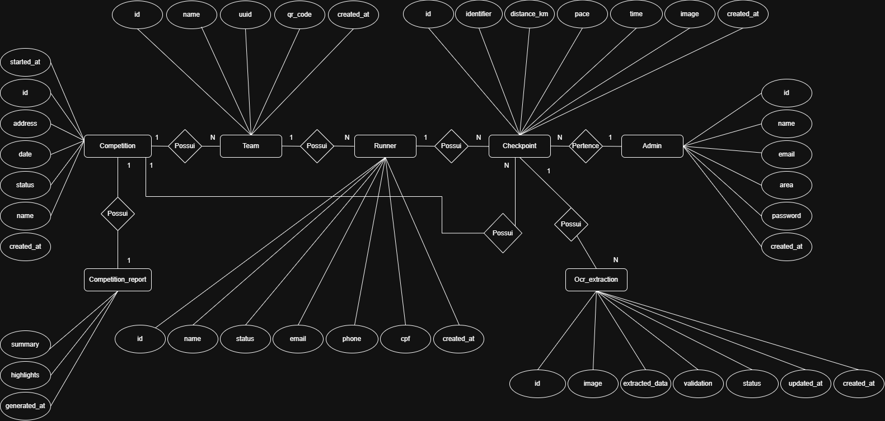<br>
      <sup>Fonte: Elaborado pelos autores (2026).</sup>
</div> 


#### Descrição das entidades e relacionamentos

A seguir, o Quadro 26 apresenta cada entidade, seu papel e os relacionamentos que desempenha no sistema. A notação `1:N` adotada na coluna de relacionamentos corresponde à notação de Chen e equivale à forma `0..N` da notação UML; a participação obrigatória (mínimo 1) é indicada em texto quando aplicável.

<div align="center">
  <sub>Quadro 31 - Descrição das entidades e relacionamentos</sub>
</div>

| Entidade | Papel no sistema | Relacionamentos |
| --------- | ---------------- | --------------- |
| Competition | Representa o evento Red Bull 24h, raiz do modelo | Possui N Teams (1:N); possui N Checkpoints (1:N) |
| Team | Agrupa corredores de uma mesma competição | Pertence a 1 Competition (obrigatório); possui N Runners (1:N) |
| Runner | Corredor participante vinculado a uma equipe | Pertence a 1 Team (obrigatório); possui N Checkpoints (1:N) |
| Checkpoint | Registro de desempenho do corredor durante a prova | Pertence obrigatoriamente a 1 Runner, 1 Competition e 1 Admin (todas as associações são obrigatórias) |
| Admin | Operador responsável por registrar checkpoints | Possui N Checkpoints (1:N) |
| OcrExtraction | Armazena imagens e dados extraídos por OCR para validação | Pertence opcionalmente a 1 Checkpoint (0..1) |
| CompetitionReport | Relatório consolidado e highlights da competição | Pertence a 1 Competition (relação 1:1) |


<div align="center">
  <sup>Fonte: Elaborado pelos autores (2026).</sup>
</div> 

Em relação à diferença entre o modelo conceitual (MER) e o modelo físico (SQL), o MER representa de forma abstrata a estrutura que o banco de dados deverá possuir, focando na organização das informações e em seus relacionamentos, sem detalhar tipos de dados ou nomes de colunas. Já o modelo físico apresenta a implementação prática no banco de dados, contendo elementos adicionais como chaves estrangeiras, restrições de integridade e definições específicas da linguagem SQL, necessários para o funcionamento do sistema em um contexto relacional. O dicionário de dados apresentado a seguir já incorpora informações do nível lógico/físico (tipos, chaves estrangeiras e obrigatoriedade), de modo a aproximar a modelagem conceitual da implementação efetivamente adotada no projeto.

A seguir, o Quadro 32 exemplifica os elementos da notação de Chen utilizados no MER.

<div align="center">
  <sub>Quadro 32 - Exemplificação dos elementos da notação de Chen </sub>
</div>

| Elemento |  Símbolo  | Aplicação ao MER |
| -------- | --------- | ---------------- |
| Entidade | Retângulo | `Competition`, `Team`, `Runner`, `Checkpoint` e `Admin` |
| Atributo | Elipse    | `address` em `Competition`, `cpf` em `Runner` |
| Relacionamento | Losango | `Team` possui `Runner` |
| Cardinalidade | 1, N nas arestas | Um `Runner` possui N `Checkpoints` |

<div align="center">
  <sup>Fonte: Elaborado pelos autores (2026).</sup>
</div>

#### Dicionário de dados

Por meio de quadros, serão detalhadas todas as entidades, listando seus atributos com o respectivo tipo semântico, a obrigatoriedade e a descrição, a fim de contextualizar a implementação ao sistema. A coluna "Obrigatório" indica se o atributo é de preenchimento obrigatório no banco de dados (`SIM`) ou se aceita valor nulo (`NÃO`).

- O Quadro 33 apresenta a entidade e os atributos de "Competição".

<div align="center">
  <sub>Quadro 33 - Dicionário de Dados da Entidade Competição</sub>
</div>

| Entidade | Atributo | Tipo semântico | Obrigatório | Restrições / Chave | Descrição |
| -------- | --------- | -------------- | ----------- | ------------------ | --------- |
| Competition | `id` | Identificador | Sim | Chave primária (PK) | Identifica unicamente cada competição |
| Competition | `name` | Texto | Sim | CHECK: não vazio | Nome da competição |
| Competition | `address` | Texto | Sim | — | Local onde a competição ocorre |
| Competition | `date` | Data | Sim | CHECK: data ≥ 01/01/2020 | Data de realização da competição |
| Competition | `status` | Categórico | Sim | CHECK: `not_started`, `in_progress` ou `closed`; padrão `not_started` | Estado atual da competição |
| Competition | `started_at` | Data/Hora | Não | — | Horário de início da competição, utilizado para configurar a exibição no painel de TV |
| Competition | `created_at` | Data/Hora | Sim | Padrão: data/hora atual | Data e horário em que o registro foi inserido no sistema |

<div align="center">
  <sup>Fonte: Elaborado pelos autores (2026).</sup>
</div> 

- A seguir, o Quadro 34 ilustra a entidade Equipe e os seus atributos.

<div align="center">
  <sub>Quadro 34 - Dicionário de Dados da Entidade Equipe</sub>
</div>

| Entidade | Atributo | Tipo semântico | Obrigatório | Restrições / Chave | Descrição |
| -------- | --------- | -------------- | ----------- | ------------------ | --------- |
| Team | `id` | Identificador | Sim | Chave primária (PK) | Identifica unicamente cada equipe |
| Team | `name` | Texto | Sim | CHECK: não vazio | Nome da equipe |
| Team | `uuid` | Identificador único público | Sim | UNIQUE; gerado automaticamente | Código distribuído ao capitão para acesso sem login |
| Team | `qr_code` | JSONB | Não | — | Metadados do QR Code gerado a partir do UUID |
| Team | `id_competition` | Chave estrangeira | Sim | FK → `Competition` (ON DELETE RESTRICT) | Vincula a equipe à competição |
| Team | `created_at` | Data/Hora | Sim | Padrão: data/hora atual | Data e horário em que o registro foi inserido no sistema |

<div align="center">
  <sup>Fonte: Elaborado pelos autores (2026).</sup>
</div> 

- O Quadro 35 representa o dicionário de dados da entidade Corredor.

<div align="center">
  <sub>Quadro 35 - Dicionário de Dados da Entidade Corredor</sub>
</div>

| Entidade | Atributo | Tipo semântico | Obrigatório | Restrições / Chave | Descrição |
| -------- | --------- | -------------- | ----------- | ------------------ | --------- |
| Runner | `id` | Identificador | Sim | Chave primária (PK) | Identifica unicamente cada corredor |
| Runner | `name` | Texto | Sim | CHECK: não vazio | Nome completo do corredor |
| Runner | `status` | Categórico | Sim | CHECK: `runner` ou `captain`; padrão `runner`. Conforme a migration, armazena o papel do corredor na equipe | Papel do corredor na equipe |
| Runner | `email` | Texto | Sim | UNIQUE; CHECK: formato de e-mail | Endereço de e-mail do corredor |
| Runner | `phone` | Texto | Não | — | Contato telefônico do corredor |
| Runner | `cpf` | Texto | Sim | UNIQUE; CHECK: formato `000.000.000-00` | Documento de identificação civil |
| Runner | `id_team` | Chave estrangeira | Sim | FK → `Team` (ON DELETE RESTRICT) | Vincula o corredor à equipe |
| Runner | `created_at` | Data/Hora | Sim | Padrão: data/hora atual | Data e horário em que o registro foi inserido no sistema |

<div align="center">
  <sup>Fonte: Elaborado pelos autores (2026).</sup>
</div> 

- O Quadro 36 apresenta a entidade e os atributos de "Checkpoint".

<div align="center">
  <sub>Quadro 36 - Dicionário de Dados da Entidade Checkpoint</sub>
</div>

| Entidade | Atributo | Tipo semântico | Obrigatório | Restrições / Chave | Descrição |
| -------- | --------- | -------------- | ----------- | ------------------ | --------- |
| Checkpoint | `id` | Identificador | Sim | Chave primária (PK) | Identifica unicamente cada checkpoint |
| Checkpoint | `identifier` | Texto | Sim | UNIQUE | Identificador que possibilita a rastreabilidade dos registros |
| Checkpoint | `distance_km` | Numérico decimal | Sim | CHECK: entre 0 e 1000 | Distância percorrida registrada (em km) |
| Checkpoint | `pace` | Texto | Não | CHECK: formato `mm:ss/km` | Ritmo médio em minutos por km |
| Checkpoint | `time` | Texto | Não | CHECK: formato `hh:mm:ss` | Tempo total na esteira |
| Checkpoint | `image` | JSONB | Não | — | Foto ou metadados da evidência capturada |
| Checkpoint | `id_runner` | Chave estrangeira | Sim | FK → `Runner` (ON DELETE RESTRICT) | Vincula o checkpoint ao corredor |
| Checkpoint | `id_competition` | Chave estrangeira | Sim | FK → `Competition` (ON DELETE RESTRICT) | Vincula o checkpoint à competição |
| Checkpoint | `id_admin` | Chave estrangeira | Sim | FK → `Admin` (ON DELETE RESTRICT) | Vincula o checkpoint ao admin responsável |
| Checkpoint | `created_at` | Data/Hora | Sim | Padrão: data/hora atual | Data e horário em que o registro foi inserido no sistema |

<div align="center">
  <sup>Fonte: Elaborado pelos autores (2026).</sup>
</div> 

- A seguir, o Quadro 37 ilustra a entidade Administrador e os seus atributos.

<div align="center">
  <sub>Quadro 37 - Dicionário de Dados da Entidade Administrador</sub>
</div>

| Entidade | Atributo | Tipo semântico | Obrigatório | Restrições / Chave | Descrição |
| -------- | --------- | -------------- | ----------- | ------------------ | --------- |
| Admin | `id` | Identificador | Sim | Chave primária (PK) | Identifica unicamente cada admin |
| Admin | `name` | Texto | Sim | CHECK: não vazio | Nome do admin |
| Admin | `email` | Texto | Sim | UNIQUE; CHECK: formato de e-mail | E-mail usado para autenticação |
| Admin | `area` | Texto | Não | — | Área de atuação do admin |
| Admin | `password` | Texto (hash) | Sim | — | Hash da credencial de acesso ao painel administrativo (a senha em texto puro nunca é armazenada) |
| Admin | `created_at` | Data/Hora | Sim | Padrão: data/hora atual | Data e horário em que o registro foi inserido no sistema |

<div align="center">
  <sup>Fonte: Elaborado pelos autores (2026).</sup>
</div> 


- O Quadro 39 apresenta a entidade e os atributos de "Extração OCR".

<div align="center">
  <sub>Quadro 39 - Dicionário de Dados da Entidade Extração OCR</sub>
</div>

| Entidade | Atributo | Tipo semântico | Obrigatório | Restrições / Chave | Descrição |
| -------- | --------- | -------------- | ----------- | ------------------ | --------- |
| OcrExtraction | `id` | Identificador | Sim | Chave primária (PK) | Identifica unicamente cada extração |
| OcrExtraction | `image` | JSONB | Sim | — | Imagem submetida ao processamento OCR |
| OcrExtraction | `extracted_data` | JSONB | Não | — | Dados extraídos automaticamente da imagem |
| OcrExtraction | `validation` | JSONB | Não | — | Resultado da validação dos dados extraídos |
| OcrExtraction | `status` | Categórico | Sim | CHECK: `pending`, `processed`, `validated` ou `rejected`; padrão `pending` | Estágio do processamento da extração |
| OcrExtraction | `id_checkpoint` | Chave estrangeira | Não | FK → `Checkpoint` (ON DELETE SET NULL) | Vincula a extração ao checkpoint gerado (opcional) |
| OcrExtraction | `created_at` | Data/Hora | Sim | Padrão: data/hora atual | Data e horário de criação do registro |
| OcrExtraction | `updated_at` | Data/Hora | Sim | Padrão: data/hora atual | Data e horário da última atualização |

<div align="center">
  <sup>Fonte: Elaborado pelos autores (2026).</sup>
</div>


- O Quadro 40 representa o dicionário de dados da entidade Relatório da Competição.

<div align="center">
  <sub>Quadro 40 - Dicionário de Dados da Entidade Relatório da Competição</sub>
</div>

| Entidade | Atributo | Tipo semântico | Obrigatório | Restrições / Chave | Descrição |
| -------- | --------- | -------------- | ----------- | ------------------ | --------- |
| CompetitionReport | `id_competition` | Identificador / FK | Sim | PK e FK → `Competition` (ON DELETE CASCADE) | Identifica o relatório e o vincula 1:1 à competição |
| CompetitionReport | `summary` | JSONB | Sim | — | Resumo estatístico da competição |
| CompetitionReport | `highlights` | JSONB | Sim | — | Destaques de desempenho do evento |
| CompetitionReport | `generated_at` | Data/Hora | Sim | Padrão: data/hora atual | Data e horário de geração do relatório |

<div align="center">
  <sup>Fonte: Elaborado pelos autores (2026).</sup>
</div>

#### Regras que impactam o modelo

Além dos atributos, o modelo é governado por regras de integridade definidas no banco de dados, descritas a seguir, que impactam diretamente a estrutura e o comportamento das entidades:

- **Unicidade:** os atributos `email` e `cpf` de `Runner`, `email` de `Admin`, `uuid` de `Team` e `identifier` de `Checkpoint` são únicos, impedindo registros duplicados.
- **Domínios restritos (CHECK):** `status` de `Competition` aceita apenas `not_started`, `in_progress` ou `closed`; `status` de `Runner` aceita apenas `runner` ou `captain`; `status` de `OcrExtraction` aceita apenas `pending`, `processed`, `validated` ou `rejected`; `distance_km` deve estar entre 0 e 1000; `cpf`, `email`, `pace` e `time` seguem formatos pré-definidos.
- **Obrigatoriedade das associações:** as chaves estrangeiras são, em regra, de preenchimento obrigatório, o que torna total a participação das entidades nos relacionamentos — todo `Team` pertence a uma `Competition`, todo `Runner` a um `Team` e todo `Checkpoint` a um `Runner`, uma `Competition` e um `Admin`. A única exceção é a associação de `OcrExtraction` com `Checkpoint`, opcional, pois `id_checkpoint` aceita valor nulo.
- **Integridade referencial:** em regra, não é permitido excluir um registro que ainda possua dependentes (ON DELETE RESTRICT) — por exemplo, uma `Competition` não pode ser removida enquanto houver `Teams` ou `Checkpoints` vinculados a ela. Há duas exceções intencionais: um `CompetitionReport` é removido em cascata junto com sua `Competition` (ON DELETE CASCADE) e a exclusão de um `Checkpoint` apenas anula o vínculo da extração OCR, sem removê-la (ON DELETE SET NULL).


#### Rastreabilidade entidade → RF → RN

A seguir, o Quadro 39 apresenta a rastreabilidade entre as entidades criadas com os Requisitos Funcionais e Não Funcionais, para assim, ser possível o entendimento e compreensão integral do sistema:

<div align="center">
  <sub>Quadro 39 - Rastreabilidade entidade → RF → RN </sub>
</div>

| Entidade | RF que origina | RN que governa |
| --------- | -------------- | -------------|
| Competition | RF001, RF002 | RN14 |
| Team | RF003 | RN01, RN02, RN07 | 
| Runner | RF003 | RN07 | 
| Checkpoint | RF005, RF008 | RN04, RN05, RN12 |
| Admin | RF004 | RN03 |
| OcrExtraction | RF005, RF006, RF007, RF009 | RN05, RN06 |
| CompetitionReport | RF014 | — |


<div align="center">
  <sup>Fonte: Elaborado pelos autores (2026).</sup>
</div>

### 3.6.2. Diagrama Entidade-Relacionamento (DER)

O Diagrama Entidade-Relacionamento (DER) é uma ferramenta utilizada na modelagem de bancos de dados para representar, de forma visual, as entidades de um sistema, seus atributos e os relacionamentos existentes entre elas. Esse diagrama auxilia na organização e estruturação das informações que serão armazenadas no banco de dados, permitindo uma melhor compreensão da lógica do sistema antes de seu desenvolvimento (Lucid Software Inc., s.d.).

A principal finalidade do DER é facilitar o planejamento do banco de dados, reduzindo erros de estrutura e garantindo que os dados sejam armazenados de maneira organizada e eficiente. Além disso, o diagrama contribui para a comunicação entre os membros da equipe, pois apresenta, de forma clara, como as informações se conectam dentro do sistema (Joel, 2014).

No contexto do projeto, o DER é importante para representar os elementos fundamentais da plataforma, como competições, equipes, corredores e registros de desempenho. A partir dele, é possível visualizar como essas entidades se relacionam, garantindo que o banco de dados suporte corretamente as funcionalidades do sistema, como cadastro de atletas, monitoramento em tempo real e atualização de rankings. Dessa forma, o DER contribui diretamente para a organização, integridade e funcionamento adequado do banco de dados do projeto.

### Notação Crow's Foot

Para a construção do Diagrama Entidade-Relacionamento (ER) deste projeto, foi utilizada a notação Crow’s Foot. O nome Crow’s Foot (“pé de corvo”) vem do símbolo utilizado para representar relações do tipo “muitos”, que possui um formato semelhante às patas de um corvo. 

Por meio dessa representação, é possível identificar de forma clara relações como um-para-um (1:1), um-para-muitos (1:N) e muitos-para-muitos (N:N). Além das cardinalidades, a notação também permite representar a opcionalidade e a obrigatoriedade dos relacionamentos por meio de símbolos específicos, como círculos e barras, indicando se a participação de uma entidade em um relacionamento é opcional ou obrigatória. Dessa forma, a modelagem do banco de dados se torna mais organizada e compreensível. (Perera, 2026)


### Glossário de cardinalidades  
<div align="center">
  <sub>Quadro 40 - Glossário de cardinalidades </sub>
</div>

| Símbolo | Nome | Significado |
|---|---|---|
| `\|` | Um obrigatório | Representa exatamente 1 ocorrência obrigatória |
| `<` | Muitos | Representa várias ocorrências relacionadas |
| `\|———\|` | 1:1 (Um para Um) | Uma entidade se relaciona obrigatoriamente com exatamente uma ocorrência da outra |
| `\|———\|<` | 1:N obrigatório | Uma entidade se relaciona com uma ou mais ocorrências obrigatórias da outra entidade |
| `>\|———\|` | N:1 obrigatório | Várias entidades se relacionam obrigatoriamente com uma única ocorrência da outra entidade |
| `O\|` | Zero ou um (opcional) | Representa no máximo uma ocorrência, podendo não haver nenhuma |
| `O<` | Zero ou muitos (opcional) | Representa zero ou várias ocorrências relacionadas |

<div align="center">
  <sup>Fonte: Elaborado pelos autores (2026).</sup>
</div>

> A mesma linha carrega as duas direções. Não é preciso desenhar duas setas,


<div align="center">
  <sub>Figura 57 - Diagrama Entidade Relacionamento</sub><br>
    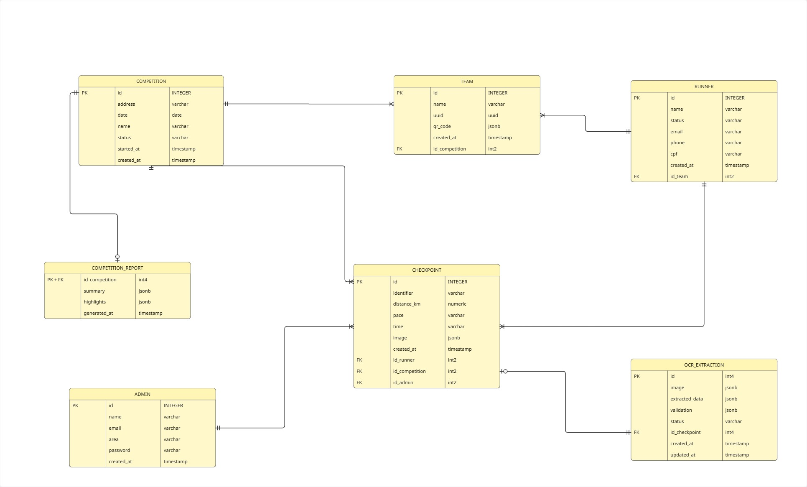<br>
      <sup>Fonte: Elaborado pelos autores (2026).</sup>
</div>


### Relacionamentos do DER
<div align="center">
  <sub>Quadro 41 - Relacionamentos do DER </sub>
</div>

| # | Entidade A | Entidade B | A → B | B → A |
|---|---|---|---|---|
| 1 | COMPETITION | TEAM | 1 competição tem muitas equipes (1:N) | Muitas equipes pertencem a 1 única competição (N:1) |
| 2 | TEAM | RUNNER | 1 equipe tem muitos corredores (1:N) | Muitos corredores pertencem a 1 única equipe (N:1) |
| 3 | RUNNER | CHECKPOINT | 1 corredor possui muitos checkpoints (1:N) | Muitos checkpoints pertencem a 1 único corredor (N:1) |
| 4 | ADMIN | CHECKPOINT | 1 administrador supervisiona muitos checkpoints (1:N) | Muitos checkpoints são supervisionados por 1 único administrador (N:1) |
| 5 | COMPETITION | CHECKPOINT | 1 competição possui muitos checkpoints (1:N) | Muitos checkpoints pertencem a 1 única competição (N:1) |
| 6 | CHECKPOINT | OCR_EXTRACTION | 1 checkpoint pode originar muitas extrações OCR (1:N, opcional) | Cada extração referencia no máximo 1 checkpoint (N:0..1) |
| 7 | COMPETITION | COMPETITION_REPORT | 1 competição possui no máximo 1 relatório (1:0..1) | Cada relatório pertence a exatamente 1 competição (1:1) |

<div align="center">
  <sup>Fonte: Elaborado pelos autores (2026).</sup>
</div>

### Coerência com o Diagrama de Classes
<div align="center">
  <sub>Quadro 42 - Coerência com o Diagrama de Classes </sub>
</div>

| Diagrama de Classes                                         | DER                                   |
| ----------------------------------------------------------- | ------------------------------------- |
| Classe `Competition`                                         | Tabela `COMPETITION`                   |
| Classe `Team`                                             | Tabela `TEAM`                       |
| Classe `Runner`                                  | Tabela `RUNNER`                     |
| Classe `Admin`                               | Tabela `ADMIN`                |
| Classe `Checkpoint`                                         | Tabela `CHECKPOINT`                   |
| Associação `Competition` possui `Team`                     | FK `id_competition` em `TEAM`        |
| Associação `Team` possui `Runner`                       | FK `id_team` em `RUNNER`          |
| Associação `Runner` registra `Checkpoint`                 | FK `id_runner` em `CHECKPOINT`      |
| Associação `Competition` possui `Checkpoint`                 | FK `id_competition` em `CHECKPOINT`    |
| Associação `Admin` valida/supervisiona `Checkpoint` | FK `id_admin` em `CHECKPOINT` |
| Classe/serviço `OCR` (OCRService / `Validação`)              | Tabela `OCR_EXTRACTION`               |
| Associação `Checkpoint` origina `OcrExtraction`              | FK `id_checkpoint` em `OCR_EXTRACTION` |
| Entidade de relatório (`Ranking`/relatório consolidado)      | Tabela `COMPETITION_REPORT`           |
| Associação `Competition` gera `CompetitionReport`            | FK/PK `id_competition` em `COMPETITION_REPORT` |

<div align="center">
  <sup>Fonte: Elaborado pelos autores (2026).</sup>
</div>


## 3.6.3 Modelo Relacional e Modelo Físico 

O modelo relacional consiste em uma abordagem de organização e gerenciamento de dados baseada na representação das informações por meio de relações, normalmente implementadas como tabelas compostas por linhas e colunas. Esse modelo possibilita a definição de entidades, atributos e relacionamentos, além de mecanismos que garantem integridade, consistência e redução de redundâncias no armazenamento das informações. Sua estrutura fundamenta-se em conceitos como chaves primárias, chaves estrangeiras e restrições de integridade, permitindo representar de forma estruturada as regras de negócio de um sistema (Codd, 1970).

No contexto deste projeto, o modelo relacional foi desenvolvido a partir dos requisitos funcionais e das regras de negócio levantadas nas etapas anteriores, com o objetivo de estruturar o armazenamento das informações referentes às competições, equipes, corredores, registros de desempenho e processos de auditoria. A modelagem proposta busca garantir integridade referencial, rastreabilidade das operações e escalabilidade para futuras evoluções do sistema.

#### 3.6.3.1 Modelo Relacional

Com base nos requisitos funcionais, nas regras de negócio e na modelagem conceitual definida nas etapas anteriores, foi elaborado o modelo relacional do sistema, contemplando as principais entidades, seus atributos e os relacionamentos necessários para garantir integridade e consistência dos dados. A Figura 28 apresenta a estrutura relacional proposta para o projeto.

<div align="center">
  <sub>Figura 58 - Modelo Relacional</sub><br>
  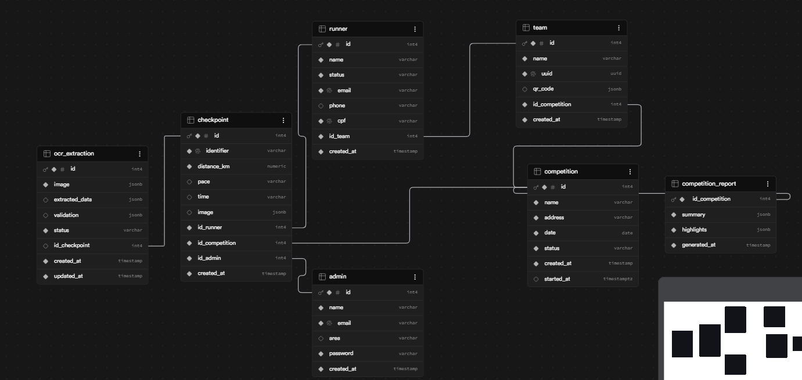<br>
  <sup>Fonte: Elaborado pelos autores (2026).</sup>
</div>

##### Descrição das entidades

**Tabela `competition`**  
A tabela `competition` armazena as informações referentes aos eventos esportivos cadastrados na plataforma, incluindo nome, endereço, data de realização, o status do evento (`not_started`, `in_progress` ou `closed`) e o horário de início usado pelo painel de TV (`started_at`). Essa entidade representa a base organizacional do sistema, servindo como referência para o cadastro das equipes participantes e para os registros operacionais gerados durante a competição.

**Tabela `team`**  
A tabela `team` registra os grupos participantes vinculados a uma competição específica por meio da chave estrangeira `id_competition`. Além de sua chave primária, contempla um identificador público único (`uuid`) e os metadados do QR Code (`qr_code`), que permitem individualizar cada equipe e associá-la ao respectivo evento esportivo.

**Tabela `runner`**  
A tabela `runner` armazena os dados cadastrais dos participantes, incluindo nome, email, telefone e CPF, além de um campo `status` que representa o papel do corredor na equipe (`runner` para corredor comum ou `captain` para capitão). Por meio da chave estrangeira `id_team`, cada corredor é associado à sua respectiva equipe.


**Tabela `admin`**  
A tabela `admin` armazena os dados dos usuários responsáveis pela gestão operacional da plataforma, incluindo nome, email (único, utilizado na autenticação), área de atuação e o hash da senha de acesso, garantindo identificação, autenticação e rastreabilidade temporal.

**Tabela `checkpoint`**  
A tabela `checkpoint` centraliza os registros operacionais das corridas, armazenando um identificador único de registro, métricas de desempenho e evidências capturadas pelo sistema. Além disso, essa entidade mantém relacionamento com as tabelas `runner`, `competition` e `admin`, permitindo rastrear a origem, o contexto e a validação administrativa associada a cada registro.

**Tabela `ocr_extraction`**  
A tabela `ocr_extraction` dá suporte ao processo de extração automática de dados a partir de imagens (OCR), armazenando a imagem submetida, os dados extraídos, o resultado da validação e o status do processamento (`pending`, `processed`, `validated` ou `rejected`). Vincula-se opcionalmente a um `checkpoint` por meio da chave estrangeira `id_checkpoint`.

**Tabela `competition_report`**  
A tabela `competition_report` armazena o relatório consolidado de cada competição, contendo o resumo estatístico (`summary`) e os destaques (`highlights`) do evento. Mantém relação 1:1 com `competition`, utilizando `id_competition` simultaneamente como chave primária e estrangeira.

Adicionalmente, as entidades contemplam atributos temporais de rastreabilidade: `created_at` na maioria das tabelas — com `updated_at` adicional em `ocr_extraction` e `generated_at` em `competition_report` —, permitindo o acompanhamento histórico das operações realizadas na plataforma.

##### Relacionamentos e integridade referencial

Os relacionamentos entre as entidades foram definidos por meio de chaves primárias (*Primary Keys*) e chaves estrangeiras (*Foreign Keys*), respeitando as dependências identificadas durante a modelagem conceitual e garantindo integridade referencial entre as tabelas. Nesse contexto:

- uma `competition` pode possuir múltiplas `teams` *(1:N)*;
- uma `team` pode possuir múltiplos `runners` *(1:N)*;
- um `runner` pode gerar múltiplos `checkpoints` *(1:N)*;
- uma `competition` pode possuir múltiplos `checkpoints` *(1:N)*;
- um `admin` pode validar múltiplos `checkpoints` *(1:N)*;
- um `checkpoint` pode originar múltiplas `ocr_extractions` *(1:N, opcional)* — a associação é opcional, pois `id_checkpoint` aceita valor nulo;
- uma `competition` possui no máximo um `competition_report` *(1:1)*.

##### Constraints do modelo relacional

As constraints do modelo relacional definem as regras de integridade que serão implementadas posteriormente no modelo físico. Elas indicam quais campos identificam unicamente cada registro, quais relacionamentos devem ser preservados entre as tabelas e quais valores precisam respeitar regras específicas do domínio do sistema.
<div align="center">
  <sub>Quadro 43 - Constraints do modelo relacional </sub>
</div>

| Tabela | Constraint | Campo(s) | Finalidade |
| :--- | :--- | :--- | :--- |
| Todas as tabelas (exceto `competition_report`) | `PRIMARY KEY` | `id` | Garante a identificação única dos registros principais do sistema. |
| `competition_report` | `PRIMARY KEY` | `id_competition` | Usa a própria chave estrangeira como chave primária, materializando a relação 1:1 com `competition`. |
| `team` | `FOREIGN KEY` | `id_competition` | Indica que cada equipe pertence a uma competição. |
| `runner` | `FOREIGN KEY` | `id_team` | Indica que cada corredor pertence a uma equipe. |
| `checkpoint` | `FOREIGN KEY` | `id_runner`, `id_competition` e `id_admin` | Indica que cada checkpoint deve estar associado a um corredor, uma competição e um administrador. |
| `ocr_extraction` | `FOREIGN KEY` | `id_checkpoint` | Vincula a extração a um checkpoint (associação opcional, `ON DELETE SET NULL`). |
| `competition_report` | `FOREIGN KEY` | `id_competition` | Vincula o relatório a uma competição (`ON DELETE CASCADE`). |
| `team` | `UNIQUE` | `uuid` | Define que o identificador público da equipe não pode se repetir. |
| `runner` | `UNIQUE` | `cpf`, `email` | Define que CPF e email devem ser exclusivos para cada corredor. |
| `admin` | `UNIQUE` | `email` | Define que o e-mail de autenticação do administrador é único. |
| `checkpoint` | `UNIQUE` | `identifier` | Define que cada registro operacional possui um identificador próprio. |
| `competition` | `CHECK` | `status`, `name`, `date` | Restringe o status aos valores previstos, impede nome vazio e exige data ≥ 01/01/2020. |
| `runner` | `CHECK` | `status`, `name`, `cpf`, `email` | Limita o papel do participante, impede nome vazio e valida os formatos de CPF e e-mail. |
| `team` | `CHECK` | `name` | Impede o cadastro de equipe com nome vazio. |
| `admin` | `CHECK` | `name`, `email` | Impede nome vazio e valida o formato do e-mail. |
| `checkpoint` | `CHECK` | `distance_km`, `pace`, `time` | Impede valores de distância fora da faixa (0 a 1000) e valida os formatos de ritmo e tempo. |
| `ocr_extraction` | `CHECK` | `status` | Limita o status do processamento aos valores `pending`, `processed`, `validated` e `rejected`. |
| Principais campos obrigatórios | `NOT NULL` | Campos de identificação, relacionamento e rastreabilidade | Define quais informações mínimas precisam existir para manter a consistência dos cadastros e registros operacionais. |

<div align="center">
  <sup>Fonte: Elaborado pelos autores (2026).</sup>
</div>

#### 3.6.3.2 Modelo Físico
Segundo a Amazon Web Services (2024), o modelo físico é a última etapa da modelagem do banco de dados, refinando aquilo que já foi trabalhado e passando a organização para uma tecnologia específica. Ou seja, representa a implementação do banco de dados no SGBD escolhido, detalhando tabelas, atributos, tipos de dados, chaves primárias, chaves estrangeiras e constraints. Nesta seção, serão apresentados os scripts SQL responsáveis pela criação da estrutura da aplicação do evento Red Bull 24 Horas, garantindo integridade, consistência e suporte às regras de negócio do sistema.

Os scripts SQL de migração podem ser vistos aqui: Diretório de Migrações.

A implementação física do banco de dados foi elaborada com base na estrutura relacional definida na subseção anterior, contemplando a tradução das entidades, atributos e relacionamentos em instruções DDL (Data Definition Language) executáveis no PostgreSQL. Em vez de um único arquivo, o esquema foi organizado em migrations sequenciais e versionadas (de 0000 a 0008), cada uma responsável por uma etapa da construção do banco. Essa abordagem respeita a ordem de dependências entre as tabelas, aplica as restrições de integridade identificadas durante a modelagem conceitual e relacional, e permite que a evolução do esquema seja rastreável e reproduzível em qualquer ambiente.


##### Extensões (`0000_extensions.sql`)

```sql
CREATE EXTENSION IF NOT EXISTS pgcrypto;
```

Antes da criação das tabelas, é habilitada a extensão **`pgcrypto`**, que disponibiliza a função `gen_random_uuid()` utilizada posteriormente pela tabela `team` para gerar identificadores públicos no formato UUID. O uso de `IF NOT EXISTS` torna a operação idempotente, evitando erros caso a extensão já esteja instalada no banco.


 ##### Tabela `competition` (`0001_create_competition.sql`)
 
```sql
CREATE TABLE competition (
    id          INTEGER       NOT NULL GENERATED ALWAYS AS IDENTITY,
    name        VARCHAR(100)  NOT NULL,
    address     VARCHAR(255)  NOT NULL,
    date        DATE          NOT NULL,
    status      VARCHAR(30)   NOT NULL DEFAULT 'not_started',
    started_at  TIMESTAMP     NULL,
    created_at  TIMESTAMP     NOT NULL DEFAULT NOW(),

    CONSTRAINT pk_competition PRIMARY KEY (id),
    CONSTRAINT ck_competition_status
        CHECK (status IN ('not_started', 'in_progress', 'closed')),
    CONSTRAINT ck_competition_name_not_empty
        CHECK (length(trim(name)) > 0),
    CONSTRAINT ck_competition_date_min
        CHECK (date >= DATE '2020-01-01')
);

CREATE INDEX idx_competition_date ON competition (date);
```

A tabela **`competition`** é a raiz do modelo e, por não possuir dependências externas, é criada em primeiro lugar. O campo **`id`** é do tipo `INTEGER` e utiliza `GENERATED ALWAYS AS IDENTITY` para geração automática e sequencial de identificadores. O campo **`name`** armazena o nome do evento e é protegido pela constraint `ck_competition_name_not_empty`, que impede a inserção de nomes em branco. O campo **`address`** é obrigatório, pois toda competição deve possuir um local de realização. O campo **`date`** armazena exclusivamente a data do evento (sem componente horária) e a constraint `ck_competition_date_min` impede o cadastro de datas anteriores a 01/01/2020. O campo **`status`** recebe `DEFAULT 'not_started'` e é restringido pela constraint `ck_competition_status` aos valores `not_started`, `in_progress` e `closed`, representando o ciclo de vida da competição. O campo `started_at` (`TIMESTAMP`, opcional) armazena o horário de início da competição utilizado para configurar o painel de TV, complementando `date` (data prevista do evento) e `created_at` (criação do registro). O atributo **`created_at`** recebe `DEFAULT NOW()`, garantindo rastreabilidade automática da criação do registro. Por fim, um **índice** é criado sobre `date` para otimizar consultas por período de realização.

##### Tabela `team` (`0002_create_team.sql`)

```sql
CREATE TABLE team (
    id              INTEGER       NOT NULL GENERATED ALWAYS AS IDENTITY,
    name            VARCHAR(100)  NOT NULL,
    uuid            UUID          NOT NULL DEFAULT gen_random_uuid(),
    qr_code         JSONB         NULL,
    id_competition  INTEGER       NOT NULL,
    created_at      TIMESTAMP     NOT NULL DEFAULT NOW(),

    CONSTRAINT pk_team PRIMARY KEY (id),
    CONSTRAINT uq_team_uuid UNIQUE (uuid),
    CONSTRAINT ck_team_name_not_empty
        CHECK (length(trim(name)) > 0),
    CONSTRAINT fk_team_id_competition
        FOREIGN KEY (id_competition) REFERENCES competition (id)
        ON UPDATE CASCADE
        ON DELETE RESTRICT
);

CREATE INDEX idx_team_id_competition ON team (id_competition);
```
A tabela **`team`** depende de **`competition`** por meio da chave estrangeira `id_competition`, definida com `ON UPDATE CASCADE` (propaga alterações de id) e `ON DELETE RESTRICT` (impede a exclusão de uma competição que ainda possua equipes). O campo **`uuid`** utiliza `gen_random_uuid()` como valor padrão — função disponibilizada pela extensão `pgcrypto` — e possui restrição `UNIQUE`, garantindo que cada equipe tenha um identificador público único e não sequencial, adequado para exposição em QR Codes sem revelar o `id` interno numérico. O campo **`qr_code`** é armazenado como `JSONB` e definido como `NULL`, pois pode ser gerado em etapa posterior ao cadastro inicial; o uso de `JSONB` (em vez de `JSON`) permite indexação e consultas eficientes sobre o conteúdo. O campo **`name`** é protegido contra valores vazios pela constraint `ck_team_name_not_empty`. O índice sobre `id_competition` otimiza operações de junção entre as tabelas.

##### Tabela `runner` (`0003_create_runner.sql`)

```sql
CREATE TABLE runner (
    id          INTEGER       NOT NULL GENERATED ALWAYS AS IDENTITY,
    name        VARCHAR(100)  NOT NULL,
    status      VARCHAR(50)   NOT NULL DEFAULT 'runner',
    email       VARCHAR(150)  NOT NULL,
    phone       VARCHAR(20)   NULL,
    cpf         VARCHAR(14)   NOT NULL,
    id_team     INTEGER       NOT NULL,
    created_at  TIMESTAMP     NOT NULL DEFAULT NOW(),

    CONSTRAINT pk_runner PRIMARY KEY (id),
    CONSTRAINT uq_runner_cpf UNIQUE (cpf),
    CONSTRAINT uq_runner_email UNIQUE (email),
    CONSTRAINT ck_runner_status
        CHECK (status IN ('runner', 'captain')),
    CONSTRAINT ck_runner_name_not_empty
        CHECK (length(trim(name)) > 0),
    CONSTRAINT ck_runner_cpf_format
        CHECK (cpf ~ '^[0-9]{3}\.[0-9]{3}\.[0-9]{3}-[0-9]{2}$'),
    CONSTRAINT ck_runner_email_format
        CHECK (email ~ '^[^@[:space:]]+@[^@[:space:]]+\.[^@[:space:]]+$'),
    CONSTRAINT fk_runner_id_team
        FOREIGN KEY (id_team) REFERENCES team (id)
        ON UPDATE CASCADE
        ON DELETE RESTRICT
);

CREATE INDEX idx_runner_id_team ON runner (id_team);
CREATE INDEX idx_runner_cpf     ON runner (cpf);
```
 
 A tabela **`runner`** depende de **`team`** por meio da chave estrangeira `id_team` (`ON UPDATE CASCADE` / `ON DELETE RESTRICT`). Os campos **`cpf`** e **`email`** possuem restrição `UNIQUE`, impedindo o cadastro de dois participantes com os mesmos dados de identificação, e ambos são validados por constraints de formato: `ck_runner_cpf_format` exige a máscara `000.000.000-00` e `ck_runner_email_format` valida a estrutura de um endereço de e-mail. O `cpf` é armazenado como `VARCHAR(14)` para comportar o formato com máscara. O campo **`status`** recebe `DEFAULT 'runner'` e é restringido pela constraint `ck_runner_status` aos valores `runner` e `captain`, diferenciando participantes comuns dos responsáveis (capitães) pela equipe. O campo **`name`** é protegido contra valores vazios, e o campo **`phone`** é opcional (`NULL`). São criados dois índices: um sobre `id_team`, para otimizar junções, e outro sobre `cpf`, para acelerar buscas por identificação.
 


##### Tabela `admin` (`0005_create_admin.sql`)

```sql
CREATE TABLE admin (
    id          INTEGER       NOT NULL GENERATED ALWAYS AS IDENTITY,
    name        VARCHAR(100)  NOT NULL,
    email       VARCHAR(150)  NOT NULL,
    area        VARCHAR(100)  NULL,
    password    VARCHAR(255)  NOT NULL,
    created_at  TIMESTAMP     NOT NULL DEFAULT NOW(),

    CONSTRAINT pk_admin PRIMARY KEY (id),
    CONSTRAINT uq_admin_email UNIQUE (email),
    CONSTRAINT ck_admin_name_not_empty
        CHECK (length(trim(name)) > 0),
    CONSTRAINT ck_admin_email_format
        CHECK (email ~ '^[^@[:space:]]+@[^@[:space:]]+\.[^@[:space:]]+$')
);
```

A tabela **`admin`** também não possui chaves estrangeiras, sendo criada de forma independente antes da tabela `checkpoint`, da qual é referenciada. O campo **`email`** é o identificador de autenticação do usuário administrativo: possui restrição `UNIQUE` (`uq_admin_email`) e validação de formato (`ck_admin_email_format`). O campo **`password`** utiliza `VARCHAR(255)` para armazenar o *hash* gerado por algoritmos como bcrypt ou Argon2 — nunca a senha em texto puro. O campo **`area`** é opcional e representa a área de atuação do usuário dentro da plataforma, podendo ser preenchido em etapa posterior ao cadastro. O campo **`name`** é protegido contra valores vazios.
 
##### Tabela `checkpoint` (`0006_create_checkpoint.sql`)

```sql
CREATE TABLE checkpoint (
    id              INTEGER       NOT NULL GENERATED ALWAYS AS IDENTITY,
    identifier      VARCHAR(100)  NOT NULL,
    distance_km     NUMERIC(6, 3) NOT NULL,
    pace            VARCHAR(20)   NULL,
    time            VARCHAR(20)   NULL,
    image           JSONB         NULL,
    id_runner       INTEGER       NOT NULL,
    id_competition  INTEGER       NOT NULL,
    id_admin        INTEGER       NOT NULL,
    created_at      TIMESTAMP     NOT NULL DEFAULT NOW(),

    CONSTRAINT pk_checkpoint PRIMARY KEY (id),
    CONSTRAINT uq_checkpoint_identifier UNIQUE (identifier),
    CONSTRAINT ck_checkpoint_distance_km
        CHECK (distance_km >= 0 AND distance_km <= 1000),
    CONSTRAINT ck_checkpoint_pace_format
        CHECK (pace IS NULL OR pace ~ '^[0-9]{1,2}:[0-9]{2}/km$'),
    CONSTRAINT ck_checkpoint_time_format
        CHECK (time IS NULL OR time ~ '^[0-9]{2}:[0-9]{2}:[0-9]{2}$'),
    CONSTRAINT fk_checkpoint_id_runner
        FOREIGN KEY (id_runner) REFERENCES runner (id)
        ON UPDATE CASCADE
        ON DELETE RESTRICT,
    CONSTRAINT fk_checkpoint_id_competition
        FOREIGN KEY (id_competition) REFERENCES competition (id)
        ON UPDATE CASCADE
        ON DELETE RESTRICT,
    CONSTRAINT fk_checkpoint_id_admin
        FOREIGN KEY (id_admin) REFERENCES admin (id)
        ON UPDATE CASCADE
        ON DELETE RESTRICT
);

CREATE INDEX idx_checkpoint_id_runner      ON checkpoint (id_runner);
CREATE INDEX idx_checkpoint_id_competition ON checkpoint (id_competition);
CREATE INDEX idx_checkpoint_id_admin       ON checkpoint (id_admin);
CREATE INDEX idx_checkpoint_created_at     ON checkpoint (created_at);
```
 
A tabela **`checkpoint`** é a entidade central do sistema operacional, pois concentra três chaves estrangeiras: `id_runner`, `id_competition` e `id_admin`, todas obrigatórias e definidas com `ON UPDATE CASCADE` / `ON DELETE RESTRICT`. Por depender de três tabelas, é a última das entidades principais a ser criada. O campo **`identifier`** possui restrição `UNIQUE` (`uq_checkpoint_identifier`), garantindo a rastreabilidade individual de cada registro operacional. O campo **`distance_km`** utiliza o tipo `NUMERIC(6, 3)`, que suporta até três casas decimais de precisão (adequado para distâncias como `42,195 km`), e é validado pela constraint `ck_checkpoint_distance_km`, que assegura valores entre 0 e 1000. Os campos **`pace`** e **`time`** são armazenados como `VARCHAR` e são opcionais; quando preenchidos, são validados por constraints de formato (`mm:ss/km` e `hh:mm:ss`, respectivamente), construídas com a condição `IS NULL OR ...` para permitir o valor nulo sem violar a regra. O campo **`image`** é definido como `JSONB` para armazenar metadados ou referências das evidências capturadas no ponto de controle. O campo **`id_admin`** registra qual usuário administrativo foi responsável pelo checkpoint, refletindo a relação *1:N* entre administrador e checkpoints. São criados quatro índices: três sobre as chaves estrangeiras, para otimizar junções, e um sobre `created_at`, para acelerar relatórios cronológicos de desempenho.

##### Tabela `ocr_extraction` (`0007_create_ocr_extraction.sql`)

```sql
CREATE TABLE checkpoint (
    id                  SMALLINT        NOT NULL GENERATED ALWAYS AS IDENTITY,
    identificador       VARCHAR(100)    NOT NULL,
    km                  NUMERIC(6, 3)   NOT NULL,
    pace                VARCHAR(20)     NULL,
    tempo               VARCHAR(20)     NULL,
    imagem              JSON            NULL,
    corredor_id         SMALLINT        NOT NULL,
    competicao_id       SMALLINT        NOT NULL,
    esteira_id          SMALLINT        NOT NULL,
    administrador_id    SMALLINT        NOT NULL,
    criado_em           TIMESTAMP       NOT NULL DEFAULT NOW(),
 
    PRIMARY KEY (id),
    UNIQUE (identificador),
    CHECK (km >= 0 AND km <= 1000),
    CHECK (pace ~ '^[0-9]+:[0-9]{2}/km$'),
    CHECK (tempo ~ '^[0-9]{2}:[0-9]{2}:[0-9]{2}$')
);
 
ALTER TABLE checkpoint
    ADD CONSTRAINT checkpoint_corredor_id_foreign
    FOREIGN KEY (corredor_id) REFERENCES corredor (id);
 
ALTER TABLE checkpoint
    ADD CONSTRAINT checkpoint_competicao_id_foreign
    FOREIGN KEY (competicao_id) REFERENCES competicao (id);
 
ALTER TABLE checkpoint
    ADD CONSTRAINT checkpoint_esteira_id_foreign
    FOREIGN KEY (esteira_id) REFERENCES esteira (id);
 
ALTER TABLE checkpoint
    ADD CONSTRAINT checkpoint_administrador_id_foreign
    FOREIGN KEY (administrador_id) REFERENCES administrador (id);
 
CREATE INDEX idx_checkpoint_corredor_id       ON checkpoint (corredor_id);
CREATE INDEX idx_checkpoint_competicao_id     ON checkpoint (competicao_id);
CREATE INDEX idx_checkpoint_esteira_id        ON checkpoint (esteira_id);
CREATE INDEX idx_checkpoint_administrador_id ON checkpoint (administrador_id);
CREATE INDEX idx_checkpoint_criado_em         ON checkpoint (criado_em);
```
 
A tabela **checkpoint** é a entidade central do sistema operacional e a última a ser criada, pois concentra quatro chaves estrangeiras: `corredor_id`, `competicao_id`, `esteira_id` e `administrador_id`. O campo **km** utiliza o tipo `NUMERIC(6, 3)`, que suporta até três casas decimais de precisão, adequado para registros de distância como `42,195 km`. A restrição `CHECK (km >= 0)` assegura que nenhum valor negativo seja inserido. Os campos **pace** e **tempo** são armazenados como `VARCHAR`, pois seguem formatos textuais como `"5:30/km"` e `"01:23:45"`, sendo opcionais pois podem não estar disponíveis em todos os registros. O campo **imagem** é definido como `JSON` para armazenar metadados ou referências das evidências capturadas no ponto de controle. O campo **identificador** possui restrição `UNIQUE` para garantir unicidade entre os registros operacionais. O campo **administrador_id** registra qual usuário administrativo foi responsável pelo checkpoint, refletindo a relação *1:N* entre administrador e checkpoints — um administrador pode estar associado a múltiplos registros ao longo de uma competição. Cinco índices são criados: quatro sobre as chaves estrangeiras para otimizar junções e um sobre `criado_em` para acelerar relatórios cronológicos de desempenho.

##### Considerações gerais sobre a implementação
 
A implementação física foi organizada em **migrations sequenciais e versionadas** (`0000` a `0008`), executadas na ordem de dependência entre as tabelas: primeiro as extensões, depois as entidades independentes (`competition` e `admin`) e, por fim, as entidades dependentes (`team`, `runner`, `checkpoint`, `ocr_extraction`, `competition_report`). Adotou-se a convenção de **nomear explicitamente todas as constraints** segundo seu tipo — `pk_` (*primary key*), `uq_` (*unique*), `ck_` (*check*) e `fk_` (*foreign key*) —, o que torna as mensagens de erro do banco autoexplicativas e facilita a manutenção e a evolução do esquema.

Todos os campos de identificação seguem o tipo `INTEGER` com geração automática por `GENERATED ALWAYS AS IDENTITY`. As chaves estrangeiras, em regra, adotam `ON UPDATE CASCADE` e `ON DELETE RESTRICT`, preservando a integridade referencial ao bloquear a exclusão de registros que ainda possuam dependentes — com duas exceções intencionais: `ocr_extraction` usa `ON DELETE SET NULL` (para preservar o histórico de extração) e `competition_report` usa `ON DELETE CASCADE` (por ser dependente exclusivo da competição). Os campos de auditoria temporal (`created_at`, `updated_at`, `generated_at`) são preenchidos automaticamente via `DEFAULT NOW()`, garantindo rastreabilidade histórica sem exigir intervenção da aplicação. A implementação completa e executável encontra-se nos arquivos de migração disponíveis no [diretório de migrações](outros/migrations/) do repositório.

### 3.6.4. Consultas SQL e lógica proposicional

A presente subseção apresenta um conjunto de consultas SQL relacionadas às funcionalidades previstas para o sistema, com o objetivo de demonstrar a aplicação de lógica proposicional em operações de banco de dados. As consultas foram selecionadas considerando os requisitos funcionais atualizados do projeto, especialmente aqueles relacionados ao cadastro de equipes e atletas, captura e validação de checkpoints, identificação de inconsistências, atualização de ranking, encerramento da competição e exportação de dados.

Além de exemplificar diferentes tipos de operações SQL, como `SELECT`, `UPDATE` e `DELETE`, as consultas também evidenciam o uso de operadores lógicos e relacionais, como `AND`, `OR`, `NOT`, `LIKE`, `IN`, `BETWEEN`, além de consultas com junções e agregações. Cada consulta é acompanhada de sua descrição, proposições lógicas, expressão proposicional correspondente, identificação dos conectivos e tabela-verdade.

#### Q01 — `SELECT` com `AND` e `OR`

<div align="center">
  <sub>Quadro 44 - Consulta Q01</sub>
</div>

| Atributo                   | Conteúdo                                                                                                                                                                                  |
| -------------------------- | ----------------------------------------------------------------------------------------------------------------------------------------------------------------------------------------- |
| **Tipo de operação**       | `SELECT`                                                                                                                                                                                  |
| **Operadores lógicos**     | `AND`, `OR`                                                                                                                                                                               |
| **Operadores relacionais** | `=`, `>`, `<`                                                                                                                                                                             |
| **Contexto de negócio**    | Identificar checkpoints com possíveis inconsistências nos valores de distância em relação ao tempo registrado, apoiando a sinalização de dados suspeitos antes da validação pelo usuário. |

<div align="center">
  <sup>Fonte: Elaborado pelos autores (2026).</sup>
</div>

**Expressão SQL:**

```sql
SELECT id, corredor_id, competicao_id, km, tempo
FROM checkpoint
WHERE competicao_id = 1
  AND (km > 30 OR km < 0,3);
```

**Descrição em palavras:** seleciona os checkpoints pertencentes à competição de identificador `1` cuja distância registrada esteja fora de uma faixa esperada, considerando valores muito altos ou muito baixos para um checkpoint. A cláusula `WHERE` combina o filtro obrigatório por competição com uma condição composta sobre a distância, utilizando `AND` para exigir simultaneidade e `OR` para indicar que basta uma das situações de inconsistência ser verdadeira.

#### Proposições lógicas

Considerando a cláusula `WHERE`, definem-se as seguintes proposições atômicas:

* **P:** o checkpoint pertence à competição de ID 1.
  `competicao_id = 1`

* **Q:** o checkpoint possui distância maior que 30 km.
  `km > 30`

* **R:** o checkpoint possui distância menor que 0,3 km.
  `km < 0,3`

#### Expressão lógica proposicional

A expressão lógica correspondente à consulta é:

```text
P ∧ (Q ∨ R)
```

Em palavras: o checkpoint será selecionado se pertencer à competição 1 e possuir distância maior que 30 km ou menor que 0,3 km.

#### Identificação dos conectivos lógicos

* **∧ (AND):** exige que o checkpoint pertença à competição informada e também satisfaça a condição de distância;
* **∨ (OR):** permite que a inconsistência seja identificada tanto por distância acima do limite quanto por distância abaixo do limite.

#### Tabela-verdade

<div align="center">
  <sub>Tabela 1 - Tabela-verdade da Consulta Q01</sub>
</div>

| P | Q | R | Q ∨ R | P ∧ (Q ∨ R) | Resultado     |
| - | - | - | ----- | ----------- | ------------- |
| V | V | V | V     | V           | Seleciona     |
| V | V | F | V     | V           | Seleciona     |
| V | F | V | V     | V           | Seleciona     |
| V | F | F | F     | F           | Não seleciona |
| F | V | V | V     | F           | Não seleciona |
| F | V | F | V     | F           | Não seleciona |
| F | F | V | V     | F           | Não seleciona |
| F | F | F | F     | F           | Não seleciona |

<div align="center">
  <sup>Fonte: Elaborado pelos autores (2026).</sup>
</div>

#### Interpretação da tabela-verdade

A tabela demonstra que a consulta retorna registros apenas quando o checkpoint pertence à competição analisada e apresenta distância fora da faixa esperada. Caso o checkpoint pertença a outra competição ou esteja dentro do intervalo considerado aceitável, ele não será selecionado.

#### Q02 — `SELECT` com `LIKE`, `AND` e `NOT`

<div align="center">
  <sub>Quadro 45 - Consulta Q02</sub>
</div>

| Atributo                   | Conteúdo                                                                                                                                                     |
| -------------------------- | ------------------------------------------------------------------------------------------------------------------------------------------------------------ |
| **Tipo de operação**       | `SELECT`                                                                                                                                                     |
| **Operadores lógicos**     | `AND`, `NOT`                                                                                                                                                 |
| **Operadores especiais**   | `LIKE`                                                                                                                                                       |
| **Operadores relacionais** | `=`                                                                                                                                                          |
| **Contexto de negócio**    | Buscar atletas cadastrados em uma equipe, permitindo localizar rapidamente corredores pelo nome e desconsiderar registros inativos ou removidos da operação. |

<div align="center">
  <sup>Fonte: Elaborado pelos autores (2026).</sup>
</div>

**Expressão SQL:**

```sql
SELECT id, nome, equipe_id, status
FROM corredor
WHERE nome LIKE 'A%'
  AND NOT status = 'Inativo';
```

**Descrição em palavras:** seleciona os corredores cujo nome começa com a letra “A” e que não estão marcados como inativos. A consulta utiliza o operador `LIKE` para buscar nomes por padrão textual, o operador `AND` para exigir que as duas condições sejam verdadeiras ao mesmo tempo e o operador `NOT` para negar a condição de status inativo.

#### Proposições lógicas

Considerando a cláusula `WHERE`, definem-se as seguintes proposições atômicas:

* **P:** o nome do corredor inicia com a letra “A”.
  `nome LIKE 'A%'`

* **Q:** o corredor está com status “Inativo”.
  `status = 'Inativo'`

#### Expressão lógica proposicional

A expressão lógica correspondente à consulta é:

```text
P ∧ ¬Q
```

Em palavras: o corredor será selecionado se seu nome começar com a letra “A” e ele não estiver inativo.

#### Identificação dos conectivos lógicos

* **∧ (AND):** exige que as duas condições sejam satisfeitas simultaneamente;
* **¬ (NOT):** inverte o valor lógico da proposição relacionada ao status do corredor.

#### Tabela-verdade

<div align="center">
  <sub>Tabela 2 - Tabela-verdade da Consulta Q02</sub>
</div>

| P | Q | ¬Q | P ∧ ¬Q | Resultado     |
| - | - | -- | ------ | ------------- |
| V | V | F  | F      | Não seleciona |
| V | F | V  | V      | Seleciona     |
| F | V | F  | F      | Não seleciona |
| F | F | V  | F      | Não seleciona |

<div align="center">
  <sup>Fonte: Elaborado pelos autores (2026).</sup>
</div>

#### Interpretação da tabela-verdade

A consulta retorna somente corredores cujo nome começa com “A” e cujo status não é “Inativo”. Caso o nome não atenda ao padrão definido ou o corredor esteja inativo, o registro não será selecionado.

#### Q03 — `UPDATE` com `AND` e `BETWEEN`

<div align="center">
  <sub>Quadro 46 - Consulta Q03</sub>
</div>

| Atributo                   | Conteúdo                                                                                                                                                                      |
| -------------------------- | ----------------------------------------------------------------------------------------------------------------------------------------------------------------------------- |
| **Tipo de operação**       | `UPDATE`                                                                                                                                                                      |
| **Operadores lógicos**     | `AND`                                                                                                                                                                         |
| **Operadores especiais**   | `BETWEEN`                                                                                                                                                                     |
| **Operadores relacionais** | `=`, `>=`, `<=`                                                                                                                                                               |
| **Contexto de negócio**    | Atualizar manualmente dados capturados por OCR antes da confirmação definitiva do checkpoint, permitindo a correção de valores inconsistentes antes da persistência validada. |

<div align="center">
  <sup>Fonte: Elaborado pelos autores (2026).</sup>
</div>

**Expressão SQL:**

```sql
UPDATE checkpoint
SET km = 5.42
WHERE validado = FALSE
  AND km BETWEEN 20 AND 100;
```

**Descrição em palavras:** atualiza a distância de checkpoints ainda não validados quando o valor capturado se encontra em uma faixa considerada inconsistente para o contexto da competição. A cláusula `WHERE` garante que apenas registros pendentes de validação sejam alterados e que a atualização ocorra somente quando a distância estiver entre 20 e 100 km. O operador `BETWEEN` equivale logicamente à combinação `km >= 20 AND km <= 100`.

#### Proposições lógicas

Considerando a cláusula `WHERE`, definem-se as seguintes proposições atômicas:

* **P:** o checkpoint ainda não foi validado.
  `validado = FALSE`

* **Q:** o checkpoint possui distância maior ou igual a 20 km.
  `km >= 20`

* **R:** o checkpoint possui distância menor ou igual a 100 km.
  `km <= 100`

#### Expressão lógica proposicional

A expressão lógica correspondente à consulta é:

```text
P ∧ Q ∧ R
```

Em palavras: o checkpoint será atualizado se ainda não tiver sido validado e se sua distância estiver entre 20 e 100 km.

#### Identificação dos conectivos lógicos

* **∧ (AND):** exige que todas as condições sejam verdadeiras simultaneamente;
* **BETWEEN:** representa uma condição composta por limite inferior e limite superior, equivalente a `Q ∧ R`.

#### Tabela-verdade

<div align="center">
  <sub>Tabela 3 - Tabela-verdade da Consulta Q03</sub>
</div>

| P | Q | R | Q ∧ R | P ∧ Q ∧ R | Resultado    |
| - | - | - | ----- | --------- | ------------ |
| V | V | V | V     | V         | Atualiza     |
| V | V | F | F     | F         | Não atualiza |
| V | F | V | F     | F         | Não atualiza |
| V | F | F | F     | F         | Não atualiza |
| F | V | V | V     | F         | Não atualiza |
| F | V | F | F     | F         | Não atualiza |
| F | F | V | F     | F         | Não atualiza |
| F | F | F | F     | F         | Não atualiza |

<div align="center">
  <sup>Fonte: Elaborado pelos autores (2026).</sup>
</div>

#### Interpretação da tabela-verdade

A tabela demonstra que a atualização ocorre apenas quando o checkpoint ainda não foi validado e sua distância está dentro do intervalo definido como suspeito. Caso o checkpoint já tenha sido validado ou a distância esteja fora desse intervalo, o registro não será alterado.

#### Q04 — `DELETE` com `AND` e `NOT`

<div align="center">
  <sub>Quadro 47 - Consulta Q04</sub>
</div>

| Atributo                   | Conteúdo                                                                                                                                                                           |
| -------------------------- | ---------------------------------------------------------------------------------------------------------------------------------------------------------------------------------- |
| **Tipo de operação**       | `DELETE`                                                                                                                                                                           |
| **Operadores lógicos**     | `AND`, `NOT`                                                                                                                                                                       |
| **Operadores relacionais** | `=`, `<`                                                                                                                                                                           |
| **Contexto de negócio**    | Remover registros temporários de checkpoints não validados durante a rotina de limpeza executada após o encerramento da competição. |

<div align="center">
  <sup>Fonte: Elaborado pelos autores (2026).</sup>
</div>

**Expressão SQL:**

```sql
DELETE FROM checkpoint
WHERE competicao_id = 1
  AND NOT validado = TRUE;
```

**Descrição em palavras:** remove os checkpoints da competição de identificador `1` que não foram validados pelo usuário. Essa consulta é útil em um cenário de limpeza de registros temporários após o encerramento da competição, impedindo que checkpoints incompletos ou não confirmados sejam considerados nos relatórios finais. O operador `NOT` nega a condição de validação, enquanto o `AND` garante que a remoção esteja limitada à competição informada.

#### Proposições lógicas

Considerando a cláusula `WHERE`, definem-se as seguintes proposições atômicas:

* **P:** o checkpoint pertence à competição de ID 1.
  `competicao_id = 1`

* **Q:** o checkpoint foi validado.
  `validado = TRUE`

#### Expressão lógica proposicional

A expressão lógica correspondente à consulta é:

```text
P ∧ ¬Q
```

Em palavras: o checkpoint será removido se pertencer à competição 1 e não tiver sido validado.

#### Identificação dos conectivos lógicos

* **∧ (AND):** exige que o checkpoint pertença à competição especificada e satisfaça a condição de não validação;
* **¬ (NOT):** representa a negação da proposição que indica se o checkpoint foi validado.

#### Tabela-verdade

<div align="center">
  <sub>Tabela 4 - Tabela-verdade da Consulta Q04</sub>
</div>

| P | Q | ¬Q | P ∧ ¬Q | Resultado  |
| - | - | -- | ------ | ---------- |
| V | V | F  | F      | Não remove |
| V | F | V  | V      | Remove     |
| F | V | F  | F      | Não remove |
| F | F | V  | F      | Não remove |

<div align="center">
  <sup>Fonte: Elaborado pelos autores (2026).</sup>
</div>

#### Interpretação da tabela-verdade

A exclusão ocorre somente quando o checkpoint pertence à competição analisada e não foi validado. Checkpoints de outras competições ou já validados não são removidos.

#### Q05 — `SELECT` com `JOIN`, `IN`, `BETWEEN` e agregação

<div align="center">
  <sub>Quadro 48 - Consulta Q05</sub>
</div>

| Atributo                    | Conteúdo                                                                                                           |
| --------------------------- | ------------------------------------------------------------------------------------------------------------------ |
| **Tipo de operação**        | `SELECT`                                                                                                           |
| **Operadores lógicos**      | `AND`                                                                                                              |
| **Operadores especiais**    | `IN`, `BETWEEN`                                                                                                    |
| **Recursos SQL adicionais** | `INNER JOIN`, `GROUP BY`, `SUM`                                                                                    |
| **Contexto de negócio**     | Gerar dados consolidados por equipe para apoiar o ranking, os relatórios finais e a exportação XLSX da competição. |

<div align="center">
  <sup>Fonte: Elaborado pelos autores (2026).</sup>
</div>

**Expressão SQL:**

```sql
SELECT
    e.nome AS equipe,
    SUM(c.km) AS km_total
FROM equipe e
INNER JOIN corredor r
    ON e.id = r.equipe_id
INNER JOIN checkpoint c
    ON r.id = c.corredor_id
WHERE e.id IN (1, 2)
  AND c.criado_em BETWEEN '2026-06-01' AND '2026-06-30'
GROUP BY e.nome;
```

**Descrição em palavras:** seleciona o total de quilômetros registrados por equipe, considerando apenas as equipes de identificador `1` e `2` e os checkpoints criados dentro do intervalo de datas definido. A consulta utiliza `INNER JOIN` para relacionar equipes, corredores e checkpoints, `IN` para restringir o conjunto de equipes analisadas, `BETWEEN` para delimitar o período da consulta, `SUM` para somar a quilometragem e `GROUP BY` para consolidar os resultados por equipe.

#### Proposições lógicas

Considerando a cláusula `WHERE`, definem-se as seguintes proposições atômicas:

* **P:** a equipe possui identificador 1.
  `e.id = 1`

* **Q:** a equipe possui identificador 2.
  `e.id = 2`

* **R:** o checkpoint foi criado em data igual ou posterior a 01/06/2026.
  `c.criado_em >= '2026-06-01'`

* **S:** o checkpoint foi criado em data igual ou anterior a 30/06/2026.
  `c.criado_em <= '2026-06-30'`

#### Expressão lógica proposicional

A expressão lógica correspondente à consulta é:

```text
(P ∨ Q) ∧ R ∧ S
```

Em palavras: o registro será considerado se pertencer à equipe 1 ou à equipe 2 e se o checkpoint tiver sido criado dentro do intervalo de datas definido.

#### Identificação dos conectivos lógicos

* **∨ (OR):** representa a expansão lógica do operador `IN`, permitindo que a equipe seja a de ID 1 ou a de ID 2;
* **∧ (AND):** exige que a equipe esteja no conjunto selecionado e que a data esteja dentro do intervalo especificado;
* **BETWEEN:** representa uma condição composta por limite inferior e limite superior, equivalente a `R ∧ S`.

#### Tabela-verdade

<div align="center">
  <sub>Tabela 5 - Tabela-verdade da Consulta Q05</sub>
</div>

| P | Q | R | S | P ∨ Q | R ∧ S | (P ∨ Q) ∧ R ∧ S | Resultado     |
| - | - | - | - | ----- | ----- | --------------- | ------------- |
| V | V | V | V | V     | V     | V               | Seleciona     |
| V | V | V | F | V     | F     | F               | Não seleciona |
| V | V | F | V | V     | F     | F               | Não seleciona |
| V | V | F | F | V     | F     | F               | Não seleciona |
| V | F | V | V | V     | V     | V               | Seleciona     |
| V | F | V | F | V     | F     | F               | Não seleciona |
| V | F | F | V | V     | F     | F               | Não seleciona |
| V | F | F | F | V     | F     | F               | Não seleciona |
| F | V | V | V | V     | V     | V               | Seleciona     |
| F | V | V | F | V     | F     | F               | Não seleciona |
| F | V | F | V | V     | F     | F               | Não seleciona |
| F | V | F | F | V     | F     | F               | Não seleciona |
| F | F | V | V | F     | V     | F               | Não seleciona |
| F | F | V | F | F     | F     | F               | Não seleciona |
| F | F | F | V | F     | F     | F               | Não seleciona |
| F | F | F | F | F     | F     | F               | Não seleciona |

<div align="center">
  <sup>Fonte: Elaborado pelos autores (2026).</sup>
</div>

#### Observação sobre dependências semânticas

A tabela-verdade apresenta todas as combinações proposicionais possíveis, mas nem todas representam situações possíveis no domínio real da consulta. As proposições **P** e **Q** dependem do mesmo atributo `e.id`, portanto uma equipe não pode possuir simultaneamente o identificador 1 e o identificador 2. Assim, linhas em que **P = V** e **Q = V** são válidas do ponto de vista lógico abstrato, mas não ocorrem na prática para um único registro.

O mesmo raciocínio se aplica às proposições **R** e **S**, pois ambas dependem do mesmo atributo de data. Em termos práticos, a consulta seleciona somente checkpoints criados dentro do intervalo definido e vinculados a uma das equipes analisadas.

#### Interpretação da tabela-verdade

A consulta considera registros apenas quando a equipe pertence ao conjunto de equipes selecionadas e o checkpoint foi criado dentro do intervalo definido. Assim, o resultado consolidado por equipe será utilizado para apoiar a atualização do ranking, a geração de relatórios finais e a exportação dos dados da competição em formato XLSX.

#### Síntese da relação entre consultas e requisitos funcionais

<div align="center">
  <sub>Quadro 49 - Relação entre consultas SQL e requisitos funcionais</sub>
</div>

| Consulta | Objetivo da consulta                                                       | Requisitos relacionados    |
| -------- | -------------------------------------------------------------------------- | -------------------------- |
| **Q01**  | Identificar checkpoints com possíveis inconsistências de distância         | RF008, RF009               |
| **Q02**  | Buscar atletas cadastrados por padrão de nome e status                     | RF003                      |
| **Q03**  | Atualizar manualmente valores capturados antes da validação definitiva     | RF005, RF006, RF007, RF008 |
| **Q04**  | Remover checkpoints não validados após encerramento ou limpeza operacional | RF012                      |
| **Q05**  | Consolidar quilômetros por equipe para ranking, relatórios e exportação    | RF010, RF013, RF014, RF015 |

<div align="center">
  <sup>Fonte: Elaborado pelos autores (2026).</sup>
</div>

A partir das consultas apresentadas, observa-se que a lógica proposicional está diretamente relacionada às regras de seleção, atualização, remoção e consolidação de informações de registros no banco de dados. Cada cláusula `WHERE` pode ser representada por proposições atômicas combinadas por conectivos lógicos, permitindo compreender formalmente as condições que determinam quando um registro será selecionado, atualizado ou removido. Dessa forma, a seção evidencia tanto a aplicação prática de SQL no contexto do sistema quanto a correspondência entre consultas computacionais e expressões da lógica proposicional.

## 3.7. WebAPI e endpoints 

A WebAPI desenvolvida para a aplicação atua como a principal camada de comunicação entre a interface web, os serviços de negócio e o banco de dados, sendo responsável por centralizar o processamento das requisições, aplicar as regras de negócio e controlar o acesso às informações persistidas. Dessa forma, o front-end não realiza acesso direto ao banco de dados; todas as operações de leitura, escrita, validação e atualização são intermediadas pela API, garantindo consistência dos dados, rastreabilidade das operações e maior segurança durante a execução da competição.

A implementação segue a arquitetura em camadas apresentada na Seção 3.2.1, organizada em **Routes → Controllers → Services → Repositories.** Nessa organização, cada camada possui responsabilidades bem definidas: as rotas recebem as requisições HTTP e realizam seu direcionamento; os controllers tratam a comunicação entre cliente e servidor; os services concentram toda a lógica de negócio da aplicação; e os repositories encapsulam o acesso ao banco de dados. Essa separação reduz o acoplamento entre componentes, facilita a manutenção do código, melhora a testabilidade da aplicação e favorece sua evolução ao longo das sprints.

A documentação completa da API foi disponibilizada em uma página HTML versionada juntamente ao projeto, reunindo os endpoints implementados, métodos HTTP utilizados, exemplos de requisição e resposta, códigos de status retornados e sua rastreabilidade com os requisitos funcionais e regras de negócio. A adoção de uma documentação externa ao WAD permite apresentar um nível maior de detalhamento sem comprometer a legibilidade deste documento, além de facilitar futuras atualizações da API conforme sua evolução. A documentação pode ser consultada no arquivo documentos/outros/api-documentation.html, versionado juntamente ao projeto, e também foi publicada por meio do GitLab Pages para facilitar a navegação durante a avaliação, permanecendo sincronizada com a versão mantida no repositório.

No estado atual da aplicação, a WebAPI contempla os principais fluxos necessários para a operação do sistema desenvolvido para o evento Red Bull 24 Horas. Entre eles destacam-se o gerenciamento de competições, equipes e atletas, autenticação administrativa, processamento OCR, validação e registro de checkpoints, atualização de rankings, geração de relatórios, exportação de dados e disponibilização do painel público destinado às equipes.

Embora a aplicação seja disponibilizada como um sistema web completo, sua arquitetura distingue dois tipos principais de rotas. Os endpoints REST disponibilizam dados em formato JSON e executam as operações de negócio da aplicação, enquanto as rotas SSR (Server-Side Rendering) são responsáveis pela renderização dinâmica das interfaces utilizadas pelos administradores, operadores e equipes durante a competição. Essa separação desacopla a camada de serviços da interface gráfica, favorecendo a reutilização da lógica de negócio, a realização de testes automatizados e futuras integrações.

Essa distinção permite que a mesma aplicação ofereça tanto interfaces prontas para utilização em campo quanto serviços reutilizáveis para integração, testes automatizados e futuras expansões da plataforma.

Os principais domínios implementados pela WebAPI são apresentados no Quadro 39.

| Domínio                 | Operações principais                                                        | Tipo       | Relação com o escopo                                                                                                          |
| ----------------------- | --------------------------------------------------------------------------- | ---------- | ----------------------------------------------------------------------------------------------------------------------------- |
| Autenticação            | Login administrativo, criação e encerramento de sessão                      | REST + SSR | Controla o acesso ao ambiente administrativo por autenticação JWT, mantendo o painel público acessível sem autenticação.      |
| Competições             | Cadastro, consulta, atualização, ativação, encerramento e exclusão          | REST       | Gerencia todo o ciclo de vida das competições, servindo como entidade principal do sistema.                                   |
| Equipes                 | Cadastro, consulta, atualização, exclusão e definição do atleta em execução | REST       | Mantém a estrutura das equipes participantes e controla o atleta ativo durante a competição.                                  |
| Atletas (Runners)       | Cadastro, consulta, atualização e exclusão                                  | REST       | Gerencia os atletas pertencentes a cada equipe e possibilita o vínculo correto dos checkpoints registrados.                   |
| Checkpoints             | Registro, consulta, edição, exclusão e identificação de inconsistências     | REST       | Implementa o principal fluxo operacional da aplicação, registrando distância, tempo e validações realizadas pelos operadores. |
| OCR                     | Extração automática de informações a partir de imagens da esteira           | REST       | Recebe imagens do visor das esteiras, realiza a extração automática dos dados e disponibiliza os valores obtidos para validação antes do registro definitivo do checkpoint.   |
| Rankings                | Consulta dos rankings geral, por equipe e por atleta                        | REST + SSR | Disponibiliza os rankings da competição para consulta pelos usuários, respeitando a frequência de atualização definida pelo sistema.              |
| Relatórios e Exportação | Consolidação dos dados da competição e geração de arquivos XLSX             | REST + SSR | Disponibiliza indicadores, relatórios e exportações utilizados na análise pós-evento.                                         |
| Painel Público          | Visualização dos dados de cada equipe por UUID                              | SSR        | Disponibiliza aos atletas e capitães um painel público atualizado periodicamente sem necessidade de autenticação.             |
| Administradores         | Cadastro e gerenciamento de usuários administrativos                        | REST       | Gerencia os usuários autorizados a operar o sistema durante o evento.                                                         |

Os domínios apresentados implementam diretamente os requisitos funcionais definidos na Seção 3.1.1. O gerenciamento das competições, equipes e atletas atende aos requisitos RF001, RF002 e RF003; a autenticação administrativa implementa o RF004; o fluxo de captura, validação e confirmação dos checkpoints contempla os requisitos RF005 ao RF009; os serviços responsáveis pela atualização dos rankings atendem aos requisitos RF010, RF011 e RF015; enquanto os módulos de encerramento da competição, geração de relatórios e exportação dos dados implementam os requisitos RF012, RF013 e RF014.

A WebAPI foi projetada seguindo os princípios de arquitetura REST (Representational State Transfer) sempre que os recursos representam entidades persistidas ou operações diretamente relacionadas ao domínio da aplicação. Dessa forma, cada recurso é identificado por uma URI única e manipulado por meio dos métodos HTTP adequados, preservando uma interface consistente e previsível para clientes e desenvolvedores.

Os recursos da API são organizados de forma hierárquica para representar os relacionamentos existentes entre as entidades do sistema. Por exemplo, a rota ```/competitions/:id/teams/:teamId/runners``` evidencia que um atleta pertence a uma equipe, enquanto a equipe está vinculada a uma competição específica. Essa estrutura torna a navegação pela API mais intuitiva, reduz ambiguidades na identificação dos recursos e facilita sua manutenção conforme novas funcionalidades são incorporadas.

A comunicação entre as camadas da aplicação ocorre de forma sequencial. Inicialmente, uma requisição HTTP é recebida pelas rotas, que direcionam a solicitação ao controller correspondente. Em seguida, o controller delega o processamento ao service responsável pela regra de negócio. Quando necessário, o service consulta ou altera os dados persistidos por meio dos repositories, responsáveis exclusivamente pela comunicação com o banco de dados. Após o processamento, a resposta retorna ao cliente acompanhada do código HTTP apropriado e do conteúdo correspondente à operação realizada.

Os códigos de resposta HTTP adotados seguem a semântica definida pela RFC 9110, permitindo que clientes interpretem corretamente o resultado de cada requisição. Em operações realizadas com sucesso, a API retorna:

- 200 (OK): utilizado para consultas e atualizações realizadas com sucesso;
- 201 (Created): utilizado após a criação de novos recursos;
- 204 (No Content): utilizado quando uma exclusão é concluída sem necessidade de retorno de conteúdo.

Para situações de erro, são utilizados códigos compatíveis com a natureza da falha encontrada:

- 400 (Bad Request): requisições contendo parâmetros inválidos ou inconsistentes;
- 401 (Unauthorized): ausência de autenticação ou utilização de credenciais inválidas;
- 404 (Not Found): tentativa de acesso a recursos inexistentes;
- 409 (Conflict): violação de regras de negócio ou conflito entre estados da aplicação;
- 422 (Unprocessable Content): payload sintaticamente válido, porém semanticamente incompatível com as validações da aplicação;
- 500 (Internal Server Error): falhas inesperadas durante o processamento da requisição.

O tratamento dessas respostas é centralizado pelo middleware errorHandler, responsável por interceptar exceções lançadas pelos serviços da aplicação e convertê-las em respostas HTTP padronizadas. Essa estratégia reduz duplicação de código, mantém consistência entre os diferentes módulos da API e simplifica a manutenção da aplicação.

O acesso às funcionalidades administrativas é protegido por autenticação baseada em JSON Web Token (JWT). Após a validação das credenciais do administrador, o servidor gera um token assinado que acompanha as requisições subsequentes realizadas às rotas protegidas. A verificação desse token é realizada pelo middleware de autenticação antes da execução da lógica de negócio, garantindo que apenas usuários autenticados possam executar operações administrativas, como cadastro de competições, gerenciamento de equipes, registro de checkpoints e geração de relatórios.

Em contraste, o painel público destinado às equipes permanece acessível sem autenticação. O acesso é realizado por meio de um identificador único (UUID) associado a cada equipe, permitindo a visualização das informações públicas da competição sem exposição das funcionalidades administrativas ou dos dados internos da aplicação.

A implementação adota de forma consistente a nomenclatura runner para representar os atletas participantes da competição. Essa convenção é utilizada tanto na definição das rotas quanto na implementação dos serviços e da documentação técnica, garantindo uniformidade entre o modelo de domínio, a estrutura da API e o código-fonte. Da mesma forma, os recursos seguem uma convenção de nomenclatura baseada em substantivos no plural, prática recomendada para APIs REST por favorecer clareza, padronização e previsibilidade na construção das URIs.

Outro aspecto relevante da implementação é a separação entre operações de consulta e operações que modificam o estado da aplicação. Requisições do tipo GET são utilizadas exclusivamente para recuperação de informações, preservando sua característica de não alterar o estado do sistema. Operações de criação, atualização e exclusão são realizadas, respectivamente, pelos métodos POST, PUT, PATCH e DELETE, respeitando a semântica esperada de cada verbo HTTP. Essa organização favorece a interoperabilidade da API com ferramentas de teste, clientes HTTP e futuras integrações.

Por meio dessas decisões arquiteturais, a WebAPI fornece uma interface consistente para todas as funcionalidades centrais da aplicação, reduzindo o acoplamento entre interface e persistência, facilitando a evolução do sistema e garantindo maior confiabilidade durante a operação do evento.

Embora a WebAPI implementada contemple integralmente os fluxos previstos para o escopo desta aplicação, algumas oportunidades de evolução foram identificadas durante o desenvolvimento do projeto. Entre elas, destaca-se a possibilidade de ampliar o nível de detalhamento da documentação da API por meio da adoção de especificações abertas, como a OpenAPI Specification (OAS), permitindo a geração automática de documentação interativa e facilitando futuras integrações com aplicações de terceiros.

Outra possibilidade consiste na evolução do modelo de autorização atualmente adotado. A aplicação implementa autenticação baseada em JSON Web Token (JWT) para controle de acesso às funcionalidades administrativas, considerando apenas um perfil de usuário administrativo, conforme definido no escopo do projeto. Em versões futuras, esse mecanismo poderá ser expandido para suportar diferentes níveis de permissão, permitindo a definição de papéis específicos, como operadores, organizadores e administradores, com diferentes privilégios de acesso às funcionalidades do sistema.

Também foi identificada a possibilidade de ampliar os recursos disponibilizados pelos serviços de consulta, incorporando filtros adicionais, paginação, ordenação e mecanismos de pesquisa mais avançados. Essas melhorias favorecem a escalabilidade da aplicação e reduzem o volume de dados trafegados em cenários com maior quantidade de competições, equipes, atletas e checkpoints registrados.

Em relação à documentação técnica, optou-se por manter a descrição detalhada dos endpoints em uma página HTML versionada juntamente ao projeto. Essa abordagem facilita a manutenção da documentação durante o desenvolvimento, mas exige que eventuais alterações nas rotas implementadas sejam refletidas também no artefato correspondente, preservando a consistência entre a implementação e sua documentação.

Apesar dessas oportunidades de evolução, a WebAPI implementada atende integralmente aos objetivos definidos para a solução proposta. Os serviços disponibilizados suportam o gerenciamento das competições, equipes e atletas, o processamento das imagens capturadas para extração automática dos dados via OCR, a validação e persistência dos checkpoints, a atualização dos rankings, a geração de relatórios consolidados e a exportação das informações produzidas durante a competição.

Sob a perspectiva arquitetural, a separação entre as camadas da aplicação, aliada à utilização de endpoints REST, rotas SSR, autenticação baseada em JWT e organização hierárquica dos recursos, contribui para uma solução com baixo acoplamento, maior facilidade de manutenção e elevada reutilização dos componentes desenvolvidos. Essa organização também favorece a realização de testes automatizados, a evolução incremental da aplicação e a incorporação de novas funcionalidades sem necessidade de alterações significativas na arquitetura existente.

Além disso, a correspondência entre os endpoints implementados e os requisitos funcionais definidos na Seção 3.1 demonstra a rastreabilidade entre especificação e implementação. Cada domínio funcional disponibilizado pela API está diretamente associado às funcionalidades previstas para o sistema, assegurando que os serviços implementados atendam às necessidades operacionais do evento Red Bull 24 Horas e sustentem os processos de captura, validação, monitoramento e consolidação das informações produzidas durante a competição.

Dessa forma, a WebAPI constitui um dos principais elementos estruturais da solução desenvolvida, estabelecendo uma interface consistente entre a camada de apresentação e a persistência dos dados, garantindo segurança no acesso às funcionalidades administrativas, padronização das operações realizadas pela aplicação e suporte aos fluxos operacionais críticos do sistema. Sua implementação permite que as informações registradas durante o evento sejam processadas de maneira confiável, auditável e alinhada aos objetivos de negócio definidos para o projeto.

## <a name="38"></a>3.8. Autenticação, Autorização e Resiliência 

### 3.8.1. Autenticação

A autenticação da aplicação é implementada por meio de hash seguro de credenciais com a biblioteca bcryptjs. A senha do administrador não é armazenada em texto puro em nenhuma camada do sistema: o hash bcrypt é gerado por um utilitário auxiliar (`scripts/hash-password.js`) e armazenado exclusivamente como variável de ambiente (`ADMIN_PASSWORD_HASH`). A validação das credenciais ocorre no back-end por meio da função `bcrypt.compare()`, que compara a senha informada pelo usuário com o hash armazenado em memória. Senhas em texto puro não são persistidas no banco de dados.

**Fluxo de autenticação:**

O fluxo de autenticação é iniciado quando o operador submete suas credenciais (e-mail e senha) via `POST /auth/sessions`. O `authService.createSession` consulta o `adminRepository.findByEmail` no banco Supabase para localizar o registro do administrador. Após recuperar o registro, a senha informada é comparada com o hash bcrypt armazenado na variável de ambiente `ADMIN_PASSWORD_HASH` por meio de `bcrypt.compare(input.password, adminPasswordHash)`. Caso as credenciais sejam inválidas ou o administrador não seja encontrado, um `UnauthorizedError` (HTTP 401) é lançado. Em caso de sucesso, o serviço gera um token JWT assinado com o algoritmo `HS256`, com expiração de `8h`, contendo o payload `{ admin: { id, email, name, role: "admin" } }`. O token é retornado como `access_token` e `refresh_token` (com valor idêntico, dado que o mecanismo de refresh é stateless).

**Mecanismo de segurança de senha:**

A aplicação utiliza o algoritmo bcrypt (implementado via `bcryptjs`) com fator de custo `saltRounds = 10` para armazenamento seguro das credenciais administrativas. O hash bcrypt é gerado fora do ciclo de execução da aplicação, por meio do utilitário `node scripts/hash-password.js "sua-senha"`, e armazenado exclusivamente na variável de ambiente `ADMIN_PASSWORD_HASH` no servidor, nunca na tabela `admin` do Supabase. Essa abordagem garante que, mesmo em caso de vazamento do banco de dados, a senha original não possa ser recuperada diretamente. O fator de custo 10 representa um equilíbrio entre segurança e desempenho, tornando ataques de força bruta computacionalmente inviáveis em cenário de produção.

**Token JWT e criação de sessão:**

O token JWT é gerado pelo método `authService.generateToken` utilizando `jwt.sign({ admin }, JWT_SECRET, { algorithm: "HS256", expiresIn: "8h" })`. O segredo de assinatura (`JWT_SECRET`) é lido exclusivamente de variável de ambiente, lançando `AppError` caso não esteja configurado. A sessão é stateless: não há tabela de sessões no banco de dados. A validação do token em cada requisição autenticada é realizada por `authService.validateToken`, que decodifica e verifica o JWT via `jwt.verify(token, JWT_SECRET)`. Em caso de token ausente, malformado ou expirado, um `UnauthorizedError` (HTTP 401) é retornado antes de qualquer processamento da requisição.

### 3.8.2. Controle de sessão

#### 3.8.2.1 Estratégia adotada

O projeto adota **JSON Web Token (JWT)** como mecanismo de controle de sessão, em vez da utilização de um identificador de sessão (*session ID*) persistido em uma tabela específica no banco de dados. Trata-se de uma abordagem baseada em arquitetura **stateless**, na qual o servidor não mantém o estado da sessão entre as requisições. Assim, as informações necessárias para autenticação e autorização são transportadas pelo próprio token, juntamente com seu período de validade.

#### 3.8.2.2 Funcionamento da sessão

Após a validação das credenciais (descrita na Seção 3.8.1), o serviço de autenticação gera um JWT assinado utilizando o algoritmo **HS256**, com uma chave secreta armazenada na variável de ambiente **JWT_SECRET**.

O token possui tempo de expiração de **8 horas**, definido automaticamente por meio da *claim* padrão **exp** do JWT.

O *payload* contém as informações necessárias para identificação do usuário autenticado, incluindo:

* `id`
* `email`
* `name`
* `role`

Esses dados são utilizados pelo backend para identificar o usuário e aplicar as regras de autorização durante o processamento das requisições autenticadas.

Atualmente, o sistema não implementa um fluxo independente de *refresh token*. Embora a API retorne os campos `access_token` e `refresh_token`, ambos contêm o mesmo JWT. Dessa forma, a renovação da sessão ocorre mediante uma nova autenticação do usuário, com a emissão de um novo token.

#### 3.8.2.3 Validação das requisições autenticadas

As requisições protegidas devem enviar o token por meio do cabeçalho HTTP:

```http
Authorization: Bearer <token>
```

Em cada requisição autenticada, o backend valida:

* a assinatura digital do token;
* sua integridade;
* sua data de expiração.

Caso o token esteja ausente, inválido ou expirado, a requisição é rejeitada com o código **401 Unauthorized**.

A operação de logout não realiza a invalidação do token no servidor. Ao encerrar a sessão, o frontend remove o token armazenado e redireciona o usuário para a tela de login. Enquanto o token não expirar, ele permanece tecnicamente válido caso ainda esteja em posse do cliente.

#### 3.8.2.4 Justificativa da escolha e trade-offs

| Aspecto                | JWT (implementado)                                                                                                                                | Session ID em tabela                                                                 |
| ---------------------- | ------------------------------------------------------------------------------------------------------------------------------------------------- | ------------------------------------------------------------------------------------ |
| Natureza               | **Stateless** — o servidor não mantém estado da sessão                                                                                            | **Stateful** — exige armazenamento e gerenciamento das sessões                       |
| Escalabilidade         | Alta — qualquer instância da aplicação pode validar o token sem consultar o banco de dados                                                        | Requer compartilhamento do estado das sessões entre instâncias (por exemplo, Redis)  |
| Revogação imediata     | Não suportada nativamente — um token permanece válido até sua expiração                                                                           | Sessões podem ser invalidadas imediatamente pela remoção do registro correspondente  |
| Informações do usuário | O payload pode ser decodificado por qualquer cliente, pois utiliza codificação Base64URL, mas sua integridade é garantida pela assinatura digital | Os dados permanecem armazenados exclusivamente no servidor                           |
| Overhead de banco      | Não há necessidade de consulta ao banco para validar o token                                                                                      | Geralmente exige consulta ao mecanismo de armazenamento da sessão em cada requisição |

A utilização de JWT é adequada ao contexto do sistema **Red Bull 24H**, que possui apenas um perfil autenticado (**admin**) e é utilizado durante períodos específicos de operação correspondentes ao evento. A arquitetura **stateless** reduz a complexidade da infraestrutura, melhora a escalabilidade da aplicação e elimina a necessidade de gerenciamento centralizado de sessões, mantendo um nível de segurança compatível com o escopo do projeto.

#### 3.8.2.5 Limitações identificadas

Como não há mecanismo de revogação de tokens, a operação de logout apenas remove o token do lado do cliente, sem invalidá-lo no backend. Consequentemente, caso o token seja obtido por terceiros antes de sua expiração, ele continuará sendo aceito até o término de sua validade.

Em um ambiente de produção com requisitos de segurança mais rigorosos, seria recomendável implementar um mecanismo de revogação, como:

* uma **denylist** (*blacklist*) de tokens inválidos armazenada em Redis;
* uma tabela de tokens revogados consultada durante a validação das requisições;
* ou um fluxo completo de **access token** de curta duração combinado com **refresh token** independente, permitindo renovação segura da sessão e revogação do acesso quando necessário.


### 3.8.3. Autorização

A aplicação define dois tipos de acesso: o **ambiente administrativo**, restrito a operadores autenticados, e o **ambiente público por equipe**, acessível via URL com UUID único sem necessidade de login.

A verificação de autorização é realizada inteiramente no back-end. O front-end nunca é fonte de verdade para controle de acesso — ele apenas exibe ou oculta elementos de interface com base no estado local, mas nenhuma operação sensível é executada sem que o back-end valide a identidade do solicitante.

**Perfil de acesso e estrutura de roles:**

O sistema reconhece um único perfil privilegiado: `role: "admin"`, embutido no payload do JWT no momento da autenticação. Toda rota administrativa verifica a presença e a validade do token antes de processar a requisição.

**Mecanismo de verificação:**

O método `authService.validateToken(token)` é responsável por decodificar e verificar o JWT via `jwt.verify(token, JWT_SECRET)`. Em caso de token ausente, malformado ou expirado, o serviço lança um `UnauthorizedError` (HTTP 401). O método `authService.validatePermission(token)` é utilizado para verificações booleanas de acesso, retornando `false` em caso de qualquer falha de validação.

**Mapeamento de rotas por nível de acesso:**

| Rota | Método | Acesso | Descrição |
|---|---|---|---|
| `POST /auth/sessions` | POST | Público | Autenticação — geração de token |
| `POST /admin/login` | POST | Público | Alias de compatibilidade com front-end |
| `GET /admin/login` | GET | Público | Renderiza tela de login |
| `GET /logout` | GET | Público | Redireciona para login |
| `GET /dashboard` | GET | Administrativo | Painel principal com competições |
| `POST /competitions` | POST | Administrativo | Criar competição |
| `PUT /competitions/:id` | PUT | Administrativo | Editar competição |
| `PATCH /competitions/:id` | PATCH | Administrativo | Encerrar competição |
| `DELETE /competitions/:id` | DELETE | Administrativo | Excluir competição |
| `POST /checkpoints` | POST | Administrativo | Registrar checkpoint |
| `PUT /checkpoints/:id` | PUT | Administrativo | Editar checkpoint |
| `DELETE /checkpoints/:id` | DELETE | Administrativo | Remover checkpoint |
| `GET /operational-panel` | GET | Administrativo | Painel operacional de corrida |
| `GET /ranking` | GET | Público | Ranking geral por equipe |
| `GET /view/competitions/:id/ranking` | GET | Público | Ranking do paienl das equipes por competição (via UUID) |

**Responsabilidade da camada de back-end:**

Toda operação de escrita (criação, atualização, exclusão) e acesso ao painel administrativo exige que o token JWT esteja presente no cabeçalho `Authorization: Bearer <token>` e seja validado pelo serviço antes de qualquer processamento. O front-end recebe apenas os dados necessários para renderização, sem receber informações de controle de acesso que possam ser manipuladas pelo cliente.

### 3.8.4. Estratégias de Resiliência

*Descreva as estratégias aplicadas no tratamento de falhas de rede: timeout, retry com backoff exponencial, circuit breaker e idempotência em operações críticas (`PUT`, `DELETE`, operações de pagamento etc.).*

### Resiliência 
 
A resiliência da aplicação, no contexto operacional da competição Red Bull 24 Horas, refere-se à capacidade do sistema de manter a integridade dos registros de checkpoint e a previsibilidade do contrato HTTP exposto pelos endpoints mesmo diante de falhas transitórias de rede, de indisponibilidade momentânea de dependências externas ou de reenvio acidental de requisições. As condições reais de operação tornam essas garantias particularmente críticas: os iPads dos juízes operam em ambiente externo durante 24 horas contínuas, sujeitos a oscilações de conectividade móvel; o *backend* depende exclusivamente do PostgreSQL gerenciado pelo Supabase, acessado via HTTPS pela camada Repository conforme descrito nas seções 3.2.1 e 3.2.6; e o futuro motor de Reconhecimento Óptico de Caracteres (OCR), descrito como integração externa no fluxo OCR assíncrono da seção 3.2.1, introduzirá uma segunda dependência de rede no fluxo de captura de checkpoint.

Esta seção descreve, organizadas segundo o seu *status* de entrega no MVP da Sprint 5, as quatro estratégias canônicas de resiliência consideradas no projeto: idempotência das operações `PUT` e `DELETE`, sustentada por contrato determinístico de erros via *middleware* central — **implementação consolidada**; e *timeout* explícito, *retry* com *backoff* exponencial e *circuit breaker* — **enquadradas como Trabalhos Futuros (seção 7)**, com justificativa técnica e contextual para cada exclusão. A ordenação adotada — primeiro idempotência e contrato de erros, somente depois *timeout*, *retry* e *circuit breaker* — segue a recomendação implícita da RFC 9110 (HTTP Semantics, IETF, 2022), em seu §9.2.2: a aplicação de *retry* sobre métodos não-idempotentes é, na ausência de mecanismos complementares como o cabeçalho `Idempotency-Key`, fonte ativa de inconsistência em vez de resiliência. Por essa razão, a entrega do MVP consolida primeiro a garantia de idempotência e o determinismo do contrato HTTP, condição sem a qual a introdução posterior dos mecanismos ativos de tolerância seria arquiteturalmente insegura.

#### 3.8.4.1. Idempotência de `PUT` e `DELETE` e contrato determinístico de erros

**Status: implementado, com extensões registradas como Trabalho Futuro.**

A propriedade de idempotência, definida pela RFC 9110 §9.2.2, estabelece que múltiplas execuções de uma mesma requisição com os mesmos parâmetros devem produzir o mesmo estado final no servidor e a mesma resposta efetiva ao cliente. A RFC 9110 §9.3.4 e §9.3.5 obrigam que os métodos `PUT` e `DELETE` sejam implementados como idempotentes — propriedade que torna seguras estratégias ativas de retransmissão em camadas superiores e protege contra duplicação de efeitos em reenvios acidentais decorrentes de falhas na pilha de transporte.

A aplicação respeita estritamente essa semântica REST nas rotas de atualização e remoção de recursos. Os verbos `PUT` e `DELETE` estão declarados nos módulos de rotas `src/routes/competitionRoutes.ts`, `src/routes/checkpointRoutes.ts`, `src/routes/adminRoutes.ts`, `src/routes/teamRoutes.ts`, `src/routes/athleteRoutes.ts` e `src/routes/runnerRoutes.ts`, em conformidade com a tabela de mapeamento da seção 3.7. As operações `PUT` executam atualização por chave primária na camada Repository — como exemplificado pelo método `update` em `src/repositories/competitionRepository.ts`, que aplica os campos recebidos diretamente sobre a linha identificada pelo `id` da entidade, sem etapas anteriores de efeito colateral —, de modo que a repetição da mesma requisição converge ao mesmo registro persistido. As operações `DELETE`, por sua vez, garantem idempotência de *efeito* (o estado final do banco é o mesmo após uma ou várias execuções), uma vez que a ausência do recurso é tratada pela classe `NotFoundError` (definida em `src/errors/AppError.ts`) e convertida em resposta `404 Not Found` pelo *middleware* central, sem alteração do estado do banco em chamadas subsequentes. Cabe registrar que essa garantia incide sobre o estado persistido e não sobre o código HTTP devolvido: a primeira execução produz tipicamente `204 No Content`, ao passo que reenvios após a remoção do recurso produzem `404 Not Found`. Clientes que implementarem retransmissão automática sobre `DELETE` devem, portanto, tratar `404` como sucesso semântico equivalente para preservar a propriedade desejada em camada superior.

A previsibilidade do contrato HTTP, que sustenta operacionalmente a propriedade de idempotência, é implementada de forma centralizada pelo *middleware* `errorHandler` (`src/middlewares/errorHandler.ts`), registrado como último *middleware* do *pipeline* Express em `src/app.ts`. O *middleware* captura qualquer erro propagado pela cadeia Controller → Service → Repository, lê o `statusCode` definido pela subclasse de `AppError` correspondente (`src/errors/AppError.ts`) e devolve resposta JSON com o código HTTP indicado, conforme detalhado na seção 3.7: `400` para `ValidationError`, `404` para `NotFoundError`, `409` para `ConflictError`, `422` para `UnprocessableError` e `500` como *fallback* para erros não-categorizados. Esse mapeamento *ladder* é o ponto operacional em que a aplicação assegura que erros equivalentes em momentos distintos produzam respostas idênticas — propriedade da qual depende qualquer estratégia futura de retransmissão, em conformidade com a RFC 9110 §15.5 (5xx Server Error). A classe `UnauthorizedError` definida em `src/errors/AppError.ts` é o ponto correspondente para respostas `401 Unauthorized`, operando em conjunto com as camadas de Autenticação e Autorização descritas nas subseções 3.8.1 a 3.8.3. Cabe destacar, do ponto de vista de segurança, que o *middleware* só serializa a `message` da subclasse de `AppError` correspondente — mensagens nativas oriundas de bibliotecas externas, em particular do *driver* do Supabase, são interceptadas pela cláusula *fallback*, registradas em log via `console.error` e substituídas, na resposta ao cliente, pelo texto genérico `Erro interno do servidor`, sem exposição de identificadores de tabela, coluna ou consulta `SQL` ao consumidor da API.

Duas extensões à garantia de idempotência estão conscientemente reconhecidas como Trabalho Futuro (seção 7), com prioridades distintas em função do risco operacional associado. A primeira, e de **prioridade alta**, é a ausência de suporte ao cabeçalho `Idempotency-Key` em operações `POST` que criam recursos críticos — em particular `POST /checkpoints` —, o que mantém o tratamento contra reenvio acidental dependente apenas das validações de domínio aplicadas na camada Service. Essas validações conseguem rejeitar duplicatas detectáveis *a posteriori*, mas não substituem a garantia preventiva oferecida por uma chave de idempotência controlada pelo cliente. A elevação dessa lacuna à prioridade alta decorre diretamente do contexto operacional descrito na introdução desta seção: ao longo das vinte e quatro horas contínuas de prova, os iPads dos juízes operam em rede móvel sujeita a oscilações que tornam plausível o reenvio acidental de uma requisição `POST` cuja resposta original tenha se perdido no caminho de retorno. Cada duplicação de *checkpoint* resultante impacta diretamente o ranking calculado pelo `RankingService` (seção 3.2.1), introduzindo distorção no artefato que orienta a decisão operacional ao vivo. A segunda extensão, de prioridade comparativamente menor, é a ausência de controle de concorrência otimista por meio dos cabeçalhos `ETag` e `If-Match` em operações `PUT`, situação em que duas atualizações concorrentes sobre o mesmo recurso seguem em regime *last-write-wins*. Ambas as extensões pressupõem a base contratual entregue por esta subseção.

#### 3.8.4.2. *Timeout*

**Status: Trabalho Futuro (seção 7).**

A estratégia de *timeout* consiste em impor um limite máximo de tempo de espera por resposta em operações de entrada e saída — em particular, chamadas HTTPS à API gerenciada do Supabase, na camada Repository, e chamadas `fetch` do *frontend* aos endpoints do *backend* —, devolvendo erro previsível ao cliente quando o limite é excedido. A finalidade é dupla: liberar recursos do servidor para outras requisições e oferecer ao usuário sinal determinístico de falha em vez de uma espera indefinida que, em campo, tipicamente induz reenvio acidental por parte do operador.

A aplicação não declara limites explícitos de *timeout* em sua camada de aplicação. O cliente Supabase configurado em `src/database/supabaseClient.ts` é instanciado por meio da função `createClient` sem opções adicionais; o *pipeline* Express registrado em `src/app.ts` não inclui *middleware* de *timeout*; e as chamadas `fetch` do *frontend* em `public/js/app.js` não utilizam `AbortController` para interromper requisições suspensas. O comportamento atual herda os limites-padrão do `fetch` nativo do Node.js 18 e dos navegadores cliente — suficientes para o cenário operacional do MVP, caracterizado por chamadas diretas e de baixa latência típica entre o *backend* e o Supabase, sem *proxies* intermediários ou microsserviços encadeados, mas insuficientes como mecanismo de resiliência explícito e configurável por chamada.

O refinamento dessa estratégia, com declaração de limites por operação na camada Repository e nas chamadas `fetch` críticas do *frontend* e com tratamento padronizado por meio de subclasse específica de `AppError` mapeada para `504 Gateway Timeout` conforme RFC 9110 §15.5.9, está registrado como candidato a Trabalho Futuro (seção 7).

#### 3.8.4.3. *Retry* com *backoff* exponencial

**Status: Trabalho Futuro (seção 7).**

A estratégia de *retry* com *backoff* exponencial consiste em reexecutar automaticamente uma operação que falhou por causa transitória, com intervalo crescente entre as tentativas — tipicamente `base * 2^n + jitter aleatório`, onde `n` é o número da tentativa. O *backoff* exponencial e o componente aleatório (*jitter*) são complementares: o primeiro evita sobrecarga imediata sobre a dependência em recuperação; o segundo previne o fenômeno conhecido como *thundering herd*, no qual múltiplos clientes sincronizados pelas mesmas falhas reenviam suas requisições simultaneamente após o intervalo padrão de espera.

A aplicação não implementa *retry* automático em sua camada de aplicação. Essa exclusão é uma decisão consciente fundamentada na RFC 9110 §9.2.2: *retry* sobre métodos não-idempotentes — sobretudo `POST /checkpoints`, a operação mais crítica do domínio — produz, quando a primeira tentativa de fato persistiu o recurso no Supabase mas a resposta se perdeu no caminho de retorno, duplicação de *checkpoint*, com impacto direto sobre o ranking calculado pelo `RankingService` (seção 3.2.1). Habilitar *retry* no estado atual da aplicação, em que `POST` ainda não dispõe de proteção por cabeçalho `Idempotency-Key` (subseção 3.8.4.1), constituiria anti-padrão arquitetural — fonte ativa de inconsistência, não de resiliência.

A introdução de *retry* é, portanto, condicionada à entrega prévia do suporte a `Idempotency-Key` no `CheckpointController` e ao mapeamento de erros transitórios para uma subclasse específica de `AppError`, capaz de ser distinguida pelo *wrapper* de retransmissão. A entrega conjunta dessas peças está registrada como Trabalho Futuro (seção 7).

#### 3.8.4.4. *Circuit breaker*

**Status: Trabalho Futuro (seção 7).**

O padrão *circuit breaker* monitora a taxa de falha de uma dependência externa em uma janela de tempo móvel; ao ultrapassar um limiar configurado, transita para o estado *open* — interrompendo as chamadas subsequentes e devolvendo erro imediato sem onerar a dependência —, e, após intervalo de *cool-down*, transita para o estado *half-open*, no qual permite uma chamada de sondagem cuja resposta determina o retorno ao estado *closed* (operação normal) ou novo *open*. A finalidade é dupla: evitar que o cliente continue a degradar uma dependência já em falha e oferecer ao usuário sinal de falha rápido e determinístico em vez de *timeout* repetido.

A aplicação não implementa *circuit breaker*. A justificativa contextual para essa exclusão é a topologia atual de dependências externas: o *backend* possui hoje uma única dependência externa direta, o Supabase, acessado exclusivamente pela camada Repository (seção 3.2.1). Como não há fonte alternativa de dados nem camada de cache transparente capaz de servir como *fallback*, abrir o circuito do Supabase em estado *open* equivaleria a interromper a aplicação por inteiro — efeito operacionalmente indistinguível do `500 Internal Server Error` que o `errorHandler` já produz diante de uma falha do Repository, ao custo adicional de uma camada de complexidade arquitetural sem benefício correspondente.

A introdução de *circuit breaker* tornar-se-á efetivamente útil quando o motor OCR externo entrar em operação, conforme descrito no fluxo OCR assíncrono da seção 3.2.1. Diferentemente do Supabase, a integração com o motor OCR caracterizar-se-á por chamadas a um serviço de terceiros sujeito a oscilações próprias de disponibilidade; nesse ponto, o padrão protegerá o `OCRService` de cascatear a falha do motor para o restante da aplicação. A implementação por meio de biblioteca consolidada — a exemplo de `opossum` no ecossistema Node — está registrada como Trabalho Futuro (seção 7), em conjunto com a entrada em produção do fluxo OCR.

A consolidação apresentada nesta seção mantém coerência direta com a seção 3.7, ao explicitar o `errorHandler` e a hierarquia `AppError` como os mecanismos centrais de tradução do estado interno em códigos HTTP previsíveis, e com a seção 3.2.1, ao alocar cada estratégia futura ao seu ponto natural na arquitetura em camadas — Repository para *timeout* e *retry* sobre o Supabase, Service para *circuit breaker* sobre o motor OCR. As estratégias enquadradas como Trabalho Futuro são candidatas explícitas à seção 7 deste documento, sem que a sua ausência atual comprometa as garantias contratuais já entregues no MVP: a idempotência REST das operações de atualização e remoção e o contrato determinístico de erros do *middleware* central são, em conjunto, a fundação que tornará segura a introdução posterior dos mecanismos ativos de tolerância a falhas.

### 3.9. Matriz de Rastreabilidade (RTM) 
 
A Matriz de Rastreabilidade (Requirements Traceability Matrix – RTM) tem como objetivo garantir a rastreabilidade completa entre as necessidades dos usuários, os requisitos funcionais, as regras de negócio, os endpoints implementados, as telas do sistema, os testes executados e as evidências geradas durante o desenvolvimento. Dessa forma, é possível verificar que cada funcionalidade implementada possui correspondência com uma necessidade identificada, uma regra de negócio associada, um mecanismo de implementação e uma forma de validação.
 
 
A rastreabilidade contribui para a manutenção da consistência entre os artefatos do projeto, reduzindo ambiguidades, facilitando processos de validação e testes, além de permitir a identificação rápida de impactos causados por alterações nos requisitos ao longo das sprints.
 
 
<div align="center">
  <sub>Quadro 49 - Matriz de Rastreabilidade (RTM)</sub>
 
 
</div>

| Persona | RF | RN | Endpoint | Tela | Arquivo de Teste (real) | Evidência |
|---|---|---|---|---|---|---|
| Marina Costa | RF001 | RN03 | POST /competitions | Cadastro de Competição | competitionService.spec.ts | Competição criada com sucesso e persistida no banco |
| Marina Costa | RF002 | RN18 | GET/POST /competitions | Dashboard Principal | competitionService.spec.ts | Dados da competição cadastrados e recuperados corretamente |
| Marina Costa | RF003 | RN01, RN07 | POST /competitions/:id/teams | Cadastro de Equipes | team.e2e.spec.ts | Equipe criada e vinculada à competição |
| Marina Costa | RF003 | RN01 | POST /competitions/:id/teams/:teamId/athletes | Cadastro de Equipes | runner.e2e.spec.ts | Atleta vinculado corretamente à equipe |
| Marina Costa | RF003 | RN01 | POST /competitions/:id/teams/:teamId/runners | Cadastro de Equipes | runner.e2e.spec.ts | Atleta vinculado corretamente à equipe |
| Marina Costa | RF003 | RN01 | POST /competitions/:id/teams/:teamId/athletes | Cadastro de Equipes | runner.e2e.spec.ts | Atleta vinculado corretamente à equipe |
| Marina Costa | RF004 | RN02, RN03 | POST /auth/sessions | Dashboard Principal | authService.test.ts | Sessão autenticada com sucesso |
| Marina Costa | RF005 | RN05, RN06 | POST /ocr/extractions | Captura da Foto do Painel | checkpointService.spec.ts | Dados extraídos via OCR retornados para validação |
| Marina Costa | RF005 | RN05, RN06 | POST /ocr/extractions | Captura da Foto do Painel | checkpointService.spec.ts | Dados extraídos via OCR retornados para validação |
| Marina Costa | RF006 | RN04, RN05 | POST /ocr/extractions | Dados Extraídos via OCR | checkpointService.spec.ts | Dados disponibilizados para conferência antes da persistência |
| Marina Costa | RF007 | RN05, RN06, RN12 | POST /checkpoints | Dados Extraídos via OCR | checkpointService.spec.ts | Dados corrigidos e registrados após conferência |
| Marina Costa | RF007 | RN05, RN06, RN12 | POST /checkpoints | Dados Extraídos via OCR | checkpointService.spec.ts | Dados corrigidos e registrados após conferência |
| Marina Costa | RF008 | RN04, RN05 | POST /checkpoints | Registro Manual | checkpointService.spec.ts | Checkpoint registrado com sucesso |
| Marina Costa | RF008 | RN04, RN05 | GET /checkpoints | Checkpoints Salvos | checkpointService.spec.ts | Histórico de checkpoints recuperado corretamente |
| Marina Costa | RF009 | RN06 | GET /competitions/:id/checkpoints/inconsistencies | Dados Extraídos via OCR | checkpointService.spec.ts | Inconsistências identificadas e exibidas ao operador |
| Bruno Monteiro | RF010 | RN09, RN11 | GET /competitions/:id/ranking/teams | Dashboard Principal | rankingService.spec.ts | Ranking administrativo atualizado automaticamente |
| Bruno Monteiro | RF011 | RN07, RN10 | GET /competitions/:id/teams/:teamId/athletes | Painel Operacional das Equipes | runnerService.spec.ts | Exibição do atleta em corrida e próximo atleta previsto |
| Bruno Monteiro | RF011 | RN07, RN10 | GET /competitions/:id/teams/:teamId/runners | Painel Operacional das Equipes | runnerService.spec.ts | Exibição do atleta em corrida e próximo atleta previsto |
| Bruno Monteiro | RF011 | RN07, RN10 | GET /competitions/:id/teams/:teamId/athletes | Painel Operacional das Equipes | runnerService.spec.ts | Exibição do atleta em corrida e próximo atleta previsto |
| Bruno Monteiro | RF012 | RN14 | PATCH /competitions/:id | Dashboard Principal | competitionService.spec.ts | Competição encerrada e bloqueio de novos registros validado |
| Bruno Monteiro | RF013 | RN15 | GET /competitions/:id/export | Dashboard Principal | export.e2e.spec.ts | Arquivo de exportação gerado com sucesso |
| Bruno Monteiro | RF014 | RN16, RN17 | GET /competitions/:id/reports | Dashboard Principal | exportService.spec.ts | Relatórios e indicadores gerados corretamente |
| Amanda Azevedo | RF015 | RN09, RN13 | GET /competitions/:id/ranking/runners | Painel Público da Equipe | rankingService.spec.ts | Ranking público atualizado e exibido corretamente |
| Bruno Monteiro | RF004 | RN02, RN03 | GET /admin | Dashboard Principal | adminService.test.ts | Administradores recuperados corretamente |
| Bruno Monteiro | RF004 | RN02, RN03 | POST /admin | Dashboard Principal | adminService.test.ts | Administrador criado com sucesso |
| Bruno Monteiro | RF004 | RN02, RN03 | PUT /admin/:id | Dashboard Principal | adminService.test.ts | Dados administrativos atualizados corretamente |
| Bruno Monteiro | RF004 | RN02, RN03 | DELETE /admin/:id | Dashboard Principal | adminService.test.ts | Administrador removido corretamente |
 
| Amanda Azevedo | RF015 | RN09, RN13 | GET /competitions/:id/ranking/runners | Painel Público da Equipe | rankingService.spec.ts | Ranking público atualizado e exibido corretamente |
| Bruno Monteiro | RF004 | RN02, RN03 | GET /admin | Dashboard Principal | adminService.test.ts | Administradores recuperados corretamente |
| Bruno Monteiro | RF004 | RN02, RN03 | POST /admin | Dashboard Principal | adminService.test.ts | Administrador criado com sucesso |
| Bruno Monteiro | RF004 | RN02, RN03 | PUT /admin/:id | Dashboard Principal | adminService.test.ts | Dados administrativos atualizados corretamente |
| Bruno Monteiro | RF004 | RN02, RN03 | DELETE /admin/:id | Dashboard Principal | adminService.test.ts | Administrador removido corretamente |

| Amanda Azevedo | RF015 | RN09, RN13 | GET /competitions/:id/ranking/runners | Painel Público da Equipe | rankingService.spec.ts | Ranking público atualizado e exibido corretamente |
| Bruno Monteiro | RF004 | RN02, RN03 | GET /admin | Dashboard Principal | adminService.test.ts | Administradores recuperados corretamente |
| Bruno Monteiro | RF004 | RN02, RN03 | POST /admin | Dashboard Principal | adminService.test.ts | Administrador criado com sucesso |
| Bruno Monteiro | RF004 | RN02, RN03 | PUT /admin/:id | Dashboard Principal | adminService.test.ts | Dados administrativos atualizados corretamente |
| Bruno Monteiro | RF004 | RN02, RN03 | DELETE /admin/:id | Dashboard Principal | adminService.test.ts | Administrador removido corretamente |
 
<div align="center">
  <sup>Fonte: Elaborado pelos autores (2026).</sup>
 
 
</div>

A matriz apresentada demonstra que todos os fluxos centrais do sistema possuem rastreabilidade entre as necessidades das personas, os requisitos definidos, as regras de negócio estabelecidas, os endpoints implementados, as interfaces projetadas e os mecanismos de validação utilizados durante o desenvolvimento. Dessa forma, garante-se maior controle sobre a evolução da solução e alinhamento entre os artefatos produzidos ao longo das sprints.


# <a name="c4"></a>4. Desenvolvimento da Aplicação Web

## 4.1. Primeira versão da aplicação web 

### (a) O que foi implementado

Nesta sprint foi consolidada a base do back-end da aplicação, estruturada em **Node.js + TypeScript + Supabase**, seguindo arquitetura em camadas (Routes → Controllers → Services → Repositories) para garantir separação de responsabilidades e aderência aos princípios SOLID (Martin, 2002).

<div align="center">
  <sub>Figura 58 - Estrutura de pastas</sub><br>
    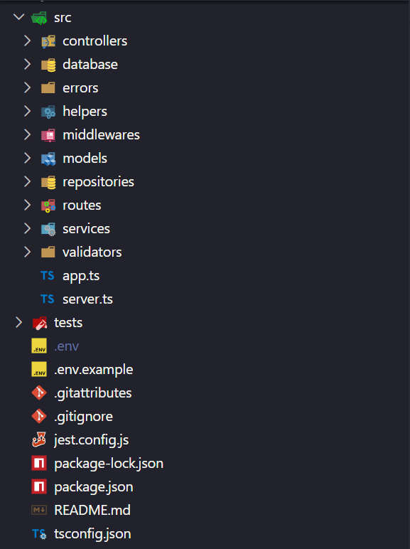<br>
      <sup>Fonte: Elaborado pelos autores (2026).</sup>
</div>

<div align="center">
  <sub>Figura 59 - Arquivo supabaseClient.ts</sub><br>
    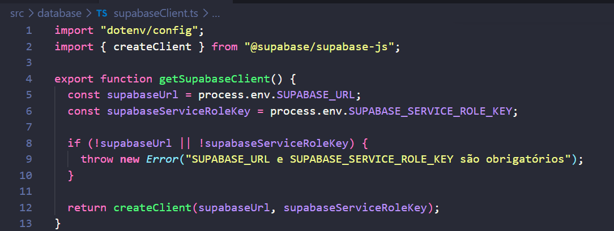<br>
      <sup>Fonte: Elaborado pelos autores (2026).</sup>
</div>

**- Configuração do ambiente e gestão de dependências:** o arquivo `package.json` foi estruturado contendo as dependências de produção e de desenvolvimento, além de scripts padronizados de execução (`dev`, `build`, `start`, `test`, `test:e2e`, `test:unit`, `test:integration`), garantindo que qualquer membro da equipe consiga rodar o projeto e os testes de forma consistente. Foi configurado também o arquivo `.env` para gerenciamento seguro de variáveis sensíveis (URL e chave do Supabase, porta da aplicação, ambiente de execução), com um `.env.example` versionado no repositório para servir de referência, mantendo o arquivo real fora do controle de versão via `.gitignore`. Essa estrutura padroniza o setup local, evita o vazamento de credenciais e prepara o projeto para deploy em diferentes ambientes (desenvolvimento, teste e produção).

<div align="center">
  <sub>Figura 60 - Arquivo Package.json</sub><br>
    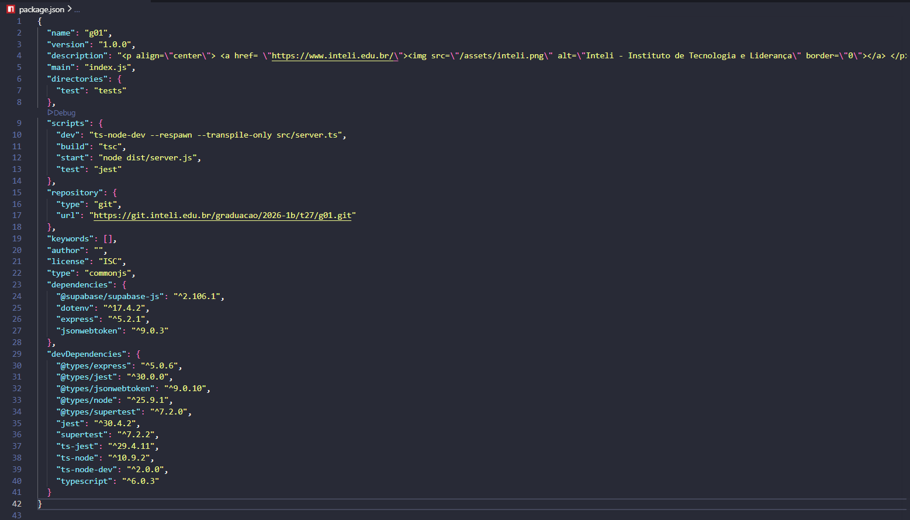<br>
      <sup>Fonte: Elaborado pelos autores (2026).</sup>
</div>

<div align="center">
  <sub>Figura 61 - Representação do .env</sub><br>
    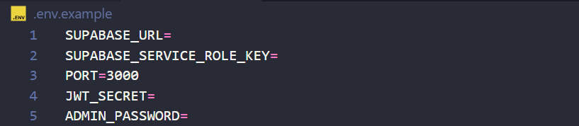<br>
      <sup>Fonte: Elaborado pelos autores (2026).</sup>
</div>

**- Infraestrutura base:** servidor Express configurado, integração com Supabase, sistema de erros customizados (`ValidationError`, `NotFoundError`, `ConflictError`, `UnprocessableError`), middleware centralizado de tratamento de erros e helper `asyncHandler` para padronização do fluxo assíncrono.

<div align="center">
  <sub>Figura 62 - Arquivo AppError.ts</sub><br>
    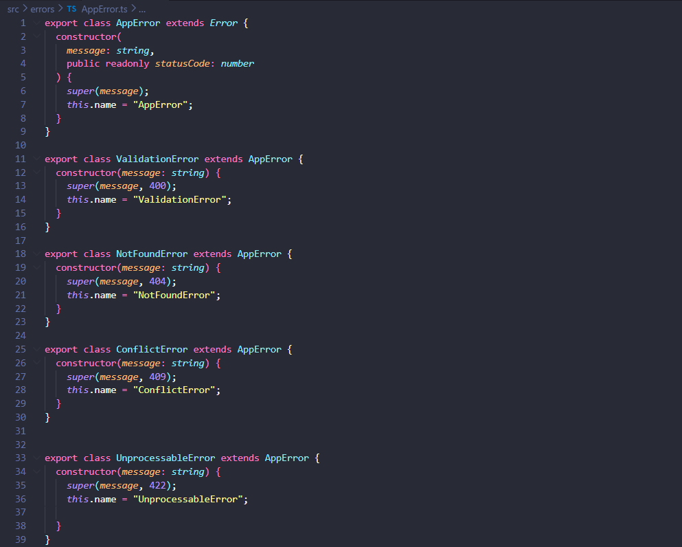<br>
      <sup>Fonte: Elaborado pelos autores (2026).</sup>
</div>

**- Módulo de Competições (RF002, RF012):** CRUD completo com endpoint adicional de encerramento (`PATCH`), validação dos campos obrigatórios (nome, data e local — RN18) e controle de status da competição (não iniciada / em andamento / encerrada), garantindo o bloqueio de novos registros após o encerramento.

**- Módulo de Equipes (RF003):** CRUD completo com rotas aninhadas sob competição, refletindo a hierarquia do domínio.

**- Módulo de Atletas (RF003):** CRUD completo com rotas aninhadas sob equipe, limite de 16 atletas por equipe (RN17), validação de CPF, unicidade de CPF e e-mail, controle de status (corredor/capitão) e proteção contra remoção de atletas com checkpoints vinculados.

**- Módulo de Checkpoints (RF005 a RF009):** CRUD completo sob rota aninhada de atleta, contemplando tanto o fluxo manual quanto o fluxo via OCR, com persistência dos campos obrigatórios definidos pela RN04 (distância, pace e tempo total) e log de auditoria registrando o método de entrada (OCR ou manual) conforme RN05.

**- Módulo de Rankings (RF010, RF011, RF015):** endpoints de leitura agregada para o painel administrativo e para o painel público, calculando distância total por equipe, pace médio, atleta em corrida e próximo atleta da escalação, com atualização periódica via polling.

**- Módulo de Reports (RF013, RF014):** endpoints de relatório consolidado da competição, relatório por equipe e exportação CSV contendo checkpoints, timestamps e logs de validação, incluindo o relatório de inconsistências derivado do log de auditoria.

**- Módulo de Autenticação (RF001, RF004, RN03):** controle de acesso por sala administrativa via senha definida na criação da sala, com escopo limitado à área administrativa e mantendo o acesso público sem autenticação para o painel da equipe via UUID (US12).

**- Protótipo de alta fidelidade de todas as telas finalizado:** o design system, os fluxos de navegação e o layout completo das interfaces administrativas e públicas estão concluídos no Figma, contemplando todas as telas previstas no escopo (painel administrativo, gestão de equipes e atletas, painel operacional da competição, captura e validação OCR, registro manual de checkpoint, tabela consolidada da equipe, relatórios e painel público acessado via UUID). Essa entrega serve de base direta para a implementação do front-end funcional na sprint 4.

Para mais informações acesse a [Seção 3.5 — Protótipo de alta fidelidade](#prototipo-alta-fidelidade)


**- Protótipo do OCR finalizado:** o fluxo de captura, extração e validação dos dados da esteira já está validado em protótipo funcional, com o funcionamento end-to-end definido (captura da imagem → processamento no back-end → persistência dos campos extraídos → validação humana). A solução será integrada ao servidor para garantir a persistência de logs de extração e auditoria (RN05), permitindo que o administrador revise registros e trate discrepâncias (RN06) diretamente via API. O comportamento atual está alinhado com os critérios de aceite da US09, restando a implementação das rotas de extração no back-end e a integração refinada com o módulo de Checkpoints na sprint 4.

<div align="center">
  <sub>Figura 63 - Adicionar imagem</sub><br>
    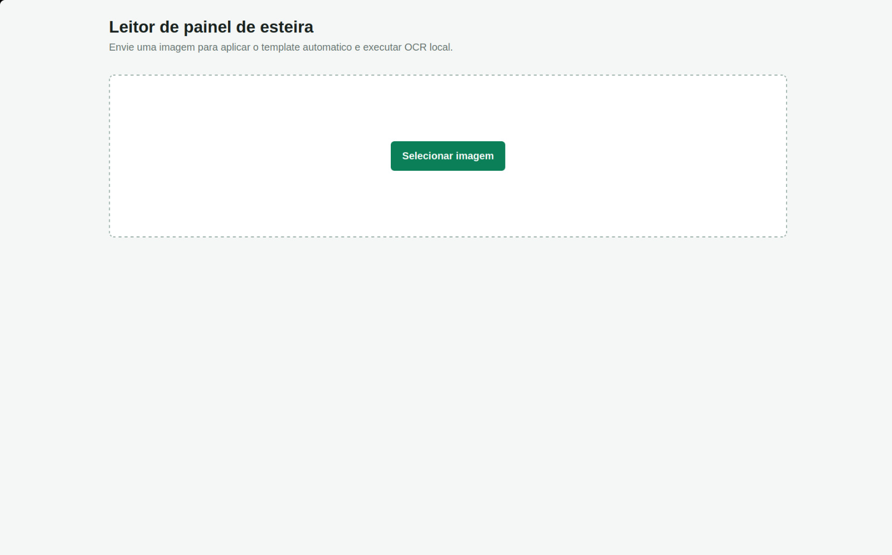<br>
      <sup>Fonte: Elaborado pelos autores (2026).</sup>
</div>

<div align="center">
  <sub>Figura 64 - Leitura da imagem</sub><br>
    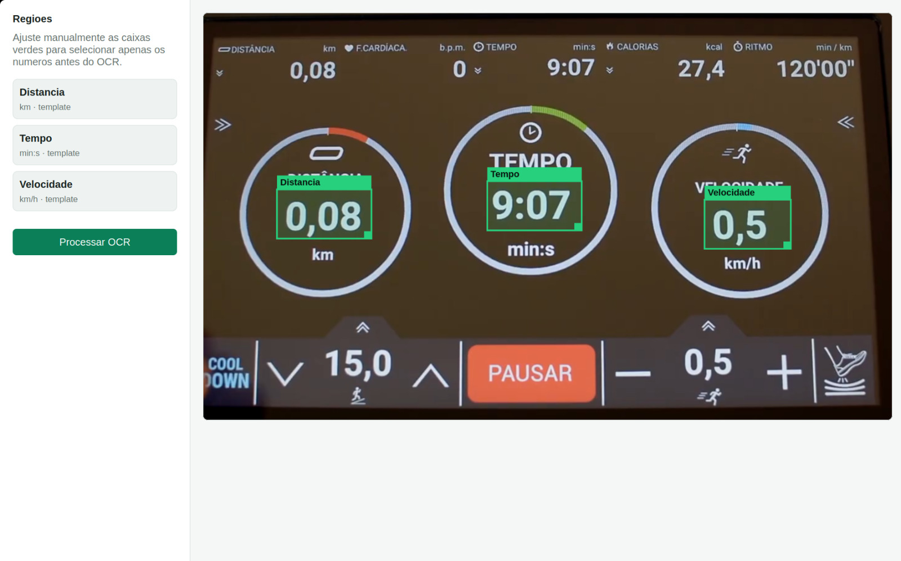<br>
      <sup>Fonte: Elaborado pelos autores (2026).</sup>
</div>

<div align="center">
  <sub>Figura 65 - Registro das informações</sub><br>
    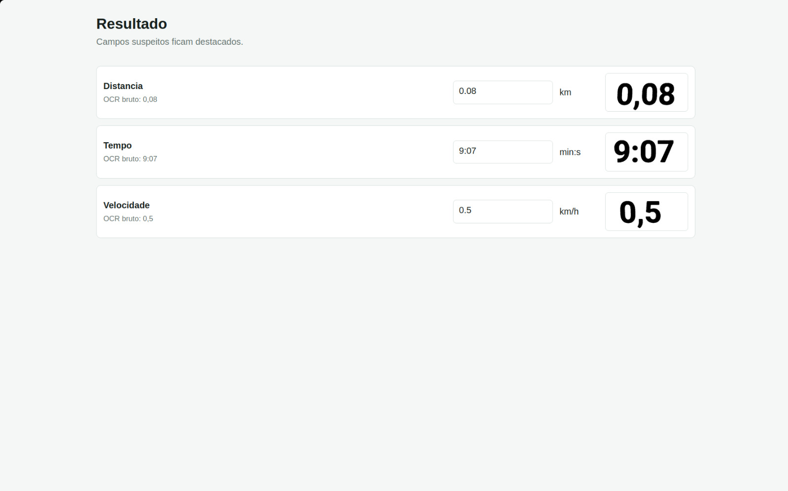<br>
      <sup>Fonte: Elaborado pelos autores (2026).</sup>
</div>

**- Desenvolvimento orientado a testes (TDD) em todos os módulos:** a equipe adotou a prática de **Test-Driven Development** durante toda a sprint, escrevendo primeiro os testes com **Jest** e **Supertest** para cada funcionalidade planejada, executando-os para confirmar que falhavam como esperado (fase *red* do ciclo) e somente então implementando os endpoints, services e repositories necessários para fazê-los passar (fase *green*), seguida da refatoração quando aplicável (fase *refactor*). Essa abordagem foi aplicada nos três níveis de teste — E2E, unitário e integração — garantindo que toda regra de negócio e contrato de API entregue na sprint nasceu a partir de um teste falho e, portanto, possui cobertura automatizada associada desde o primeiro commit.

<div align="center">
  <sub>Figura 66 - Testes jest e supertest</sub><br>
    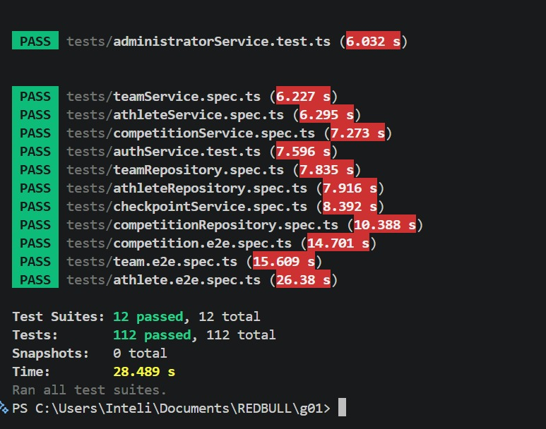<br>
      <sup>Fonte: Elaborado pelos autores (2026).</sup>
</div>


### (b) O que não foi concluído

**- Refinamento do OCR:** apesar do protótipo estar finalizado e do fluxo estar definido, ainda é necessário aprimorar a precisão da captura das informações da imagem (distância, pace e tempo total), tratar variações de iluminação e posicionamento do display da esteira, ajustar o limiar de discrepância para acionamento dos alertas visuais (RN06) e refinar detalhes de integração para entregar o módulo em nível de MVP funcional.

**- Front-end funcional integrado:** entregue até o momento apenas o protótipo de alta fidelidade; a integração com o back-end será iniciada na sprint 4.

### (c) Dificuldades técnicas

**- Estruturação de rotas aninhadas respeitando o escopo do recurso pai**, garantindo que operações sobre atletas estejam sempre vinculadas a uma equipe válida, operações sobre equipes vinculadas a uma competição válida e operações sobre checkpoints vinculadas a um atleta válido.

**- Ambiente de testes E2E com banco real evitando colisão de dados únicos entre execuções** — mitigado parcialmente com geração de dados aleatórios por run; solução definitiva (uso de prefixos ou IDs descartáveis padronizados) prevista para a sprint 4.

### (d) Próximos passos

Com base no que já foi entregue na sprint 3 e considerando o que o TAP estabelece como prioritário para o MVP, o foco da sprint 4 será **integrar o front-end ao back-end já existente e refinar os fluxos críticos da operação** durante as 24 horas do evento. As frentes de trabalho previstas são:

**1. Front-end funcional integrado ao back-end**
Migração do protótipo de alta fidelidade para uma aplicação funcional consumindo a API já implementada, com foco nas telas críticas para a operação do evento: painel operacional administrativo, captura e validação OCR, registro manual de checkpoint, tabela consolidada da equipe com auto-refresh, relatórios e painel público acessado via UUID sem autenticação (US12). A UX deve seguir os wireframes já validados na sprint 2, priorizando uso em iPad conforme escopo do TAP.

**2. Refinamento do módulo de OCR**
Aprimoramento da precisão de extração dos dados da imagem, tratamento de variações de iluminação e posicionamento do display da esteira, ajuste do limiar de discrepância para acionamento dos alertas visuais (RN06) e validação prática com imagens reais do ambiente operacional. O objetivo é elevar o OCR ao nível de MVP funcional, aderente aos critérios de aceite da US09.

**3. Registro das rotas do módulo de Usuários**
Conclusão do módulo já iniciado na sprint 3 (model, repository e service), registrando as rotas no Express e completando a cadeia da arquitetura em camadas.

**4. Testes automatizados e Matriz de Rastreabilidade**
Manutenção da abordagem de TDD para todas as novas funcionalidades, expandindo a cobertura para o front-end conforme aplicável e reforçando os testes dos módulos consolidados na sprint 3. Em paralelo, preenchimento da RTM (seção 3.9), conectando persona → RF → RN → endpoint → tela → teste → evidência, sem lacunas nos fluxos centrais a partir desta sprint, conforme exigido pelo template.

**5. Dívida técnica identificada na sprint 3**
Avaliação da centralização do tratamento de erros de constraint do PostgreSQL (códigos 23505 e 23503) em um helper único, evitando a repetição desse padrão entre repositories, e adoção de prefixos ou IDs descartáveis no ambiente de testes E2E para eliminar a colisão de dados únicos entre execuções.

## 4.2. Segunda versão da aplicação web 

### (a) O que foi implementado

Nesta sprint foi iniciada a camada de front-end da aplicação, migrando do protótipo de alta fidelidade para interfaces funcionais integradas ao back-end já existente. A stack adotada foi EJS + Express + express-ejs-layouts, mantendo o servidor Node.js como único processo e servindo as views por SSR (Server-Side Rendering), sem a necessidade de um framework front-end separado.

**- Estrutura de pastas do front-end:** Infraestrutura de views e layout base: o motor de templates EJS foi configurado no app.ts, com express-ejs-layouts gerenciando um layout mestre (src/views/layouts/main.ejs) que injeta a sidebar de navegação e o wrapper de conteúdo em todas as telas autenticadas. Os assets estáticos (CSS, imagens e JavaScript) são servidos diretamente da pasta public/. Essa estrutura centraliza a identidade visual e evita duplicação de marcação entre as views.

<div align="center"> <sub>Figura 67 — Estrutura de views EJS</sub><br> 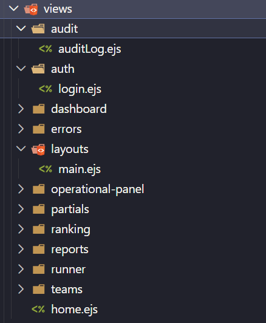<br> <sup>Fonte: Elaborado pelos autores (2026).</sup> </div>

**- Sistema de design modular (CSS):** As folhas de estilo foram organizadas em módulos independentes — variables.css (design tokens de cor, tipografia e espaçamento alinhados ao protótipo de alta fidelidade), garantindo consistência visual e facilitando a manutenção e expansão para as telas restantes.

<div align="center"> <sub>Figura 68 — Estrutura de pastas do CSS</sub><br> 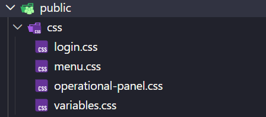<br> <sup>Fonte: Elaborado pelos autores (2026).</sup> </div>

**- Tela de login funcional (RF004, RN02, RN03):** Nesta sprint, reconheceu-se a necessidade de criar o protótipo de alta fidelidade da tela de login dos auditores, que não havia sido desenvolvido na sprint 3. A view auth/login.ejs foi implementada com formulário completo de autenticação, integrado ao endpoint POST /admin/login. Ao submeter, o app.js consome a API via fetch, persiste o accessToken retornado no sessionStorage e redireciona para /dashboard. Erros de autenticação são exibidos inline, sem recarregamento de página. A tela inclui toggle de visibilidade da senha e não depende do layout base (renderizada sem sidebar).

<div align="center"> <sub>Figura 69 — Tela de login</sub><br> 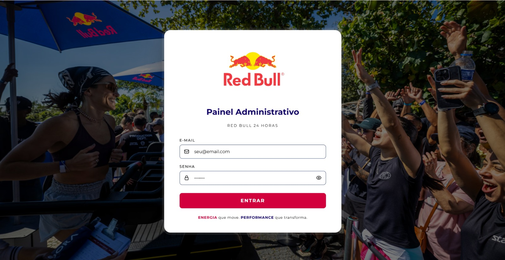<br> <sup>Fonte: Elaborado pelos autores (2026).</sup> </div>

**- Endpoint de compatibilidade POST /admin/login:** Além da rota de API POST /auth/sessions já existente na sprint 3, foi adicionada a rota POST /admin/login em authRoutes.ts como ponto de entrada esperado pelo front-end, mapeada para o mesmo authController.createSession. A rota GET /admin/login renderiza a view SSR, e GET /logout limpa a sessão e redireciona para login.

**- Sidebar de navegação persistente:** O partial partials/menu.ejs, incluído no layout base, renderiza a barra lateral com os links para todas as telas. O app.js ativa dinamicamente o item correspondente à rota atual via comparação com window.location.pathname, seguindo o comportamento definido no protótipo de alta fidelidade.

<div align="center"> <sub>Figura 70 — Arquivo menu.ejs </sub><br> 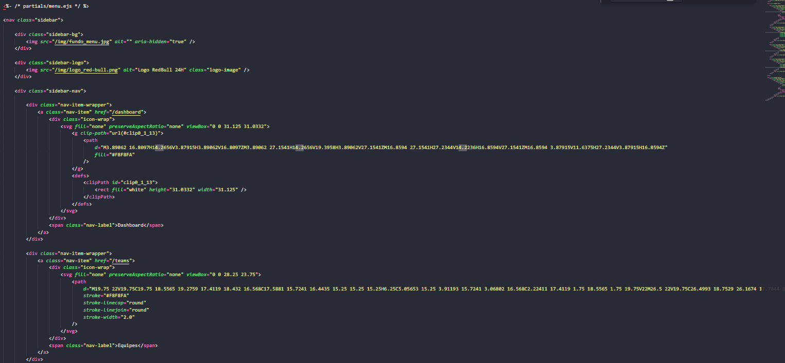<br> <sup>Fonte: Elaborado pelos autores (2026).</sup> </div>

<div align="center"> <sub>Figura 71 — Arquivo menu.ejs</sub><br> 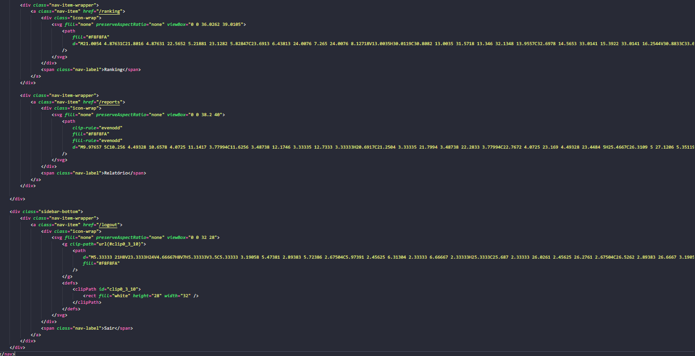<br> <sup>Fonte: Elaborado pelos autores (2026).</sup> </div>

**- Registro de checkpoint e atualização de ranking (RF008, RN04, RN05):** Foi implementado o fluxo de registro manual de checkpoint, conectado diretamente ao endpoint POST /checkpoints. O formulário coleta distância (km), pace e tempo total, valida os campos obrigatórios no cliente antes do envio e exibe feedback em tempo real (loading, sucesso e erro). Após um registro bem-sucedido, o painel dispara automaticamente uma consulta ao endpoint GET /competitions/:id/ranking/teams para atualizar o ranking sem recarregamento da página.

<div align="center"> <sub>Figura 72 — Painel operacional: registro manual de checkpoint</sub><br> 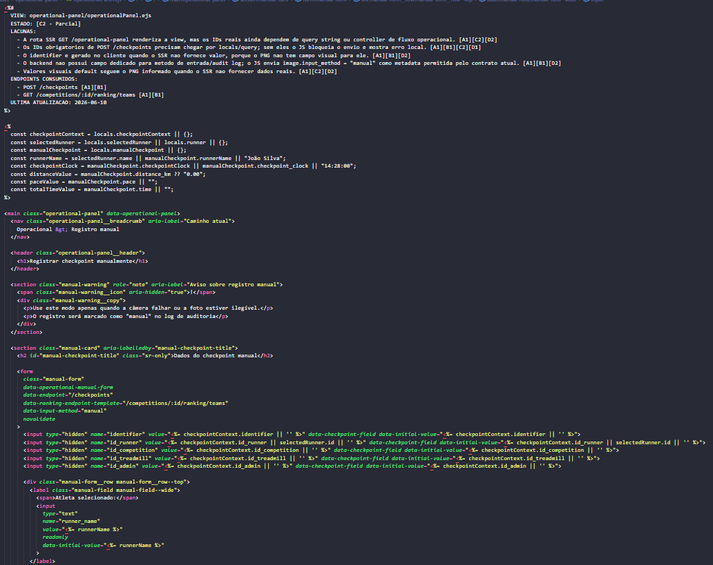<br> <sup>Fonte: Elaborado pelos autores (2026).</sup> </div>

<div align="center"> <sub>Figura 73 — Painel operacional: registro manual de checkpoint</sub><br> 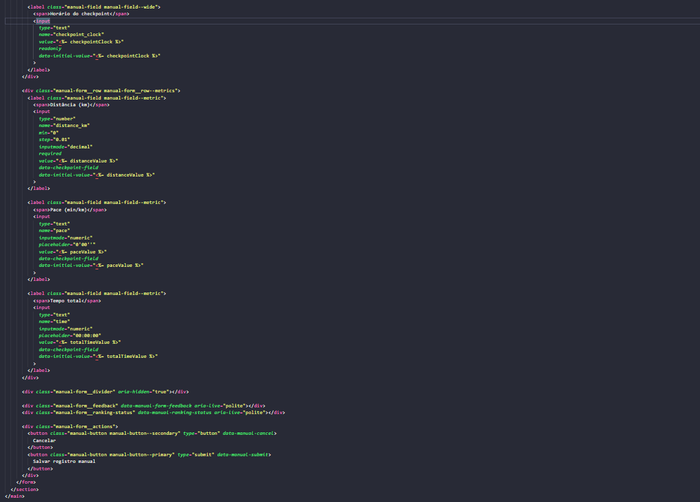<br> <sup>Fonte: Elaborado pelos autores (2026).</sup> </div>

**- Evolução do módulo de OCR:** além do protótipo inicial, foram implementadas melhorias significativas na robustez da extração. A principal entrega foi a detecção automática das regiões de interesse do display da esteira, permitindo que o sistema localize e segmente os campos de distância, pace e tempo total independentemente de variações de tamanho, ângulo ou iluminação da imagem capturada. Em paralelo, o banco de imagens de referência foi expandido para cobrir mais cenários reais do ambiente operacional, funcionando como base de testes e adaptação iterativa para aumentar a precisão da extração em condições adversas.

### (b) O que não foi concluído

**Integração do OCR com o front-end e o back-end:** Apesar dos avanços na precisão e robustez da extração, o módulo de OCR ainda opera de forma isolada. A implementação da interface de captura no front-end e a integração com o endpoint de checkpoints no back-end — fechando o fluxo completo de captura → extração → validação humana → persistência — estão previstas para a sprint 5.

**Funcionamento da calculadora de descanso:** A calculadora de descanso, apesar de implementada, ainda carece de contas complexas que partem de consultas específicas no histórico de cada atleta e seus checkpoints. Não foi possível ajustar perfeitamente esse funcionamento durante a sprint 4.

**Padronização do WAD:** Apesar de boa parte da sprint 4 ter sido voltada à padronização de nomenclatura e seções do wad, ainda sim a seção de modelagem do banco de dados permaneceu desatualizada em relação à situação atual do projeto, carecendo de duas entidades (ocr_extraction e competition_report) e um atributo (started_at em competitions).

### (c) Dificuldades técnicas

**- Padronização de nomenclatura entre modelagem, banco de dados e código:** Desde o início do módulo, a modelagem de dados foi desenvolvida com entidades e atributos em português (ex.: corredor, equipe, checkpoint), enquanto o código da aplicação utilizava entidades em inglês (runner, team) e atributos em português. Essa inconsistência acumulada ao longo das sprints anteriores exigiu, nesta sprint, uma decisão de padronização global e a refatoração coordenada de todos os artefatos afetados: modelos TypeScript, repositories, controllers, rotas, testes, banco de dados e as seções correspondentes do WAD. O volume de alterações simultâneas e o risco de regressão tornaram essa tarefa uma das mais custosas da sprint, exigindo atenção redobrada para garantir que nenhum contrato de API fosse quebrado durante a migração.

**- Compatibilidade entre rotas SSR e rotas de API no mesmo servidor Express:** O registro da rota GET /admin/login precisou ser gerenciado com atenção à ordem de declaração em relação à rota genérica GET /admin/:id já existente — registrar as rotas específicas antes das parametrizadas evitou colisões de roteamento.

**- Propagação de contexto operacional para o painel de checkpoint manual:** Os campos obrigatórios do payload (`id_runner`, `id_competition` e `id_admin`) precisam chegar à view via locals do SSR ou query string, pois a tela não tem estado próprio para buscá-los. Sem esses dados, o formulário bloqueia o envio com erro de contexto faltante — o fluxo completo depende de uma tela anterior que selecione o atleta e passe o contexto.


### (d) Próximos passos

**1. Refinamento do OCR:** Aprimoramento da integração entre a captura da foto da esteira, o `OcrService`, o endpoint `POST /ocr/extractions` e o fluxo de conferência humana antes da persistência, finalizando o ciclo RF005–RF007.

**2. Calculadora de descanso e gráfico de performance do atleta:** Revisão da lógica de cálculo do tempo estimado de descanso e da alimentação de dados do gráfico de evolução na tela do atleta. A complexidade dos cálculos de agregação sobre o histórico de checkpoints e a renderização do gráfico sugerem a adoção de uma biblioteca de visualização (como Chart.js ou similar) para garantir precisão, responsividade e manutenibilidade adequadas.

**3. Painel de TV para acompanhamento ao vivo da competição:** Desenvolvimento de uma tela dedicada para exibição em monitores e TVs durante o evento, com atualização automática em tempo real. O painel consolidará as métricas agregadas da competição em andamento: pace médio geral, tempo total de prova decorrido, quilometragem total percorrida por todas as equipes e indicadores de destaque por equipe. A interface deve ser projetada para leitura a distância — fonte grande, alto contraste e layout limpo — dispensando qualquer interação do operador após o carregamento. O acesso deve ser público, sem autenticação, seguindo o mesmo padrão do painel da equipe via UUID (US12).

**4. Exportação de resultados em CSV:** Implementação do endpoint de exportação e da interface de acionamento para geração do arquivo CSV consolidado ao encerramento da competição. O arquivo deverá conter o desempenho de cada equipe (distância total, pace médio, tempo de prova) e os dados individuais de cada atleta (checkpoints registrados, método de entrada de cada registro, tempo parcial e total). Essa entrega finaliza o fluxo de RF013 e RF014 e é crítica para a apuração oficial do evento, pois substitui definitivamente a planilha manual que a equipe da Red Bull utiliza hoje.

**5. Log de auditoria completo:** Finalização da tela de log de auditoria (audit/auditLog.ejs), exibindo o histórico detalhado de cada checkpoint registrado: qual administrador ou operador de prova realizou o registro, o método utilizado (manual ou OCR), o timestamp exato e os valores capturados. A rastreabilidade por método de entrada já é persistida pelo back-end desde a sprint 3 (RN05), restando apenas expor esses dados em uma interface navegável e filtrável, permitindo que o gerente de Field Marketing audite qualquer registro durante ou após a competição.


## 4.3. Versão final da aplicação web 

### (a) O que foi refinado ou adicionado desde a sprint 4

Nesta sprint final, o foco esteve na entrega da camada de autenticação/autorização, no fechamento dos fluxos operacionais críticos para o evento — como a captura por OCR — e na estabilização geral do sistema. Também foram desenvolvidos os templates para a divulgação do evento após a competição e realizados testes com pessoas reais para validar o fluxo do sistema, consolidando a versão final da aplicação.


**Camada de Autenticação e Autorização (RF001, RF004, RN03):** Implementação completa do controle de acesso à área administrativa, com login de administrador, persistência de senha por meio de hash (sem armazenamento em texto plano), criação e controle de sessão e verificação de autorização por rota no backend. O acesso público ao painel da equipe via UUID foi preservado sem autenticação (US12), mantendo a separação entre área privada de operação e área pública de acompanhamento. O detalhamento técnico do fluxo está descrito na [Seção 3.8 — Autenticação, Autorização e Resiliência](#38).

<div align="center"> <sub>Figura 73 — Frontend da tela login negando acesso</sub><br> 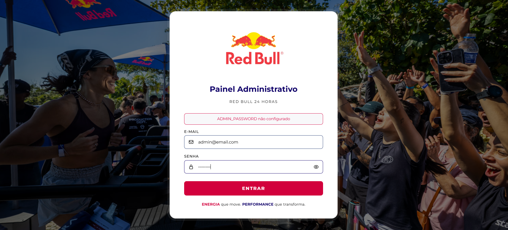<br> <sup>Fonte: Elaborado pelos autores (2026).</sup> </div>

<div align="center"> <sub>Figura 73 — Camada service de autenticação</sub><br> 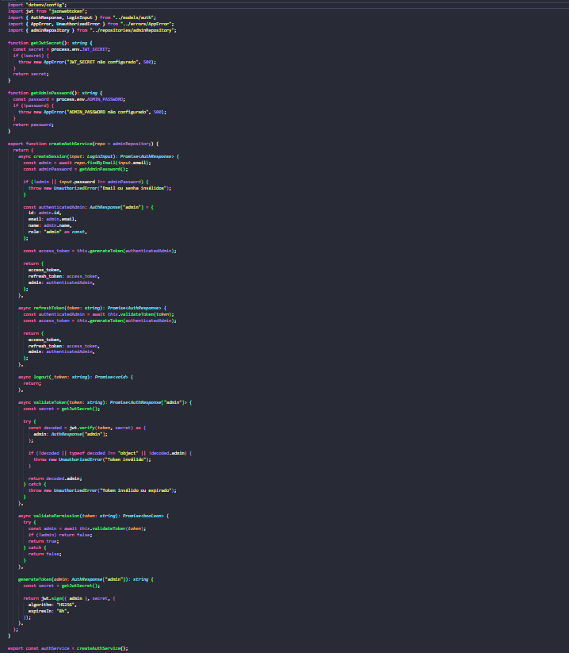<br> <sup>Fonte: Elaborado pelos autores (2026).</sup> </div>


**Integração final do módulo de OCR:** conclusão do ciclo completo de captura → extração → conferência humana → persistência (RF005–RF007). O frontend de captura foi desenvolvido e integrado ao backend, e a precisão da extração dos campos foi reforçada com o apoio da API da Groq como camada de validação inteligente. Diferentemente de um OCR puramente textual, o modelo multimodal utilizado (Llama 4 Scout) recebe a própria imagem da esteira como fonte principal e o texto extraído pelo Tesseract.js apenas como apoio, retornando os campos de distância (km) e tempo de forma estruturada. Essa camada complementa o pipeline OpenCV + Tesseract.js já existente e aumenta a confiabilidade da leitura em condições adversas de imagem (variações de iluminação, ângulo e foco do display).

<div align="center"> <sub>Figura 73 — Frontend OCR parte 1</sub><br> 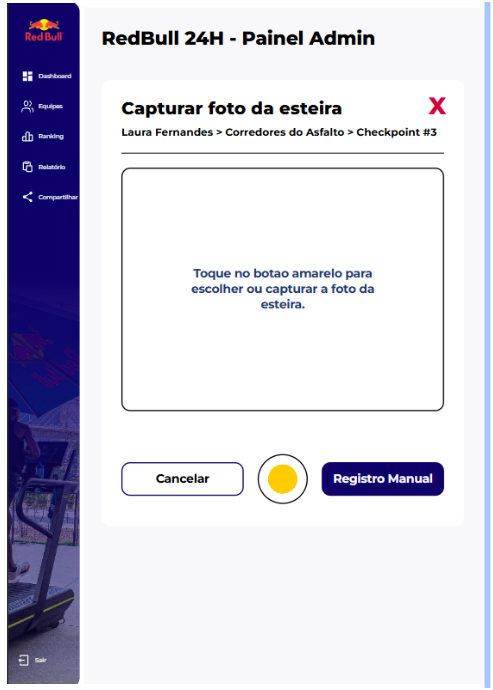<br> <sup>Fonte: Elaborado pelos autores (2026).</sup> </div>

<div align="center"> <sub>Figura 73 — Frontend OCR parte 2</sub><br> 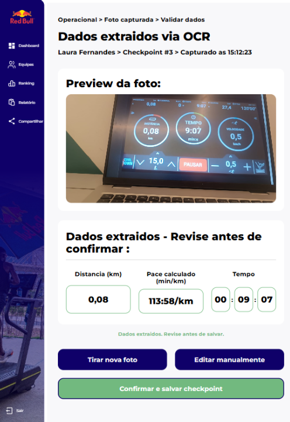<br> <sup>Fonte: Elaborado pelos autores (2026).</sup> </div>

<div align="center"> <sub>Figura 73 — Camada service referente à API do Groq</sub><br> 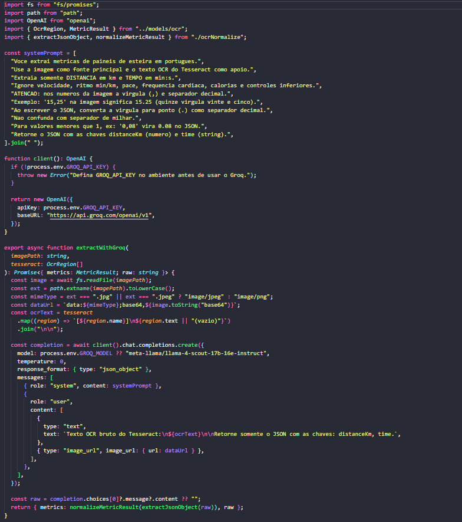<br> <sup>Fonte: Elaborado pelos autores (2026).</sup> </div>

<div align="center"> <sub>Figura 73 — Camada service referente ao OCR</sub><br> 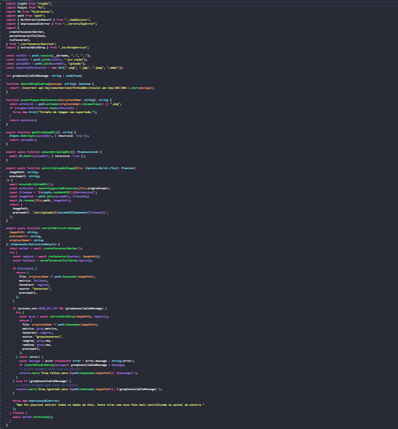<br> <sup>Fonte: Elaborado pelos autores (2026).</sup> </div>


**Painel de TV para acompanhamento ao vivo (US12):** entrega de protótipo, backend e frontend da tela dedicada à exibição em monitores durante o evento, com atualização automática e consolidação das métricas agregadas da competição (pace médio geral, tempo de prova decorrido, quilometragem total e destaques por equipe). A interface foi projetada para leitura a distância, com fonte ampliada e alto contraste, e acesso público sem autenticação.

Para visualizar o protótipo da Tela TV acesse [Seção 3.5 — Protótipo de alta fidelidade](#prototipo-alta-fidelidade)

<div align="center"> <sub>Figura 73 — Camada routes referente ao Painel TV</sub><br> 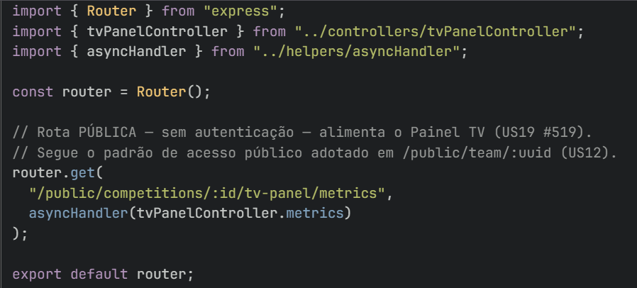<br> <sup>Fonte: Elaborado pelos autores (2026).</sup> </div>


**Telas para Instagram:** entrega de protótipo, backend e frontend das telas voltadas à geração de conteúdo para divulgação nas redes sociais do evento, permitindo o compartilhamento de resultados e destaques da competição em formato adequado à plataforma.

Para visualizar o protótipo dos templates de instagram acesse [Seção 3.5 — Protótipo de alta fidelidade](#prototipo-alta-fidelidade)


**Tela de auditoria (RN05):** finalização da interface de log de auditoria, exibindo o histórico detalhado de cada checkpoint — administrador ou operador responsável pelo registro, método utilizado (manual ou OCR), timestamp exato e valores capturados. A rastreabilidade por método de entrada, já persistida pelo backend desde a sprint 3, passou a ser exposta em uma interface navegável e filtrável para auditoria durante e após a competição.

<div align="center"> <sub>Figura 73 — Frontend da tela com log de auditoria</sub><br> 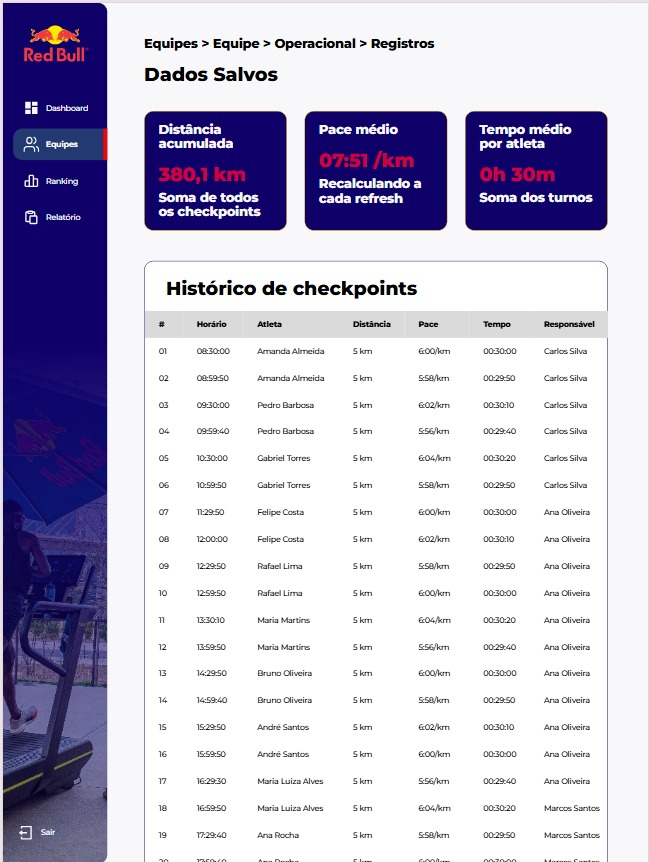<br> <sup>Fonte: Elaborado pelos autores (2026).</sup> </div>


**Exportação de resultados em XLSX (RF013, RF014):** implementação do endpoint e da interface de acionamento para geração do arquivo XLSX consolidado ao encerramento da competição, contendo o desempenho de cada equipe (distância total, pace médio, tempo de prova) e os dados individuais de cada atleta (checkpoints, método de entrada, tempos parcial e total). Essa entrega substitui definitivamente a planilha manual utilizada hoje pela equipe da Red Bull na apuração oficial.


<div align="center"> <sub>Figura 73 — View da tabela de informações exportada (atletas)</sub><br> 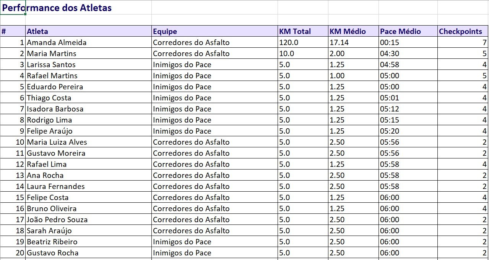<br> <sup>Fonte: Elaborado pelos autores (2026).</sup> </div>

<div align="center"> <sub>Figura 73 — View da tabela de informações exportada (checkpoints)</sub><br> 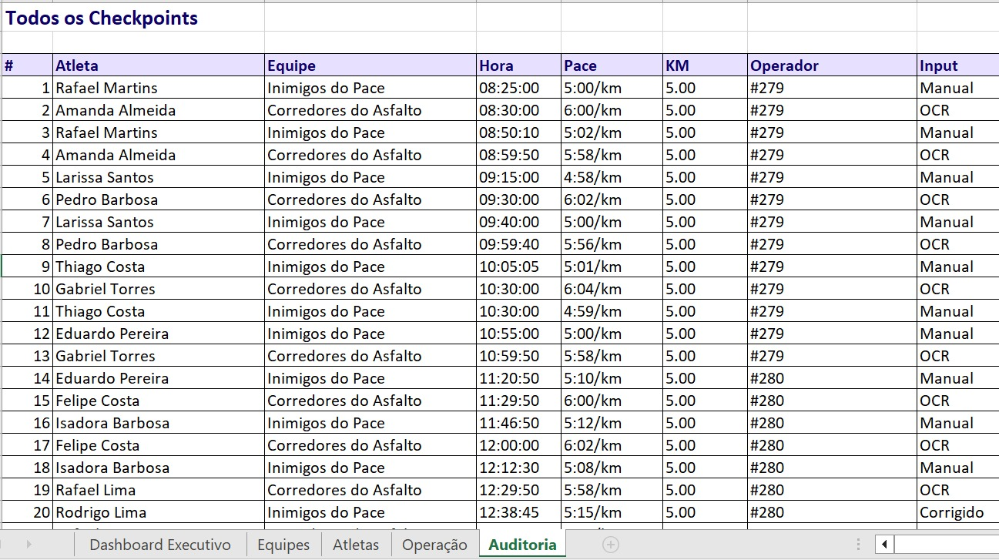<br> <sup>Fonte: Elaborado pelos autores (2026).</sup> </div>

<div align="center"> <sub>Figura 73 — Camada controller referente à exportação em XLSX</sub><br> 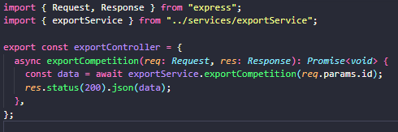<br> <sup>Fonte: Elaborado pelos autores (2026).</sup> </div>

<div align="center"> <sub>Figura 73 — Camada service referente à exportação em XLSX</sub><br> 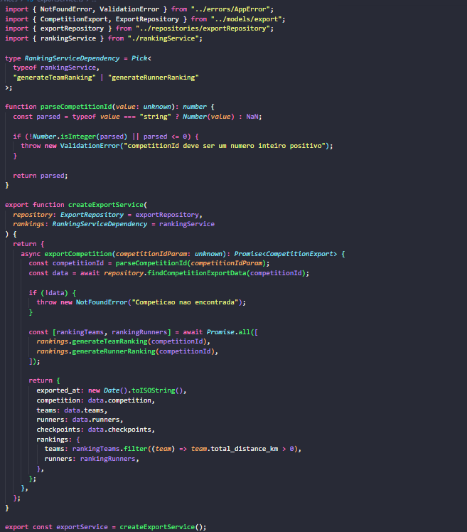<br> <sup>Fonte: Elaborado pelos autores (2026).</sup> </div>


**Aviso de inconsistência (RN06):** implementação do alerta visual acionado quando há divergência entre os dados capturados via OCR e os valores esperados/corrigidos manualmente, reforçando a confiabilidade do processo de validação humana antes da persistência.

<div align="center"> <sub>Figura 73 — View aviso de inconsistência</sub><br> 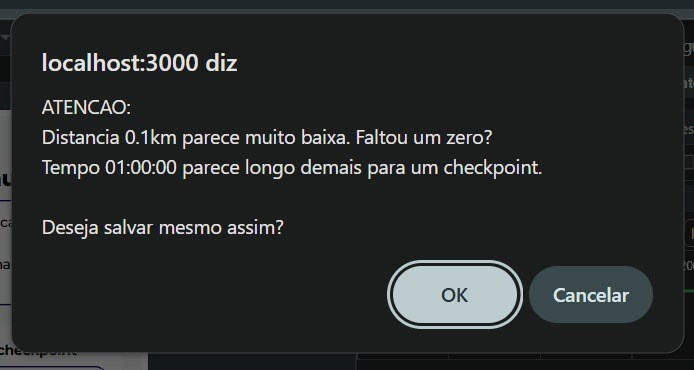<br> <sup>Fonte: Elaborado pelos autores (2026).</sup> </div>


**Calculadora de descanso:** conclusão da lógica de cálculo do tempo estimado de descanso e da alimentação do gráfico de evolução na tela do atleta, pendências herdadas da sprint 4, agora finalizadas.

<div align="center"> <sub>Figura 73 — Frontend da calculadora de descanso funcionando</sub><br> 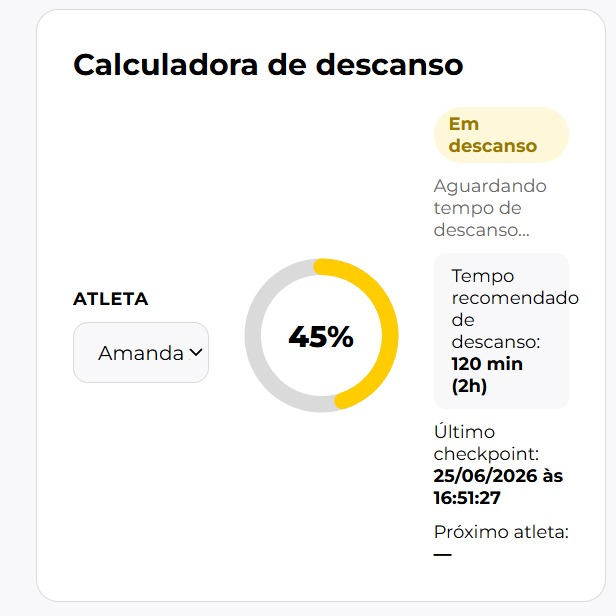<br> <sup>Fonte: Elaborado pelos autores (2026).</sup> </div>

**Estabilização da suíte de testes:** consolidação e estabilização da suíte automatizada (E2E, unitário e integração), eliminando as colisões de dados únicos entre execuções identificadas como dívida técnica nas sprints anteriores e garantindo execução consistente e repetível.


**Testes de usabilidade:** realização dos testes de usabilidade com usuários, cujos relatórios e resultados estão documentados na [Seção 5.2 — Testes de usabilidade](#52), fornecendo evidências para os ajustes finais de interface.


### (b) Pendências remanescentes
Todas as funcionalidades previstas no MVP definido pelo TAP foram entregues e todas as pendências herdadas da sprint 4, como a calculadora de descanso e refinamento do OCR, foram concluídas nesta sprint. As pendências remanescentes restringem-se a itens fora do escopo do MVP e a melhorias incrementais:

**Refinamentos de UX apontados nos testes de usabilidade:** ajustes pontuais de interface identificados durante os testes com usuários, pouco intuitivas ou sem funcionalidade direta com o escopo do projeto, registrados como melhorias futuras na [Seção 7 — Conclusões e trabalhos futuros](#c7).


**Evolução contínua do OCR:** embora o módulo esteja integrado e funcional, a precisão da extração pode ser continuamente aprimorada com a expansão do banco de imagens de referência e novos cenários de teste do ambiente real do evento.

### (c) Dificuldades técnicas

**Persistência segura de credenciais e controle de sessão:** a implementação da autenticação exigiu atenção à escolha e parametrização do algoritmo de hash, ao armazenamento seguro da sessão e à garantia de que a verificação de autorização ocorresse sempre no backend, nunca confiando no frontend como fonte de verdade. O equilíbrio entre segurança e a restrição do TAP — que não previa autenticação de usuários no escopo original — exigiu manter o login restrito à área administrativa, preservando o acesso público por UUID.

**Integração de uma camada externa multimodal (API da Groq) ao pipeline de OCR:** combinar o processamento local existente (OpenCV + Tesseract.js) com uma chamada externa a um modelo de visão exigiu tratar latência de rede, fluxo de fallback (garantindo que a extração não dependesse exclusivamente do serviço externo), normalização das respostas, incluindo a conversão do separador decimal de vírgula para ponto, e a consolidação dos resultados das duas fontes, assegurando que a extração permanecesse confiável mesmo diante de variações de imagem.

**Estabilização da suíte de testes em ambiente com banco real:** a eliminação definitiva das colisões de dados únicos entre execuções, arrastada desde a sprint 3, demandou padronizar a geração de dados descartáveis por execução e isolar o estado entre os testes, assegurando que a suíte completa rodasse de forma determinística.

# <a name="c5"></a>5. Testes

## 5.1. Relatório de testes de integração de endpoints automatizados 

### 5.1.1 Estratégia de Testes

#### Nomenclatura dos Arquivos de Teste

Os arquivos de teste seguem a nomenclatura abaixo:

- `*.service.test.ts` ou `*.service.spec.ts` — Testes unitários de Service (white-box)
- `*.e2e.spec.ts` — Testes de integração de endpoints (black-box) via Supertest
- `*Repository.spec.ts` — Testes de Repository (white-box, para lógicas não triviais de query)

Os arquivos de Service utilizam predominantemente `.spec.ts` (ex.: `competitionService.spec.ts`), com exceção de `authService.test.ts` e `adminService.test.ts` que usam `.test.ts`. A padronização de todos os arquivos de service para `*.service.test.ts` e os arquivos e2e para `*.integration.test.ts` ficou pendente para futura refatoração.

#### Separação por Camada

A estratégia de testes adotada no projeto foi estruturada de acordo com a arquitetura em camadas da aplicação, permitindo validar diferentes aspectos do sistema de forma organizada e independente. Para isso, os testes foram divididos conforme a responsabilidade de cada camada da aplicação.

A camada de **Service** é validada por meio de testes **white-box**, nos quais há conhecimento da implementação interna dos métodos testados. Essa abordagem permite verificar o comportamento da lógica de negócio e dos fluxos internos da aplicação de forma isolada.

A camada de **Controller e Rotas** é validada por meio de testes **black-box**, realizados com o auxílio da biblioteca **Supertest**. Nessa abordagem, a aplicação é tratada como uma caixa-preta, sendo avaliados apenas os comportamentos observáveis por meio das requisições HTTP e respostas retornadas pelos endpoints.

Quando necessário, a camada de **Repository** também pode ser validada separadamente, principalmente em situações que envolvam consultas ou operações de persistência com maior complexidade.

Todos os testes seguem o padrão **AAA (Arrange, Act, Assert)**. Inicialmente são preparados os dados e condições necessárias para o cenário de teste (*Arrange*), em seguida a funcionalidade é executada (*Act*) e, por fim, os resultados obtidos são comparados com os resultados esperados (*Assert*).

Além disso, os testes foram desenvolvidos de forma determinística, evitando dependências de ordem de execução, horário do sistema, serviços externos, acesso à rede ou dados residuais de execuções anteriores. Dessa forma, garante-se que uma mesma execução produza resultados consistentes independentemente do ambiente utilizado.


## 5.1.2  Testes Unitários de Service (white-box)

### Cobertura da Camada Service

A camada de Service foi estabilizada do ponto de vista funcional e de cobertura no recorte automatizado da seção 5.1. O comando `npm test -- --coverage` utiliza a configuração de cobertura do Jest para medir os módulos cobertos integralmente pela suíte documentada, com `coverageThreshold` global de 100% para statements, branches, functions e lines. Assim, a execução falha automaticamente caso qualquer métrica do recorte fique abaixo de 100%.

<div align="center">
  <sub>Quadro 26 - Cobertura da Camada Service </sub>
</div>

| Métrica | Cobertura atingida | Meta |
|---------|-------------------|------|
| Statements | 100% | 100% |
| Branches | 100% | 100% |
| Functions | 100% | 100% |
| Lines | 100% | 100% |

<div align="center">
  <sup>Fonte: Elaborado pelos autores (2026).</sup>
</div>

A meta foi atingida com 100% dos testes passando e 100% de cobertura no recorte medido pela suíte automatizada da seção 5.1.

### Mapeamento CT → RN — Testes Unitários de Service

<div align="center">
  <sub>Quadro 27 - Mapeamento CT → RN dos Testes Unitários de Service </sub>
</div>

| Caso de Teste (CT) | Arquivo de Teste | Regra de Negócio (RN) | Requisito Funcional (RF) | Descrição |
|--------------------|-----------------|------------------------|---------------------------|-----------|
| CT01 | authService.test.ts | RN03 | RF004 | Autenticação deve exigir senha do administrador |
| CT02 | adminService.test.ts | RN03 | RF004 | CRUD de administradores com controle de acesso |
| CT03 | competitionService.spec.ts | RN18, RN14 | RF002, RF012 | Criação de competição com dados obrigatórios e encerramento |
| CT04 | teamService.spec.ts | RN01 | RF003 | Criação de equipe com geração de UUID |
| CT05 | runnerService.spec.ts | RN07 | RF003 | Criação de atleta com validação de limite de 16 por equipe |
| CT06 | checkpointService.spec.ts | RN04, RN05, RN06 | RF005, RF008, RF009 | Registro de checkpoint com validações de integridade |
| CT07 | rankingService.spec.ts | RN09, RN11 | RF010, RF015 | Cálculo de ranking por equipe e por atleta |
| CT08 | exportService.spec.ts | RN15 | RF013 | Exportação de dados da competição |

<div align="center">
  <sup>Fonte: Elaborado pelos autores (2026).</sup>
</div>

### Análise AAA dos 5 Casos de Teste Prioritários

A seguir, os 5 casos de teste prioritários são detalhados com explicação de como cada um atende ao padrão AAA, ao determinismo, à RN coberta e ao caminho de falha.


**CT01 — `authService.test.ts`: `createSession` deve autenticar com credenciais válidas**

- **RN coberta:** RN03 — "O acesso ao painel administrativo deve exigir autenticação via senha do administrador."
- **Padrão AAA:**
  - *Arrange:* Um mock de `AdminRepository` é configurado para retornar um administrador com `findByEmail`. A variável de ambiente `ADMIN_PASSWORD_HASH` é definida com um hash bcrypt gerado a partir de `"adminpass"`.
  - *Act:* O método `authService.createSession({ email: "admin@example.com", password: "adminpass" })` é invocado.
  - *Assert:* Verifica-se que o retorno contém `access_token`, `refresh_token` e `admin` com `id`, `email`, `name` e `role: "admin"`.
- **Determinismo:** Nenhuma dependência externa — o repositório é substituído por mock (`jest.fn()`), sem banco de dados, rede ou relógio do sistema.
- **Caminho de falha:** Credenciais inválidas (email inexistente ou senha incorreta) devem lançar `UnauthorizedError`, verificado nos testes subsequentes do mesmo `describe`.


**CT02 — `adminService.test.ts`: `create` deve criar administrador se email não estiver em uso**

- **RN coberta:** RN03 — Apenas administradores autenticados podem acessar o painel; a criação de administradores é protegida pelo mesmo princípio.
- **Padrão AAA:**
  - *Arrange:* Mock de `AdminRepository` configurado para retornar `null` em `findByEmail` (email disponível) e o novo administrador em `create`.
  - *Act:* `adminService.create({ name: "New Admin", email: "new@example.com", area: "TI", password: "senha123" })`.
  - *Assert:* Verifica-se que o administrador foi criado com os dados esperados e que `findByEmail` e `create` foram chamados.
- **Determinismo:** Repositório mockado; sem efeitos colaterais entre testes (cada `beforeEach` recria os mocks).
- **Caminho de falha:** Se o email já estiver em uso, `findByEmail` retorna um administrador existente e o service lança `ConflictError` sem chamar `create`.


**CT03 — `competitionService.spec.ts`: `create` deve criar competição com status `not_started`**

- **RN coberta:** RN18 — "O cadastro da competição deve exigir obrigatoriamente nome, data e local válidos."
- **Padrão AAA:**
  - *Arrange:* Mock de `CompetitionRepository` configurado para retornar uma competição com status `"not_started"`.
  - *Act:* `competitionService.create({ name, date, address })`.
  - *Assert:* Verifica-se que o resultado contém `status: "not_started"`, `id` definido e `created_at` definido, e que `repository.create` foi chamado com os parâmetros corretos.
- **Determinismo:** Repositório mockado; sem dependência de banco ou estado global.
- **Caminho de falha:** Se o ID for inválido (não numérico) em `findById`, o service lança `AppError`; se a competição não existir, lança `NotFoundError`.


**CT06 — `checkpointService.spec.ts`: `create` deve rejeitar `distance_km` negativo**

- **RN coberta:** RN04 — "O registro de checkpoint deve exigir obrigatoriamente a distância (km)."
- **Padrão AAA:**
  - *Arrange:* Mock de `CheckpointRepository` (sem configuração especial — o repository não deve ser chamado).
  - *Act:* `checkpointService.create({ identifier: "CP-002", distance_km: -1, ... })`.
  - *Assert:* Verifica-se que o método lança `ValidationError` e que `repository.create` **não** foi chamado (a validação ocorre antes da persistência).
- **Determinismo:** Validação puramente síncrona; sem E/S, rede ou estado compartilhado.
- **Caminho de falha:** Também testa `identifier` ausente (`ValidationError`), violação de unique constraint (`ConflictError`, código PostgreSQL 23505) e violação de FK (`NotFoundError`, código 23503).

**CT07 — `rankingService.spec.ts`: `generateTeamRanking` deve somar distância dos corredores da equipe**

- **RN coberta:** RN09 — "O ranking exibido no painel da equipe deve ser atualizado a cada 1 hora, enquanto o painel administrativo deve atualizar o leaderboard a cada novo checkpoint registrado."
- **Padrão AAA:**
  - *Arrange:* Mocks de `CheckpointRepository.findByCompetition` e `TeamRepository.findByCompetition` retornando 3 checkpoints (dois da Equipe Alpha, um da Equipe Beta).
  - *Act:* `rankingService.generateTeamRanking(1)`.
  - *Assert:* Equipe Alpha (total 9 km, 2 atletas) deve estar em 1º, Equipe Beta (5 km, 1 atleta) em 2º.
- **Determinismo:** Toda a lógica é determinística — ordenação por `total_distance_km` decrescente e `average_pace_seconds` crescente; dados de entrada fixos nos mocks.
- **Caminho de falha:** Se apenas uma equipe tiver checkpoints, a outra deve aparecer no ranking com 0 km e 0 atletas, garantindo visibilidade de todas as equipes cadastradas.


## 5.1.3. Testes de integração dos endpoints (black-box)

As 10 suítes e2e (`tests/*.e2e.spec.ts`) utilizam Jest + Supertest para acionar a aplicação Express real (`request(app)`), exercitando o pipeline completo: roteador → validador → controller → service → repositório real (Supabase staging) quando aplicável. Nenhum mock é aplicado nas suítes de endpoint — os testes verificam apenas o **contrato HTTP** (status code, estrutura do body, efeito observável). Todos os testes e2e passam nesta sprint.

**Cobertura por endpoint:**

<div align="center">
  <sub>Quadro 28 - Legenda de Cenários de Teste </sub>
</div>

| Cenário | Descrição |
|---------|-----------|
| 200/201 | Sucesso (consulta / criação) |
| 400/422 | Erro de validação |
| 409 | Conflito |
| 404 | Não encontrado |

<div align="center">
  <sup>Fonte: Elaborado pelos autores (2026).</sup>
</div>

<div align="center">
  <sub>Quadro 29 - Cobertura de Endpoints por Cenário </sub>
</div>

| Endpoint | Método | 200/201 | 400/422 | 409 | 404 |
|----------|--------|---------|---------|-----|-----|
| `/competitions` | POST | ✅ 201 (criação) | ✅ 400 (6 casos) | — | — |
| `/competitions` | GET | ✅ 200 (lista) | — | — | — |
| `/competitions/:id` | GET | ✅ 200 (por id) | ✅ 400 (id não numérico) | — | ✅ 404 |
| `/competitions/:id` | PUT | ✅ 200 (atualização) | ✅ 400 (payload vazio) | — | ✅ 404 |
| `/competitions/:id` | PATCH (close) | ✅ 200 (status closed) | ✅ 400 (id não numérico) | — | ✅ 404 |
| `/competitions/:id` | DELETE | ✅ 204 (remoção) | ✅ 400 (id não numérico) | — | ✅ 404 |
| `/competitions/:id/teams` | POST | ✅ 201 (criação) | ✅ 400 (4 casos) | ✅ 409 (nome duplicado) | ✅ 404 |
| `/competitions/:id/teams` | GET | ✅ 200 (lista) | ✅ 400 (id não numérico) | — | — |
| `/competitions/:id/teams/:teamId` | GET | ✅ 200 (por id) | ✅ 400 (teamId não numérico) | — | ✅ 404 |
| `/competitions/:id/teams/:teamId` | PUT | ✅ 200 (atualização) | ✅ 400 (payload vazio + teamId não numérico) | — | ✅ 404 |
| `/competitions/:id/teams/:teamId` | DELETE | ✅ 204 (remoção) | ✅ 400 (teamId não numérico) | — | ✅ 404 |
| `/competitions/:id/teams/:teamId/runners` | POST | ✅ 201 (criação) | ✅ 400 (6 casos) | ✅ 409 (cpf/email dup) | ✅ 404 |
| `/competitions/:id/teams/:teamId/runners` | GET | ✅ 200 (lista) | ✅ 400 (teamId não numérico) | — | — |
| `/competitions/:id/teams/:teamId/runners/:runnerId` | GET | ✅ 200 (por id) | ✅ 400 (runnerId não numérico) | — | ✅ 404 |
| `/competitions/:id/teams/:teamId/runners/:runnerId` | PUT | ✅ 200 (atualização) | ✅ 400 (payload vazio + cpf no body + runnerId não numérico) | ✅ 409 (email dup) | ✅ 404 |
| `/competitions/:id/teams/:teamId/runners/:runnerId` | DELETE | ✅ 204 (remoção) | ✅ 400 (runnerId não numérico) | ✅ 409 (com checkpoints) | ✅ 404 |
| `/competitions/:id/export` | GET | ✅ 200 (exportação) | ✅ 400 (id não numérico) | — | ✅ 404 |
| `/checkpoints` | POST | ✅ 201 (criação) | ✅ 400 (3 casos) | ✅ 409 (id dup) | — |
| `/checkpoints` | GET | ✅ 200 (lista) | — | — | — |
| `/checkpoints/:id` | GET | ✅ 200 (por id) | ✅ 400 (id não numérico) | — | ✅ 404 |
| `/checkpoints/:id` | PUT | ✅ 200 (atualização) | ✅ 400 (id não numérico) | — | ✅ 404 |
| `/checkpoints/:id` | DELETE | ✅ 204 (remoção) | ✅ 400 (id não numérico) | — | ✅ 404 |
| `/runners/:runnerId/checkpoints` | POST | ✅ 201 (criação) | ✅ 400 (runnerId não numérico + 3 validações) | ✅ 409 (id dup) | — |
| `/runners/:runnerId/checkpoints` | GET | ✅ 200 (lista) | ✅ 400 (runnerId não numérico) | — | — |
| `/competitions/:id/checkpoints` | GET | ✅ 200 (lista) | ✅ 400 (id não numérico) | — | — |
| `/competitions/:id/checkpoints/inconsistencies` | GET | ✅ 200 (lista) | ✅ 400 (id não numérico) | — | — |
| `/competitions/:id/ranking/teams` | GET | ✅ 200 (ranking) | ✅ 400 (id não numérico) | — | — |
| `/competitions/:id/ranking/runners` | GET | ✅ 200 (ranking) | ✅ 400 (id não numérico) | — | — |
| `/competitions/:id/reports` | GET | ✅ 200 (relatório) | ✅ 400 (id não numérico) | — | — |
| `/auth/sessions` | POST | ✅ 200 (login) | — | — | ✅ 401 (email/pwd inválidos) |
| `/admin` | GET | ✅ 200 (lista) | — | — | — |
| `/admin` | POST | ✅ 201 (criação) | ✅ 400 (payload vazio) | ✅ 409 (email duplicado) | — |
| `/admin/:id` | GET | ✅ 200 (por id) | ✅ 400 (id não numérico) | — | ✅ 404 |
| `/admin/:id` | PUT | ✅ 200 (atualização) | ✅ 400 (id não numérico) | — | ✅ 404 |
| `/admin/:id` | DELETE | ✅ 204 (remoção) | ✅ 400 (id não numérico) | — | ✅ 404 |

<div align="center">
  <sup>Fonte: Elaborado pelos autores (2026).</sup>
</div>

**Arquivos de teste:** `admin.e2e.spec.ts`, `auth.e2e.spec.ts`, `checkpoint.e2e.spec.ts`, `competition.e2e.spec.ts`, `export.e2e.spec.ts`, `ranking.e2e.spec.ts`, `report.e2e.spec.ts`, `runner.e2e.spec.ts`, `team.e2e.spec.ts`, `tvPanel.e2e.spec.ts`.

**Análise por endpoint da cobertura dos 4 cenários:**

- **POST /competitions** — cobre 2/4 (sucesso ✅, validação ✅; 409 e 404 não se aplicam).
- **GET /competitions** — cobre 1/4 (sucesso ✅; demais não se aplicam — retorna sempre array).
- **GET /competitions/:id** — cobre **3/4** (sucesso ✅, 400 ✅, 404 ✅).
- **PUT /competitions/:id** — cobre **3/4** (sucesso ✅, 400 ✅, 404 ✅).
- **PATCH /competitions/:id (close)** — cobre **3/4** (sucesso ✅, 400 ✅, 404 ✅).
- **DELETE /competitions/:id** — cobre **3/4** (204 ✅, 400 ✅, 404 ✅).
- **POST /competitions/:id/teams** — cobre **4/4** (sucesso ✅, validação ✅, 409 ✅, 404 ✅).
- **GET /competitions/:id/teams** — cobre 2/4 (sucesso ✅, 400 ✅).
- **GET /competitions/:id/teams/:teamId** — cobre **3/4** (sucesso ✅, 400 ✅, 404 ✅).
- **PUT /competitions/:id/teams/:teamId** — cobre **3/4** (sucesso ✅, 400 ✅, 404 ✅).
- **DELETE /competitions/:id/teams/:teamId** — cobre **3/4** (204 ✅, 400 ✅, 404 ✅).
- **POST .../runners** — cobre **4/4** (endpoint completo).
- **GET .../runners** — cobre 2/4 (sucesso ✅, 400 ✅).
- **GET .../runners/:runnerId** — cobre **3/4** (sucesso ✅, 400 ✅, 404 ✅).
- **PUT .../runners/:runnerId** — cobre **4/4** (endpoint completo).
- **DELETE .../runners/:runnerId** — cobre **4/4** (endpoint completo).
- **GET .../export** — cobre **3/4** (sucesso ✅, 400 ✅, 404 ✅).
- **POST /checkpoints** — cobre **3/4** (sucesso ✅, validação ✅, 409 ✅).
- **GET /checkpoints** — cobre 1/4 (sucesso ✅; demais não se aplicam).
- **GET /checkpoints/:id** — cobre **3/4** (sucesso ✅, 400 ✅, 404 ✅).
- **PUT /checkpoints/:id** — cobre **3/4** (sucesso ✅, 400 ✅, 404 ✅).
- **DELETE /checkpoints/:id** — cobre **3/4** (204 ✅, 400 ✅, 404 ✅).
- **POST /runners/:runnerId/checkpoints** — cobre **3/4** (sucesso ✅, validação ✅, 409 ✅).
- **GET /runners/:runnerId/checkpoints** — cobre 2/4 (sucesso ✅, 400 ✅).
- **GET /competitions/:id/checkpoints** — cobre 2/4 (sucesso ✅, 400 ✅).
- **GET .../checkpoints/inconsistencies** — cobre 2/4 (sucesso ✅, 400 ✅).
- **GET .../ranking/teams** — cobre 2/4 (sucesso ✅, 400 ✅).
- **GET .../ranking/runners** — cobre 2/4 (sucesso ✅, 400 ✅).
- **GET .../reports** — cobre 2/4 (sucesso ✅, 400 ✅).
- **POST /auth/sessions** — cobre **3/4** (sucesso ✅, 401 ✅; 400 não se aplica — sem validação de body no controller).
- **GET /admin** — cobre 1/4 (sucesso ✅).
- **POST /admin** — cobre **3/4** (sucesso ✅, validação ✅, 409 ✅; 404 não se aplica à criação).
- **GET /admin/:id** — cobre **3/4** (sucesso ✅, 400 ✅, 404 ✅).
- **PUT /admin/:id** — cobre **3/4** (sucesso ✅, 400 ✅, 404 ✅).
- **DELETE /admin/:id** — cobre **3/4** (204 ✅, 400 ✅, 404 ✅).

**Painel geral — 10 suítes e2e, 20 grupos de endpoints cobertos:**

<div align="center">
  <sub>Quadro 30 - Painel Geral de Endpoints e Suítes de Teste </sub>
</div>

| Endpoint | Método | Arquivo de Teste |
|----------|--------|------------------|
| `/competitions` | GET/POST | `competition.e2e.spec.ts` |
| `/competitions/:id` | GET/PUT/PATCH/DELETE | `competition.e2e.spec.ts` |
| `/competitions/:id/teams` | GET/POST | `team.e2e.spec.ts` |
| `/competitions/:id/teams/:teamId` | GET/PUT/DELETE | `team.e2e.spec.ts` |
| `/competitions/:id/teams/:teamId/runners` | GET/POST | `runner.e2e.spec.ts` |
| `/competitions/:id/teams/:teamId/runners/:runnerId` | GET/PUT/DELETE | `runner.e2e.spec.ts` |
| `/competitions/:id/export` | GET | `export.e2e.spec.ts` |
| `/checkpoints` | POST/GET | `checkpoint.e2e.spec.ts` |
| `/checkpoints/:id` | GET/PUT/DELETE | `checkpoint.e2e.spec.ts` |
| `/runners/:runnerId/checkpoints` | POST/GET | `checkpoint.e2e.spec.ts` |
| `/competitions/:id/checkpoints` | GET | `checkpoint.e2e.spec.ts` |
| `/competitions/:id/checkpoints/inconsistencies` | GET | `checkpoint.e2e.spec.ts` |
| `/competitions/:id/ranking/teams` | GET | `ranking.e2e.spec.ts` |
| `/competitions/:id/ranking/runners` | GET | `ranking.e2e.spec.ts` |
| `/competitions/:id/reports` | GET | `report.e2e.spec.ts` |
| `/public/competitions/:id/tv-panel` e `/metrics` | GET | `tvPanel.e2e.spec.ts` |
| `/auth/sessions` | POST | `auth.e2e.spec.ts` |
| `/admin` | GET/POST | `admin.e2e.spec.ts` |
| `/admin/:id` | GET/PUT/DELETE | `admin.e2e.spec.ts` |

<div align="center">
  <sup>Fonte: Elaborado pelos autores (2026).</sup>
</div>


## 5.1.4  Evidências de Execução
### Execução dos Testes Automatizados

Para validar o correto funcionamento da aplicação, foi realizada a execução dos testes automatizados utilizando o framework **Jest**, por meio do seguinte comando:

```bash
npm test
```

A execução utiliza a configuração do Jest com `maxWorkers: 1` e `testTimeout: 30000`, garantindo execução serial e estável das suítes que acessam o Supabase.

A execução foi concluída com sucesso, demonstrando que todos os testes implementados no sistema foram aprovados, sem ocorrência de falhas ou erros. O resumo retornado pelo comando foi:

```text
> g01@1.0.0 test
> jest

Test Suites: 23 passed, 23 total
Tests:       222 passed, 222 total
Snapshots:   0 total
Time:        86.232 s
Ran all test suites.
```

**Resumo da Execução**

<div align="center">
  <sub>Quadro 31 - Resumo da Execução dos Testes </sub>
</div>

| Métrica | Resultado |
|----------|----------|
| Test Suites | 23 passed, 23 total |
| Tests | 222 passed, 222 total |
| Failures | 0 |
| Snapshots | 0 |
| Tempo de Execução | 86.232 s |

<div align="center">
  <sup>Fonte: Elaborado pelos autores (2026).</sup>
</div>

Durante a execução, foram testadas diferentes camadas e funcionalidades do sistema, incluindo serviços, repositórios, autenticação e testes end-to-end, garantindo a validação do comportamento esperado da aplicação.

**Arquivos de teste executados (23 arquivos)**

**Testes Unitários de Service (white-box):**
- `authService.test.ts`
- `adminService.test.ts`
- `competitionService.spec.ts`
- `checkpointService.spec.ts`
- `teamService.spec.ts`
- `runnerService.spec.ts`
- `rankingService.spec.ts`
- `exportService.spec.ts`
- `tvPanelService.spec.ts`

**Testes de Repository (white-box):**
- `teamRepository.spec.ts`
- `runnerRepository.spec.ts`
- `exportRepository.spec.ts`
- `competitionRepository.spec.ts`

**Testes de Integração de Endpoints (black-box / e2e):**
- `admin.e2e.spec.ts`
- `auth.e2e.spec.ts`
- `checkpoint.e2e.spec.ts`
- `competition.e2e.spec.ts`
- `export.e2e.spec.ts`
- `ranking.e2e.spec.ts`
- `report.e2e.spec.ts`
- `runner.e2e.spec.ts`
- `team.e2e.spec.ts`
- `tvPanel.e2e.spec.ts`

**Evidência**


<div align="center">
  <sub>Figura X - Resultado da execução do comando `npm test`.</sub><br>
    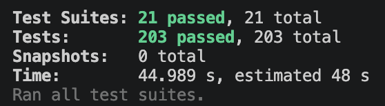<br>
      <sup>Fonte: Elaborado pelos autores (2026).</sup>
</div>

---

### Relatório de Cobertura

A cobertura dos testes foi avaliada por meio do seguinte comando:

```bash
npm test -- --coverage
```

O relatório gerado permitiu analisar o percentual de código exercitado pelos testes automatizados em cada camada da aplicação.

<div align="center">
  <sub>Quadro 32 - Cobertura por Camada da Aplicação </sub>
</div>

| Camada / arquivo | Statements | Branches | Functions | Lines |
| ---------------- | ---------- | -------- | --------- | ----- |
| All files | 100% | 100% | 100% | 100% |
| helpers | 100% | 100% | 100% | 100% |
| `asyncHandler.ts` | 100% | 100% | 100% | 100% |
| routes | 100% | 100% | 100% | 100% |
| `adminRoutes.ts` | 100% | 100% | 100% | 100% |
| `checkpointRoutes.ts` | 100% | 100% | 100% | 100% |
| `exportRoutes.ts` | 100% | 100% | 100% | 100% |
| `ocrRoutes.ts` | 100% | 100% | 100% | 100% |
| `rankingRoutes.ts` | 100% | 100% | 100% | 100% |
| `reportRoutes.ts` | 100% | 100% | 100% | 100% |
| `runnerRoutes.ts` | 100% | 100% | 100% | 100% |
| `teamRoutes.ts` | 100% | 100% | 100% | 100% |
| `tvPanelRoutes.ts` | 100% | 100% | 100% | 100% |
| services | 100% | 100% | 100% | 100% |
| `adminService.ts` | 100% | 100% | 100% | 100% |
| `teamService.ts` | 100% | 100% | 100% | 100% |
| **Cobertura Total** | **100%** | **100%** | **100%** | **100%** |


<div align="center">
  <sup>Fonte: Elaborado pelos autores (2026).</sup>
</div>

O relatório apresenta as métricas de cobertura de código organizadas por camada e arquivo monitorado pela configuração de cobertura da seção 5.1, considerando Statements, Branches, Functions e Lines como indicadores de qualidade dos testes automatizados. Na execução completa com `--coverage`, a cobertura total obtida foi de **100% em statements, 100% em branches, 100% em functions e 100% em lines.**

Todos os arquivos monitorados no relatório atingiram **100% de cobertura em todas as métricas**.

Além disso, o `coverageThreshold` global está configurado em 100%, garantindo que o comando falhe caso qualquer métrica do recorte monitorado fique abaixo desse valor.

**Evidência**
<div align="center">
  <sub>Figura X - Relatório completo de cobertura gerado pelo Jest.</sub><br>
    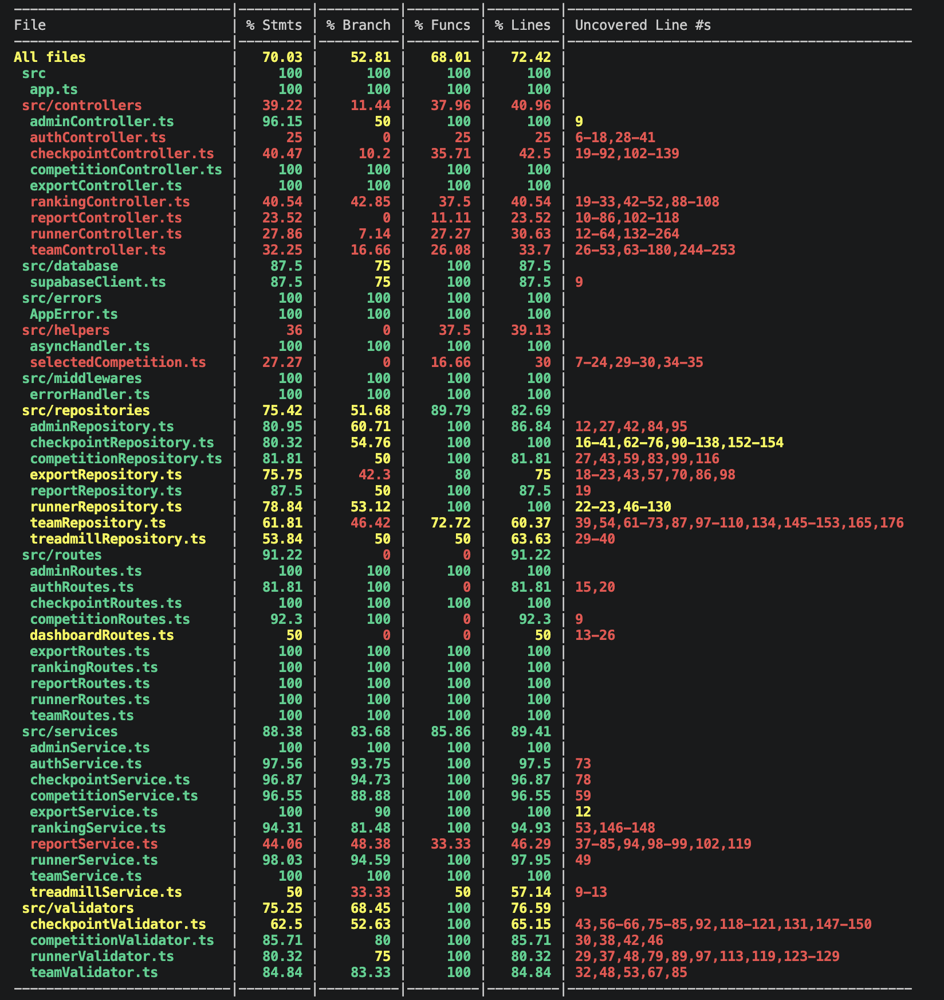<br>
      <sup>Fonte: Elaborado pelos autores (2026).</sup>
</div>

### Rastreabilidade dos Casos de Teste

Os testes automatizados implementados foram relacionados às respectivas regras de negócio e requisitos funcionais, garantindo consistência com a Matriz RF → RN → Endpoint (Seção 3.1.4) e com a Matriz de Rastreabilidade do Projeto (Seção 3.9).

<div align="center">
  <sub>Quadro 33 - Rastreabilidade dos Casos de Teste (CT → RN → RF) </sub>
</div>

| Caso de Teste (CT) | Arquivo de Teste | Regra de Negócio (RN) | Requisito Funcional (RF) |
|--------------------|------------------|------------------------|---------------------------|
| CT01 | authService.test.ts | RN03 | RF004 |
| CT02 | adminService.test.ts | RN03 | RF004 |
| CT03 | admin.e2e.spec.ts | RN03 | RF004 |
| CT04 | competitionService.spec.ts | RN18, RN14 | RF002, RF012 |
| CT05 | competition.e2e.spec.ts | RN18 | RF002 |
| CT06 | competitionRepository.spec.ts | RN18 | RF002 |
| CT07 | teamService.spec.ts | RN01 | RF003 |
| CT08 | team.e2e.spec.ts | RN01 | RF003 |
| CT09 | teamRepository.spec.ts | RN01 | RF003 |
| CT10 | runnerService.spec.ts | RN07 | RF003, RF011 |
| CT11 | runner.e2e.spec.ts | RN07 | RF003 |
| CT12 | runnerRepository.spec.ts | — | RF003 |
| CT13 | checkpointService.spec.ts | RN04, RN05, RN06 | RF005, RF008, RF009 |
| CT14 | checkpoint.e2e.spec.ts | RN04, RN05 | RF008 |
| CT15 | rankingService.spec.ts | RN09, RN11 | RF010, RF015 |
| CT16 | ranking.e2e.spec.ts | RN09 | RF010, RF015 |
| CT17 | exportService.spec.ts | RN15 | RF013 |
| CT18 | export.e2e.spec.ts | RN15 | RF013 |
| CT19 | exportRepository.spec.ts | RN15 | RF013 |
| CT20 | report.e2e.spec.ts | RN16 | RF014 |
| CT21 | auth.e2e.spec.ts | RN03 | RF004 |

<div align="center">
  <sup>Fonte: Elaborado pelos autores (2026).</sup>
</div>

A rastreabilidade apresentada demonstra que os testes implementados validam requisitos funcionais e regras de negócio previamente definidos, assegurando alinhamento entre especificação, implementação e processo de validação da aplicação.

## <a name="52"></a>5.2. Testes de usabilidade 

### 5.2.1. Relatório de testes de guerrilha

Foram realizados testes de guerrilha com 5 participantes da Turma 25, aplicando as 5 tarefas previstas na planilha de testes de usabilidade. Cada tarefa foi avaliada por etapas, com registro das ocorrências e classificação do resultado geral.

**Perfil dos participantes**

<div align="center">
  <sub>Quadro x - Perfil dos participantes </sub>
</div>

| # | Nome | Curso | Idade | Turma |
|---|------|-------|-------|-------|
| 1 | Valter Lima | Sistemas de Informação | 18 | Ateliê 2 – Turma 25 |
| 2 | Sara Nunes | Sistemas de Informação | 20 | Ateliê 2 – Turma 25 |
| 3 | Vini | Sistemas de Informação | 18 | Ateliê 2 – Turma 25 |
| 4 | Matheus | Ciência da Computação | 18 | Ateliê 2 – Turma 25 |
| 5 | Arthur | Adm Tech | 19 | Ateliê 2 – Turma 25 |

<div align="center">
  <sup>Fonte: Elaborado pelos autores (2026).</sup>
</div>

#### Tarefa 1: Cadastro de nova competição

 *Suponha que você é Bruno Monteiro, Gerente de Field Marketing da Red Bull, e está preparando uma nova edição do Red Bull 24 Horas em São Paulo. Utilize o sistema para cadastrar essa nova competição informando nome, data e local do evento.*

**Etapas:**
1. Acessar a área administrativa do sistema (Dashboard).
2. Iniciar o cadastro de uma nova competição a partir da Dashboard.
3. Preencher os campos obrigatórios: nome, data e local.
4. Confirmar o cadastro e verificar que a competição foi criada e está disponível para uso.

**Heurísticas relacionadas:** 
- H1 - Visibilidade do status do sistema
- H5 - Prevenção de erros
- H8 - Estética e design minimalista.

| Tester | Resultado | Ocorrências |
|--------|-----------|-------------|
| Valter Lima | Sucesso com dificuldade | Teve dúvida inicial sobre por onde começar, pois encontrou várias competições já cadastradas; após alguns instantes, compreendeu que deveria criar uma nova. Cadastro concluído com sucesso. |
| Sara Nunes | Sucesso | Cadastrou a competição sem dificuldades. |
| Vini | Sucesso | Não teve dificuldade em criar a primeira competição; preenchimento fácil de todos os campos. |
| Matheus | Sucesso com dificuldade | Cadastrou a competição, mas sugeriu permitir digitar a data, pois só há a opção de calendário. O card da nova competição apareceu em primeiro. |
| Arthur | Sucesso | Criou a competição e conseguiu adicionar as informações nos campos. |

<div align="center">
  <sup>Fonte: Elaborado pelos autores (2026).</sup>
</div>

#### Tarefa 2:  Cadastro de equipe e obtenção do link público (UUID)

 *Suponha que você é Bruno Monteiro, Gerente de Field Marketing, e precisa cadastrar a equipe "Falcões Vermelhos" com seus atletas no sistema. Após o cadastro, você precisa obter o link público exclusivo da equipe para enviá-lo ao capitão. Utilize o sistema para cadastrar a equipe e copiar o link público gerado.*

**Etapas:**
1. Acessar a área de Equipes a partir do menu de navegação ou do card de atalho na Dashboard.
2. Iniciar o cadastro de uma nova equipe.
3. Preencher os dados da equipe (nome, capitão, atletas) e salvar.
4. Localizar o link UUID gerado no card da equipe e copiá-lo para enviar ao capitão.

**Heurísticas relacionadas:** 
- H1 - Visibilidade do status do sistema
- H7 - Flexibilidade e eficiência de uso
- H8 - Estética e design minimalista.

| Tester | Resultado | Ocorrências |
|--------|-----------|-------------|
| Valter Lima | Sucesso com dificuldade | Teve dificuldade para localizar a competição recém-criada entre diversos registros existentes. Após encontrá-la, enfrentou erro por e-mail já cadastrado e dúvidas sobre campos obrigatórios, concluindo a tarefa após corrigir os dados. |
| Sara Nunes | Sucesso com dificuldade | Não localizou a competição criada e acessou diretamente o menu para criar a equipe. Concluiu o cadastro de equipe com sucesso. |
| Vini | Sucesso com dificuldade | Criou equipes dentro da competição. Como participante de teste, foi pego pelas regras de negócio (ex.: número correto do CPF e campos obrigatórios). Não tinha noção das regras do evento — número de equipes e atletas e informações obrigatórias. |
| Matheus | Sucesso | Criou as duas equipes sem problemas; achou as equipes intuitivas. |
| Arthur | Sucesso com dificuldade | Trocou de atleta e criou as equipes, mas acabou criando a equipe 2 vezes. |

<div align="center">
  <sup>Fonte: Elaborado pelos autores (2026).</sup>
</div>

#### Tarefa 3: Registro de checkpoint via OCR (foto da esteira)

 *Suponha que você é Marina Costa, coordenadora operacional do Red Bull 24 Horas, e o atleta João Silva acabou de completar um trecho de corrida na esteira. Utilize o sistema para registrar o checkpoint do João capturando uma foto do visor da esteira para que os dados sejam extraídos automaticamente pelo sistema.*

**Etapas:**
1. Acessar o painel operacional a partir do card da equipe do João.
2. Selecionar o atleta João Silva como atleta ativo no painel.
3. Capturar a foto do visor da esteira pela câmera integrada do sistema.
4. Conferir os dados extraídos pelo OCR e confirmar o registro do checkpoint.

**Heurísticas relacionadas:** 
- H1 - Visibilidade do status do sistema; 
- H6 - Reconhecimento em vez de memorização; 
- H9 - Ajudar usuários a reconhecer, diagnosticar e recuperar erros.

| Tester | Resultado | Ocorrências |
|--------|-----------|-------------|
| Valter Lima | Sucesso | Concluiu a tarefa com sucesso na funcionalidade de OCR. |
| Sara Nunes | Sucesso com dificuldade | Apresentou dificuldade para compreender a funcionalidade de OCR, especialmente o botão amarelo utilizado para inserir imagens. Considerou a seção de checkpoints um pouco confusa. |
| Vini | Sucesso | Conseguiu registrar checkpoints via OCR sem dificuldades. |
| Matheus | Não realizada | Não testou o registro por foto. |
| Arthur | — | Não registrou checkpoint por OCR (realizou apenas o registro manual). |

<div align="center">
  <sup>Fonte: Elaborado pelos autores (2026).</sup>
</div>

#### Tarefa 4: Registro de checkpoint manual

 *Suponha que você é Marina Costa, coordenadora operacional, e precisa registrar o desempenho atual do atleta João Silva durante a corrida. Utilize o sistema para registrar manualmente o checkpoint do João, informando a distância percorrida.*

**Etapas:**
1. Acessar o painel operacional da equipe do João.
2. Identificar a tela de registro manual e o atleta selecionado.
3. Preencher os campos do checkpoint: distância (km), pace (min/km) e tempo total.
4. Confirmar o registro manual e verificar a confirmação do sistema.

**Heurísticas relacionadas:** 
- H4 - Consistência e padrões; 
- H6 - Reconhecimento em vez de memorização; 
- H10 - Ajuda e documentação.

| Tester | Resultado | Ocorrências |
|--------|-----------|-------------|
| Valter Lima | Sucesso com dificuldade | Apresentou dificuldade com o formato exigido para o preenchimento dos dados. Antes desta tarefa, ficou em dúvida sobre qual ação executar na sequência do fluxo. |
| Sara Nunes | Sucesso com dificuldade | Concluiu a tarefa com sucesso, mas teve dúvidas sobre como informar o pace. Antes desta tarefa, demonstrou dúvida sobre qual seria o próximo passo do fluxo. |
| Vini | Sucesso | Como não conseguiu realizar o registro pelo OCR em determinado momento, realizou o registro manualmente com sucesso. |
| Matheus | Sucesso com dificuldade | Criou o checkpoint manual, mas teve problemas com a formatação do campo de horário, pois precisava adicionar os segundos — o sistema avisou. Sugeriu deixar o cálculo de pace explícito. |
| Arthur | Sucesso com dificuldade | Registrou o checkpoint manualmente, mas teve problemas com a formatação dos dados e acabou criando o checkpoint 2 vezes. |

<div align="center">
  <sup>Fonte: Elaborado pelos autores (2026).</sup>
</div>

#### Tarefa 5: Acompanhamento da competição pelo painel da equipe (UUID)

 *Suponha que você é Amanda Azevedo, atleta da equipe "Falcões Vermelhos" no Red Bull 24 Horas, e quer acompanhar o desempenho da sua equipe na competição utilizando o link enviado pela sua capitã. Utilize esse link para descobrir a posição atual da equipe no ranking e identificar quanto tempo de descanso é recomendado entre seus turnos.*

**Etapas:**
1. Acessar o link UUID da equipe enviado pela capitã.
2. Localizar a posição atual da equipe no ranking global da competição.
3. Encontrar seu próprio status individual e suas métricas na lista de atletas da equipe.
4. Consultar a calculadora de descanso e identificar a recomendação atual.

**Heurísticas relacionadas:** 
- H1 - Visibilidade do status do sistema; 
- H2 - Correspondência entre sistema e mundo real; 
- H8 - Estética e design minimalista.

| Tester | Resultado | Ocorrências |
|--------|-----------|-------------|
| Valter Lima | Sucesso | Acessou e visualizou o ranking sem dificuldades. |
| Sara Nunes | Sucesso com dificuldade | Não percebeu inicialmente a existência das funcionalidades de ranking e relatórios. |
| Vini | Sucesso | Acessou a tela de relatórios sem ajuda e visualizou os checkpoints que ele mesmo havia registrado. |
| Matheus | Sucesso | acessou o painel público, visualizou o ranking e posteriormente explorou espontaneamente a funcionalidade de exportação. |
| Arthur | — | Não há registro de execução desta tarefa. |

<div align="center">
  <sup>Fonte: Elaborado pelos autores (2026).</sup>
</div>

#### Síntese dos resultados dos testes

Com base na execução das cinco tarefas propostas, foi possível observar a taxa de sucesso dos participantes em cada atividade. A Tabela XX apresenta um resumo consolidado dos resultados obtidos.

| Tarefa | Sucesso | Sucesso com dificuldade | Não realizada |
| ------ | ------- | ----------------------- | ------------- |
| T1     | 3       | 2                       | 0             |
| T2     | 1       | 4                       | 0             |
| T3     | 2       | 1                       | 2             |
| T4     | 1       | 4                       | 0             |
| T5     | 3       | 1                       | 1             |

<div align="center">
  <sup>Fonte: Elaborado pelos autores (2026).</sup>
</div>

Observa-se que todas as tarefas puderam ser concluídas pela maioria dos participantes. Entretanto, as atividades relacionadas ao cadastro de equipes e ao registro de checkpoints concentraram a maior quantidade de dificuldades, indicando oportunidades de melhoria principalmente na compreensão do fluxo da aplicação, na validação dos campos e na comunicação das funcionalidades disponíveis.

#### Resumo das ocorrências (ordenado por prioridade de melhoria)

As ocorrências identificadas foram classificadas conforme sua severidade, considerando o impacto na execução das tarefas: severidade 1 (cosmética), quando o problema não compromete a realização da tarefa; 2 (baixa), quando gera dificuldades, mas não impede sua conclusão; e 3 (alta), quando compromete significativamente a eficiência ou compreensão do fluxo pelo usuário.

| Prioridade | Tarefa | Tipo | Severidade | Resumo do ocorrido e melhoria proposta | Participantes |
|------------|--------|------|------------|----------------------------------------|---------------|
| 1 | Geral / Fluxo | Usabilidade | 3. Alta | Ausência de um passo a passo/guia claro do fluxo. Dúvida sobre qual ação executar após criar a equipe e dificuldade para entender o fluxo da competição. **Melhoria:** indicar o "próximo passo" sugerido na interface ou um onboarding guiado. | Valter, Sara, Matheus |
| 2 | T2 / T1 | Usabilidade | 3. Alta | Dificuldade em localizar a competição recém-criada entre os registros existentes; excesso de competições já criadas dificulta a navegação. **Melhoria:** destacar/selecionar automaticamente a competição recém-criada e melhorar a busca/listagem. | Valter, Sara, Matheus |
| 3 | T3 / T4 | Compreensão de conteúdo | 3. Alta | Seção de checkpoints confusa: dificuldade com a função OCR (botão destinado ao envio da imagem) e com como definir/marcar o pace. **Melhoria:** rótulos mais descritivos, microcopy, exemplo de preenchimento de pace e tornar o cálculo de pace explícito. | Valter, Sara, Matheus |
| 4 | T2 | Compreensão de conteúdo | 3. Alta | Usuário sem noção das regras de negócio do evento (CPF válido, campos obrigatórios, número de equipes e atletas), gerando bloqueios durante o cadastro. **Melhoria:** exibir as regras/limites de forma visível e mensagens de validação explicativas. | Vini |
| 5 | T4 | Usabilidade | 2. Baixa | Dificuldade com o formato exigido no preenchimento manual dos dados (incluindo a necessidade de informar os segundos no campo de horário). **Melhoria:** máscara de input, placeholder com formato esperado e validação amigável. | Valter, Matheus, Arthur |
| 6 | T2 / T4 | Usabilidade | 2. Baixa | Ações duplicadas: equipe e checkpoint criados 2 vezes. **Melhoria:** prevenir duplicidade com bloqueio de submit repetido e feedback de confirmação. | Arthur |
| 7 | T2 | Usabilidade | 2. Baixa | E-mail recusado como inválido por duplicidade, sem clareza; dúvidas sobre quais campos eram obrigatórios. **Melhoria:** mensagem de erro específica para e-mail duplicado e marcação visual de campos obrigatórios. | Valter |
| 8 | Login | Usabilidade | 2. Baixa | Ao errar a senha, o sistema exibiu um erro de servidor em vez de uma mensagem clara de credenciais inválidas. **Melhoria:** mensagem de erro de autenticação específica e amigável. | Matheus |
| 9 | T1 | Usabilidade | 1. Cosmética | Campo de data permite apenas seleção por calendário, sem opção de digitação. **Melhoria:** permitir entrada manual da data além do seletor de calendário. | Matheus |
| 10 | T5 | Usabilidade | 2. Baixa | Funcionalidades de ranking e relatórios não percebidas inicialmente. **Melhoria:** aumentar a visibilidade/hierarquia desses elementos no painel. | Sara |

<div align="center">
  <sup>Fonte: Elaborado pelos autores (2026).</sup>
</div>

#### Feedback geral dos participantes

- **Valter Lima:** sentiu falta de um passo a passo mais claro durante o uso da plataforma; elogiou a parte visual das equipes e o design da aplicação.
- **Sara Nunes:** gostou da identidade visual inspirada na Red Bull e considerou a interface visualmente clara.
- **Vini:** não relatou dificuldades nas tarefas principais; as barreiras encontradas foram relacionadas ao desconhecimento das regras de negócio do evento (campos obrigatórios, CPF, número de equipes e atletas).
- **Matheus:** avaliou positivamente a plataforma, destacando que teve dificuldade para entender o fluxo da competição (muitas competições já criadas); elogiou o dashboard, achou as equipes intuitivas e os rankings bons; sugeriu deixar o cálculo de pace explícito e não chegou a testar o registro por foto.
- **Arthur:** conseguiu concluir os cadastros, mas enfrentou problemas de formatação no registro manual e duplicou ações (equipe e checkpoint criados duas vezes). 

De modo geral, os testes de guerrilha evidenciaram que os participantes conseguiram concluir a maior parte das tarefas propostas, indicando boa facilidade de aprendizagem da plataforma. As principais dificuldades concentraram-se na compreensão do fluxo operacional da competição, na identificação de algumas funcionalidades e na formatação de determinados campos durante o cadastro manual. As melhorias identificadas foram registradas e serviram de base para refinamentos da interface antes da versão final do sistema.

### 5.2.2. Relatório de testes SUS (System Usability Scale)

Com o objetivo de avaliar a usabilidade da plataforma desenvolvida, foi aplicado o método **System Usability Scale (SUS)**, um dos instrumentos mais utilizados para mensurar a percepção dos usuários quanto à facilidade de uso de sistemas interativos. O SUS permite obter uma avaliação quantitativa da usabilidade percebida por meio de um questionário padronizado composto por dez afirmações avaliadas em escala Likert de cinco pontos (Brooke, 1996).

A coleta das respostas foi realizada por meio de um formulário eletrônico elaborado no Google Forms ([link](https://docs.google.com/forms/d/e/1FAIpQLSfbogO73x2usq7xjncadyTzCvAgDskjZmJD1b7VFlcXzymP_w/viewform)), aplicado individualmente após a execução das tarefas propostas durante os testes de usabilidade. Participaram da avaliação sete usuários, que responderam ao questionário de forma independente imediatamente após utilizarem a plataforma.

O questionário SUS utiliza uma escala de concordância de 1 a 5, conforme apresentado no Quadro XX.

<div align="center">

<sub>Quadro XX – Escala de respostas do questionário SUS</sub>

</div>

| Valor | Significado |
|--------|-------------|
| 1 | Discordo totalmente |
| 2 | Discordo parcialmente |
| 3 | Neutro |
| 4 | Concordo parcialmente |
| 5 | Concordo totalmente |

<div align="center">
<sup>Fonte: Elaborado pelos autores (2026).</sup>
</div>

As dez afirmações apresentadas aos participantes estão descritas no Quadro XX.

<div align="center">

<sub>Quadro XX – Questões do questionário SUS</sub>

</div>

| Nº | Afirmação |
|---|---|
| 1 | Eu acho que gostaria de usar esse sistema com frequência. |
| 2 | Eu acho o sistema desnecessariamente complexo. |
| 3 | Eu achei o sistema fácil de usar. |
| 4 | Eu acho que precisaria de ajuda de uma pessoa com conhecimentos técnicos para usar o sistema. |
| 5 | Eu acho que as várias funções do sistema estão muito bem integradas. |
| 6 | Eu acho que o sistema apresenta muita inconsistência. |
| 7 | Eu imagino que as pessoas aprenderão como usar esse sistema rapidamente. |
| 8 | Eu achei o sistema atrapalhado de usar. |
| 9 | Eu me senti confiante ao usar o sistema. |
| 10 | Eu precisei aprender várias coisas novas antes de conseguir usar o sistema. |

<div align="center">
<sup>Fonte: Elaborado pelos autores (2026).</sup>
</div>

Após a coleta das respostas, os dados foram consolidados em uma planilha eletrônica desenvolvida no Google Sheets ([link](https://docs.google.com/spreadsheets/d/1Lj2P-CIKph2wutV7gCXMYBHs6-yrS_pfKu9RcWPMiP4/edit?usp=sharing)).

Conforme a metodologia proposta por Brooke (1996), para as afirmações positivas (questões ímpares) foi subtraído 1 da resposta atribuída pelo participante, enquanto para as afirmações negativas (questões pares) a resposta foi subtraída de 5. Em seguida, a soma dos valores obtidos foi multiplicada por 2,5, resultando em uma pontuação final compreendida entre 0 e 100 pontos para cada participante.

A Tabela XX apresenta as pontuações obtidas pelos participantes.

<div align="center">

<sub>Tabela XX – Pontuação SUS por participante</sub>

</div>

| Participante | Pontuação SUS |
|-------------|---------------|
| Participante 1 | 72,5 |
| Participante 2 | 77,5 |
| Participante 3 | 82,5 |
| Participante 4 | 82,5 |
| Participante 5 | 77,5 |
| Participante 6 | 100,0 |
| Participante 7 | 72,5 |

<div align="center">
<sup>Fonte: Elaborado pelos autores (2026).</sup>
</div>

#### 5.2.2.1. Análise dos resultados SUS

A aplicação do questionário SUS resultou em uma pontuação média de **80,71 pontos**, valor superior à média de referência do método, estabelecida em aproximadamente 68 pontos. Segundo a classificação proposta por Bangor, Kortum e Miller (2009), pontuações superiores a 80 pontos enquadram-se na categoria **Excelente**, indicando elevado nível de satisfação dos usuários e forte aceitação da solução desenvolvida.

A análise das pontuações individuais também evidencia uma percepção consistente entre os participantes. Das sete avaliações realizadas, seis apresentaram pontuações entre **72,5 e 82,5 pontos**, enquanto um participante atribuiu a nota máxima de **100 pontos**, indicando uma experiência de uso extremamente positiva. Essa distribuição demonstra que a percepção favorável da usabilidade foi compartilhada pela maior parte dos avaliadores.

<div align="center">
  <sub>Figura X - Distribuição das respostas da Questão 7 do questionário SUS</sub><br>
    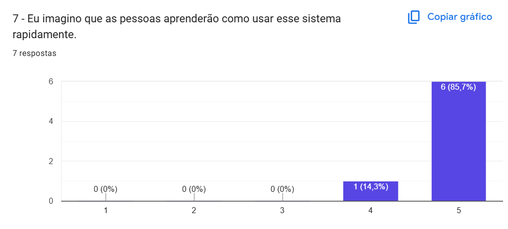<br>
      <sup>Fonte: Elaborado pelos autores (2026).</sup>
</div>

A Figura XX apresenta os resultados da questão **"Eu imagino que a maioria das pessoas aprenderia a usar este sistema rapidamente"**. Observa-se que **85,7% dos participantes concordaram totalmente** com a afirmação, enquanto **14,3% concordaram parcialmente**, não havendo respostas neutras ou discordantes. Esse resultado evidencia que os usuários perceberam a plataforma como intuitiva e de rápida aprendizagem, característica especialmente importante para o contexto operacional do evento Red Bull 24 Horas, no qual diferentes operadores podem utilizar o sistema durante a competição.

<div align="center">
  <sub>Figura X - Distribuição das respostas da Questão 8 do questionário SUS</sub><br>
    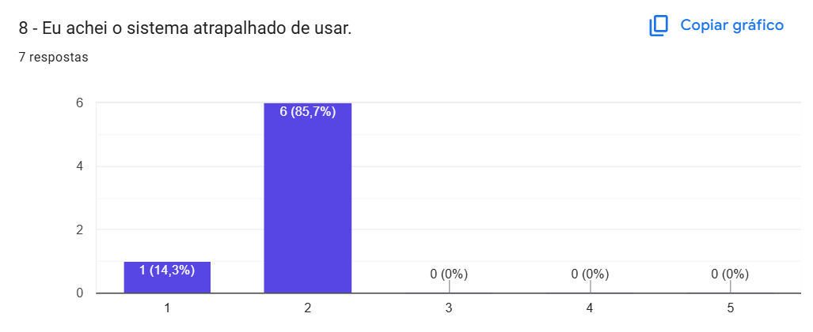<br>
      <sup>Fonte: Elaborado pelos autores (2026).</sup>
</div>

A Figura XX apresenta os resultados da questão **"Eu achei o sistema complicado de usar"**. Por se tratar de uma afirmação negativa, respostas de discordância representam uma avaliação positiva da usabilidade. Observa-se que **85,7% dos participantes discordaram parcialmente** da afirmação e **14,3% discordaram totalmente**, sem registros de respostas neutras ou concordantes. Esse comportamento reforça a percepção de que a plataforma apresenta uma navegação simples e um fluxo de utilização compreensível.

Os resultados observados nessas questões refletem uma tendência identificada ao longo de todo o questionário SUS: os participantes avaliaram positivamente aspectos relacionados à facilidade de aprendizado, simplicidade de utilização, integração das funcionalidades e confiança durante o uso do sistema. Essas percepções estão alinhadas com o desempenho observado durante os testes de usabilidade, nos quais os usuários conseguiram concluir as tarefas propostas sem dificuldades significativas.

Embora a avaliação tenha indicado excelente nível de usabilidade, os testes de usabilidade realizados anteriormente permitiram identificar oportunidades de melhoria relacionadas ao refinamento de alguns elementos visuais da interface e à maior clareza de determinadas mensagens exibidas pelo sistema. Essas observações não comprometeram a execução das funcionalidades, mas foram registradas como oportunidades de evolução para versões futuras da plataforma.

Portanto, conclui-se que a solução desenvolvida apresenta um nível de usabilidade considerado **excelente**, segundo os critérios do método SUS. Os resultados obtidos demonstram que os usuários conseguem compreender, aprender e utilizar suas funcionalidades de forma eficiente, reforçando a adequação da plataforma ao contexto operacional do evento Red Bull 24 Horas e contribuindo para uma operação mais ágil, confiável e com menor probabilidade de erros durante a competição.

# <a name="c6"></a>6. Estudo de Mercado e Plano de Marketing

## 6.1 Resumo Executivo

O mercado de event-tech voltado a organizadores de eventos esportivos de grande porte apresenta oportunidade relevante no segmento B2B. Segundo relatórios do setor, o mercado global de tecnologias para eventos tem apresentado crescimento contínuo impulsionado pela digitalização das operações e pela crescente demanda por monitoramento, rastreabilidade e análise de dados em tempo real. Além disso, a expansão do número de eventos esportivos e experiências esportivas promovidas por marcas reforça a necessidade de soluções especializadas para apoiar a gestão operacional dessas iniciativas. Nesse contexto, a apuração de resultados em corridas de longa duração ainda é conduzida por métodos manuais — pranchetas, planilhas Excel e formulários genéricos como Google Forms — que não foram projetados para operações contínuas de 24 horas com troca frequente de operadores sob alta pressão. Nenhuma ferramenta genérica disponível no mercado atende com confiabilidade as especificidades desse contexto, o que configura uma lacuna real para organizadores de eventos esportivos desta escala.

O problema atendido diz respeito à ausência de uma ferramenta digital especializada para registro e validação de dados durante a competição. A coleta manual de quilometragem, pace, tempo e checkpoints impõe limitações à rastreabilidade dos resultados e à credibilidade da apuração final, impactando diretamente operadores de evento e equipes técnicas.

A solução consiste em uma plataforma web com captura via OCR, validação humana assistida, registro de checkpoints, métricas em tempo real e exportação de relatórios. Em comparação com as alternativas existentes — planilhas, Google Forms e plataformas genéricas de gestão operacional —, os diferenciais competitivos são: especialização no fluxo real do evento (uso ininterrupto de 24 horas com suporte a revezamento de operadores); combinação de automação com supervisão humana, garantindo precisão sem eliminar o controle operacional; rastreabilidade por log de validações; e dispensa de integração direta com as esteiras ou dispositivos acoplados aos atletas, eliminando dependência de hardware não prevista em soluções genéricas.

Os objetivos estratégicos abrangem substituir o fluxo manual de apuração por um processo auditável e eficiente, além de ampliar a confiabilidade dos resultados entregues ao parceiro. A possibilidade de reutilização em outros eventos é tratada como uma aspiração de longo prazo — e não como objetivo do projeto atual —, em linha com a Matriz de Riscos (seção 2.1.5), que classifica essa expansão como oportunidade de baixa prioridade (10%).

## 6.2 Análise de Mercado

O projeto está inserido no contexto do Red Bull 24 Horas, desafio esportivo de resistência e experiência de marca em que equipes de corredores se revezam em esteiras durante 24 horas, com o objetivo de acumular a maior quilometragem possível. Mais do que uma competição de corrida, o evento funciona como uma ativação esportiva da Red Bull voltada à comunidade running, combinando performance, estratégia coletiva, engajamento do público e produção de conteúdo em torno da marca. A edição de 2025 evidencia essa proposta ao reunir running crews em seletivas nacionais e em uma final com equipes mistas de 16 atletas, revezamento contínuo e forte componente de torcida, superação e colaboração (Itatiaia, 2025).

Nesse cenário, a solução desenvolvida tem como foco aumentar a eficiência operacional e a confiabilidade da apuração do evento. Atualmente, o registro de quilometragem, pace, tempo e checkpoints depende de anotações manuais realizadas por operadores durante uma operação contínua e de alta pressão, o que aumenta o risco de erros, retrabalho e inconsistências nos resultados. O sistema proposto substitui parte desse fluxo por uma plataforma web com captura de dados via OCR, validação humana, registro de checkpoints, visualização de métricas e exportação de relatórios, mantendo a supervisão operacional e ampliando a rastreabilidade dos dados.

A proposta de valor do projeto está em transformar uma etapa crítica da experiência do Red Bull 24 Horas, a apuração dos resultados, em um processo mais confiável, auditável e eficiente. A plataforma não busca criar um produto genérico para o mercado, mas atender a uma necessidade específica do parceiro dentro de um evento esportivo de marca. Ainda assim, o projeto apresenta potencial futuro de reutilização em outros eventos esportivos da Red Bull que dependam de coleta de dados, acompanhamento de performance e validação operacional em tempo real.

### 6.2.1 Visão Geral do Setor

O setor analisado corresponde à interseção entre eventos esportivos de corrida, experiências de marca e tecnologia para gestão operacional de eventos. No caso do Red Bull 24 Horas, a corrida não é apresentada apenas como uma prática esportiva individual, mas como uma experiência coletiva organizada em torno de running crews, estratégia de equipe, resistência física e envolvimento do público. A etapa de Belo Horizonte da temporada de 2025, por exemplo, reuniu quatro running crews locais, organizadas em duas equipes de 16 atletas, em uma disputa de 24 horas de revezamento contínuo em esteiras (Itatiaia, 2025).

A Red Bull atua globalmente com eventos em diferentes territórios culturais e esportivos, como bike, motorsport, surf, esportes de inverno, música e gaming, utilizando essas iniciativas como parte central de sua presença de marca. Esse posicionamento reforça a lógica do Red Bull 24 Horas como uma experiência esportiva proprietária, na qual a marca não apenas patrocina a prática esportiva, mas estrutura um formato competitivo, social e midiático ao redor dela (Red Bull, 2025).

Dentro desse setor, a digitalização da operação passa a ser um fator relevante, pois eventos esportivos experienciais dependem cada vez mais de dados confiáveis para sustentar performance, comunicação, segurança, engajamento e análise pós-evento. No Red Bull 24 Horas, essa necessidade é ainda mais evidente, já que a competição ocorre sem interrupção, exige revezamentos rápidos, possui grande volume de registros e depende da precisão dos checkpoints para definir resultados.

Além dos aspectos econômicos e tecnológicos, a operação de eventos esportivos depende cada vez mais de práticas de governança de dados e conformidade regulatória. A coleta, armazenamento e tratamento de informações relacionadas aos participantes devem observar princípios de segurança, rastreabilidade e transparência, especialmente em contextos nos quais os resultados da competição dependem diretamente da integridade dos registros realizados durante a prova. No Brasil, esse cenário é reforçado pela Lei Geral de Proteção de Dados (LGPD), que estabelece diretrizes para o tratamento adequado de dados pessoais e exige mecanismos que reduzam riscos de perda, alteração ou uso indevido das informações coletadas.

Sob a perspectiva operacional, processos de apuração esportiva também demandam mecanismos de auditoria capazes de comprovar a origem e a consistência dos resultados divulgados. Em eventos de longa duração, nos quais múltiplos operadores realizam registros ao longo da competição, a existência de logs, histórico de alterações e validações estruturadas contribui para aumentar a confiabilidade da apuração e reduzir questionamentos sobre os resultados finais. Nesse contexto, a solução proposta busca alinhar a digitalização da operação com práticas de governança e rastreabilidade adequadas ao ambiente competitivo do Red Bull 24 Horas.

### 6.2.2 Tamanho e Crescimento do Mercado

O mercado brasileiro de corrida apresenta forte expansão, o que favorece a criação de eventos proprietários, experiências esportivas de marca e soluções de apoio à operação. Segundo levantamento da ABRACEO apresentado no 4º Summit ABRACEO/CBAt, o número de corridas de rua oficiais no Brasil saltou de 2.827 em 2024 para 5.241 em 2025, um crescimento de 85%, enquanto o estado de São Paulo registrou 1.311 corridas no período, liderando o volume nacional de provas. A própria ABRACEO caracteriza o setor de corridas de rua como responsável por quase 90% dos eventos esportivos realizados no país, em um mercado que já movimenta cerca de R$ 1,1 bilhão ao ano (Abraceo; Ticket Sports, 2026).

Esse ecossistema fortalece diretamente eventos experienciais como o Red Bull 24 Horas, cuja temporada 2025, em sua 4ª edição, percorreu cinco capitais brasileiras — Belo Horizonte, São Paulo, Recife, Porto Alegre e Rio de Janeiro — reunindo 20 running crews em etapas classificatórias antes da final nacional. A escala regional do evento evidencia a necessidade de soluções digitais que padronizem e garantam a confiabilidade da operação em múltiplas localidades.

Esse cenário se insere em um movimento global de digitalização de eventos. O mercado global de software de gestão de eventos foi estimado em USD 8,40 bilhões em 2024, com projeção de alcançar USD 17,33 bilhões até 2030, a uma taxa de crescimento anual composta de 13,2% (Grand View Research, s.d.). A convergência entre a expansão do running no Brasil e a crescente demanda por plataformas de gestão digital reforça a oportunidade para soluções como a proposta neste projeto.

Embora os dados apresentados demonstrem o crescimento do mercado de corridas e de tecnologias para eventos, o mercado efetivamente endereçável pela solução proposta é mais específico. A plataforma foi concebida para atender organizadores de eventos esportivos que dependem de processos contínuos de coleta, validação e consolidação de dados operacionais, especialmente em competições de longa duração ou com elevado volume de registros. Nesse contexto, o Red Bull 24 Horas representa um exemplo de aplicação em que a confiabilidade da apuração é parte crítica da experiência do evento. Assim, a oportunidade de mercado não está associada ao conjunto de eventos esportivos em geral, mas ao segmento que demanda controle operacional, rastreabilidade e auditoria de resultados em tempo real.

### 6.2.3 Tendências de Mercado

Entre as tecnologias utilizadas na solução proposta, destaca-se o Reconhecimento Óptico de Caracteres (OCR), recurso que acompanha uma tendência crescente de automação e digitalização de processos. A tecnologia permite a extração automática de informações a partir de imagens capturadas pelas esteiras, reduzindo a necessidade de inserção manual de dados e minimizando erros operacionais. Dessa forma, contribui para aumentar a confiabilidade, a rastreabilidade e a consistência das informações coletadas.

Do ponto de vista tecnológico, observa-se um crescimento contínuo na adoção de soluções baseadas em OCR. O mercado brasileiro de OCR gerou receita de US$ 676,3 milhões em 2024 e possui previsão de atingir US$ 1,585 bilhão até 2030, com taxa composta de crescimento anual (CAGR) de 14,8% entre 2025 e 2030. O segmento de software foi responsável por 95,27% da receita gerada em 2024, evidenciando a predominância de soluções digitais escaláveis na composição desse mercado (Grand View Research, s.d.).

Sob a perspectiva comportamental, um movimento de digitalização vem remodelando a operação de eventos, com câmeras e sensores substituindo parte dos processos manuais, tornando o controle mais previsível para organizadores (CartaCapital, 2026). Essa mudança reflete uma exigência crescente do mercado por processos baseados em captura automatizada de dados e validação em tempo real, especialmente em competições onde a precisão das informações é determinante para a integridade dos resultados.

No aspecto mercadológico, o Red Bull 24 Horas encontra-se em trajetória de expansão no Brasil. Em sua 4ª edição, realizada em 2025, o evento reuniu 20 running crews em cinco etapas classificatórias realizadas em Belo Horizonte, São Paulo, Recife, Porto Alegre e Rio de Janeiro, consolidando-se como o maior desafio de revezamento em esteira do país (Mania de corrida, 2025). A final nacional registrou mais de 678 km totais percorridos pelas equipes ao longo de 24 horas, evidenciando o volume de dados gerados e a necessidade de uma solução confiável para seu registro e rastreabilidade (Webrun, 2025).

Diante desse cenário, a solução proposta está alinhada às principais tendências do mercado, utilizando tecnologias em expansão para aumentar a eficiência operacional, a qualidade dos dados coletados e a confiabilidade dos processos.

## 6.3 Público-Alvo

A definição do público-alvo é uma etapa fundamental do planejamento estratégico de qualquer produto digital, pois orienta decisões de design, funcionalidade e comunicação com base em quem de fato utilizará a solução.

Identificar esse público com precisão permite que o desenvolvimento seja guiado por necessidades reais, evitando funcionalidades genéricas que não atendem às particularidades do contexto de uso. No caso do Red Bull 24 Horas, essa análise é especialmente relevante, uma vez que a aplicação será operada sob alta pressão, em turnos contínuos de 24 horas, por um grupo heterogêneo que inclui desde gerentes experientes até estagiários sem familiaridade prévia com sistemas operacionais de evento.

Esta seção está dividida em dois subitens: a segmentação de mercado, que descreve os grupos atendidos pela aplicação, e o perfil do público-alvo, que caracteriza esses usuários em profundidade.

### 6.3.1 Segmentação de Mercado

A segmentação de mercado é o processo de dividir um público em grupos com características e necessidades semelhantes, permitindo o desenvolvimento de produtos e serviços mais adequados a cada perfil de usuário. Essa prática possibilita compreender melhor as demandas de cada segmento e direcionar soluções de forma mais eficiente (HubSpot, 2025).

Neste projeto, a segmentação está relacionada aos diferentes públicos que se relacionam com a solução ao longo do ciclo de vida do evento Red Bull 24 Horas. Por tratar-se de uma solução B2B desenvolvida para um evento proprietário da Red Bull, é importante diferenciar o cliente responsável pela contratação e utilização estratégica da solução dos usuários que efetivamente operam a plataforma e do público que apenas consome as informações geradas. Nesse contexto, o cliente comprador corresponde à equipe de Field Marketing da Red Bull, responsável pelo planejamento e gestão do evento. Já os usuários operadores são os profissionais envolvidos na execução e monitoramento da competição, enquanto o público participante é formado pelos atletas e capitães de equipe que acompanham informações da prova por meio da área pública da plataforma.

Os segmentos atendidos pela solução podem ser agrupados da seguinte forma:

* **Equipe de Field Marketing (Cliente Comprador):** responsável pelo planejamento, coordenação e execução do evento. Sua necessidade central é dispor de uma ferramenta que permita gerenciar as inscrições das equipes, acompanhar o andamento da competição e garantir o controle operacional ao longo das 24 horas de duração do evento.

* **Coordenadores e Gestores de Operação (Usuários Operadores):** profissionais encarregados de supervisionar a execução das atividades em tempo real, coordenar equipes de apoio e assegurar que os registros do evento, como trocas de participantes, quilometragem e tempos percorridos, sejam capturados de forma confiável e precisa.

* **Analistas de Resultados e Desempenho (Usuários Operadores):** responsáveis pelo acompanhamento dos dados gerados durante o evento, incluindo o desempenho das equipes participantes e o cumprimento das metas estabelecidas. Para esse segmento, a aplicação deve oferecer visibilidade sobre os resultados registrados e facilitar a obtenção de informações para relatórios pós-evento.

* **Participantes e Capitães de Equipe (Público Participante):** usuários que acessam a área pública da plataforma para acompanhar rankings, desempenho das equipes e informações atualizadas da competição, sem interferir diretamente nos processos de registro e validação dos dados.

Embora possuam papéis distintos, esses segmentos compartilham a necessidade de uma solução centralizada que substitua processos manuais por um fluxo digital de registro, monitoramento e consulta de dados, reduzindo erros operacionais, ampliando a rastreabilidade das informações e aumentando a eficiência da gestão do evento.

### 6.3.2 Perfil do Público-Alvo

O público-alvo da aplicação é composto pelo time operacional de Field Marketing da Red Bull responsável pela condução do evento Red Bull 24 Horas. Esse grupo inclui gerentes e coordenadores experientes, além de estagiários que atuam diretamente ao lado das esteiras como responsáveis pelo registro dos dados.

Demograficamente, trata-se de profissionais e jovens em formação na faixa dos 18 a 38 anos. Quase metade dos profissionais de marketing no Brasil (45,5%) tem entre 29 e 38 anos, enquanto 13,7% estão na faixa de 18 a 28 anos, com forte concentração geográfica na região Sudeste, onde São Paulo reúne 36% dos profissionais mapeados (Serasa Experian; Mundo do Marketing, s.d.). As personas mapeadas no projeto, Marina Costa, 29 anos, coordenadora operacional no Rio de Janeiro, e Bruno Monteiro, 32 anos, Gerente de Field Marketing em São Paulo refletem esse espectro.

Psicograficamente, são usuários orientados a resultado e execução, que valorizam objetividade e clareza nas ferramentas que utilizam. Os estagiários, em particular, podem ter pouca familiaridade prévia com sistemas operacionais de eventos, o que reforça a necessidade de uma curva de aprendizado mínima. Além disso, por ainda estarem em fase de treinamento, contam com a pressão e motivação de garantir que a prova transcorra sem falhas de registro.

Embora o foco principal da solução esteja nos operadores responsáveis pelo registro e validação dos dados, os atletas e capitães de equipe também constituem um público relevante por meio da área pública da plataforma. Esse grupo busca acompanhar rankings, desempenho das equipes e evolução da competição atualizados a cada 1 hora, valorizando informações claras, atualizadas e facilmente acessíveis em dispositivos móveis. Diferentemente dos operadores, seu objetivo não é inserir dados, mas consumir informações confiáveis que permitam acompanhar a dinâmica da prova e o desempenho de sua equipe ao longo das 24 horas de duração do evento.

Comportamentalmente, operam sob pressão contínua, em turnos que se estendem por 24 horas, realizando trocas rápidas de corredores com janelas de segundos para registrar dados. Nesse contexto, as necessidades específicas da solução estão diretamente ligadas à usabilidade: a interface deve ser intuitiva o suficiente para ser operada sem treinamento extenso, com fluxos curtos, ações nomeadas de forma clara e feedback imediato a cada interação. Isso é especialmente crítico para os estagiários, que precisam executar o registro corretamente mesmo sem experiência prévia com o sistema. A adoção de ferramentas digitais em eventos melhora a eficiência operacional ao oferecer aos organizadores maior capacidade de gerenciamento e controle sobre cada etapa do processo, o que gera ganho diretamente dependente de quão simples e acessível a ferramenta se apresenta ao operador em campo (Lets Events, 2024).

## 6.4 Posicionamento e Branding

A seção 6.4 dedica-se ao posicionamento da aplicação no contexto do mercado de gestão de eventos esportivos e à definição da identidade de marca que orienta sua comunicação com o parceiro Red Bull e com os três públicos atendidos pela solução: operadores em campo, gerentes de Field Marketing e atletas (incluindo capitães de equipe). Embora a aplicação seja resultado de uma parceria acadêmica — e não de um produto comercial autônomo —, o exercício de posicionamento é relevante para alinhar a percepção esperada por esses públicos e fundamentar as decisões editoriais, visuais e de experiência adotadas ao longo do desenvolvimento.

A subseção 6.4.1 (Proposta de Valor) consolida o valor central entregue pela aplicação para cada perfil de usuário, retomando os elementos identificados no Value Proposition Canvas (seção 2.1.4) e nas Personas (seção 2.2). A subseção 6.4.2 (Posicionamento e Diferenciação) define como a aplicação se distingue das alternativas existentes — de processos manuais a sistemas profissionais de cronometragem — e quais atributos sustentam essa diferenciação. Os pilares detalhados nessas subseções são três: (i) especialização técnica em corridas de revezamento de longa duração e fluxos operacionais desenhados para trocas rápidas sob pressão; (ii) validação híbrida entre captura assistida por OCR — em refinamento técnico desde a Sprint 3 — e operador humano, com auditabilidade ponta a ponta garantida pela WebAPI centralizada (seção 3.7); e (iii) abertura controlada via URL com UUID, permitindo acompanhamento público em tempo real sem comprometer a camada administrativa.

O objetivo estratégico, alinhado às dores levantadas com o parceiro (seção 2.1.3) e às oportunidades identificadas na análise SWOT (seção 2.1.2), é estabelecer a solução como padrão operacional confiável para competições de ultra-resistência com múltiplas trocas de atletas, com meta declarada de manter o erro de apuração abaixo de 1%. Em conjunto, as duas subseções compõem a base estratégica que conecta a Análise de Mercado e o Público-Alvo (seções 6.2 e 6.3) à Estratégia de Marketing detalhada nos 4Ps (seção 6.6), garantindo coerência entre o que a aplicação entrega, como é percebida e como é comunicada.

### 6.4.1 Proposta de Valor

A aplicação resolve um problema concreto da operação do Red Bull 24 Horas: durante 24 horas ininterruptas, operadores anotam à mão, em pranchetas, os horários de turno e os checkpoints de cada corredor. A fadiga ao longo da madrugada, a caligrafia e as distrações tornam esses registros pouco confiáveis, e não existe forma estruturada de auditar o que foi anotado. Como as esteiras do evento não se conectam a dispositivos externos, a apuração depende inteiramente desse trabalho manual.

O público-alvo da solução se organiza em três perfis. Na área administrativa estão os operadores e a equipe de Field Marketing da Red Bull, representados pela coordenadora operacional, que registra checkpoints e trocas de atleta em campo, e pelo gerente de Field Marketing, que supervisiona a prova e analisa os relatórios. Na área pública estão os capitães e atletas das equipes, que acompanham o desempenho pelo painel acessível por link.

O sistema substitui a prancheta por uma captura assistida. O operador fotografa o visor da esteira e a aplicação extrai distância, pace e tempo por reconhecimento óptico de caracteres, com conferência humana antes de salvar e alerta visual para valores que destoem da média do atleta.

Frente a planilhas ou formulários genéricos, os diferenciais são claros: especialização para trocas rápidas sob pressão, validação híbrida entre OCR e operador, rastreabilidade do método de cada checkpoint e acesso público por URL com UUID, sem login. É essa combinação que sustenta a meta de manter o erro de apuração abaixo de 1%.

### 6.4.2 Posicionamento e Diferenciação

A aplicação pretende ser percebida como uma solução especializada e confiável para a gestão operacional de eventos esportivos de longa duração, alinhada à identidade de inovação e alta performance que a Red Bull projeta em todas as suas iniciativas. Mais do que uma ferramenta de registro de dados, o posicionamento desejado é o de uma plataforma que traduz a energia e a exigência do evento em uma experiência digital à altura, tanto para quem opera quanto para quem compete.

Frente aos concorrentes diretos e indiretos, como Google Forms, Excel e aplicativos genéricos de coleta de dados, a diferenciação se dá pelo recorte contextual. Essas ferramentas funcionam bem para cenários comuns, mas não foram pensadas para operar durante 24 horas seguidas, com rotatividade de operadores, pressão de tempo e necessidade de registros rápidos sob fadiga. A aplicação nasce moldada a essa realidade, o que a posiciona em um espaço que as alternativas genéricas não conseguem ocupar com a mesma eficiência.

Os atributos que sustentam essa identidade são a automação assistida via OCR, que reduz o esforço manual sem eliminar o controle humano, a validação híbrida dos dados, que garante confiabilidade mesmo em condições adversas, e a dupla interface, privada para a organização e pública para os participantes. Essa última reforça um atributo importante da marca: a valorização da experiência do atleta, entregando ranking e calculadora de descanso via link direto, sem fricção de login.

A percepção de valor desejada é a de uma solução que não apenas substitui a prancheta, mas eleva o padrão operacional do evento, transmitindo profissionalismo, agilidade e cuidado com todos os envolvidos.

## 6.5 Business Model Canvas

O Business Model Canvas é uma ferramenta de gestão estratégica que descreve, de forma visual e integrada, a lógica pela qual uma organização cria, entrega e captura valor, organizando o modelo de negócio em nove blocos interdependentes (Osterwalder; Pigneur, 2010). No contexto deste projeto, o canvas foi aplicado à solução desenvolvida para o Red Bull 24 Horas, evidenciando como a digitalização do registro de quilometragem se conecta às necessidades operacionais do time de Field Marketing da Red Bull e aos recursos, parcerias e custos necessários para viabilizá-la.

<div align="center">
  <sub>Figura X - Business Model Canvas</sub><br>
    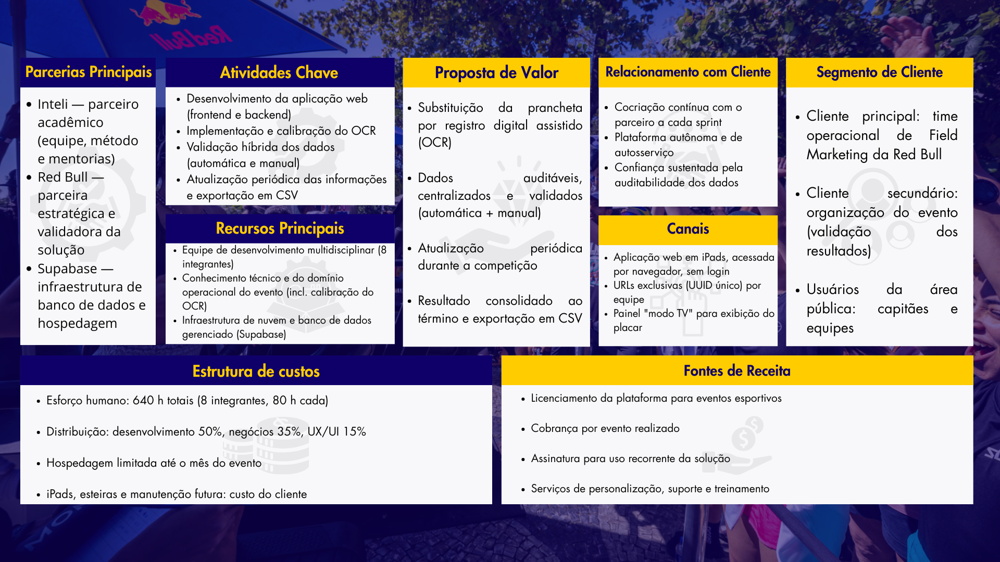<br>
      <sup>Fonte: Elaborado pelos autores (2026).</sup>
</div>

### Segmento de Cliente

A solução cria valor sobretudo para a Red Bull e seu time de Field Marketing, especificamente os avaliadores e organizadores que hoje registram os dados da competição de forma manual, com pranchetas e planilhas. O cliente mais importante é o time operacional responsável por monitorar as equipes durante o evento, garantir a integridade dos registros e conduzir a apuração final; em uso secundário, a própria coordenação do evento utiliza a solução para a validação dos resultados. Há ainda os usuários da área pública — capitães e equipes participantes —, que consultam o ranking, o status individual dos atletas e a calculadora de descanso. O cliente típico é um profissional de operações de eventos esportivos, que lida com trocas rápidas de corredores e múltiplas equipes simultâneas e busca uma ferramenta ágil e confiável capaz de substituir o processo manual sem introduzir novas fricções.

### Proposta de Valor

A proposta de valor reúne os benefícios concretos entregues ao cliente. A solução substitui o registro manual em prancheta por uma abordagem de automação assistida, na qual o operador captura imagens do visor da esteira e o sistema realiza a extração automática dos dados por OCR, reduzindo a sobrecarga e os erros humanos típicos de um processo manual de 24 horas. A validação híbrida, que combina leitura automática e conferência manual com alertas de inconsistência, aumenta a confiabilidade e torna os dados auditáveis e rastreáveis, atendendo diretamente à necessidade de maior integridade na apuração. A centralização das informações em uma única plataforma, com atualização periódica ao longo da competição — em acompanhamento próximo ao tempo real, conforme a dinâmica de checkpoints —, oferece visão consolidada e organizada do andamento do evento. Ao término da competição, o resultado já está consolidado, e a exportação em CSV, somada ao relatório pós-evento, viabiliza auditoria e análises estratégicas das edições futuras.

### Canais

Os canais descrevem como a solução chega ao cliente e aos usuários. O canal central é a própria aplicação web, acessada por navegador nos iPads já utilizados no ambiente do evento, o que dispensa instalação e aproveita dispositivos existentes. O acesso é simplificado e ocorre sem autenticação: os operadores utilizam o painel administrativo, enquanto cada equipe acessa sua área pública por meio de uma URL com UUID único entregue ao capitão. Um painel em "modo TV" permite exibir o placar de quilometragem em tela durante a competição, ampliando a visibilidade dos resultados. A integração à operação se dá, portanto, por dispositivos e fluxos já familiares ao time, e o alinhamento e a entrega evolutiva da solução acontecem por meio dos encontros realizados a cada sprint com o parceiro.

### Relacionamento com o cliente

O relacionamento com o cliente combina cocriação e autosserviço. Ao longo do projeto, a relação é construída de forma colaborativa nos encontros realizados a cada sprint, em que o parceiro valida entregas, ajusta requisitos e participa da evolução da solução. Em operação, o relacionamento é predominantemente autônomo: a plataforma foi concebida para ser simples, confiável e de baixa fricção, permitindo que o time operacional a utilize sem dependência constante da equipe técnica. Para reduzir a barreira de adoção — fator crítico, dado que o método manual já está consolidado na cultura do evento —, prevê-se um guia rápido de uso de uma página. A confiança é sustentada principalmente pela auditabilidade e pela rastreabilidade dos dados, e o valor percebido pelo cliente concentra-se na praticidade e na organização que a solução agrega ao processo de apuração.

### Recursos Principais

Os recursos principais são os ativos necessários para construir e operar a solução — e não a solução em si. O principal é o recurso humano: a equipe de oito integrantes, que atua de forma multidisciplinar nas frentes de desenvolvimento, negócios e UX/UI. Como recurso intelectual, destaca-se o conhecimento técnico e o entendimento do fluxo operacional do evento, levantado junto ao parceiro, incluindo a calibração do OCR às condições reais das esteiras — fator que a própria documentação aponta como dependente de validações práticas. Por fim, o recurso tecnológico é a infraestrutura de nuvem e o banco de dados gerenciado pela Supabase, que sustentam a aplicação durante as 24 horas. Os iPads e as esteiras, embora essenciais à operação, são recursos físicos do cliente, e não da equipe.

### Atividades Chave

As atividades-chave correspondem às ações essenciais para entregar a proposta de valor. A central é o desenvolvimento da aplicação web, abrangendo front-end e back-end, sobre a qual se constroem o painel administrativo — utilizado por operadores e fiscais para registrar checkpoints, corrigir dados e acompanhar cada equipe — e a área pública por equipe, acessada sem autenticação por meio de uma URL com UUID único. Soma-se a isso a implementação e a calibração do OCR para leitura automática dos dados dos visores das esteiras, acompanhada da validação híbrida, que combina extração automática com conferência manual e emissão de alertas em caso de inconsistências. Completam o conjunto a disponibilização e atualização periódica das informações ao longo da competição, a exportação dos dados em CSV e a geração do relatório pós-evento para auditoria, além dos testes e da validação prática realizados antes do evento, comparando os registros gerados ao método manual atual.

### Parcerias Principais

As parcerias principais do projeto envolvem tanto o Inteli quanto a Red Bull. O Inteli viabiliza a iniciativa ao disponibilizar a equipe multidisciplinar de desenvolvimento, a estrutura metodológica baseada em Scrum, as mentorias e o ambiente acadêmico necessário para a condução do projeto. Já a Red Bull atua como parceira estratégica e principal validadora da solução, fornecendo acesso ao contexto operacional do evento, definindo requisitos, participando das revisões de sprint e validando continuamente as entregas realizadas pela equipe.

Além dessas organizações, a infraestrutura tecnológica utilizada durante o desenvolvimento, especialmente os serviços de banco de dados e hospedagem fornecidos pela Supabase, contribui para a viabilização técnica da solução. Em conjunto, essas parcerias garantem acesso ao conhecimento do domínio, suporte metodológico e recursos tecnológicos necessários para a construção e validação da plataforma.


### Fontes de receita

Embora a solução tenha sido desenvolvida para uso interno da Red Bull e não possua geração direta de receita no contexto atual do projeto, é possível identificar potenciais mecanismos de captura de valor caso a plataforma fosse evoluída para um produto comercial.

Entre as possibilidades estão o licenciamento da plataforma para organizadores de eventos esportivos, a cobrança por evento realizado, planos de assinatura para utilização recorrente da solução e serviços adicionais de personalização, treinamento e suporte operacional. Também seria possível oferecer módulos complementares de relatórios avançados, auditoria de resultados e acompanhamento de desempenho em tempo real.

No contexto do projeto atual, a captura de valor ocorre principalmente por meio da redução de erros operacionais, diminuição do retrabalho, maior confiabilidade da apuração e melhoria da experiência proporcionada aos participantes e à equipe organizadora. Esses benefícios representam ganhos indiretos para a Red Bull, enquanto os modelos descritos anteriormente ilustram possíveis fontes de receita em um cenário futuro de comercialização da solução.


### Estrutura de custos

A estratégia de custos concentra-se na alocação de esforço humano e no uso de ferramentas digitais para acelerar a entrega, coerente com uma proposta de valor baseada na automação do registro, na redução de erros e no aumento da confiabilidade da apuração. A estrutura considera dez semanas de desenvolvimento, com quatro dias de trabalho por semana e duas horas de dedicação por dia, totalizando 80 horas por pessoa e 640 horas para a equipe de oito integrantes. A distribuição segue a lógica dos artefatos do projeto, com maior peso em desenvolvimento (50%), seguido por negócios (35%) e UX/UI (15%), equilibrando implementação técnica, alinhamento estratégico e experiência do usuário. O uso de quatro inteligências artificiais ao longo do período atua como apoio à produtividade, à documentação, à prototipação e ao desenvolvimento. Os custos de hospedagem e deploy ficam limitados até o mês do evento; a manutenção da plataforma em edições futuras seria custo direto do cliente. Por fim, os recursos físicos e de infraestrutura do evento, como iPads e esteiras, são considerados responsabilidade do cliente.

## 6.6 Estratégia de Marketing (4Ps)

A estratégia de marketing para o projeto da Redbull 24h foi estruturada com base no modelo dos 4Ps (Produto, Preço, Praça e Promoção), com o objetivo de definir como a solução gera valor para seus usuários e como pode ser posicionada no mercado de tecnologia aplicada a eventos esportivos. A proposta busca atender às necessidades de organizadores de competições que demandam maior confiabilidade, rastreabilidade e eficiência operacional na coleta e consolidação de resultados.

Nesse contexto, serão apresentados os principais atributos da solução, seu modelo de monetização, os canais pelos quais poderá ser disponibilizada e as estratégias de divulgação que podem contribuir para sua adoção. A análise dos 4Ps permite compreender como se diferenciar das abordagens tradicionais de controle manual e como a plataforma pode se tornar uma alternativa competitiva para eventos que necessitam de monitoramento preciso e acompanhamento com atualização periódica.

### 6.6.1 Produto/Serviço

A aplicação web é um sistema de gestão operacional especializado em competições esportivas de longa duração, com foco no formato Red Bull 24 Horas. O produto integra três interfaces dedicadas — operação de campo (operadores), supervisão estratégica (Field Marketing) e acompanhamento público (atletas e capitães de equipe) — todas conectadas a uma WebAPI centralizada (seção 3.7), que padroniza o contrato de dados e concentra as regras de negócio em um único ponto de manutenção.

As funcionalidades da plataforma organizam-se em quatro blocos principais: (a) gestão administrativa, com CRUD completo de competições, equipes, atletas e administradores; (b) registro operacional de checkpoints, com vínculo obrigatório a corredor, competição e administrador responsável; (c) identificação de cada equipe por UUID único para acesso público sem autenticação; e (d) acompanhamento do desempenho da competição por meio de rankings em tempo real, exportação de relatórios em formato XLSX e disponibilização de métricas consolidadas para auditoria e análise pós-evento.

Além disso, a solução incorpora captura assistida por OCR para automatização da coleta de dados dos visores das esteiras, mecanismos de autenticação para acesso às funcionalidades administrativas, sinalização de inconsistências nos registros realizados e recursos de rastreabilidade que permitem identificar a origem e o histórico das alterações efetuadas ao longo da competição. Em conjunto, essas funcionalidades contribuem para reduzir erros operacionais, aumentar a confiabilidade da apuração e oferecer maior transparência ao processo de consolidação dos resultados.

### 6.6.2 Preço

O modelo de precificação da solução é estruturado a partir da combinação entre a estrutura de custos do projeto e as oportunidades de geração de valor identificadas para a Red Bull.

Do lado dos custos, o principal insumo é o esforço humano da equipe de desenvolvimento: são 8 integrantes dedicando 80 horas cada ao longo de 10 semanas, totalizando 640 horas distribuídas entre desenvolvimento (50%), negócios (35%) e UX/UI (15%). Complementam essa base os custos com 4 ferramentas de inteligência artificial utilizadas como apoio à produtividade e documentação, além dos custos de hospedagem e deploy da plataforma até a data do evento. Infraestrutura física como iPads e esteiras é de responsabilidade do cliente.

Do ponto de vista da monetização, a solução pode ser enquadrada como um software especializado para gestão operacional de eventos esportivos, adotando um modelo de licenciamento por evento realizado. Nesse formato, organizadores contratariam a plataforma para utilização durante uma competição específica, incluindo acesso ao sistema, suporte operacional e geração dos relatórios finais. Alternativamente, em cenários de uso recorrente, a solução poderia ser oferecida por meio de assinatura anual, permitindo sua utilização em múltiplos eventos ao longo do período contratado.

O preço seria definido a partir da combinação entre os custos de desenvolvimento, manutenção e infraestrutura da plataforma e o valor gerado para o cliente. Entre os fatores considerados estão a redução de erros operacionais, a eliminação do retrabalho associado à apuração manual, o aumento da confiabilidade dos resultados e a disponibilidade de dados estruturados para auditoria e análise pós-evento. Dessa forma, a precificação combina uma lógica baseada em custos com uma abordagem orientada ao valor entregue ao organizador do evento. 

### 6.6.3 Praça (Distribuição)

A distribuição da solução ocorre de forma digital, sem necessidade de instalação de software ou configuração por parte dos usuários finais. A aplicação web é acessada diretamente pelo navegador, sendo projetada para uso em iPads durante o evento Red Bull 24 Horas.

O acesso é segmentado conforme o perfil de cada usuário. A equipe operacional e os administradores do evento acessam a área privada da plataforma por meio de uma senha única. Já os capitães de equipe e atletas têm acesso à área pública por meio de uma URL única gerada com UUID, permitindo o acompanhamento do ranking, do status dos corredores e das métricas de desempenho atualizadas a cada 1 hora.

Essa escolha de distribuição é aderente às exigências do ambiente competitivo: a mobilidade dos iPads garante agilidade ao operador durante as trocas de turno, enquanto o acesso via link elimina fricções para perfis de usuário. Por ser uma aplicação web, a solução não depende de lojas de aplicativos nem de processos de atualização manual, o que simplifica a manutenção operacional. Além disso, essa abordagem viabiliza a reutilização da plataforma em edições futuras do Red Bull 24 Horas ou em outros eventos esportivos com dinâmica operacional semelhante.

Além da utilização no Red Bull 24 Horas, o modelo de distribuição adotado permite que a solução seja replicada em outros eventos esportivos sem necessidade de adaptações significativas de infraestrutura. Por ser disponibilizada como uma aplicação web, a plataforma pode ser contratada e acessada remotamente por organizadores de diferentes localidades, utilizando apenas conexão à internet e dispositivos compatíveis. Dessa forma, os principais canais de distribuição em um cenário de expansão incluem a contratação direta por organizadores de eventos esportivos, parcerias com agências especializadas em ativações de marca e eventos de endurance, bem como a adoção por empresas que necessitem de soluções para registro, monitoramento e consolidação de resultados em competições esportivas.

### 6.6.4 Promoção

Por ser uma solução desenvolvida no escopo da parceria acadêmica com a Red Bull, a promoção assume caráter institucional, voltada à comunicação interna do evento e ao público diretamente ligado a ele, e não à aquisição de clientes em mercado aberto. O marketing de conteúdo cumpre o papel central: uma vez aplicada em uma edição real, a solução poderá gerar estudos de caso e demonstrações do fluxo OCR que evidenciem quantitativamente a queda de erros na apuração, reforçando seu valor junto à organização.

A divulgação da solução concentra-se na geração de evidências de valor e na comunicação institucional. Uma vez aplicada em uma edição real do Red Bull 24 Horas, a plataforma poderá ser apresentada por meio de estudos de caso, demonstrações operacionais e relatórios comparativos que evidenciem ganhos de confiabilidade, rastreabilidade e eficiência na apuração dos resultados. Esses materiais podem ser utilizados em apresentações para equipes internas da Red Bull, parceiros estratégicos e organizadores de eventos esportivos interessados em processos semelhantes de monitoramento e consolidação de dados.

O próprio Red Bull 24 Horas funciona como principal canal de promoção, permitindo demonstrações da solução durante a competição e evidenciando sua aplicação em um contexto real de uso. As estratégias de relacionamento, por meio da comunicação pós-evento com organizadores, operadores e capitães de equipe, fortalecem a percepção de valor da plataforma ao longo do tempo. Além disso, a associação à marca Red Bull confere credibilidade à solução, enquanto a participação das running crews contribui para ampliar sua visibilidade dentro da comunidade esportiva.

# <a name="c7"></a>7. Conclusões e trabalhos futuros 

### Atingimento dos objetivos
A solução desenvolvida para o Red Bull 24 Horas foi concebida para responder aos benefícios esperados e aos critérios de sucesso estabelecidos na Seção 2. A avaliação a seguir considera cada objetivo de forma individualizada.

**Redução de erros operacionais:** O objetivo foi endereçado pela substituição do registro manual em pranchetas por um fluxo de captura assistida, no qual o operador fotografa o visor da esteira e o sistema extrai os dados por meio de OCR. A introdução de uma etapa de validação humana antes da confirmação dos registros, somada aos alertas automáticos em caso de inconsistência, mitiga diretamente os erros decorrentes de fadiga, caligrafia e divergências entre turnos identificados no processo original. Cabe registrar, contudo, que a verificação plena do critério de taxa de erro inferior a 1% depende de aferição conjunta com o parceiro em condições reais de evento.

**Maior eficiência na coleta de dados:** A entrada de checkpoints por OCR, com alternativa de inserção manual, reduz o esforço de transcrição a cada intervalo de cinco minutos ao longo das 24 horas, atendendo ao objetivo de tornar a coleta mais ágil e menos suscetível à sobrecarga operacional.

**Maior confiabilidade e integridade das informações:** A persistência estruturada em banco relacional PostgreSQL, organizada em arquitetura em camadas, e a etapa de validação prévia à confirmação contribuem para a consistência e a rastreabilidade dos dados — lacunas centrais do processo manual, que não oferecia qualquer histórico ao término do evento.

**Métricas em tempo real e relatórios analíticos para decisão:** O objetivo foi contemplado pelo ambiente público por equipe, acessível via URL com UUID único e sem necessidade de login, que disponibiliza ranking, status dos corredores e calculadora de descanso com atualização periódica, bem como pela funcionalidade de exportação de relatórios no ambiente administrativo, voltada ao apoio à tomada de decisão.


De modo geral, a aplicação atingiu os objetivos funcionais definidos no escopo da seção 2.


### Pontos fortes

O principal diferencial da solução reside na captura de dados por meio de OCR, que transforma uma fotografia do visor da esteira em um registro estruturado e rastreável, substituindo integralmente a anotação manual em pranchetas. Esse mecanismo não apenas elimina a transcrição humana a cada intervalo de cinco minutos ao longo das 24 horas de competição, como também introduz uma camada de validação automática com alertas de inconsistência, conferindo ao processo um nível de confiabilidade inatingível pelo método anterior. A combinação entre captura assistida por OCR e confirmação humana representa, portanto, o núcleo tecnológico que viabiliza a proposta de valor do projeto.

Complementam esse diferencial: a separação clara entre os ambientes administrativo e público, que confere segurança ao primeiro, por meio de autenticação JWT, e acessibilidade ao segundo, por meio de acesso via UUID sem necessidade de login; a adoção de uma arquitetura em camadas que favorece a manutenibilidade e a evolução do sistema; e o resultado dos testes de usabilidade, com média de 80,71 pontos na escala SUS, valor acima do benchmark de 68 pontos e correspondente a uma classificação entre "boa" e "excelente", evidenciando que o diferencial técnico foi entregue sem comprometer a experiência de uso.


### Pontos a melhorar
Embora o resultado SUS seja positivo, a presença de pontuações individuais de 72,5 entre os participantes indica pontos de fricção remanescentes na experiência de uso, que demandam atenção.

No plano técnico, identificam-se oportunidades de melhoria relacionadas à precisão da extração por OCR sob diferentes condições de display, como modelos muito diferentes de esteira. Ao fechamento integrado do ciclo de captura, extração, validação e persistência, e à existência de dívidas técnicas associadas ao tratamento de erros de constraint do PostgreSQL e à padronização do ambiente de testes ponta a ponta.


### Planos de ação a partir dos testes
A partir da avaliação de usabilidade, e tendo em vista a margem de melhoria sinalizada pelas menores pontuações registradas, são propostos os seguintes planos de ação, ainda não implementados e registrados como direcionamentos futuros:

**Refinamento e integração do OCR:** Elevar a precisão da extração de distância, pace e tempo total; tratar variações de iluminação e de posicionamento do display; ajustar o limiar de discrepância que dispara os alertas de inconsistência; e consolidar o ciclo captura → extração → validação humana → persistência de forma integrada ao frontend e ao backend, reduzindo a fricção percebida no fluxo de registro.


**Refinamento de UX e design:** A partir dos pontos de fricção sinalizados pelas menores pontuações do SUS, propõe-se revisar os fluxos de maior atrito identificados nos testes de guerrilha, com foco na redução do número de interações para as tarefas críticas de registro de checkpoint e validação de dados; ampliar o feedback visual imediato — indicadores de estado e mensagens de erro contextuais — para reduzir ambiguidade em momentos de decisão rápida; e ajustar a hierarquia visual das telas operacionais para que as ações primárias sejam acessíveis sem rolagem, respeitando as dimensões de tela do iPad e as condições do ambiente do evento.

### Trabalhos futuros
Além dos planos derivados dos testes, o grupo mapeou as seguintes oportunidades de evolução da solução:

**Integração direta na esteira para captura automática de dados:** Investigar a possibilidade de integração entre a aplicação web e a infraestrutura da esteira, de modo a capturar os dados de desempenho (distância, pace, tempo) automaticamente, sem necessidade de fotografar o visor. Esta integração permitiria eliminar a dependência de OCR em determinadas condições e aumentar a precisão e a frequência de coleta de dados, reduzindo ainda mais a intervenção humana manual.


**Aumentar o número de templates de divulgação para redes sociais:** Desenvolver uma maior suite de templates pré-formatados para divulgação de resultados, rankings parciais e momentos highlights do evento em redes sociais (Instagram, Twitter/X, Facebook). Esta funcionalidade possibilitaria ao parceiro compartilhar atualizações do evento em tempo real, amplificando o engajamento da comunidade e o alcance da marca durante a competição.
**Tratamento de dívidas técnicas: centralização do tratamento de erros de constraint do PostgreSQL e padronização do ambiente de testes ponta a ponta, com vistas à robustez e à manutenibilidade do sistema.

Em síntese, a solução desenvolvida cumpriu os objetivos funcionais previstos no escopo e demonstrou boa usabilidade, conforme evidenciado pela avaliação SUS de 80,71 pontos, ao mesmo tempo em que deixa mapeado um conjunto consistente de melhorias e trabalhos futuros capazes de ampliar sua precisão, sua abrangência analítica e sua aderência às necessidades operacionais do parceiro.


# <a name="c8"></a>8. Referências 

ABRACEO; TICKET SPORTS. **Perfil do Atleta Brasileiro 25/26**. 2026. Disponível em: https://hub.ticketsports.com.br/perfil-atleta-brasileiro-2025-ticket-sports/. Acesso em: 11 jun. 2026.

AMAZON WEB SERVICES. **A diferença entre modelo de dados lógico e físico**. 2024. Disponível em: https://aws.amazon.com/pt/compare/the-difference-between-logical-and-physical-data-model/. Acesso em: 11 maio 2026.

BASS, Len; CLEMENTS, Paul; KAZMAN, Rick. **Software Architecture in Practice**. 3. ed. Boston: Addison-Wesley, 2012.

BOOCH, Grady; RUMBAUGH, James; JACOBSON, Ivar. **The Unified Modeling Language User Guide**. 2. ed. Boston: Addison-Wesley, 2005.

BROOKE, John. SUS: a "quick and dirty" usability scale. In: JORDAN, P. W.; THOMAS, B.; WEERDMEESTER, B.; MCCLELLAND, I. (org.). **Usability Evaluation in Industry**. London: Taylor & Francis, 1996. p. 189–194. Disponível em: https://hell.meiert.org/core/pdf/sus.pdf. Acesso em: 17 jun. 2026.

CARTACAPITAL. **Setor de eventos bate recorde e mira R$ 151,9 bilhões até o final do ano**. 2026. Disponível em: https://www.cartacapital.com.br/do-micro-ao-macro/setor-de-eventos-recorde-tecnologia-2026. Acesso em: 11 jun. 2026.

CASAROTTO, Camila. **Análise SWOT**: o que é e como fazer. Rock Content, 2019. Disponível em: https://rockcontent.com/br/blog/analise-swot/. Acesso em: 1 maio 2026.

CODD, Edgar F. A Relational Model of Data for Large Shared Data Banks. **Communications of the ACM**, New York, v. 13, n. 6, p. 377–387, 1970.

CREDERA. **The BA perspective**: How to INVEST in a good user story. 2023. Disponível em: https://www.credera.com/en-gb/insights/ba-perspective-invest-good-user-story. Acesso em: 1 maio 2026.

FIGUEIREDO, R. M. **Diagrama de Sequência**. Belo Horizonte: UFMG, 2026. Disponível em: https://homepages.dcc.ufmg.br/~figueiredo/disciplinas/aulas/uml-diagrama-sequencia_v01.pdf. Acesso em: 12 maio 2026.

FINCH, Grace. **What is acceptance criteria?** Definition, examples, & tips. Atlassian, 2026. Disponível em: https://www.atlassian.com/work-management/project-management/acceptance-criteria. Acesso em: 1 maio 2026.

FOWLER, Martin. **Patterns of Enterprise Application Architecture**. Boston: Addison-Wesley, 2002.

GARRETT, Jesse James. **The Elements of User Experience**: User-Centered Design for the Web and Beyond. 2. ed. Berkeley: New Riders, 2011.

GRAND VIEW RESEARCH. **Brazil optical character recognition market size & outlook, 2030**. [s.d.]. Disponível em: https://www.grandviewresearch.com/horizon/outlook/optical-character-recognition-market/brazil. Acesso em: 11 jun. 2026.

HUBSPOT. **Segmentação de mercado**. HubSpot, 2025. Disponível em: https://br.hubspot.com/glossary/market-segmentation. Acesso em: 11 jun. 2026.

INTERACTION DESIGN FOUNDATION. **What are user stories?** [s.d.]. Disponível em: https://www.interaction-design.org/literature/topics/user-stories. Acesso em: 1 maio 2026.

INTERNET ENGINEERING TASK FORCE (IETF). **HTTP Semantics**. RFC 9110. 2022. Disponível em: https://www.ietf.org/rfc/rfc9110.html. Acesso em: 28 maio 2026.

ITATIAIA. **BH receberá primeira seletiva do Red Bull 24 Horas no Parque Ecológico; saiba detalhes**. 2025. Disponível em: https://www.itatiaia.com.br/esportes/mais-esportes/bh-recebera-primeira-seletiva-do-red-bull-24-horas-no-parque-ecologico-saiba-detalhes/. Acesso em: 6 jun. 2026.

JOEL. **MER e DER**: modelagem de bancos de dados. DevMedia, 2014. Disponível em: https://www.devmedia.com.br/mer-e-der-modelagem-de-bancos-de-dados/14332. Acesso em: 7 maio 2026.

LETS EVENTS. **O papel da tecnologia na organização de eventos de sucesso**. 22 abr. 2024. Disponível em: https://lets.events/blog/o-papel-da-tecnologia-na-organizacao-de-eventos-de-sucesso/. Acesso em: 2 jun. 2026.

LUCID SOFTWARE INC. **O que é um diagrama entidade relacionamento?** [s.d.]. Disponível em: https://www.lucidchart.com/pages/pt/o-que-e-diagrama-entidade-relacionamento. Acesso em: 6 maio 2026.

MANIA DE CORRIDA. **Red Bull 24 Horas reúne crews de corrida em cinco seletivas pelo Brasil antes de final no Rio de Janeiro**. 2025. Disponível em: https://www.maniadecorrida.com.br/2025/09/red-bull-24-horas-reune-crews-de.html. Acesso em: 11 jun. 2026.

MARTIN, Robert C. **Agile Software Development**: Principles, Patterns, and Practices. Upper Saddle River: Prentice Hall, 2002. Disponível em: https://openlibrary.org/books/OL9297484M/Agile_Software_Development_Principles_Patterns_and_Practices. Acesso em: 28 maio 2026.

MICROSOFT. **Web API design best practices**. Microsoft Learn, 2023. Disponível em: https://learn.microsoft.com/en-us/azure/architecture/best-practices/api-design. Acesso em: 1 maio 2026.

MUNDO DO MARKETING. **Os profissionais de Marketing no Brasil**: dados mostram maioria feminina e faixa etária madura. [s.d.]. Disponível em: https://mundodomarketing.com.br/os-profissionais-de-marketing-no-brasil-dados-mostram-maioria-feminina-e-faixa-etaria-madura. Acesso em: 2 jun. 2026.

NIELSEN NORMAN GROUP. **Personas**. 2025. Disponível em: https://www.nngroup.com/articles/persona/. Acesso em: 1 maio 2026.

OSTERWALDER, Alexander; PIGNEUR, Yves. **Business Model Generation**. Hoboken: John Wiley & Sons, 2010.

OSTERWALDER, Alexander; PIGNEUR, Yves. **Value Proposition Design**. Hoboken: John Wiley & Sons, 2011.

PERERA, Nuwan. **Understanding Crow’s Foot Notation**: Symbols & Usage Guide. Creately, 2026. Disponível em: https://creately.com/guides/crows-foot-notation/. Acesso em: 11 maio 2026.

PLANTUML. **PlantUML**: open-source tool that uses simple textual descriptions to draw UML diagrams. [s.d.]. Disponível em: https://plantuml.com. Acesso em: 12 maio 2026.

PM3. **Style guide**: o que é e como criar um guia de estilo para produtos digitais. [s.d.]. Disponível em: https://pm3.com.br/blog/style-guide/. Acesso em: 13 maio 2026.

PORTER, Michael E. The Five Competitive Forces That Shape Strategy. **Harvard Business Review**, Boston, v. 86, n. 1, p. 78–93, 2008.

PROJECT MANAGEMENT INSTITUTE (PMI). **A guide to the project management body of knowledge (PMBOK guide)**. 7. ed. Newtown Square: Project Management Institute, 2021.

RED BULL. **Red Bull 24 Hours**. 2025. Disponível em: https://www.redbull.com/se-en/events/24-hours. Acesso em: 1 maio 2026.

VIAL, Gregory. Understanding Digital Transformation: A Review and a Research Agenda. **The Journal of Strategic Information Systems**, [S. l.], v. 28, n. 2, p. 118–144, 2019.

WEBRUN. **Red Bull 24 Horas**: equipe paulista corre 343 km e se consagra campeã nacional. 2025. Disponível em: https://webrun.com.br/red-bull-24-horas-equipe-paulista-corre-343-km-e-se-consagra-campea-nacional-da-competicao-no-rio-de-janeiro. Acesso em: 11 jun. 2026.


# <a name="c9"></a>Anexos
Não se aplica.